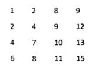
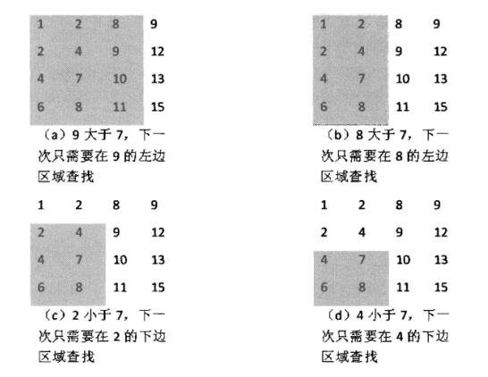

# 剑指Offer（一）：二维数组中的查找

> 搜索微信公众号:'AI-ming3526'或者'计算机视觉这件小事' 获取更多算法、机器学习干货  
> csdn：https://blog.csdn.net/baidu_31657889/  
> github：https://github.com/aimi-cn/AILearners

## 一、引子

这个系列是我在牛客网上刷《剑指Offer》的刷题笔记，旨在提升下自己的算法能力。  
查看完整的剑指Offer算法题解析请点击：[剑指Offer完整习题解析](https://blog.csdn.net/baidu_31657889/article/category/9059648)

## 二、题目

二维数组中的查找

在一个二维数组中（每个一维数组的长度相同），每一行都按照从左到右递增的顺序排序，每一列都按照从上到下递增的顺序排序。请完成一个函数，输入这样的一个二维数组和一个整数，判断数组中是否含有该整数。

### 1、思路

首先我想到的是 一个二维数组 查找其中是否存在一个整数 直接进行两个for循环是不是就可以了 但是我看到了这道题中最关键的信息，**每一行每一列都是递增排序的。**如果我使用两个for循环的话是可以解决这个问题的，但是对于时间复杂度来说的话，如果这是一个m*n的数组，时间复杂度就是O(m×n)，还是很大的，但是对于这个有序的排列数组，我们是不是可以用更简单的方式来解答那？

我们可以从右上角出发,首先选取数组中右上角的数字，如果该数字等于要查找的数字，查找过程结束；如果该数字大于要查找的数组，剔除这个数字所在的列；如果该数字小于要查找的数字，剔除这个数字所在的行。

也就是说如果要查找的数字不在数组的右上角，则每一次都在数组的查找范围中剔除一行或者一列，这样每一步都可以缩小查找的范围，直到找到要查找的数字，或者查找范围为空。

是不是很简单？如果你还没清楚的话 我们举个例子进行说明

### 2、例子

如果在一个二维数组中找到数字7，则返回true，如果没有找到，则返回false。



查找过程如下：



### 3、编程实现

**python2.7**

```python
# -*- coding:utf-8 -*-
class Solution:
    # array 二维列表
    def Find(self, target, array):
        #rows 行 cols 列
        rows = len(array)
        cols = len(array[0])
        if rows > 0 and cols > 0:
            row = 0
            col = cols - 1
            while row < rows and col >= 0:
                if target == array[row][col]:
                    return True
                elif target < array[row][col]:
                    col -= 1
                else:
                    row += 1
        return False
```


