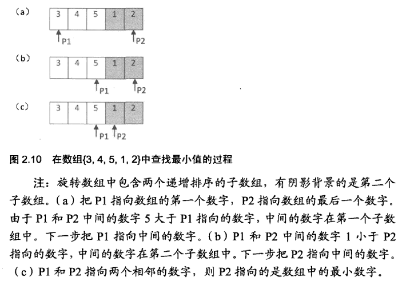
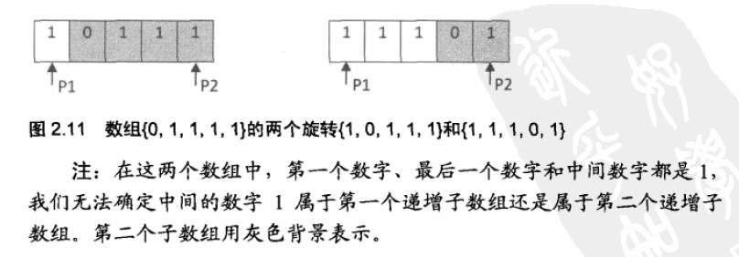

# 剑指Offer（六）：旋转数组的最小数字

> 搜索微信公众号:'AI-ming3526'或者'计算机视觉这件小事' 获取更多算法、机器学习干货  
> csdn：https://blog.csdn.net/baidu_31657889/  
> github：https://github.com/aimi-cn/AILearners

## 一、引子

这个系列是我在牛客网上刷《剑指Offer》的刷题笔记，旨在提升下自己的算法能力。  
查看完整的剑指Offer算法题解析请点击：[剑指Offer完整习题解析](https://blog.csdn.net/baidu_31657889/article/category/9059648)

## 二、题目

把一个数组最开始的若干个元素搬到数组的末尾，我们称之为数组的旋转。 输入一个非减排序的数组的一个旋转，输出旋转数组的最小元素。 例如数组{3,4,5,1,2}为{1,2,3,4,5}的一个旋转，该数组的最小值为1。 NOTE：给出的所有元素都大于0，若数组大小为0，请返回0。

### 1、思路

1.1 最简单的方法 遍历整个数组，找出其中最小的数。这样肯定拿不到offer哈哈哈 这样时间复杂度为O(n)

1.2 或者使用python大发的min方法 直接返回数组中最小的值

1.3 但是为了增加我们对算法的了解，我们这里使用时间复杂度为O(logn)的二分查找 

每次查找都把旋转数组平均分成两部分，通过比较当前旋转数组两端点和中间点的值，判断最小值在数组的哪一部分，从而达到缩小搜索范围的目的。

具体过程，如图 2.10 所示。



需要注意，当旋转数组的两端点的值都与中间点的值相等时，因为无法判断最小值在哪一部分，因此需要采用顺序查找方法，即暴力查找。其示例如图 2.11 所示。



具体思路是用变量mid定位到数组的中间位置，将数组头部的值与mid处的值进行比较，不断缩小数组。这里有两个需要注意的点： 
1. 由于是旋转数组，缩小到最小的数组大小为2，且数组中第一个元素为数组中值最大的元素，第二个元素是数组中值最小的元素，最后返回第二个元素。 
2. 当数组中包含重复元素，具体到代码中是：当mid处的值等于数组头部的值时，无法判断最小值位于mid左侧还是右侧，此时只能采取遍历的方式。


### 2、编程实现

**python2.7**

代码实现第一种方法：

```python
# -*- coding:utf-8 -*-
class Solution:
    def minNumberInRotateArray(self, rotateArray):
        # write code here
        for i in range(len(rotateArray)):
            if rotateArray[i+1] < rotateArray[i]:
                return rotateArray[i+1]
        return 0
```

代码实现第二种方法：

```python
# -*- coding:utf-8 -*-
class Solution:
    def minNumberInRotateArray(self, rotateArray):
        # write code here
        return min(rotateArray)
```

代码实现第三种方法：

```python
# -*- coding:utf-8 -*-
class Solution:
    def minNumberInRotateArray(self, rotateArray):
        # write code here
        if not rotateArray:
            return 0
        #输入的是一个非减序的数组 所以数组长度为2是第二个数字为最小返回
        if len(rotateArray)==2:
            return rotateArray[1]

        mid = int(len(rotateArray)/2)
        #输入的是一个非减序的数组 中间那个数大于第一个数的时候 最小值在中间数的右边
        if rotateArray[mid] > rotateArray[0]:
            return self.minNumberInRotateArray(rotateArray[mid:])
        elif rotateArray[mid] < rotateArray[0]:
            return self.minNumberInRotateArray(rotateArray[:mid+1])
        #当mid处的值等于数组头部的值时，无法判断最小值位于mid左侧还是右侧，此时只能采取遍历的方式。
        else:
            for i in range(1,len(rotateArray)):
                if rotateArray[i] < rotateArray[0]:
                    return rotateArray[i]
            return rotateArray[0]
```


