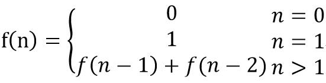
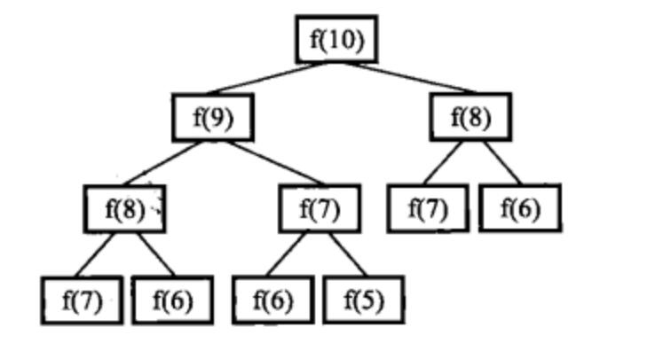

# 剑指Offer（七）：斐波那契数列

> 搜索微信公众号:'AI-ming3526'或者'计算机视觉这件小事' 获取更多算法、机器学习干货  
> csdn：https://blog.csdn.net/baidu_31657889/  
> github：https://github.com/aimi-cn/AILearners

## 一、引子

这个系列是我在牛客网上刷《剑指Offer》的刷题笔记，旨在提升下自己的算法能力。  
查看完整的剑指Offer算法题解析请点击：[剑指Offer完整习题解析](https://blog.csdn.net/baidu_31657889/article/category/9059648)

## 二、题目

大家都知道斐波那契数列，现在要求输入一个整数n，请你输出斐波那契数列的第n项（从0开始，第0项为0）。
n<=39

### 1、思路

要想求斐波那契数列，我们要先知道什么是斐波那契数列，它的公式为：



这道题递归很好写，但是存在很严重的效率问题。事实上，递归方法计算的时间复杂度是以n的指数的方式递增的。

我们可以看下面这张图，以求解f(10)为例类分析递归的求解过程。想求f(10)，需要先求得f(9)和f(8)。同样，想求得f(9)，需要先求的f(8)和f(7)....



我们不难发现在这棵树中有很多结点是重复的，而且重复的结点数会随着n的增加而急剧增加，这意味计算量会随着n的增加而急剧增大。


所以，我们用简单的循环来实现。

### 2、编程实现

**python2.7**

代码实现方法：

```python
# -*- coding:utf-8 -*-
class Solution:
   def Fibonacci(self, n):
        # write code here
        if n == 0:
            return 0
        a = 0
        b = 1
        for i in range(1,n):
            a , b = b,a+b
        return b
```


