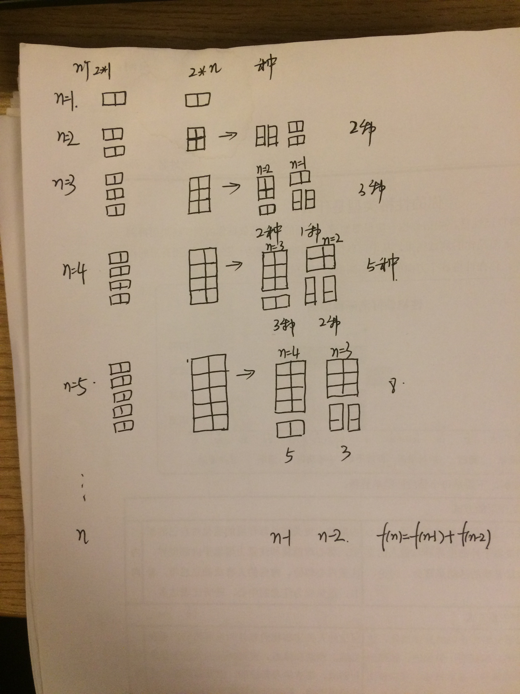

# 剑指Offer（十）：矩形覆盖

> 搜索微信公众号:'AI-ming3526'或者'计算机视觉这件小事' 获取更多算法、机器学习干货  
> csdn：https://blog.csdn.net/baidu_31657889/  
> github：https://github.com/aimi-cn/AILearners

## 一、引子

这个系列是我在牛客网上刷《剑指Offer》的刷题笔记，旨在提升下自己的算法能力。  
查看完整的剑指Offer算法题解析请点击：[剑指Offer完整习题解析](https://blog.csdn.net/baidu_31657889/article/category/9059648)

## 二、题目

我们可以用2 * 1的小矩形横着或者竖着去覆盖更大的矩形。请问用n个2 * 1的小矩形无重叠地覆盖一个2 * n的大矩形，总共有多少种方法？

### 1、思路

这道题乍一看 挺难得 无从下手

其实我可以告诉你 这还是一个斐波那契数列 不信你往下看

看下图



按照图中的推理之后果然是一个斐波那契数列~

### 2、编程实现

**python2.7**

代码实现方法：

```python
# -*- coding:utf-8 -*-
class Solution:
    def rectCover(self, number):
        # write code here
        if number == 0:
            return 0
        a = 0
        b = 1
        for i in range(number):
            a,b = b,a+b
        return b
```

