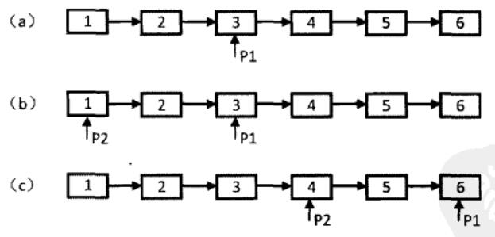

# 剑指Offer（十四）：链表中倒数第k个结点

> 搜索微信公众号:'AI-ming3526'或者'计算机视觉这件小事' 获取更多算法、机器学习干货  
> csdn：https://blog.csdn.net/baidu_31657889/  
> github：https://github.com/aimi-cn/AILearners

## 一、引子

这个系列是我在牛客网上刷《剑指Offer》的刷题笔记，旨在提升下自己的算法能力。  
查看完整的剑指Offer算法题解析请点击：[剑指Offer完整习题解析](https://blog.csdn.net/baidu_31657889/article/category/9059648)

## 二、题目

输入一个链表，输出该链表中倒数第k个结点。

### 1、思路

我们可以定义两个指针。第一个指针从链表的头指针开始遍历向前走k-1，第二个指针保持不动；从第k步开始，第二个指针也开始从链表的头指针开始遍历。由于两个指针的距离保持在k-1，当第一个（走在前面的）指针到达链表的尾结点时，第二个指针（走在后面的）指针正好是倒数第k个结点。

效果示意图，以链表总共6个结点，求倒数第3个结点为例：




### 2、编程实现

**python2.7**

代码实现方案：

```python
# -*- coding:utf-8 -*-
# class ListNode:
#     def __init__(self, x):
#         self.val = x
#         self.next = None

class Solution:
    def FindKthToTail(self, head, k):
        # write code here
        if head==None or k<=0:
            return None
        #设置两个指针，p2指针先走（k-1）步，然后再一起走，当p2为最后一个时，p1就为倒数第k个数
        p2 = head
        p1 = head
        #p2先走，走k-1步，如果k大于链表长度则返回 空，否则的话继续走
        while k > 1:
            if p2.next != None:
                p2 = p2.next
                k-=1
            else:
                return None
        #两个指针一起走，一直到p2为最后一个,p1即为所求
        while p2.next!=None:
            p1=p1.next
            p2=p2.next
        return p1
```
