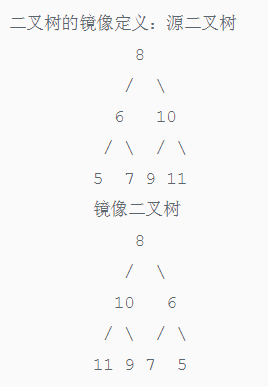
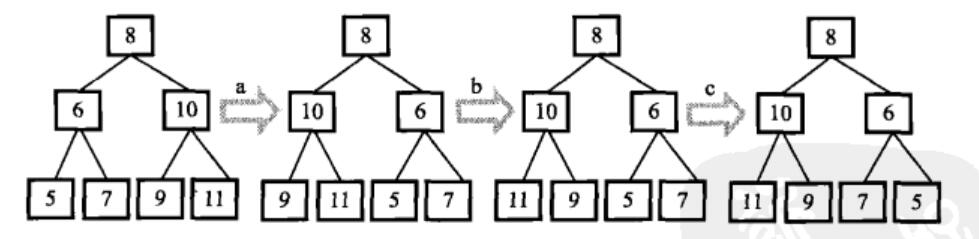

# 剑指Offer（十八）：二叉树的镜像

> 搜索微信公众号:'AI-ming3526'或者'计算机视觉这件小事' 获取更多算法、机器学习干货  
> csdn：https://blog.csdn.net/baidu_31657889/  
> github：https://github.com/aimi-cn/AILearners

## 一、引子

这个系列是我在牛客网上刷《剑指Offer》的刷题笔记，旨在提升下自己的算法能力。  
查看完整的剑指Offer算法题解析请点击：[剑指Offer完整习题解析](https://blog.csdn.net/baidu_31657889/article/category/9059648)

## 二、题目

操作给定的二叉树，将其变换为源二叉树的镜像。

二叉树的镜像定义：



### 1、思路

先交换根节点的两个子结点之后，我们注意到值为10、6的结点的子结点仍然保持不变，因此我们还需要交换这两个结点的左右子结点。做完这两次交换之后，我们已经遍历完所有的非叶结点。此时变换之后的树刚好就是原始树的镜像。交换示意图如下所示：



所以我们就可以这样，首先交换根节点下面的两个子节点的顺序，做完交换，递归调用左右节点，最终会把整个二叉树都进行镜像变换~

### 2、编程实现

**python2.7**

代码实现方案：

```python
# -*- coding:utf-8 -*-
# class TreeNode:
#     def __init__(self, x):
#         self.val = x
#         self.left = None
#         self.right = None
class Solution:
    # 返回镜像树的根节点
    def Mirror(self, root):
        # write code here
        if not root:
            return root
        else:
            root.left,root.right = root.right,root.left
            self.Mirror(root.left)
            self.Mirror(root.right)
            return root
```
