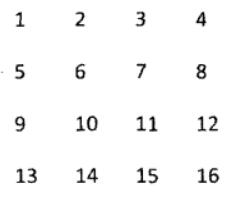

# 剑指Offer（十九）：顺时针打印矩阵

> 搜索微信公众号:'AI-ming3526'或者'计算机视觉这件小事' 获取更多算法、机器学习干货  
> csdn：https://blog.csdn.net/baidu_31657889/  
> github：https://github.com/aimi-cn/AILearners

## 一、引子

这个系列是我在牛客网上刷《剑指Offer》的刷题笔记，旨在提升下自己的算法能力。  
查看完整的剑指Offer算法题解析请点击：[剑指Offer完整习题解析](https://blog.csdn.net/baidu_31657889/article/category/9059648)

## 二、题目

输入一个矩阵，按照从外向里以顺时针的顺序依次打印出每一个数字，例如，如果输入如下4 X 4矩阵： 1 2 3 4 5 6 7 8 9 10 11 12 13 14 15 16 则依次打印出数字1,2,3,4,8,12,16,15,14,13,9,5,6,7,11,10.


### 1、思路

这道题首先我们要先搞清楚他的意思是什么，我们可以自己先画个图就可以知道他的意思了，就是如下图的顺时针打印出来~



可以模拟魔方逆时针旋转的方法，一直做取出第一行的操作~

例如：

1 2 3
4 5 6
7 8 9

输出并删除第一行后，再进行一次逆时针旋转，就变成：

6 9
5 8
4 7
继续重复上述操作即可。大功告成，只差代码实现了~

### 2、编程实现

**python2.7**

代码实现方案：

```python
# -*- coding:utf-8 -*-
class Solution:
    # matrix类型为二维列表，需要返回列表
    def printMatrix(self, matrix):
        # write code here
        result = []
        while(matrix):
            # list.pop详细介绍请看：https://www.runoob.com/python/att-list-pop.html
            result+=matrix.pop(0)
            if not matrix or not matrix[0]:
                break
            matrix = self.turn(matrix)
        return result
    def turn(self,matrix):
        num_r = len(matrix)
        num_c = len(matrix[0])
        newmat = []
        for i in range(num_c):
            newmat2 = []
            for j in range(num_r):
                newmat2.append(matrix[j][i])
            newmat.append(newmat2)
        newmat.reverse()
        return newmat
```
