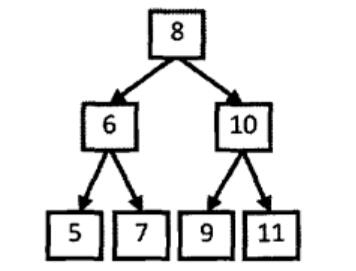

# 剑指Offer（二十二）：从上往下打印二叉树

> 搜索微信公众号:'AI-ming3526'或者'计算机视觉这件小事' 获取更多算法、机器学习干货  
> csdn：https://blog.csdn.net/baidu_31657889/  
> github：https://github.com/aimi-cn/AILearners

## 一、引子

这个系列是我在牛客网上刷《剑指Offer》的刷题笔记，旨在提升下自己的算法能力。  
查看完整的剑指Offer算法题解析请点击：[剑指Offer完整习题解析](https://blog.csdn.net/baidu_31657889/article/category/9059648)

## 二、题目

从上往下打印出二叉树的每个节点，同层节点从左至右打印。

### 1、思路

这个题目其实是一个二叉树层级遍历的题。

举例子说明：



如上图所示，因为按层打印的顺序决定应该先打印根结点，所以我们从树的根结点开始分析。为了接下来能够打印值为8的结点的两个子结点，我们应该在遍历该结点时把值为6和10的两个结点保存到一个容器里，现在容器内就有两个结点了。按照从左到右打印的要求，我们先取出为6的结点。打印出值6之后把它的值分别为5和7的两个结点放入数据容器。此时数据容器中有三个结点，值分别为10、5和7。接下来我们从数据容器中取出值为10的结点。注意到值为10的结点比值为5、7的结点先放入容器，此时又比这两个结点先取出，这就是我们通常说的先入先出，因此不难看出这个数据容器应该是一个队列。由于值为5、7、9、11的结点都没有子结点，因此只要依次打印即可。

所以我们可以得出按层打印的方法是，每一次打印一个结点的时候，如果该结点有子结点，按照从左到右则把该结点的子结点放到一个队列的末尾。接下来到队列的头部取出最早进入队列的结点，重复前面的打印操作，直至队列中所有的结点都打印出来为止。

### 2、编程实现

**python**

代码实现方案：

```python
# -*- coding:utf-8 -*-
# class TreeNode:
#     def __init__(self, x):
#         self.val = x
#         self.left = None
#         self.right = None
class Solution:
    # 返回从上到下每个节点值列表，例：[1,2,3]
    def PrintFromTopToBottom(self, root):
        # write code here
        if not root:
            return []
        else:
            currentStack1 = [root]
            res = []
            while currentStack1:
                nextStack = []
                for i in currentStack1:
                    if i.left : nextStack.append(i.left)
                    if i.right : nextStack.append(i.right)
                    res.append(i.val)
                currentStack1 = nextStack
            return res
```
