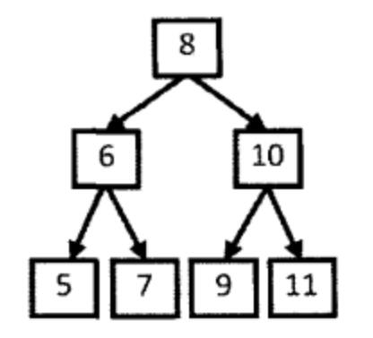

# 剑指Offer（二十三）：二叉搜索树的后序遍历序列

> 搜索微信公众号:'AI-ming3526'或者'计算机视觉这件小事' 获取更多算法、机器学习干货  
> csdn：https://blog.csdn.net/baidu_31657889/  
> github：https://github.com/aimi-cn/AILearners

## 一、引子

这个系列是我在牛客网上刷《剑指Offer》的刷题笔记，旨在提升下自己的算法能力。  
查看完整的剑指Offer算法题解析请点击：[剑指Offer完整习题解析](https://blog.csdn.net/baidu_31657889/article/category/9059648)

## 二、题目

输入一个整数数组，判断该数组是不是某二叉搜索树的后序遍历的结果。如果是则输出Yes,否则输出No。假设输入的数组的任意两个数字都互不相同。

### 1、思路

首先我们要清楚后序遍历的概念。遍历的最后一个数字是根节点，左子树的值都是小于根节点的，右子树的值都是大于根节点。

举个例子：



以{5,7,6,9,11,10,8}为例，后序遍历结果的最后一个数字8就是根结点的值。在这个数组中，前3个数字5、7和6都比8小，是值为8的结点的左子树结点；后3个数字9、11和10都比8大，是值为8的结点的右子树结点。

我们接下来用同样的方法确定与数组每一部分对应的子树的结构。这其实就是一个递归的过程。对于序列5、7、6，最后一个数字6是左子树的根结点的值。数字5比6小，是值为6的结点的左子结点，而7则是它的右子结点。同样，在序列9、11、10中，最后一个数字10是右子树的根结点，数字9比10小，是值为10的结点的左子结点，而11则是它的右子结点。

我们使用递归的方法，先判断数组的左子树和右子树的位置，然后再判断左子树、右子树是不是二叉搜索树。

### 2、编程实现

**python**

代码实现方案：

```python
# -*- coding:utf-8 -*-
class Solution:
    def VerifySquenceOfBST(self, sequence):
        # write code here
        if not len(sequence):
            return False
        if len(sequence) == 1:
            return True
        # 定义整个数的长度
        length = len(sequence)
        # 根节点的值
        root = sequence[-1]
        i = 0
        # 判断左子树的位置
        while sequence[i] < root:
            i = i+1
        k = i
        # 判断右子树的值是否都大于根节点root
        for j in range(i,length-1):
            if sequence[j] < root:
                return False
        left_s = sequence[:k]
        right_s = sequence[k:length-1]
        left , right = True, True
        # 递归遍历左右子树的值
        if len(left_s) > 0:
            left = self.VerifySquenceOfBST(left_s)
        if len(right_s) > 0:
            right = self.VerifySquenceOfBST(right_s)
        return left and right
```
