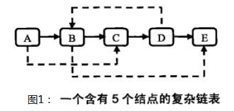
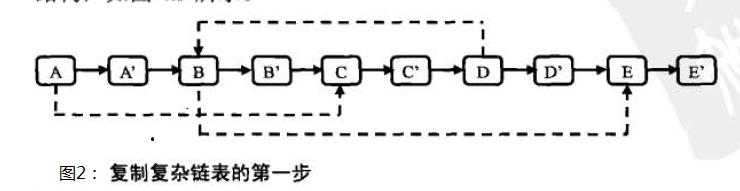
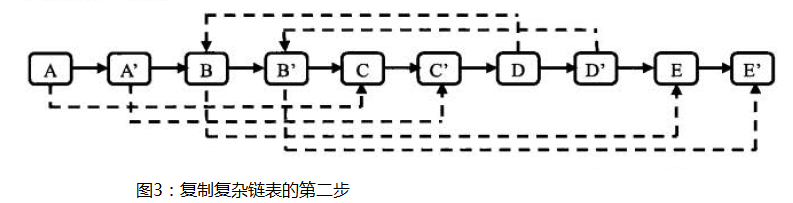
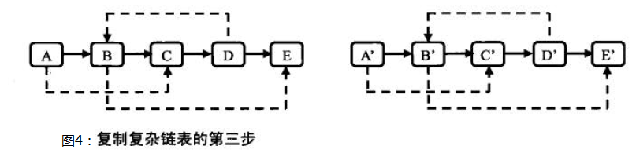

# 剑指Offer（二十五）：复杂链表的复制

> 搜索微信公众号:'AI-ming3526'或者'计算机视觉这件小事' 获取更多算法、机器学习干货  
> csdn：https://blog.csdn.net/baidu_31657889/  
> github：https://github.com/aimi-cn/AILearners

## 一、引子

这个系列是我在牛客网上刷《剑指Offer》的刷题笔记，旨在提升下自己的算法能力。  
查看完整的剑指Offer算法题解析请点击CSDN和github链接：  
[剑指Offer完整习题解析CSDN地址](https://blog.csdn.net/baidu_31657889/article/category/9059648)  
[github地址](https://github.com/aimi-cn/AILearners/tree/master/blog/Algorithm/jianzhi_offer)

## 二、题目

输入一个复杂链表（每个节点中有节点值，以及两个指针，一个指向下一个节点，另一个特殊指针指向任意一个节点），返回结果为复制后复杂链表的head。（注意，输出结果中请不要返回参数中的节点引用，否则判题程序会直接返回空）

### 1、思路

下图是一个含有 5 个结点的复杂链表。图中实线箭头表示 next 指针，虚线箭头表示 random 指针。为简单起见，指向 null 的指针没有画出。



第一步：是根据原始链表的每个结点N 创建对应的 N’。把 N’链接在N的后面。图 1 的链表经过这一步之后的结构，如图 2 所示。



第二步：设置复制出来的结点的 random。假设原始链表上的 N 的 random 指向结点 S，那么其对应复制出来的 N’是 N的 pext 指向的结点，同样 S’也是 S 的 next 指向的结点。设置 random 之后的链表如下图3所示。



第三步：把这个长链表拆分成两个链表。把奇数位置的结点用 next 链接起来就是原始链表，把偶数位置的结点用 next 链接起来就是复制 出来的链表。图3中的链表拆分之后的两个链表下图4所示。



我们可以使用递归的方法实现~

### 2、编程实现

**python**

代码实现方案：

```python
# -*- coding:utf-8 -*-
# class RandomListNode:
#     def __init__(self, x):
#         self.label = x
#         self.next = None
#         self.random = None
class Solution:
    # 返回 RandomListNode
    def Clone(self, pHead):
        # write code here
        if not pHead:return
        newNode = RandomListNode(pHead.label)
        newNode.random = pHead.random
        newNode.next = self.Clone(pHead.next)
        return newNode
```
