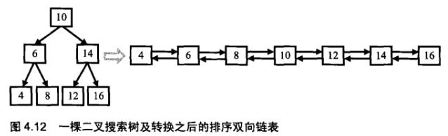
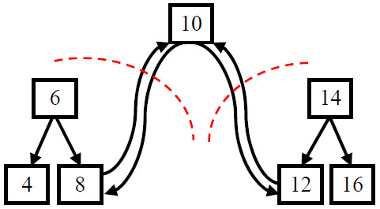

# 剑指Offer（二十六）：二叉搜索树与双向链表

> 搜索微信公众号:'AI-ming3526'或者'计算机视觉这件小事' 获取更多算法、机器学习干货  
> csdn：https://blog.csdn.net/baidu_31657889/  
> github：https://github.com/aimi-cn/AILearners

## 一、引子

这个系列是我在牛客网上刷《剑指Offer》的刷题笔记，旨在提升下自己的算法能力。  
查看完整的剑指Offer算法题解析请点击CSDN和github链接：  
[剑指Offer完整习题解析CSDN地址](https://blog.csdn.net/baidu_31657889/article/category/9059648)  
[github地址](https://github.com/aimi-cn/AILearners/tree/master/blog/Algorithm/jianzhi_offer)

## 二、题目

输入一棵二叉搜索树，将该二叉搜索树转换成一个排序的双向链表。要求不能创建任何新的结点，只能调整树中结点指针的指向。

### 1、思路

首先举例子说明：



二叉搜索树如上图所示，我们将其转换为配需双向链表。

根据二叉搜索树的特点：左结点的值<根结点的值<右结点的值，我们不难发现，使用二叉树的中序遍历出来的数据的数序，就是排序的顺序。因此，首先，确定了二叉搜索树的遍历方法。

当中序遍历到根结点的时候，我们把二叉搜索树看成3部分：值为10的结点，根结点为6的左子树，根结点为14的右子树。根据排序链表的定义，值为10的结点将和它的左子树的最大一个结点值为8的结点链接起来，同时它还将和右子树中最小的结点值为12的结点链接起来。如下图：



注：根结点、左子树、右子树。在把左右子树都转换成排序的双向链表之后再和根结点链接起来，整颗二叉搜索树也就转换成了排序的双向链表

按照中序递归遍历中，当我们遍历转换到根结点时，它的左子树已经转换成了一个排序的链表，并且此时链表尾部的值为左子树中值最大的结点的值（8）。我们将它（8）和根结点（10）链接起来，此时根结点（10）变成了链表尾部，接着去遍历右子树，我们知道中序遍历根结点（10）后的一个结点此时为右子树值最小的结点（12），我们将它和根结点链接起来。左右子树再用这样的办法，即递归即可解决问题。

### 2、编程实现

**python**

代码实现方案：

```python
# -*- coding:utf-8 -*-
# class TreeNode:
#     def __init__(self, x):
#         self.val = x
#         self.left = None
#         self.right = None
class Solution:
    def Convert(self, pRootOfTree):
        # write code here
        if not pRootOfTree: return
        self.arr = []
        self.midTraversal(pRootOfTree)
        for i,v in enumerate(self.arr[:-1]):
            v.right = self.arr[i + 1]
            self.arr[i + 1].left = v
        return self.arr[0]
        
    ##中序遍历
    def midTraversal(self, root):
        if not root: return
        self.midTraversal(root.left)
        self.arr.append(root)
        self.midTraversal(root.right)
```
