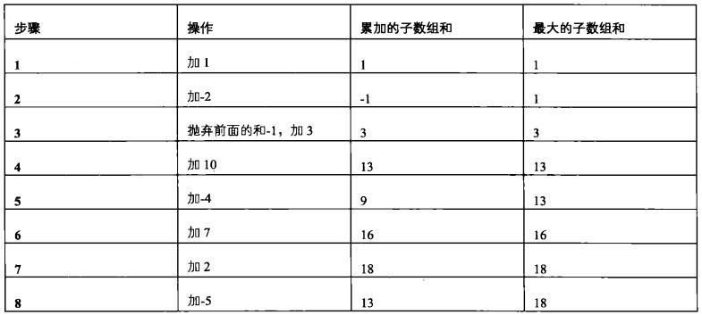

# 剑指Offer（三十）：连续子数组的最大和

> 搜索微信公众号:'AI-ming3526'或者'计算机视觉这件小事' 获取更多算法、机器学习干货  
> csdn：https://blog.csdn.net/baidu_31657889/  
> github：https://github.com/aimi-cn/AILearners

## 一、引子

这个系列是我在牛客网上刷《剑指Offer》的刷题笔记，旨在提升下自己的算法能力。  
查看完整的剑指Offer算法题解析请点击CSDN和github链接：  
[剑指Offer完整习题解析CSDN地址](https://blog.csdn.net/baidu_31657889/article/category/9059648)  
[github地址](https://github.com/aimi-cn/AILearners/tree/master/blog/Algorithm/jianzhi_offer)

## 二、题目

HZ偶尔会拿些专业问题来忽悠那些非计算机专业的同学。今天测试组开完会后,他又发话了:在古老的一维模式识别中,常常需要计算连续子向量的最大和,当向量全为正数的时候,问题很好解决。但是,如果向量中包含负数,是否应该包含某个负数,并期望旁边的正数会弥补它呢？例如:{6,-3,-2,7,-15,1,2,2},连续子向量的最大和为8(从第0个开始,到第3个为止)。给一个数组，返回它的最大连续子序列的和，你会不会被他忽悠住？(子向量的长度至少是1)

### 1、思路

数组分析：下图是我们计算数组（1，-2，3，10，-4，7，2，-5）中子数组的最大和的过程。通过分析我们发现，累加的子数组和，如果大于零，那么我们继续累加就行；否则，则需要剔除原来的累加和重新开始。

过程如下：



### 2、编程实现

**python**

代码实现方案：


```python
# -*- coding:utf-8 -*-
class Solution:
    def FindGreatestSumOfSubArray(self, array):
        # write code here
        if len(array) == 0:
            return 0
        # 初始化变量，maxSum为最大和，curSum为当前和
        curSum = array[0]
        maxSum = array[0]
        # 遍历剩下的所有元素
        for i in array[1:]:
            # 如果当前和小于等于0，说明之前的是负数，则抛弃前面的和，重新计算
            if curSum <=0:
                curSum = i
            # 如果没有问题，直接累加
            else:
                curSum += i
            # 更新最大和
            if curSum > maxSum:
                maxSum = curSum
        return maxSum
```
