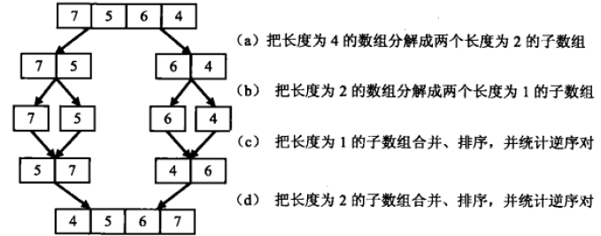
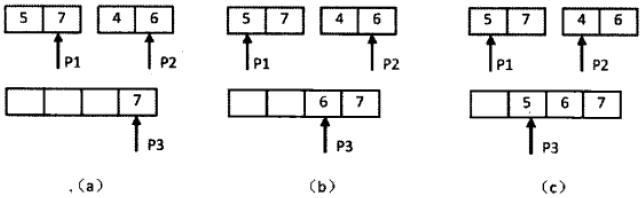

# 剑指Offer（三十五）：数组中的逆序对

> 搜索微信公众号:'AI-ming3526'或者'计算机视觉这件小事' 获取更多算法、机器学习干货  
> csdn：https://blog.csdn.net/baidu_31657889/  
> github：https://github.com/aimi-cn/AILearners

## 一、引子

这个系列是我在牛客网上刷《剑指Offer》的刷题笔记，旨在提升下自己的算法能力。  
查看完整的剑指Offer算法题解析请点击CSDN和github链接：  
[剑指Offer完整习题解析CSDN地址](https://blog.csdn.net/baidu_31657889/article/category/9059648)  
[github地址](https://github.com/aimi-cn/AILearners/tree/master/blog/Algorithm/jianzhi_offer)

## 二、题目

在数组中的两个数字，如果前面一个数字大于后面的数字，则这两个数字组成一个逆序对。输入一个数组,求出这个数组中的逆序对的总数P。并将P对1000000007取模的结果输出。 即输出P%1000000007

输入描述：

题目保证输入的数组中没有的相同的数字
数据范围：

	对于%50的数据,size<=10^4

	对于%75的数据,size<=10^5

	对于%100的数据,size<=2*10^5

事例1：

输入：
> 1,2,3,4,5,6,7,0

输出：
> 7


### 1、思路

首先我们先明白题目的意思，比如一个数组{7,5,6,4},它的逆序对总共有五对，{7,5},{7,6},{7,4},{5,4},{6,4} 只要是前面比后面大就组成一个逆序对。

看到这个题目，我们的第一反应是顺序扫描整个数组。每扫描到一个数组的时候，逐个比较该数字和它后面的数字的大小。如果后面的数字比它小，则这两个数字就组成了一个逆序对。假设数组中含有n个数字。由于每个数字都要和O(n)这个数字比较，因此这个算法的时间复杂度为O(n^2)。

现在用上面说的这种方式是一种时间复杂度比较高的一种，我们换一种思路，采用归并排序的方法。



先把数组分解成两个长度为2的子数组，再把这两个子数组分解成两个长度为1的子数组。接下来一边合并相邻的子数组，一边统计逆序对的数目。在第一对长度为1的子数组{7}、{5}中7>5，因此（7,5）组成一个逆序对。同样在第二对长度为1的子数组{6}，{4}中也有逆序对（6,4），由于已经统计了这两对子数组内部的逆序对，因此需要把这两对子数组进行排序，避免在之后的统计过程中重复统计。



逆序对的总数 = 左边数组中的逆序对的数量 + 右边数组中逆序对的数量 + 左右结合成新的顺序数组时中出现的逆序对的数量

### 2、编程实现

**python**

代码实现方案：


```python
# -*- coding:utf-8 -*-
class Solution:
    def InversePairs(self, data):
        # write code here
        if not data:
            return 0
        temp = [i for i in data]
        return self.mergeSort(temp, data, 0, len(data)-1) % 1000000007
    def mergeSort(self, temp, data, low, high):
        if low >= high:
            temp[low] = data[low]
            return 0
        mid = (low + high) / 2
        left = self.mergeSort(data, temp, low, mid)
        right = self.mergeSort(data, temp, mid+1, high)
        count = 0
        i = low
        j = mid+1
        index = low
        while i <= mid and j <= high:
            if data[i] <= data[j]:
                temp[index] = data[i]
                i += 1
            else:
                temp[index] = data[j]
                count += mid-i+1
                j += 1
            index += 1
        while i <= mid:
            temp[index] = data[i]
            i += 1
            index += 1
        while j <= high:
            temp[index] = data[j]
            j += 1
            index += 1
        return count + left + right
```
