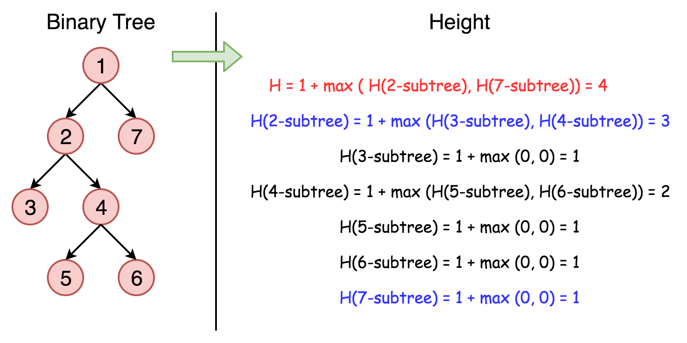

# LeetCode初级算法--树01：二叉树的最大深度

> 搜索微信公众号:'AI-ming3526'或者'计算机视觉这件小事' 获取更多算法、机器学习干货  
> csdn：https://blog.csdn.net/baidu_31657889/  
> csdn：https://blog.csdn.net/abcgkj/  
> github：https://github.com/aimi-cn/AILearners

## 一、引子

这是由LeetCode官方推出的的经典面试题目清单~  
这个模块对应的是探索的初级算法~旨在帮助入门算法。我们第一遍刷的是leetcode推荐的题目。  
查看完整的剑指Offer算法题解析请点击github链接：  
[github地址](https://github.com/aimi-cn/AILearners/tree/master/blog/Algorithm/leetcode/primary_algorithms)

## 二、题目

给定一个二叉树，找出其最大深度。

二叉树的深度为根节点到最远叶子节点的最长路径上的节点数。

说明: 叶子节点是指没有子节点的节点。

**示例:**

给定二叉树 [3,9,20,null,null,15,7]，

```
   3
   / \
  9  20
    /  \
   15   7
```

返回它的最大深度 3 。

### 1、思路

使用递归的方法解决此题。直接上图：



我们可以看到树的深度H等于1加上左右两个左右子树深度的最大值。

所以我们直接使用递归方法处理~看代码

### 2、编程实现

**python**

```python
# Definition for a binary tree node.
# class TreeNode(object):
#     def __init__(self, x):
#         self.val = x
#         self.left = None
#         self.right = None

class Solution(object):
    def maxDepth(self, root):
        """
        :type root: TreeNode
        :rtype: int
        """
        if root is None:
            return 0
        count = max(self.maxDepth(root.left),self.maxDepth(root.right)) + 1
        return count
```