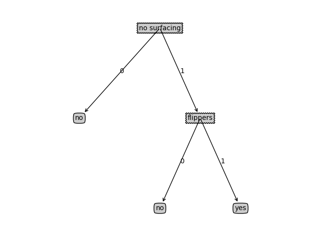

# 《机器学习实战》3.1.决策树简介
> 搜索微信公众号:'AI-ming3526'或者'计算机视觉这件小事' 获取更多人工智能、机器学习干货
> csdn：https://blog.csdn.net/baidu_31657889/
> github：https://github.com/xiaoming3526/ai-ming3526
> github：https://github.com/aimi-cn/


决策树（Decision Tree）算法是一种基本的分类与回归方法，是最经常使用的数据挖掘算法之一。我们这章节只讨论用于分类的决策树。
决策树模型呈树形结构，在分类问题中，表示基于特征对实例进行分类的过程。它可以认为是 if-then 规则的集合，也可以认为是定义在特征空间与类空间上的条件概率分布。
决策树学习通常包括 3 个步骤：特征选择、决策树的生成和决策树的修剪。

### 2、决策树 场景

**场景1**：一个叫做 "二十个问题" 的游戏，游戏的规则很简单：参与游戏的一方在脑海中想某个事物，其他参与者向他提问，只允许提 20 个问题，问题的答案也只能用对或错回答。问问题的人通过推断分解，逐步缩小待猜测事物的范围，最后得到游戏的答案。

**场景2**：一个邮件分类系统，大致工作流程如下


首先检测发送邮件域名地址。如果地址为 myEmployer.com, 则将其放在分类 "无聊时需要阅读的邮件"中。
如果邮件不是来自这个域名，则检测邮件内容里是否包含单词 "曲棍球" , 如果包含则将邮件归类到 "需要及时处理的朋友邮件", 
如果不包含则将邮件归类到 "无需阅读的垃圾邮件" 。

**场景3**：一个小型的数据集，5条记录，2个特征（属性），有标签。


根据这个数据集，我们可以建立如下决策树（用matplotlib的注释功能画的）。

观察决策树，决策节点为特征，其分支为决策节点的各个不同取值，叶节点为预测值。



建树结束也就是建立好了一个决策树分类器，有了分类器，就可以根据这个分类器对其他的鱼进行预测了。预测准确性今天暂且不讨论。

**场景三具体实现可看下一节的决策树案例分析**

### 3、决策树的定义：

分类决策树模型是一种描述对实例进行分类的树形结构。决策树由结点（node）和有向边（directed edge）组成。结点有两种类型：内部结点（internal node）和叶结点（leaf node）。内部结点表示一个特征或属性(features)，叶结点表示一个类(labels)。

用决策树对需要测试的实例进行分类：从根节点开始，对实例的某一特征进行测试，根据测试结果，将实例分配到其子结点；这时，每一个子结点对应着该特征的一个取值。如此递归地对实例进行测试并分配，直至达到叶结点。最后将实例分配到叶结点的类中。

## 4、决策树 原理和开发流程以及特点

需要知道的概念：**信息熵 & 信息增益**

熵（entropy）： 熵指的是体系的混乱的程度，在不同的学科中也有引申出的更为具体的定义，是各领域十分重要的参量。

信息论（information theory）中的熵（香农熵）： 是一种信息的度量方式，表示信息的混乱程度，也就是说：信息越有序，信息熵越低。例如：火柴有序放在火柴盒里，熵值很低，相反，熵值很高。

信息增益（information gain）： 在划分数据集前后信息发生的变化称为信息增益。

### 决策树 工作原理

如何构造一个决策树?
我们使用 createBranch() 方法，如下所示：

```python
def createBranch():
'''
此处运用了迭代的思想。 感兴趣可以搜索 迭代 recursion， 甚至是 dynamic programing。
'''
    检测数据集中的所有数据的分类标签是否相同:
        If so return 类标签
        Else:
            寻找划分数据集的最好特征（划分之后信息熵最小，也就是信息增益最大的特征）
            划分数据集
            创建分支节点
                for 每个划分的子集
                    调用函数 createBranch （创建分支的函数）并增加返回结果到分支节点中
            return 分支节点
```

### 决策树 开发流程

```
收集数据：可以使用任何方法。
准备数据：树构造算法 (这里使用的是ID3算法，只适用于标称型数据，这就是为什么数值型数据必须离散化。 还有其他的树构造算法，比如CART)
分析数据：可以使用任何方法，构造树完成之后，我们应该检查图形是否符合预期。
训练算法：构造树的数据结构。
测试算法：使用训练好的树计算错误率。
使用算法：此步骤可以适用于任何监督学习任务，而使用决策树可以更好地理解数据的内在含义。
```

### 决策树 算法特点

```
优点：计算复杂度不高，输出结果易于理解，数据有缺失也能跑，可以处理不相关特征。
缺点：容易过拟合。
适用数据类型：数值型和标称型。
```

