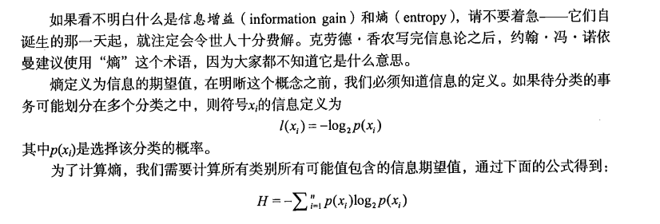

# 《机器学习实战》3.2决策树项目案例：判定鱼类和非鱼类
> 搜索微信公众号:'AI-ming3526'或者'计算机视觉这件小事' 获取更多人工智能、机器学习干货  
> csdn：https://blog.csdn.net/baidu_31657889/  
> github：https://github.com/xiaoming3526/ai-ming3526  
> github：https://github.com/aimi-cn/

上节讲了决策树的基本概念 以及什么是信息熵 信息增益 这节重点放在代码上 以代码的形式来更加清晰的解释决策树
**项目案例1: 判定鱼类和非鱼类**
## 1、项目概述(上节在场景3中简单提到了)

根据以下 2 个特征，将动物分成两类：鱼类和非鱼类。

特征：

1. 不浮出水面是否可以生存
2. 是否有脚蹼

开发流程：

[完整代码地址](https://github.com/xiaoming3526/ai-ming3526/tree/master/blog/src/py2.x/ml/3.DecisionTree)
>收集数据：可以使用任何方法  
准备数据：树构造算法（这里使用的是ID3算法，因此数值型数据必须离散化。）  
分析数据：可以使用任何方法，构造树完成之后，我们可以将树画出来。  
训练算法：构造树结构  
测试算法：使用习得的决策树执行分类  
使用算法：此步骤可以适用于任何监督学习任务，而使用决策树可以更好地理解数据的内在含义

### 1、收集数据：可以使用任何方法


我们利用 createDataSet() 函数输入数据

```python
'''
@description: 创建数据集
@param {None} 
@return: 返回数据集和对应的label标签
'''
def creatDataSet():
    '''
    |不浮出水面可以生存| 是否有脚蹼 |属于鱼类
    |1-是----------------------|-是------------|是
    |2-是---------------------  |-是------------|是
    |3-是---------------------  |-否------------|否
    |4-否---------------------  |-是------------|否
    |5-否---------------------  |-是------------|否
    no surfacing:不露出水面是否可以生成？
    flippers:是否有脚蹼？
    '''
    dataSet = [
        [1, 1, 'yes'],
        [1, 1, 'yes'],
        [1, 0, 'no'],
        [0, 1, 'no'],
        [0, 1, 'no']
    ]
    labels = ['no surfacing', 'flippers']
    return dataSet, labels
```

### 2、准备数据：树构造算法

此处，由于我们输入的数据本身就是离散化数据，所以这一步就省略了。

### 3、分析数据：可以使用任何方法，构造树完成之后，我们可以将树画出来。


公式中n是分类的个数

计算给定数据集的香农熵的函数

