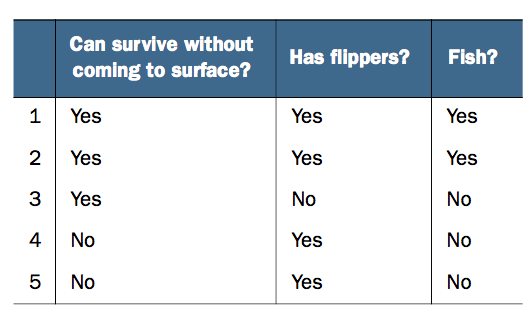
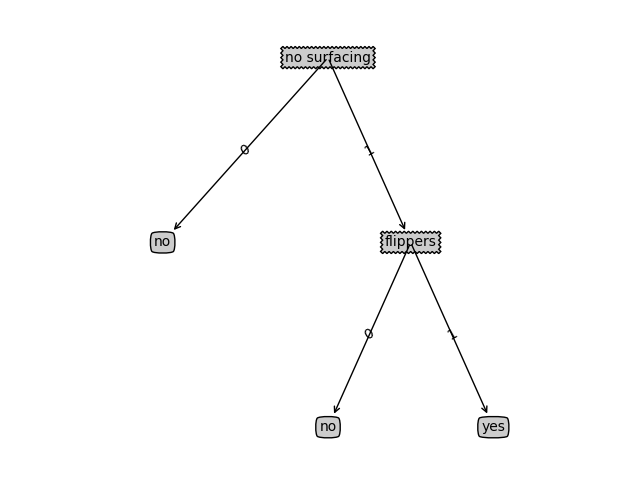

# 《机器学习实战》3.2决策树项目案例01：判定鱼类和非鱼类
> 搜索微信公众号:'AI-ming3526'或者'计算机视觉这件小事' 获取更多人工智能、机器学习干货  
> csdn：https://blog.csdn.net/baidu_31657889/  
> github：https://github.com/aimi-cn/AILearners

上节讲了决策树的基本概念 以及什么是信息熵 信息增益 这节重点放在代码上 以代码的形式来更加清晰的解释决策树

本文出现的所有代码，均可在github上下载，不妨来个Star把谢谢~：[Github代码地址](https://github.com/aimi-cn/AILearners/tree/master/src/py2.x/ml/jqxxsz/3.DecisionTree)

**项目案例1: 判定鱼类和非鱼类**
## 1、项目概述(上节在场景3中简单提到了)

根据以下 2 个特征，将动物分成两类：鱼类和非鱼类。

特征：

1. 不浮出水面是否可以生存
2. 是否有脚蹼

开发流程：

[完整代码地址](https://github.com/aimi-cn/AILearners/tree/master/src/py2.x/ml/jqxxsz/3.DecisionTree/DecisionTree_demo01.py)
>收集数据：可以使用任何方法  
准备数据：树构造算法（这里使用的是ID3算法，因此数值型数据必须离散化。）  
分析数据：可以使用任何方法，构造树完成之后，我们可以将树画出来。  
训练算法：构造树结构  
测试算法：使用习得的决策树执行分类  
使用算法：此步骤可以适用于任何监督学习任务，而使用决策树可以更好地理解数据的内在含义

### 1、收集数据：可以使用任何方法



我们利用 createDataSet() 函数输入数据

```python
'''
@description: 创建数据集
@param {None} 
@return: 返回数据集和对应的label标签
'''
def creatDataSet():
    '''
    |不浮出水面可以生存| 是否有脚蹼 |属于鱼类
    |1-是----------------------|-是------------|是
    |2-是---------------------  |-是------------|是
    |3-是---------------------  |-否------------|否
    |4-否---------------------  |-是------------|否
    |5-否---------------------  |-是------------|否
    no surfacing:不露出水面是否可以生成？
    flippers:是否有脚蹼？
    '''
    dataSet = [
        [1, 1, 'yes'],
        [1, 1, 'yes'],
        [1, 0, 'no'],
        [0, 1, 'no'],
        [0, 1, 'no']
    ]
    labels = ['no surfacing', 'flippers']
    return dataSet, labels
```

### 2、准备数据：树构造算法

此处，由于我们输入的数据本身就是离散化数据，所以这一步就省略了。

### 3、分析数据：可以使用任何方法，构造树完成之后，我们可以将树画出来。


公式中n是分类的个数

#### 计算给定数据集的香农熵的函数

```python
'''
@description: 计算给定数据集的香农熵
@param {type} 数据集
@return: 返回 每一组feature下的某个分类下，香农熵的信息期望
eg:dataSet下 Yes/No 分类下香农熵大小 0.970950594455 信息越有序，信息熵越低。
'''
def calcShannonEnt(dataSet):
    # -----------计算香农熵的第一种实现方式start--------------------------------------------------------------------------------
    #
    numEntries = len(dataSet)   #返回数据集的行数
    labelsCounts = {}           #保存每个标签(Label)出现次数的字典
    for featVec in dataSet:     #对每组特征向量进行统计
        currentLabel = featVec[-1]  #提取标签(Label)信息
        if currentLabel not in labelsCounts.keys(): #如果标签(Label)没有放入统计次数的字典,添加进去
            labelsCounts[currentLabel] = 0
        labelsCounts[currentLabel] += 1 #Label计数
    shannonEnt = 0.0    #经验熵(香农熵)
    for key in labelsCounts:    #计算香农熵
        prob = float(labelsCounts[key])/numEntries  #选择该标签(Label)的概率
        shannonEnt -= prob * log(prob, 2)   #利用公式计算
    # -----------计算香农熵的第一种实现方式end--------------------------------------------------------------------------------

    # # -----------计算香农熵的第二种实现方式start--------------------------------------------------------------------------------
    # # 统计标签出现的次数
    #eg:Counter({'no': 3, 'yes': 2})
    # label_count = Counter(data[-1] for data in dataSet)
    # # 计算概率
    # probs = [float(p[1]) / len(dataSet) for p in label_count.items()]
    # # 计算香农熵
    # shannonEnt = sum([-p * log(p, 2) for p in probs])
    # -----------计算香农熵的第二种实现方式end--------------------------------------------------------------------------------
    return shannonEnt   #返回香农熵
```

#### 按照给定特征划分数据集

```python
'''
@description: 按照给定特征划分数据集
@param {dataSet 数据集 : 待划分的数据集 
        index 表示每一行的index列 :划分数据集的特征
        value 表示index列对应的value值 :需要返回的特征的值
} 
@return: index列为value的数据集【该数据集需要排除index列】
demo:dataSet=[[1, 1, 'yes'],
      [1, 1, 'yes'],
      [1, 0, 'no'],
      [0, 1, 'no'],
      [0, 1, 'no']]
      splitDataSet(dataSet,0,1)
      这个方法代表的意思就是在上面的数据集中找到第0列值是1的数据 返回出来 并且返回值中不包含第0列的值
      现在可以看到第0列值为1的数据有[1, 1, 'yes']，[1, 1, 'yes']，[1, 0, 'no']三个，然后去掉第0列的值返回出来的就是[1, 'yes'], [1, 'yes'], [0, 'no']
'''
def splitDataSet(dataSet, index, value):
    # -----------划分数据集的第一种方式 start------------------------------------
    retDataSet = []
    for featVec in dataSet:
        # index列为value的数据集【该数据集需要排除index列】
        # 判断index列的值是否为value
        if featVec[index] == value:
            # [:index]表示前index行，即若 index 为2，就是取 featVec 的前 index 行
            reduceFeatVec = featVec[:index]
            # [index+1:]表示从跳过 index 的 index+1行，取接下来的数据
            # 收集结果值 index列为value的行【该行需要排除index列】
            '''
            对于extend append
            list.append(object) 向列表中添加一个对象object
            list.extend(sequence) 把一个序列seq的内容添加到列表中
            1、使用append的时候，是将new_media看作一个对象，整体打包添加到music_media对象中。
            2、使用extend的时候，是将new_media看作一个序列，将这个序列和music_media序列合并，并放在其后面。
            result = []
            result.extend([1,2,3])
            print result
            result.append([4,5,6])
            print result
            result.extend([7,8,9])
            print result
            结果：
            [1, 2, 3]
            [1, 2, 3, [4, 5, 6]]
            [1, 2, 3, [4, 5, 6], 7, 8, 9]
            '''
            reduceFeatVec.extend(featVec[index+1:])
            retDataSet.append(reduceFeatVec)
    # -----------划分数据集的第一种方式 end------------------------------------
    # -----------划分数据集的第二种方式 start------------------------------------
    #retDataSet = [data for data in dataSet for i,v in enumerate(data) if i == index and v == value]
    #这个没有排除第index列
    return retDataSet
```

#### 选择最好的数据集划分方式

```python
'''
@description: 选择最好的数据集划分方式
@param {dataSet:数据集} 
@return: bestFeature ：最优的特征列
demo:可以看出infoGain信息增益0的时候是比较大的 所以最好的特征是0
输出：infoGain= 0.419973094022 bestFeature= 0 0.970950594455 0.550977500433
    infoGain= 0.170950594455 bestFeature= 1 0.970950594455 0.8
    最后返回的最好的数据集bestFeature=0 
    对比我们自己计算的结果，发现结果完全正确！最优特征的索引值为0，也就是特征 no surfacing:不露出水面是否可以生成？
'''
def chooseBestFeatureToSplit(dataSet):
    # -----------选择最优特征的第一种方式 start------------------------------------
    #先求第一行有多少特征 最后一行是label标签所以减去1
    numFeatures = len(dataSet[0]) - 1
    #Label标签信息熵
    baseEntropy = calcShannonEnt(dataSet)
    # 最优的信息增益值, 和最优的Featurn编号
    bestInfoGain, bestFeature = 0.0, -1
    for i in range(numFeatures):
        # 获取每一个实例的第i+1个feature，组成list集合
        #eg:[1, 1, 1, 0, 0] [1, 1, 0, 1, 1]
        featList = [example[i] for example in dataSet]
        # 获取剔重后的集合，使用set对list数据进行去重
        #eg:set([0, 1]) set([0, 1])
        uniqueVals = set(featList)
        # 创建一个临时的信息熵
        newEntropy = 0.0
        # 遍历某一列的value集合，计算该列的信息熵 
        # 遍历当前特征中的所有唯一属性值，对每个唯一属性值划分一次数据集，计算数据集的新熵值，并对所有唯一特征值得到的熵求和。
        for value in uniqueVals:
            subDataSet = splitDataSet(dataSet, i, value)
            #计算这个subDataSet占整个dataSet的概率是多少
            prob = len(subDataSet)/float(len(dataSet))
            newEntropy += prob * calcShannonEnt(subDataSet)
        # gain[信息增益]: 划分数据集前后的信息变化， 获取信息熵最大的值
        # 信息增益是熵的减少或者是数据无序度的减少。最后，比较所有特征中的信息增益，返回最好特征划分的索引值。
        infoGain = baseEntropy - newEntropy
        #print('infoGain=', infoGain, 'bestFeature=', i, baseEntropy, newEntropy)
        if(infoGain > bestInfoGain):
            bestInfoGain = infoGain
            bestFeature = i
    # -----------选择最优特征的第一种方式 end------------------------------------
    # # -----------选择最优特征的第二种方式 start------------------------------------
    # # 计算初始香农熵
    # base_entropy = calcShannonEnt(dataSet)
    # best_info_gain = 0
    # best_feature = -1
    # # 遍历每一个特征
    # for i in range(len(dataSet[0]) - 1):
    #     # 对当前特征进行统计
    #     feature_count = Counter([data[i] for data in dataSet])
    #     # 计算分割后的香农熵
    #     new_entropy = sum(feature[1] / float(len(dataSet)) * calcShannonEnt(splitDataSet(dataSet, i, feature[0])) \
    #                    for feature in feature_count.items())
    #     # 更新值
    #     info_gain = base_entropy - new_entropy
    #     print('No. {0} feature info gain is {1:.3f}'.format(i, info_gain))
    #     if info_gain > best_info_gain:
    #         best_info_gain = info_gain
    #         best_feature = i
    # return best_feature
    # # -----------选择最优特征的第二种方式 end------------------------------------
    return bestFeature
```
### 4、训练算法：构造树的数据结构
#### 创建树的函数代码如下：

原理中只说明了如何进行选择具有决定性的特征，那么具体如何构建决策树呢？方法很简单，选择最有决定性的特征，其有若干解，构建若干解的子集的决策树，这样递归下去，直到所有的答案指向同一个分类，或者是最后一个特征了，挑选大部分训练集所选择的分类。文字说明比较难懂，看下面的伪逻辑：

```python
　　loop(dataSet):

　　　　if dataSet 所有分类都是同一个，返回该分类

　　　　if dataSet 没有可以进行选择的条件了，返回该结果集大部分指向的分类

　　　　通过信息增益指标，选择当前dataSet最有决定性的特征

　　　　for 该特征的值：

　　　　　　该值所得出的子集subDataSet

　　　　　　tree = loop(subDataSet) 构建该特征的该值的子树

　　　　return tree
```

　　整个过程就是一个不断分叉的过程，选择当前具有决定性的特征，通过其值构建子树，构建子树的方法就是使用子训练集再通过构建树的方法进行构建，构建的终点就是要不全是一个分类，要不不能再分叉了就选择最终大部分所在的结果。

```python
'''
@description: 创建树
@param {dataSet, labels 数据集 对应的标签} 
@return: 
'''
def createTree(dataSet, labels):
    #返回数据集中最后一列的值
    # eg classList:['yes', 'yes', 'no', 'no', 'no']
    classList = [example[-1] for example in dataSet]
    # 如果数据集的最后一列的第一个值出现的次数=整个集合的数量，也就说只有一个类别，就只直接返回结果就行
    # 第一个停止条件：所有的类标签(Label)完全相同，则直接返回该类标签。
    # count() 函数是统计括号中的值在list中出现的次数
    # eg: classList:['yes', 'yes'] classList.count(classList[0])== len(classList)=2直接返回'yes'
    if classList.count(classList[0]) == len(classList):
        return classList[0]
    # 如果数据集只有1列，那么最初出现label次数最多的一类，作为结果
    # 第二个停止条件：使用完了所有特征，仍然不能将数据集划分成仅包含唯一类别的分组。
    if len(dataSet[0]) == 1:
        return majorityCnt(classList)

    # 选择最优的列，得到最优列对应的label含义
    bestFeat = chooseBestFeatureToSplit(dataSet)
    # 获取label的名称
    bestFeatLabel = labels[bestFeat]
    # 初始化myTree
    myTree = {bestFeatLabel: {}}
    # 注：labels列表是可变对象，在PYTHON函数中作为参数时传址引用，能够被全局修改
    # 所以这行代码导致函数外的同名变量被删除了元素，造成例句无法执行，提示'no surfacing' is not in list
    del(labels[bestFeat])
    # 取出最优列，然后它的branch做分类
    featValues = [example[bestFeat] for example in dataSet]
    # 获取剔重后的集合，使用set对list数据进行去重
    uniqueVals = set(featValues)
    for value in uniqueVals:
        # 求出剩余的标签label
        subLabels = labels[:]
        # 遍历当前选择特征包含的所有属性值，在每个数据集划分上递归调用函数createTree()
        myTree[bestFeatLabel][value] = createTree(splitDataSet(dataSet, bestFeat, value), subLabels)
        print('myTree', value, myTree)
    return myTree
```

### 5、测试算法：使用决策树执行分类

```python
'''
@description: 给输入的节点，进行分类
@param {inputTree  决策树模型 eg:{'no surfacing': {0: 'no', 1: {'flippers': {0: 'no', 1: 'yes'}}}}
        featLabels Feature标签对应的名称 eg:['no surfacing', 'flippers']
        testVec    测试输入的数据 eg:[1,1]} 
@return: classLabel 分类的结果值(是否是鱼类 yes/no)，需要映射label才能知道名称 
'''
def classify(inputTree, featLabels, testVec):
    # 获取tree的根节点对应的key值
    firstStr = inputTree.keys()[0]
    # 通过key得到根节点对应的value
    secondDict = inputTree[firstStr]
    # 判断根节点名称获取根节点在label中的先后顺序，这样就知道输入的testVec怎么开始对照树来做分类
    featIndex = featLabels.index(firstStr)
    # 测试数据，找到根节点对应的label位置，也就知道从输入的数据的第几位来开始分类
    key = testVec[featIndex]
    valueOfFeat = secondDict[key]
    print('+++', firstStr, 'xxx', secondDict, '---', key, '>>>', valueOfFeat)
    # 判断分枝是否结束: 判断valueOfFeat是否是dict类型 是dict类型就说明分支还没结束 继续进行分类
    if isinstance(valueOfFeat, dict):
        classLabel = classify(valueOfFeat, featLabels, testVec)
    else:
        classLabel = valueOfFeat
    return classLabel
```


### 6、使用算法：此步骤可以适用于任何监督学习任务，而使用决策树可以更好地理解数据的内在含义。

根据创建出来的tree画出来图 如下所示：


```python
def createPlot(inTree):
    # 创建一个figure的模版
    fig = plt.figure(1, facecolor='green')
    fig.clf()

    axprops = dict(xticks=[], yticks=[])
    # 表示创建一个1行，1列的图，createPlot.ax1 为第 1 个子图，
    createPlot.ax1 = plt.subplot(111, frameon=False, **axprops)

    plotTree.totalW = float(getNumLeafs(inTree))
    plotTree.totalD = float(getTreeDepth(inTree))
    # 半个节点的长度；xOff表示当前plotTree未遍历到的最左的叶节点的左边一个叶节点的x坐标
    # 所有叶节点中，最左的叶节点的x坐标是0.5/plotTree.totalW（因为totalW个叶节点在x轴方向是平均分布在[0, 1]区间上的）
    # 因此，xOff的初始值应该是 0.5/plotTree.totalW-相邻两个叶节点的x轴方向距离
    plotTree.xOff = -0.5 / plotTree.totalW
    # 根节点的y坐标为1.0，树的最低点y坐标为0
    plotTree.yOff = 1.0
    # 第二个参数是根节点的坐标
    plotTree(inTree, (0.5, 1.0), '')
    plt.show()
```