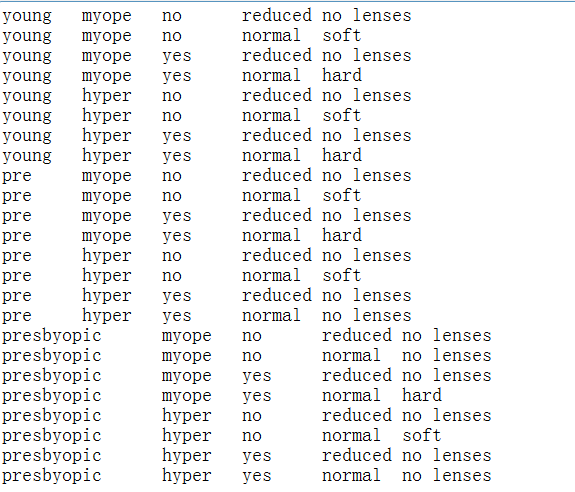
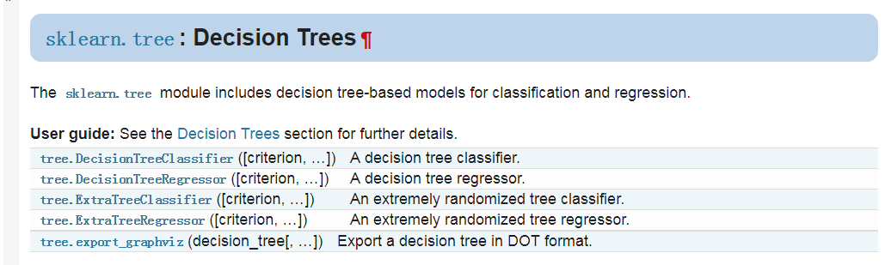
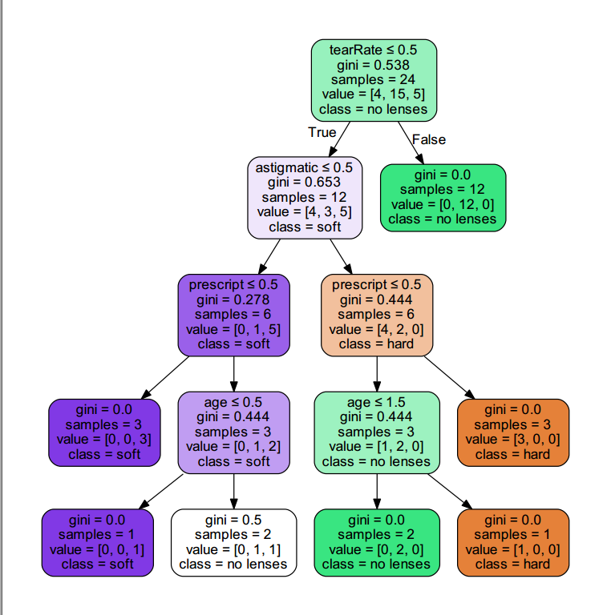

# 《机器学习实战》3.4决策树项目案例03：使用Sklearn预测隐形眼镜类型
> 搜索微信公众号:'AI-ming3526'或者'计算机视觉这件小事' 获取更多人工智能、机器学习干货  
> csdn：https://blog.csdn.net/baidu_31657889/  
> github：https://github.com/aimi-cn/AILearners

## 1、实战背景

本文出现的所有代码，均可在github上下载，不妨来个Star把谢谢~：[Github代码地址](https://github.com/aimi-cn/AILearners/tree/master/src/py2.x/ml/jqxxsz/3.DecisionTree/)

进入本文的正题：眼科医生是如何判断患者需要佩戴隐形眼镜的类型的？一旦理解了决策树的工作原理，我们甚至也可以帮助人们判断需要佩戴的镜片类型。
隐形眼镜数据集是非常著名的数据集，它包含很多换着眼部状态的观察条件以及医生推荐的隐形眼镜类型。隐形眼镜类型包括硬材质(hard)、软材质(soft)以及不适合佩戴隐形眼镜(no lenses)。数据来源与UCI数据库，数据集下载地址：[数据集下载](https://github.com/aimi-cn/AILearners/blob/master/data/ml/jqxxsz/sourceData/Ch03/lenses.txt)

数据集信息： 
* 特征有四个：age（年龄）、prescript（症状）、astigmatic（是否散光）、tearRate（眼泪数量） 
* 隐形眼镜类别有三类(最后一列)：硬材质(hard)、软材质(soft)、不适合佩戴隐形眼镜(no lenses) 


可以使用已经写好的Python程序构建决策树(上节已经给出实现步骤)，不过出于继续学习的目的，本文使用Sklearn实现。

## 2、使用Sklearn构建决策树
官方英文文档地址：http://scikit-learn.org/stable/modules/generated/sklearn.tree.DecisionTreeClassifier.html
sklearn.tree模块提供了决策树模型，用于解决分类问题和回归问题。方法如下图所示：

本次实战内容使用的是DecisionTreeClassifier和export_graphviz，前者用于决策树构建，后者用于决策树可视化。

DecisionTreeClassifier构建决策树：

让我们先看下DecisionTreeClassifier这个函数，一共有12个参数：

参数说明如下：

- criterion：特征选择标准，可选参数，默认是gini，可以设置为entropy。gini是基尼不纯度，是将来自集合的某种结果随机应用于某一数据项的预期误差率，是一种基于统计的思想。entropy是香农熵，也就是上篇文章讲过的内容，是一种基于信息论的思想。Sklearn把gini设为默认参数，应该也是做了相应的斟酌的，精度也许更高些？ID3算法使用的是entropy，CART算法使用的则是gini。
- splitter：特征划分点选择标准，可选参数，默认是best，可以设置为random。每个结点的选择策略。best参数是根据算法选择最佳的切分特征，例如gini、entropy。random随机的在部分划分点中找局部最优的划分点。默认的"best"适合样本量不大的时候，而如果样本数据量非常大，此时决策树构建推荐"random"。
- max_features：划分时考虑的最大特征数，可选参数，默认是None。寻找最佳切分时考虑的最大特征数(n_features为总共的特征数)，有如下6种情况：

    - 如果max_features是整型的数，则考虑max_features个特征；
如果max_features是浮点型的数，则考虑int(max_features * n_features)个特征；
    - 如果max_features设为auto，那么max_features = sqrt(n_features)；
    - 如果max_features设为sqrt，那么max_featrues = sqrt(n_features)，跟auto一样；
    - 如果max_features设为log2，那么max_features = log2(n_features)；
    - 如果max_features设为None，那么max_features = n_features，也就是所有特征都用。
    - 一般来说，如果样本特征数不多，比如小于50，我们用默认的"None"就可以了，如果特征数非常多，我们可以灵活使用刚才描述的其他取值来控制划分时考虑的最大特征数，以控制决策树的生成时间。

- max_depth：决策树最大深，可选参数，默认是None。这个参数是这是树的层数的。层数的概念就是，比如在贷款的例子中，决策树的层数是2层。如果这个参数设置为None，那么决策树在建立子树的时候不会限制子树的深度。一般来说，数据少或者特征少的时候可以不管这个值。或者如果设置了min_samples_slipt参数，那么直到少于min_smaples_split个样本为止。如果模型样本量多，特征也多的情况下，推荐限制这个最大深度，具体的取值取决于数据的分布。常用的可以取值10-100之间。
- min_samples_split：内部节点再划分所需最小样本数，可选参数，默认是2。这个值限制了子树继续划分的条件。如果min_samples_split为整数，那么在切分内部结点的时候，min_samples_split作为最小的样本数，也就是说，如果样本已经少于min_samples_split个样本，则停止继续切分。如果min_samples_split为浮点数，那么min_samples_split就是一个百分比，ceil(min_samples_split * n_samples)，数是向上取整的。如果样本量不大，不需要管这个值。如果样本量数量级非常大，则推荐增大这个值。
- min_samples_leaf：叶子节点最少样本数，可选参数，默认是1。这个值限制了叶子节点最少的样本数，如果某叶子节点数目小于样本数，则会和兄弟节点一起被剪枝。叶结点需要最少的样本数，也就是最后到叶结点，需要多少个样本才能算一个叶结点。如果设置为1，哪怕这个类别只有1个样本，决策树也会构建出来。如果min_samples_leaf是整数，那么min_samples_leaf作为最小的样本数。如果是浮点数，那么min_samples_leaf就是一个百分比，同上，celi(min_samples_leaf * n_samples)，数是向上取整的。如果样本量不大，不需要管这个值。如果样本量数量级非常大，则推荐增大这个值。
- min_weight_fraction_leaf：叶子节点最小的样本权重和，可选参数，默认是0。这个值限制了叶子节点所有样本权重和的最小值，如果小于这个值，则会和兄弟节点一起被剪枝。一般来说，如果我们有较多样本有缺失值，或者分类树样本的分布类别偏差很大，就会引入样本权重，这时我们就要注意这个值了。
- max_leaf_nodes：最大叶子节点数，可选参数，默认是None。通过限制最大叶子节点数，可以防止过拟合。如果加了限制，算法会建立在最大叶子节点数内最优的决策树。如果特征不多，可以不考虑这个值，但是如果特征分成多的话，可以加以限制，具体的值可以通过交叉验证得到。
- class_weight：类别权重，可选参数，默认是None，也可以字典、字典列表、balanced。指定样本各类别的的权重，主要是为了防止训练集某些类别的样本过多，导致训练的决策树过于偏向这些类别。类别的权重可以通过{class_label：weight}这样的格式给出，这里可以自己指定各个样本的权重，或者用balanced，如果使用balanced，则算法会自己计算权重，样本量少的类别所对应的样本权重会高。当然，如果你的样本类别分布没有明显的偏倚，则可以不管这个参数，选择默认的None。
- random_state：可选参数，默认是None。随机数种子。如果是证书，那么random_state会作为随机数生成器的随机数种子。随机数种子，如果没有设置随机数，随机出来的数与当前系统时间有关，每个时刻都是不同的。如果设置了随机数种子，那么相同随机数种子，不同时刻产生的随机数也是相同的。如果是RandomState instance，那么random_state是随机数生成器。如果为None，则随机数生成器使用np.random。
- min_impurity_split：节点划分最小不纯度,可选参数，默认是1e-7。这是个阈值，这个值限制了决策树的增长，如果某节点的不纯度(基尼系数，信息增益，均方差，绝对差)小于这个阈值，则该节点不再生成子节点。即为叶子节点 。
- presort：数据是否预排序，可选参数，默认为False，这个值是布尔值，默认是False不排序。一般来说，如果样本量少或者限制了一个深度很小的决策树，设置为true可以让划分点选择更加快，决策树建立的更加快。如果样本量太大的话，反而没有什么好处。问题是样本量少的时候，我速度本来就不慢。所以这个值一般懒得理它就可以了。

除了这些参数要注意以外，其他在调参时的注意点有：

- 当样本数量少但是样本特征非常多的时候，决策树很容易过拟合，一般来说，样本数比特征数多一些会比较容易建立健壮的模型
- 如果样本数量少但是样本特征非常多，在拟合决策树模型前，推荐先做维度规约，比如主成分分析（PCA），特征选择（Losso）或者独立成分分析（ICA）。这样特征的维度会大大减小。再来拟合决策树模型效果会好。
- 推荐多用决策树的可视化，同时先限制决策树的深度，这样可以先观察下生成的决策树里数据的初步拟合情况，然后再决定是否要增加深度。
- 在训练模型时，注意观察样本的类别情况（主要指分类树），如果类别分布非常不均匀，就要考虑用class_weight来限制模型过于偏向样本多的类别。
- 决策树的数组使用的是numpy的float32类型，如果训练数据不是这样的格式，算法会先做copy再运行。
- 如果输入的样本矩阵是稀疏的，推荐在拟合前调用csc_matrix稀疏化，在预测前调用csr_matrix稀疏化。

sklearn.tree.DecisionTreeClassifier()提供了一些方法供我们使用，如下图所示：


了解到这些，我们就可以编写代码了。

```python
from sklearn import tree

if __name__ == '__main__':
    fr = open('C:/Users/Administrator/Desktop/blog/github/AILearners/data/sourceData/Ch03/lenses.txt')
    #解析tab键分隔的数据行
    lenses = [inst.strip().split('\t') for inst in fr.readlines()]
    print(lenses)
    lensesLabels = ['age', 'prescript', 'astigmatic', 'tearRate']
    clf = tree.DecisionTreeClassifier()
    lenses = clf.fit(lenses, lensesLabels)
```

运行代码，会得到如下结果：

```python
ValueError: could not convert string to float: young
```

我们可以看到程序报错了，这是为什么？因为在fit()函数不能接收string类型的数据，通过打印的信息可以看到，数据都是string类型的。在使用fit()函数之前，我们需要对数据集进行编码，这里可以使用两种方法：

LabelEncoder ：将字符串转换为增量值
OneHotEncoder：使用One-of-K算法将字符串转换为整数

为了对string类型的数据序列化，需要先生成pandas数据，这样方便我们的序列化工作。这里我使用的方法是，原始数据->字典->pandas数据，编写代码如下：

从运行结果可以看出，顺利生成pandas数据。

接下来，将数据序列化，编写代码如下：

从打印结果可以看到，我们已经将数据顺利序列化，接下来。我们就可以fit()数据，构建决策树了。

## 3、使用Graphviz可视化决策树
Graphviz的是AT&T Labs Research开发的图形绘制工具，他可以很方便的用来绘制结构化的图形网络，支持多种格式输出，生成图片的质量和速度都不错。它的输入是一个用dot语言编写的绘图脚本，通过对输入脚本的解析，分析出其中的点，边以及子图，然后根据属性进行绘制。是使用Sklearn生成的决策树就是dot格式的，因此我们可以直接利用Graphviz将决策树可视化。

在讲解编写代码之前，我们需要安装两样东西，即pydotplus和Grphviz。

### (1) 安装pydotplus
pydotplus可以直接使用指令安装：
```python
pip insatall pydotplus
```
### （2）安装Graphviz
Graphviz不能使用pip进行安装，我们需要手动安装，下载地址：https://www.graphviz.org

下载好安装包，进行安装，安装完毕之后，需要设置Graphviz的环境变量。

你可以将 D:\Graphviz\bin; 目录添加到 PATH 环境变量中 具体百度


添加好环境变量之后，我们就可以正常使用Graphviz了。

> vscode需要重启下才可以使用Graphviz

### （3）编写代码
Talk is Cheap, show me the code.(废话少说，放码过来)。可视化部分的代码不难，都是有套路的，直接填参数就好，详细内容可以查看官方教程：http://scikit-learn.org/stable/modules/tree.html#tree

```python
# -*- coding: UTF-8 -*-
from sklearn.preprocessing import LabelEncoder, OneHotEncoder
from sklearn.externals.six import StringIO
from sklearn import tree
import pandas as pd
import numpy as np
import pydotplus
 
if __name__ == '__main__':
    with open('C:/Users/Administrator/Desktop/blog/github/AILearners/data/sourceData/Ch03/lenses.txt', 'r') as fr:                                        #加载文件
        lenses = [inst.strip().split('\t') for inst in fr.readlines()]        #处理文件
    lenses_target = []                                                        #提取每组数据的类别，保存在列表里
    for each in lenses:
        lenses_target.append(each[-1])
    print(lenses_target)
 
    lensesLabels = ['age', 'prescript', 'astigmatic', 'tearRate']            #特征标签       
    lenses_list = []                                                        #保存lenses数据的临时列表
    lenses_dict = {}                                                        #保存lenses数据的字典，用于生成pandas
    for each_label in lensesLabels:                                            #提取信息，生成字典
        for each in lenses:
            lenses_list.append(each[lensesLabels.index(each_label)])
        lenses_dict[each_label] = lenses_list
        lenses_list = []
    # print(lenses_dict)                                                        #打印字典信息
    lenses_pd = pd.DataFrame(lenses_dict)                                    #生成pandas.DataFrame
    # print(lenses_pd)                                                        #打印pandas.DataFrame
    le = LabelEncoder()                                                        #创建LabelEncoder()对象，用于序列化           
    for col in lenses_pd.columns:                                            #序列化
        lenses_pd[col] = le.fit_transform(lenses_pd[col])
    # print(lenses_pd)                                                        #打印编码信息
 
    clf = tree.DecisionTreeClassifier(max_depth = 4)                        #创建DecisionTreeClassifier()类
    clf = clf.fit(lenses_pd.values.tolist(), lenses_target)                    #使用数据，构建决策树
    dot_data = StringIO()
    tree.export_graphviz(clf, out_file = dot_data,                            #绘制决策树
                        feature_names = lenses_pd.keys(),
                        class_names = clf.classes_,
                        filled=True, rounded=True,
                        special_characters=True)
    graph = pydotplus.graph_from_dot_data(dot_data.getvalue())
    graph.write_pdf("tree.pdf")     
```

运行代码，在该python文件保存的相同目录下，会生成一个名为tree的PDF文件，打开文件，我们就可以看到决策树的可视化效果图了。



确定好决策树之后，我们就可以做预测了。可以根据自己的眼睛情况和年龄等特征，看一看自己适合何种材质的隐形眼镜。使用如下代码就可以看到预测结果：

```python
print(clf.predict([[1,1,1,0]]))                    #预测
```

代码简单，官方手册都有，就不全贴出来了。

本来是想继续讨论决策树的过拟合问题，但是看到《机器学习实战》将此部分内容放到了第九章，那我也放在后面好了。

七、总结
决策树的一些优点：

- 易于理解和解释。决策树可以可视化。
- 几乎不需要数据预处理。其他方法经常需要数据标准化，创建虚拟变量和删除缺失值。决策树还不支持缺失值。
- 使用树的花费（例如预测数据）是训练数据点(data points)数量的对数。
- 可以同时处理数值变量和分类变量。其他方法大都适用于分析一种变量的集合。

- 可以处理多值输出变量问题。
使用白盒模型。如果一个情况被观察到，使用逻辑判断容易表示这种规则。相反，如果是黑盒模型（例如人工神经网络），结果会非常难解释。

- 即使对真实模型来说，假设无效的情况下，也可以较好的适用。

决策树的一些缺点：

- 决策树学习可能创建一个过于复杂的树，并不能很好的预测数据。也就是过拟合。修剪机制（现在不支持），设置一个叶子节点需要的最小样本数量，或者数的最大深度，可以避免过拟合。
- 决策树可能是不稳定的，因为即使非常小的变异，可能会产生一颗完全不同的树。这个问题通过decision trees with an ensemble来缓解。
- 概念难以学习，因为决策树没有很好的解释他们，例如，XOR, parity or multiplexer problems。
- 如果某些分类占优势，决策树将会创建一棵有偏差的树。因此，建议在训练之前，先抽样使样本均衡。

其他：

下篇文章将讲解朴素贝叶斯算法