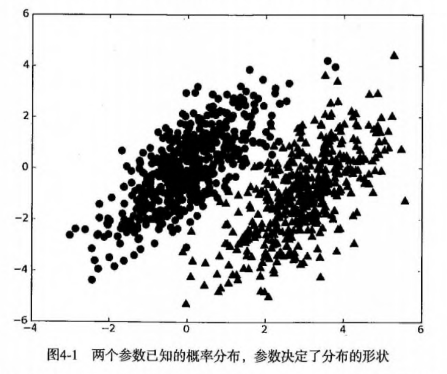
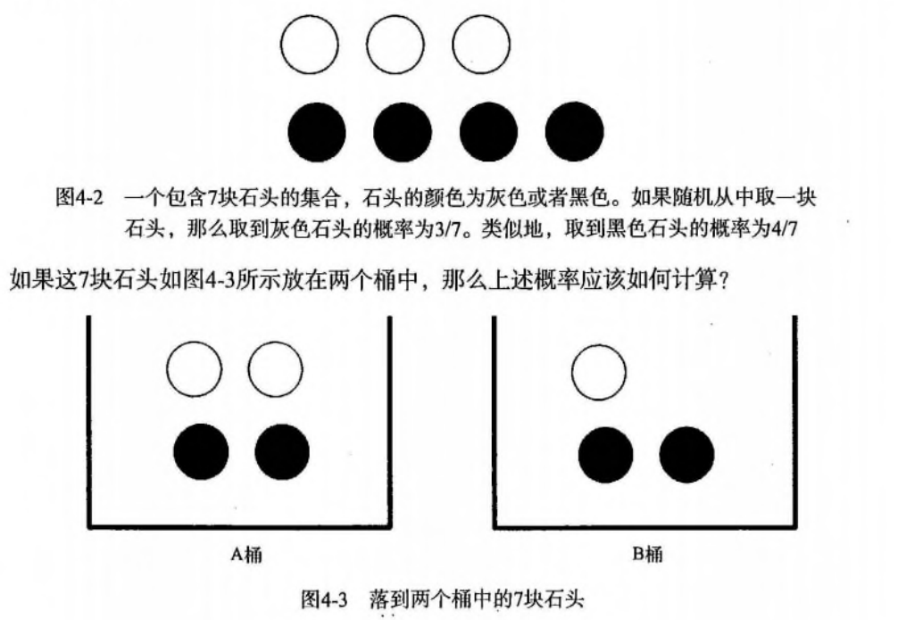
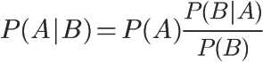
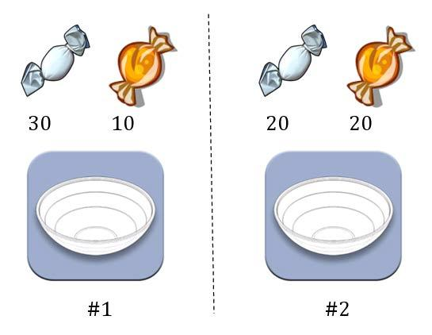
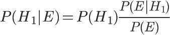
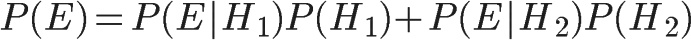
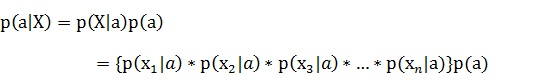
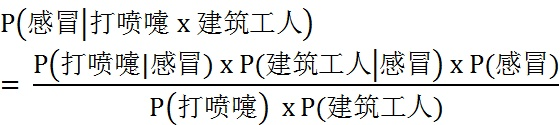
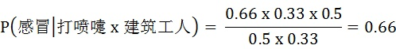

# 机器学习实战4.1 基于概率论的分类方法：朴素贝叶斯

> 搜索微信公众号:'AI-ming3526'或者'计算机视觉这件小事' 获取更多机器学习干货  
> csdn：https://blog.csdn.net/baidu_31657889/  
> github：https://github.com/aimi-cn/AILearners

## 一、引子

> 最近几天一直没来得及看《机器学习实战》这本书，感觉停滞了很久，因为需要对 [AIMI-CN](https://github.com/aimi-cn)的规划进行考虑，想了很久做了一些皮毛的东西，决定还是慢慢来按部就班，东西做出来才能说话，当然之后我做这个文章的时候，也尽量再多点自己的东西把，其他人写的多数当参考把，这样才会有更多自己原创的东西，大家才会看，才会认同把~

## 二、朴素贝叶斯理论

朴素贝叶斯是贝叶斯决策理论的一部分，所以在讲述朴素贝叶斯之前有必要快速了解一下贝叶斯决策理论。

### 1、贝叶斯决策理论

假设现在我们有一个数据集，他由两类数据组成，数据分布如下图所示：



我们现在用 p1(x,y) 表示数据点 (x,y) 属于类别 1（图中用圆点表示的类别）的概率，用 p2(x,y) 表示数据点 (x,y) 属于类别 2（图中三角形表示的类别）的概率，那么对于一个新数据点 (x,y)，可以用下面的规则来判断它的类别：

- 如果 p1(x,y) > p2(x,y) ，那么类别为1
- 如果 p2(x,y) > p1(x,y) ，那么类别为2

也就是说，我们会选择高概率对应的类别。这就是贝叶斯决策理论的核心思想，即选择具有**最高概率**的决策。

### 2、条件概率

有一个装了 7 块石头的罐子，其中 3 块是白色的，4 块是黑色的。如果从罐子中随机取出一块石头，那么是白色石头的可能性是多少？由于取石头有 7 种可能，其中 3 种为白色，所以取出白色石头的概率为 3/7 。那么取到黑色石头的概率又是多少呢？很显然，是 4/7 。我们使用 P(white) 来表示取到白色石头的概率，其概率值可以通过白色石头数目除以总的石头数目来得到。



计算 P(white) 或者 P(black) ，如果事先我们知道石头所在桶的信息是会改变结果的。这就是所谓的条件概率（conditional probablity）。假定计算的是从 B 桶取到白色石头的概率，这个概率可以记作 P(white|bucketB) ，我们称之为“在已知石头出自 B 桶的条件下，取出白色石头的概率”。很容易得到，P(white|bucketA) 值为 2/4 ，P(white|bucketB) 的值为 1/3 。

条件概率的计算公式如下：

**指在事件B发生的情况下，事件A发生的概率，用P(A|B)来表示。**

P(white|bucketB) = P(white and bucketB) / P(bucketB)

首先，我们用 B 桶中白色石头的个数除以两个桶中总的石头数，得到 P(white and bucketB) = 1/7 .其次，由于 B 桶中有 3 块石头，而总石头数为 7 ，于是 P(bucketB) 就等于 3/7 。于是又 P(white|bucketB) = P(white and bucketB) / P(bucketB) = (1/7) / (3/7) = 1/3 。

另外一种有效计算条件概率的方法称为贝叶斯准则。贝叶斯准则告诉我们如何交换条件概率中的条件与结果，即如果已知 P(x|c)，要求 P(c|x)，那么可以使用下面的计算方法：


### 3、贝叶斯推断

上面最后那张图就是贝叶斯准则，根据这个公式，以及条件概率公式进行变形，可以得到如下形式：

事件B发生的情况下，事件A发生的概率，用P(A|B)来表示



我们把P(A)称为"先验概率"（Prior probability），即在B事件发生之前，我们对A事件概率的一个判断。

P(A|B)称为"后验概率"（Posterior probability），即在B事件发生之后，我们对A事件概率的重新评估。

P(B|A)/P(B)称为"可能性函数"（Likelyhood），这是一个调整因子，使得预估概率更接近真实概率。

所以，条件概率可以理解成下面的式子：

```	
后验概率　＝　先验概率 ｘ 调整因子
```

我们举一个加深贝叶斯推断的例子：[来自这里](https://cuijiahua.com/blog/2017/11/ml_4_bayes_1.html)



两个一模一样的碗，一号碗有30颗水果糖和10颗巧克力糖，二号碗有水果糖和巧克力糖各20颗。现在随机选择一个碗，从中摸出一颗糖，发现是水果糖。请问这颗水果糖来自一号碗的概率有多大？

我们假定，H1表示一号碗，H2表示二号碗。由于这两个碗是一样的，所以P(H1)=P(H2)，也就是说，在取出水果糖之前，这两个碗被选中的概率相同。因此，P(H1)=0.5，我们把这个概率就叫做"先验概率"，即没有做实验之前，来自一号碗的概率是0.5。

再假定，E表示水果糖，所以问题就变成了在已知E的情况下，来自一号碗的概率有多大，即求P(H1|E)。我们把这个概率叫做"后验概率"，即在E事件发生之后，对P(H1)的修正。

根据条件概率公式，得到



已知，P(H1)等于0.5，P(E|H1)为一号碗中取出水果糖的概率，等于30÷(30+10)=0.75，那么求出P(E)就可以得到答案。根据全概率公式，



所以，


将数字代入原方程，得到


这表明，来自一号碗的概率是0.6。也就是说，取出水果糖之后，H1事件的可能性得到了增强。

**同时再思考一个问题，在使用该算法的时候，如果不需要知道具体的类别概率，即不需要知道上面P(H1|E)=0.6，只需要知道所属类别，即只需要知道来自一号碗，我们有必要计算P(E)这个全概率吗？要知道我们只需要比较 P(H1|E)和P(H2|E)的大小，找到那个最大的概率就可以。既然如此，两者的分母都是相同的，那我们只需要比较分子即可。即比较P(E|H1)P(H1)和P(E|H2)P(H2)的大小，所以为了减少计算量，全概率公式在实际编程中可以不使用。**

----------------------------------------------例子完----------------------------------------------

### 4、朴素贝叶斯推断

理解了贝叶斯推断，那么让我们继续看看朴素贝叶斯。贝叶斯和朴素贝叶斯的概念是不同的，区别就在于“朴素”二字，朴素贝叶斯对条件个概率分布做了**条件独立性**的假设。
我们假设特征之间 相互独立 。所谓 独立(independence) 指的是统计意义上的独立，即一个特征或者单词出现的可能性与它和其他单词相邻没有关系，比如说，“我们”中的“我”和“们”出现的概率与这两个字相邻没有任何关系。这个假设正是朴素贝叶斯分类器中 朴素(naive) 一词的含义。朴素贝叶斯分类器中的另一个假设是，每个特征同等重要。

比如下面的公式：


由于每个特征都是独立的，我们可以进一步拆分公式 ：



这样我们就可以进行计算了。意思就是，事件X发生的情况下，事件A发生的概率，用P(a|X)来表示，此时的事件X里面有很多相对独立的特征，这时候就要把X事件的所有特征都分别提取出来进行计算

我们讲一个例子来进行对朴素贝叶斯进行剖析：

某个医院早上来了六个门诊的病人，他们的情况如下表所示：


现在又来了第七个病人，是一个打喷嚏的建筑工人。请问他患上感冒的概率有多大？

根据贝叶斯定理：


可得：


根据朴素贝叶斯条件独立性的假设可知，"打喷嚏"和"建筑工人"这两个特征是独立的，因此，上面的等式就变成了



这里可以计算：



因此，这个打喷嚏的建筑工人，有66%的概率是得了感冒。同理，可以计算这个病人患上过敏或脑震荡的概率。比较这几个概率，就可以知道他最可能得什么病。

这就是贝叶斯分类器的基本方法：在统计资料的基础上，依据某些特征，计算各个类别的概率，从而实现分类。

**同样根据上面那个糖果例子的最后说明，在编程的时候，如果不需要求出所属类别的具体概率，P(打喷嚏) = 0.5和P(建筑工人) = 0.33的概率是可以不用求的。**

### 三、朴素贝叶斯开发流程

1、朴素贝叶斯 工作原理

```
提取所有文档中的词条并进行去重
获取文档的所有类别
计算每个类别中的文档数目
对每篇训练文档: 
    对每个类别: 
        如果词条出现在文档中-->增加该词条的计数值（for循环或者矩阵相加）
        增加所有词条的计数值（此类别下词条总数）
对每个类别: 
    对每个词条: 
        将该词条的数目除以总词条数目得到的条件概率（P(词条|类别)）
返回该文档属于每个类别的条件概率（P(类别|文档的所有词条)）
```

2、朴素贝叶斯 开发流程

```
收集数据: 可以使用任何方法。
准备数据: 需要数值型或者布尔型数据。
分析数据: 有大量特征时，绘制特征作用不大，此时使用直方图效果更好。
训练算法: 计算不同的独立特征的条件概率。
测试算法: 计算错误率。
使用算法: 一个常见的朴素贝叶斯应用是文档分类。可以在任意的分类场景中使用朴素贝叶斯分类器，不一定非要是文本。
```

3、朴素贝叶斯 算法特点

```
优点: 在数据较少的情况下仍然有效，可以处理多类别问题。
缺点: 对于输入数据的准备方式较为敏感。
适用数据类型: 标称型数据。
```

结语：这节主要说了贝叶斯和朴素贝叶斯的基本原理和区别，下节我们就针对具体问题进行项目实战。
