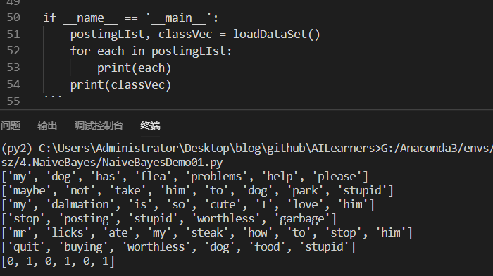
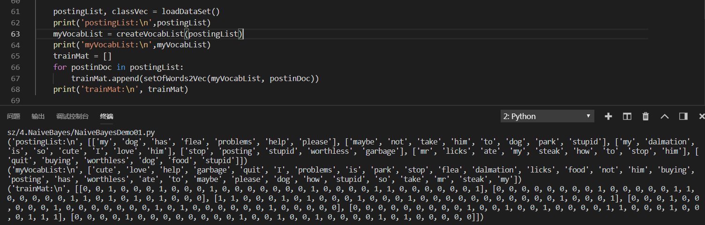
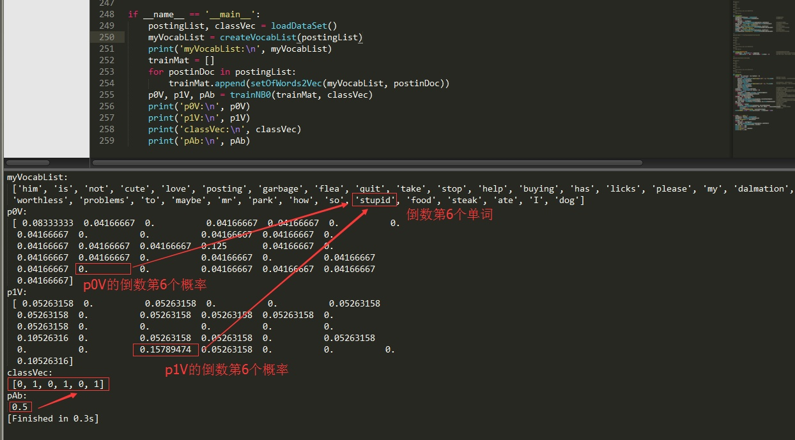
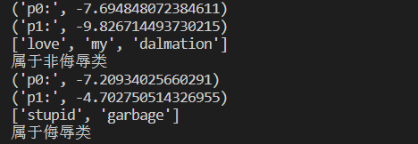

# 机器学习实战4.2 朴素贝叶斯案例：屏蔽社区留言板的侮辱性言论

> 搜索微信公众号:'AI-ming3526'或者'计算机视觉这件小事' 获取更多机器学习干货  
> csdn：https://blog.csdn.net/baidu_31657889/  
> github：https://github.com/aimi-cn/AILearners  
> 参考地址：https://cuijiahua.com/blog/2017/11/ml_4_bayes_1.html

## 一、引子

> 很久没更新机器学习实战了 应该是很久没看这本书了 最近上课需要准备各种论文来讲 今天刚上了一节课 给大家伙讲了讲深度学习 效果感觉不错 老师也很支持我们组织一起来做这个公众号(计算机视觉这件小事)和[github开源笔记](https://github.com/aimi-cn/AILearners) 瞬间感觉自己做的东西是有目标有效果的 劲头大增 我们会一直坚持下去的~ 上次做的是朴素贝叶斯的基本概念 这次在概念的基础上做一个例子 加深一下对朴素贝叶斯的理解

## 二、朴素贝叶斯案例：屏蔽社区留言板的侮辱性言论

现在进入我们的实战阶段.  
完整代码地址：https://github.com/aimi-cn/AILearners/tree/master/src/py2.x/ml/jqxxsz/4.NaiveBayes/NaiveBayesDemo01.py
### 1、项目概述
为了不影响社区的发展，我们要屏蔽侮辱性的言论，所以要构建一个快速过滤器，如果某条留言使用了负面或者侮辱性的语言，那么就将该留言标志为内容不当。过滤这类内容是一个很常见的需求。对此问题建立两个类型：侮辱类和非侮辱类，使用1和0分别表示。

### 2、开发流程

1. 收集数据: 可以使用任何方法
2. 准备数据: 从文本中构建词向量
3. 分析数据: 检查词条确保解析的正确性
4. 训练算法: 从词向量计算概率
5. 测试算法: 根据现实情况修改分类器
6. 使用算法: 对社区留言板言论进行分类

### 3、代码开发流程

#### 收集数据: 可以使用任何方法
首先我们构造自己的词表：带有侮辱性的词表我们把他的标签设置为1 反之为1 这个上面我们定义了六个词表(假设已经将本文切分完毕) 把他们以词条的形式展示 三个是侮辱类 三个不是侮辱类

```python
'''
@description: 创建实验样本
@param {None} 
@return: postingList - 实验样本切分的词条
         classVec - 类别标签向量 0代表非侮辱类 1代表侮辱类
'''
def loadDataSet():
    #切分的词条
    postingList=[['my', 'dog', 'has', 'flea', 'problems', 'help', 'please'],               
    ['maybe', 'not', 'take', 'him', 'to', 'dog', 'park', 'stupid'],
    ['my', 'dalmation', 'is', 'so', 'cute', 'I', 'love', 'him'],
    ['stop', 'posting', 'stupid', 'worthless', 'garbage'],
    ['mr', 'licks', 'ate', 'my', 'steak', 'how', 'to', 'stop', 'him'],
    ['quit', 'buying', 'worthless', 'dog', 'food', 'stupid']]
    classVec = [0,1,0,1,0,1]  #类别标签向量，1代表侮辱性词汇，0代表不是
    return postingList,classVec

if __name__ == '__main__':
    postingLIst, classVec = loadDataSet()
    for each in postingLIst:
        print(each)
    print(classVec)
```
从运行结果可以看出，我们已经将postingList是存放词条列表中，classVec是存放每个词条的所属类别，1代表侮辱类 ，0代表非侮辱类。



#### 准备数据: 从文本中构建词向量 & 分析数据: 检查词条确保解析的正确性
我们现在已经把句子转化为向量了 接着我们要先创建一个词汇表，并将切分好的词条转换为词条向量

代码如下：
```python
'''
@description: 创建实验样本
@param {None} 
@return: postingList - 实验样本切分的词条
         classVec - 类别标签向量 0代表非侮辱类 1代表侮辱类
'''
def loadDataSet():
    postingList=[['my', 'dog', 'has', 'flea', 'problems', 'help', 'please'],                #切分的词条
                ['maybe', 'not', 'take', 'him', 'to', 'dog', 'park', 'stupid'],
                ['my', 'dalmation', 'is', 'so', 'cute', 'I', 'love', 'him'],
                ['stop', 'posting', 'stupid', 'worthless', 'garbage'],
                ['mr', 'licks', 'ate', 'my', 'steak', 'how', 'to', 'stop', 'him'],
                ['quit', 'buying', 'worthless', 'dog', 'food', 'stupid']]
    classVec = [0,1,0,1,0,1]   #类别标签向量，1代表侮辱性词汇，0代表不是
    return postingList,classVec

'''
@description: 将切分的实验样本词条整理成不重复的词条列表，也就是词汇表
@param dataSet - 整理的样本数据集
@return: vocabSet - 返回不重复的词条列表，也就是词汇表
'''   
def createVocabList(dataSet):
    vocabSet = set([])                      #创建一个空的不重复列表
    for document in dataSet:               
        vocabSet = vocabSet | set(document) #取并集
    return list(vocabSet)

'''
@description: 根据vocabList词汇表，将inputSet向量化，向量的每个元素为1或0 1存在 0不存在
@param: vocabList - createVocabList返回的列表
inputSet - 切分的词条列表
@return: returnVec - 文档向量,词集模型
'''
def setOfWords2Vec(vocabList, inputSet):
    returnVec = [0] * len(vocabList)                                    #创建一个其中所含元素都为0的向量
    for word in inputSet:                                                #遍历每个词条
        if word in vocabList:                                            #如果词条存在于词汇表中，则置1
            returnVec[vocabList.index(word)] = 1
        else: print("the word: %s is not in my Vocabulary!" % word)
    return returnVec                                                    #返回文档向量

if __name__ == '__main__':
    postingList, classVec = loadDataSet()
    print('postingList:\n',postingList)
    myVocabList = createVocabList(postingList)
    print('myVocabList:\n',myVocabList)
    trainMat = []
    for postinDoc in postingList:
        trainMat.append(setOfWords2Vec(myVocabList, postinDoc))
    print('trainMat:\n', trainMat)
```

从运行结果可以看出，postingList是原始的词条列表，myVocabList是词汇表。myVocabList是所有单词出现的集合，没有重复的元素。词汇表是用来干什么的？没错，它是用来将词条向量化的，一个单词在词汇表中出现过一次，那么就在相应位置记作1，如果没有出现就在相应位置记作0。trainMat是所有的词条向量组成的列表。它里面存放的是根据myVocabList向量化的词条向量。



#### 训练算法: 从词向量计算概率
我们已经得到了词条向量。接下来，我们就可以通过词条向量训练朴素贝叶斯分类器。
```python
'''
@description: 朴素贝叶斯分类器训练函数
@param {type} 
@return: 
'''
def trainNB0(trainMatrix,trainCategory):
     #计算训练的文档数目 本文中6个
    numTrainDocs = len(trainMatrix)  
    #计算每篇文档的词条数   32个  也就是不重复的词条数
    numWords = len(trainMatrix[0])  
    #文档属于侮辱类的概率   0.5  --->  (0+1+0+1+0+1)/6   
    pAbusive = sum(trainCategory)/float(numTrainDocs)  
    #创建numpy.zeros数组,词条出现数初始化为0 表示每个词条出现的个数
    p0Num = np.zeros(numWords); p1Num = np.zeros(numWords)  
    #分母初始化为0  词条总数
    p0Denom = 0.0; p1Denom = 0.0                            
    for i in range(numTrainDocs):
        #统计属于侮辱类的条件概率所需的数据，即P(w0|1),P(w1|1),P(w2|1)···
        if trainCategory[i] == 1:                            
            p1Num += trainMatrix[i]
            p1Denom += sum(trainMatrix[i])
        else: 
            #统计属于非侮辱类的条件概率所需的数据，即P(w0|0),P(w1|0),P(w2|0)···              
            p0Num += trainMatrix[i]
            p0Denom += sum(trainMatrix[i])
    p1Vect = p1Num/p1Denom       
    p0Vect = p0Num/p0Denom    
    #返回属于侮辱类的条件概率数组，属于非侮辱类的条件概率数组，文档属于侮辱类的概率     
    return p0Vect,p1Vect,pAbusive                            
```
运行结果如下，p0V存放的是每个单词属于类别0，也就是非侮辱类词汇的概率。比如p0V的倒数第6个概率，就是stupid这个单词属于非侮辱类的概率为0。同理，p1V的倒数第6个概率，就是stupid这个单词属于侮辱类的概率为0.15789474，也就是约等于15.79%的概率。我们知道stupid的中文意思是蠢货，难听点的叫法就是傻逼。显而易见，这个单词属于侮辱类。pAb是所有侮辱类的样本占所有样本的概率，从classVec中可以看出，一用有3个侮辱类，3个非侮辱类。所以侮辱类的概率是0.5。因此p0V存放的就是P(him | 非侮辱类) = 0.0833，P(is | 非侮辱类) = 0.0417，一直到P(dog | 非侮辱类) = 0.0417，这些单词的条件概率。同理，p1V存放的就是各个单词属于侮辱类的条件概率。pAb就是先验概率。




然后对于这个算法我们提出一个新的优化算法 因为在正常情况下概率很难为0,所以我们对初始值进行一些改变 这一会对我们算法效果更好一些
```python
def trainNB1(trainMatrix, trainCategory):
    """
    训练数据优化版本
    :param trainMatrix: 文件单词矩阵
    :param trainCategory: 文件对应的类别
    :return:
    """
    # 总文件数
    numTrainDocs = len(trainMatrix)
    # 总单词数
    numWords = len(trainMatrix[0])
    # 侮辱性文件的出现概率
    pAbusive = sum(trainCategory) / float(numTrainDocs)
    # 构造单词出现次数列表
    # p0Num 正常的统计
    # p1Num 侮辱的统计
    p0Num = ones(numWords)#[0,0......]->[1,1,1,1,1.....]
    p1Num = ones(numWords)

    # 整个数据集单词出现总数，2.0根据样本/实际调查结果调整分母的值（2主要是避免分母为0，当然值可以调整）
    # p0Denom 正常的统计
    # p1Denom 侮辱的统计
    p0Denom = 2.0
    p1Denom = 2.0
    for i in range(numTrainDocs):
        if trainCategory[i] == 1:
            # 累加辱骂词的频次
            p1Num += trainMatrix[i]
            # 对每篇文章的辱骂的频次 进行统计汇总
            p1Denom += sum(trainMatrix[i])
        else:
            p0Num += trainMatrix[i]
            p0Denom += sum(trainMatrix[i])
    p1Vect = log(p1Num / p1Denom)
    p0Vect = log(p0Num / p0Denom)
    return p0Vect, p1Vect, pAbusive
```
#### 使用算法: 对社区留言板言论进行分类 并且测试

```python
def classifyNB(vec2Classify, p0Vec, p1Vec, pClass1):
    # 将乘法转换为加法 使用优化算法 之前的乘法换成log之后直接用加法就可以
    #乘法：P(C|F1F2...Fn) = P(F1F2...Fn|C)P(C)/P(F1F2...Fn)
    #加法：P(F1|C)*P(F2|C)....P(Fn|C)P(C) -> log(P(F1|C))+log(P(F2|C))+....+log(P(Fn|C))+log(P(C))
    # p1 = reduce(lambda x,y:x*y, vec2Classify * p1Vec) * pClass1                #对应元素相乘
    # p0 = reduce(lambda x,y:x*y, vec2Classify * p0Vec) * (1.0 - pClass1)
    p1 = sum(vec2Classify * p1Vec) + log(pClass1) # P(w|c1) * P(c1) ，即贝叶斯准则的分子
    p0 = sum(vec2Classify * p0Vec) + log(1.0 - pClass1) # P(w|c0) * P(c0) ，即贝叶斯准则的分子·
    print('p0:',p0)
    print('p1:',p1)
    if p1 > p0:
        return 1
    else: 
        return 0
```
我们测试了两个词条，在使用分类器前，也需要对词条向量化，然后使用classifyNB()函数，用朴素贝叶斯公式，计算词条向量属于侮辱类和非侮辱类的概率。运行结果如下：


