# 机器学习实战5.1Logistic回归基础介绍

> 搜索微信公众号:'AI-ming3526'或者'计算机视觉这件小事' 获取更多机器学习干货  
> csdn：https://blog.csdn.net/baidu_31657889/  
> github：https://github.com/aimi-cn/AILearners  


## 一、前言
本文结合apachecn和Jack Cui的文章进行整合 加上自己的看法 旨在把Logistic解释清楚~

本文出现的所有代码，均可在github上下载，不妨来个Star把谢谢~：[Github代码地址](https://github.com/aimi-cn/AILearners/tree/master/src/py2.x/ml/jqxxsz/5.Logistic)


## 二、Logistic回归与梯度上升算法
Logistic 回归 或者叫逻辑回归 虽然名字有回归，但是它是用来做分类的，例如预测明天是否会下雨。首先，让我们来了解一下，什么是Logistic回归。

### 1.1、Logistic回归概述
假设现在有一些数据点，我们利用一条直线对这些点进行拟合(该线称为最佳拟合直线)，这个拟合过程就称作为回归，如下图所示：


Logistic回归是分类方法，它利用的是Sigmoid函数阈值在[0,1]这个特性。Logistic回归进行分类的主要思想是：根据现有数据对分类边界线建立回归公式，以此进行分类。其实，Logistic本质上是一个基于条件概率的判别模型(Discriminative Model)。

### 1.2、Sigmoid函数
所以要想了解Logistic回归，我们必须先看一看Sigmoid函数 ，我们也可以称它为Logistic函数。它的公式如下：


我们想要的函数应该是: 能接受所有的输入然后预测出类别。例如，在两个类的情况下，上述函数输出 0 或 1.或许你之前接触过具有这种性质的函数，该函数称为 海维塞得阶跃函数(Heaviside step function)，或者直接称为 单位阶跃函数。然而，海维塞得阶跃函数的问题在于: 该函数在跳跃点上从 0 瞬间跳跃到 1，这个瞬间跳跃过程有时很难处理。幸好，另一个函数也有类似的性质（可以输出 0 或者 1 的性质），且数学上更易处理，这就是 Sigmoid 函数。 

下图给出了 Sigmoid 函数在不同坐标尺度下的两条曲线图。当 x 为 0 时，Sigmoid 函数值为 0.5 。随着 x 的增大，对应的 Sigmoid 值将逼近于 1 ; 而随着 x 的减小， Sigmoid 值将逼近于 0 。如果横坐标刻度足够大， Sigmoid 函数看起来很像一个阶跃函数。


因此，为了实现 Logistic 回归分类器，我们可以在每个特征上都乘以一个回归系数w（如下公式所示），然后把所有结果值相加，将这个总和代入 Sigmoid 函数中，进而得到一个范围在 0~1 之间的数值。任何大于 0.5 的数据被分入 1 类，小于 0.5 即被归入 0 类。所以，Logistic 回归也是一种概率估计，比如这里Sigmoid 函数得出的值为0.5，可以理解为给定数据和参数，数据被分入 1 类的概率为0.5。想对Sigmoid 函数有更多了解，可以点开[此链接](https://www.desmos.com/calculator/bgontvxotm)跟此函数互动。

### 2.1、基于最优化方法的回归系数确定
Sigmoid 函数的输入记为 z ，由下面公式得到:


如果采用向量的写法，上述公式可以写成  $z = w^T x$，它表示将这两个数值向量对应元素相乘然后全部加起来即得到 z 值。其中的向量 x 是分类器的输入数据，向量 w 也就是我们要找到的最佳参数（系数），从而使得分类器尽可能地精确。为了寻找该最佳参数w，需要用到最优化理论的一些知识。我们这里使用的是——梯度上升法（Gradient Ascent）。

### 2.2、梯度上升法
说了半天，梯度上升算法又是啥？我们先看个简单的求极大值的例子。一个看了就会想到高中生活的函数：

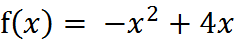

来吧，做高中题。这个函数的极值怎么求？显然这个函数开口向下，存在极大值，它的函数图像为：

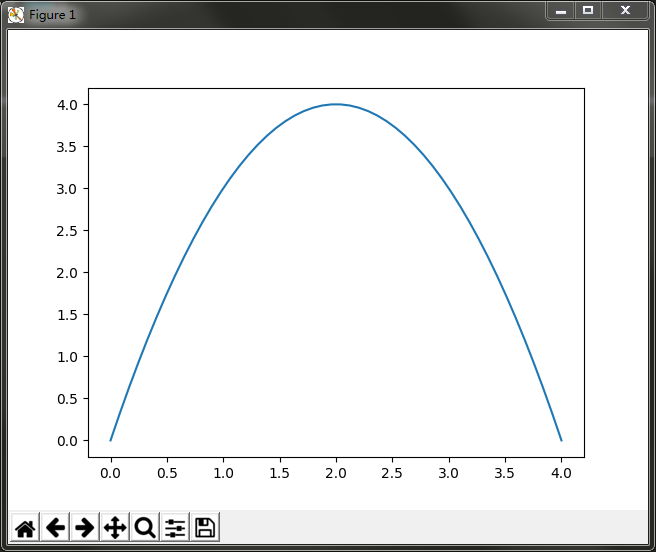

求极值，先求函数的导数：

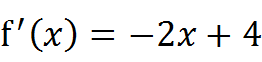

令导数为0，可求出x=2即取得函数f(x)的极大值。极大值等于f(2)=4

但是真实环境中的函数不会像上面这么简单，就算求出了函数的导数，也很难精确计算出函数的极值。此时我们就可以用迭代的方法来做。就像爬坡一样，一点一点逼近极值。这种寻找最佳拟合参数的方法，就是最优化算法。爬坡这
个动作用数学公式表达即为：

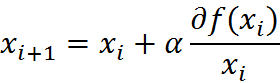

其中，α为步长，也就是学习速率，控制更新的幅度。效果如下图所示：

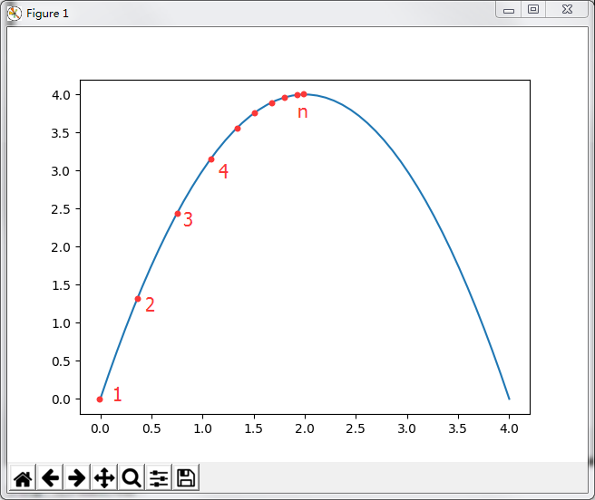

比如从(0,0)开始，迭代路径就是1->2->3->4->...->n，直到求出的x为函数极大值的近似值，停止迭代。我们可以编写Python3代码，来实现这一过程：
```python
'''
@description: 梯度上升算法测试函数
求函数f(x) = -x^2 + 4x的极大值
@param {type} 
@return: 
'''
def Gradient_Ascent_test():
    #f(x)的导数
    def f_prime(x_old):                                   
        return -2 * x_old + 4
    #初始值，给一个小于x_new的值
    x_old = -1    
    #梯度上升算法初始值，即从(0,0)开始                                        
    x_new = 0   
    #步长，也就是学习速率，控制更新的幅度                                        
    alpha = 0.01         
    #精度，也就是更新阈值                               
    presision = 0.00000001       
    #上面提到的公式                        
    while abs(x_new - x_old) > presision:
        x_old = x_new
        x_new = x_old + alpha * f_prime(x_old)  
    #打印最终求解的极值近似值         
    print(x_new)                                        

if __name__ == '__main__':
    Gradient_Ascent_test()
```
代码运行结果如下：  


结果很显然，已经非常接近我们的真实极值2了。这一过程，就是梯度上升算法。

在逻辑回归中的梯度上升可能会计算复杂一些 因为回归公式不是简单的一元二次了 而是更加复杂的函数来求导 但是原理是一样滴~

基于梯度上升法的优化方法就是确定回归系数：

w:=w+α▽f(w),其中w是要优化的参数，α是更新步长，▽是梯度。  
后面的梯度上升用的就是这个公式


> 有人会好奇为什么有些书籍上说的是梯度下降法（Gradient Decent）?  
> 答： 其实这个两个方法在此情况下本质上是相同的。关键在于代价函数（cost function）或者叫目标函数（objective function）。如果目标函数是损失函数，那就是最小化损失函数来求函数的最小值，就用梯度下降。 如果目标函数是似然函数（Likelihood function），就是要最大化似然函数来求函数的最大值，那就用梯度上升。在逻辑回归中， 损失函数和似然函数无非就是互为正负关系。

**局部最优现象 （Local Optima）**


上图表示参数 θ 与误差函数 J(θ) 的关系图 (这里的误差函数是损失函数，所以我们要最小化损失函数)，红色的部分是表示 J(θ) 有着比较高的取值，我们需要的是，能够让 J(θ) 的值尽量的低。也就是深蓝色的部分。θ0，θ1 表示 θ 向量的两个维度（此处的θ0，θ1是x0和x1的系数，也对应的是上文w0和w1）。

可能梯度下降的最终点并非是全局最小点，可能是一个局部最小点，如我们上图中的右边的梯度下降曲线，描述的是最终到达一个局部最小点，这是我们重新选择了一个初始点得到的。

看来我们这个算法将会在很大的程度上被初始点的选择影响而陷入局部最小点。

对于出现这种有局部最优值的问题 我们可以使用随机梯度下降的方法~后面的第三节补充会讲到~

## 3、Logistic回归Python实战

**项目案例1: 使用 Logistic 回归在简单数据集上的分类**

完整代码地址：https://github.com/aimi-cn/AILearners/tree/master/src/py2.x/ml/jqxxsz/5.Logistic/Logistic.py

概述：在一个简单的数据集上，采用梯度上升法找到 Logistic 回归分类器在此数据集上的最佳回归系数

开发流程:
```
收集数据: 可以使用任何方法
准备数据: 由于需要进行距离计算，因此要求数据类型为数值型。另外，结构化数据格式则最佳
分析数据: 画出决策边界
训练算法: 使用梯度上升找到最佳参数
测试算法: 使用 Logistic 回归进行分类
使用算法: 对简单数据集中数据进行分类
```

**收集数据: 可以使用任何方法**

我们采用存储在 [TestSet.txt](https://github.com/aimi-cn/AILearners/blob/master/data/ml/jqxxsz/sourceData/Ch05/testSet.txt) 文本文件中的数据，存储格式如下:
```
-0.017612	14.053064	0
-1.395634	4.662541	1
-0.752157	6.538620	0
-1.322371	7.152853	0
0.423363	11.054677	0
```
这个数据有两维特征，因此可以将数据在一个二维平面上展示出来。我们可以将第一列数据(X1)看作x轴上的值，第二列数据(X2)看作y轴上的值。而最后一列数据即为分类标签。根据标签的不同，对这些点进行分类。

**准备数据: 由于需要进行距离计算，因此要求数据类型为数值型。另外，结构化数据格式则最佳**

我们使用代码把数据绘制在图中，看下数据分布情况:

```python
#!/usr/bin/env python
# -*- encoding: utf-8 -*-
import matplotlib.pyplot as plt
import numpy as np
'''
@description: 加载数据
@param {type} 
@return: 
    dataMat - 数据列表
    labelMat - 标签列表
'''
def loadDataSet():
    #创建数据标签
    dataMat = []
    #创建标签列表
    labelMat = []
    #打开文件 
    fr = open('C:/Users/Administrator/Desktop/blog/github/AILearners/data/ml/jqxxsz/5.Logistic/testSet.txt') 
    #逐行读取
    for line in fr.readlines():
        #去回车，放入列表
        lineArr = line.strip().split()
        dataMat.append([1.0, float(lineArr[0]), float(lineArr[1])])
        labelMat.append(int(lineArr[2]))
    fr.close()
    return dataMat,labelMat

'''
@description: 绘制数据集
@param {type} 
@return: 
'''
def plotDataSet():
    #加载数据集
    dataMat, labelMat = loadDataSet()  
    #转换成numpy的array数组
    dataArr = np.array(dataMat)
    #数据个数n
    n = np.shape(dataMat)[0]
    #正样本
    xcord1 = []; ycord1 = []
    #负样本
    xcord2 = []; ycord2 = []
    for i in range(n):
        if int(labelMat[i]) == 1:
            #1为正样本
            xcord1.append(dataArr[i,1]); ycord1.append(dataArr[i,2])  
        else:
            #0为负样本
            xcord2.append(dataArr[i,1]); ycord2.append(dataArr[i,2])    
    fig = plt.figure()
    ax = fig.add_subplot(111)                                            #添加subplot
    ax.scatter(xcord1, ycord1, s = 20, c = 'red', marker = 's',alpha=.5)#绘制正样本
    ax.scatter(xcord2, ycord2, s = 20, c = 'green',alpha=.5)            #绘制负样本
    plt.title('DataSet')                                                #绘制title
    plt.xlabel('x'); plt.ylabel('y')                                    #绘制label
    plt.show()                     

if __name__ == '__main__':
    plotDataSet()
```
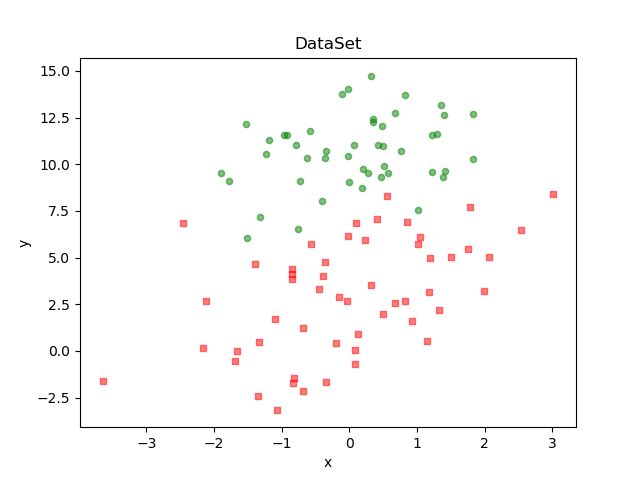

从上图可以看出数据的分布情况。假设Sigmoid函数的输入记为z，那么z=w0x0 + w1x1 + w2x2，即可将数据分割开。其中，x0为全是1的向量(loadDataSet这个函数加载的时候设置的)，x1为数据集的第一列数据，x2为数据集的第二列数据。另z=0，则0=w0 + w1x1 + w2x2。横坐标为x1，纵坐标为x2。这个方程未知的参数为w0，w1，w2，也就是我们需要求的回归系数(最优参数)。

**分析数据: 采用任意方法对数据进行分析，此处不需要**

**训练算法: 使用梯度上升找到最佳参数**

定义sigmoid阶跃函数
```
'''
@description: sigmoid函数
@param  inX - 数据
@return: sigmoid函数
'''
def sigmoid(inX):
    return 1.0 / (1 + np.exp(-inX))
```

Logistic 回归梯度上升优化算法
```python
'''
@description: 梯度上升法
@param {type} 两个参数：
第一个参数==> dataMatIn 是一个2维NumPy数组，每列分别代表每个不同的特征，每行则代表每个训练样本。
第二个参数==> classLabels 是类别标签，它是一个 1*100 的行向量。为了便于矩阵计算，需要将该行向量转换为列向量，做法是将原向量转置，再将它赋值给labelMat。
@return: 求得的权重数组(最优参数)
'''
def gradAscent(dataMatIn, classLabels):
    #用dataMatIn创建特征矩阵
    dataMatrix = np.mat(dataMatIn)     
    #调换矩阵的坐标顺序，对于二维矩阵来说，transpose()就是转置                                  
    labelMat = np.mat(classLabels).transpose()          
    #m是样本数，n是特征数                 
    m, n = np.shape(dataMatrix)   
    #梯度上升步长                                         
    alpha = 0.001   
    #最大迭代次数                                                     
    maxCycles = 500       
    #权重向量b，初始化为全1 这里面n为3                                                
    weights = np.ones((n,1))
    for k in range(maxCycles):
        #讲给定的值通过sigmoid函数输出为0-1之间的数值 #对w1*x1+w2*x2求对数几率回归
        h = sigmoid(dataMatrix * weights)      
        #计算真实值和预测值之间的误差                         
        error = labelMat - h
        #根据误差进行梯度更新
        weights = weights + alpha * dataMatrix.transpose() * error
    return weights  

if __name__ == '__main__':
    dataMat, labelMat = loadDataSet()           
    print(gradAscent(dataMat, labelMat))
```

运行结果如图所示：

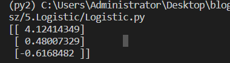

可以看出，我们已经求解出回归系数[w0,w1,w2]。

肯定有读者和我一样，一开始不理解代码gradAscent()方法倒数第二行weights为什么会那样赋值更新？不是求梯度嘛？最后怎么梯度怎么变成 dataMatrix.transpose() * error 其实呢这里有一个数学推导,可以自己查一下（涉及最大似然估计估计模型参数）

这里我给出一个复杂的计算公式 大家围观下~ 可以看出来的确需要这些写的~

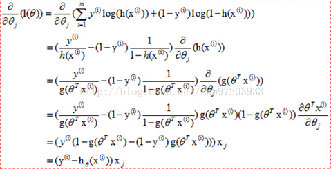

通过求解出的参数，我们就可以确定不同类别数据之间的分隔线，画出决策边界。

**测试算法: 使用 Logistic 回归进行分类**  
**使用算法: 对简单数据集中数据进行分类**
```python
def plotBestFit(weights):
    #加载数据集
    dataMat, labelMat = loadDataSet()   
    #转换成numpy的array数组 
    dataArr = np.array(dataMat)                                            
    #数据个数
    n = np.shape(dataMat)[0]                                            
    #正样本
    xcord1 = []; ycord1 = []                                            
    #负样本
    xcord2 = []; ycord2 = []                                            
    #根据数据集标签进行分类
    for i in range(n):                                                    
        if int(labelMat[i]) == 1:
            #1为正样本
            xcord1.append(dataArr[i,1]); ycord1.append(dataArr[i,2])    
        else:
            #0为正样本
            xcord2.append(dataArr[i,1]); ycord2.append(dataArr[i,2])    
    fig = plt.figure()
    #添加subplot
    ax = fig.add_subplot(111)   
    #绘制正样本                                        
    ax.scatter(xcord1, ycord1, s = 20, c = 'red', marker = 's',alpha=.5)
    #绘制负样本
    ax.scatter(xcord2, ycord2, s = 20, c = 'green',alpha=.5)            
    x = np.arange(-3.0, 3.0, 0.1)
    '''
    y怎么来的
    首先理论上是这个样子的。
    dataMat.append([1.0, float(lineArr[0]), float(lineArr[1])])
    w0*x0+w1*x1+w2*x2=f(x)
    x0最开始就设置为1叻， x1 是x的值 x2就是我们画图的y值，而f(x)被我们磨合误差给算到w0,w1,w2身上去了
    z=0 是因为sigmoid函数为0 当sigmoid函数输入为0的时候 正好是两个分类（类别1和类别0）的分界线
    所以： w0+w1*x+w2*y=0 => y = (-w0-w1*x)/w2
    '''
    y = (-weights[0] - weights[1] * x) / weights[2]
    ax.plot(x, y)
    #title
    plt.title('BestFit')    
    #label                                            
    plt.xlabel('X1'); plt.ylabel('X2')                                    
    plt.show()    

if __name__ == '__main__':
    dataMat, labelMat = loadDataSet()           
    weights = gradAscent(dataMat, labelMat)
    plotBestFit(weights)   
```

运行结果如下：

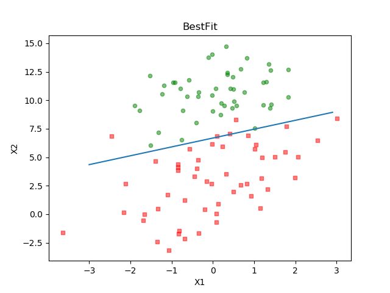

这个分类结果相当不错，从上图可以看出，只分错了几个点而已。但是，尽管例子简单切数据集很小，但是这个方法却需要大量的计算(300次乘法)。因此下篇文章将对改算法稍作改进，从而减少计算量，使其可以应用于大数据集上。

## 三、Logistic回归补充

之前我们有提到随机梯度上升算法~那我们为什么要用到随机那，这是因为梯度上升算法在每次更新回归系数时都需要遍历整个数据集，该方法在处理 100 个左右的数据集时尚可，但如果有数十亿样本和成千上万的特征，那么该方法的计算复杂度就太高了。一种改进方法是一次仅用一个样本点来更新回归系数，该方法称为 **随机梯度上升算法**。

随机梯度上升算法可以写成如下的伪代码:
```
所有回归系数初始化为 1
对数据集中每个样本
    计算该样本的梯度
    使用 alpha x gradient 更新回归系数值
返回回归系数值
```

**随机梯度上升算法的实现代码**

```python
'''
@description: 改进的随机梯度上升算法
@param  dataMatrix - 数据数组
        classLabels - 数据标签
        numIter - 迭代次数
@return: weights - 求得的回归系数数组(最优参数)
'''
def stocGradAscent1(dataMatrix, classLabels, numIter=150):
    #返回dataMatrix的大小。m为行数,n为列数。
    m,n = np.shape(dataMatrix)
    #参数初始化
    weights = np.ones(n)
    # 随机梯度, 循环150,观察是否收敛
    for j in range(numIter):
        # [0, 1, 2 .. m-1]
        dataIndex = list(range(m))
        for i in range(m):
            # i和j的不断增大，导致alpha的值不断减少，但是不为0
            alpha = 4/(1.0+j+i)+0.0001
            # 随机产生一个 0～len()之间的一个值
            # random.uniform(x, y) 方法将随机生成下一个实数，它在[x,y]范围内,x是这个范围内的最小值，y是这个范围内的最大值。
            randIndex = int(np.random.uniform(0,len(dataIndex)))
            # sum(dataMatrix[i]*weights)为了求 f(x)的值， f(x)=a1*x1+b2*x2+..+nn*xn
            h = sigmoid(sum(dataMatrix[randIndex]*weights))
            error = classLabels[randIndex] - h
            #更新回归系数
            weights = weights + alpha * error * dataMatrix[randIndex]
            #删除已经使用的样本
            del(dataIndex[randIndex])
    return weights

if __name__ == '__main__':
    dataMat, labelMat = loadDataSet()
    weights = stocGradAscent1(np.array(dataMat), labelMat)
    plotBestFit(weights)
```

代码运行结果：

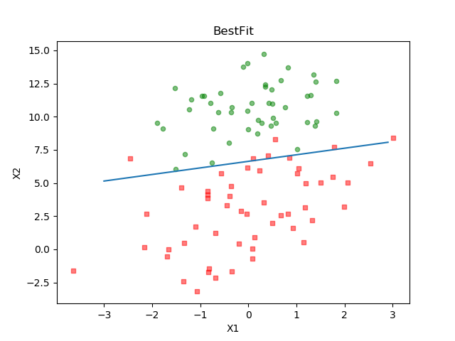


**回归系数与迭代次数的关系**  

可以看到分类效果也是不错的。不过，从这个分类结果中，我们不好看出迭代次数和回归系数的关系，也就不能直观的看到每个回归方法的收敛情况。因此，我们绘制出回归系数和迭代次数的关系曲线：

```python
详细代码见github
if __name__ == '__main__':
    dataMat, labelMat = loadDataSet()           
    weights1,weights_array1 = gradAscent2(dataMat, labelMat)

    weights2,weights_array2 = stocGradAscent2(np.array(dataMat), labelMat)
    plotWeights(weights_array1, weights_array2)
```

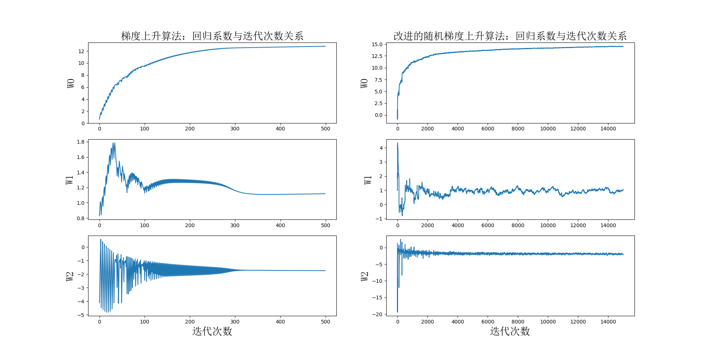

由于改进的随机梯度上升算法，随机选取样本点，所以每次的运行结果是不同的。但是大体趋势是一样的。我们改进的随机梯度上升算法收敛效果更好。为什么这么说呢？让我们分析一下。我们一共有100个样本点，改进的随机梯度上升算法迭代次数为150。而上图显示15000次迭代次数的原因是，使用一次样本就更新一下回归系数。因此，迭代150次，相当于更新回归系数150*100=15000次。简而言之，迭代150次，更新1.5万次回归参数。从上图左侧的改进随机梯度上升算法回归效果中可以看出，其实在更新2000次回归系数的时候，已经收敛了。相当于遍历整个数据集20次的时候，回归系数已收敛。训练已完成。

再让我们看看上图右侧的梯度上升算法回归效果，梯度上升算法每次更新回归系数都要遍历整个数据集。从图中可以看出，当迭代次数为300多次的时候，回归系数才收敛。凑个整，就当它在遍历整个数据集300次的时候已经收敛好了。

没有对比就没有伤害，改进的随机梯度上升算法，在遍历数据集的第20次开始收敛。而梯度上升算法，在遍历数据集的第300次才开始收敛。想像一下，大量数据的情况下，谁更牛逼？


