# 《机器学习实战》6.2支持向量机SVM基础之处理复杂的非线性SVM

> 搜索微信公众号:'AI-ming3526'或者'计算机视觉这件小事' 获取更多人工智能、机器学习干货  
> csdn：https://blog.csdn.net/baidu_31657889/  
> github：https://github.com/aimi-cn/AILearners

本文出现的所有代码，均可在github上下载，不妨来个Star把谢谢~：[Github代码地址](https://github.com/aimi-cn/AILearners/tree/master/src/py2.x/ml/jqxxsz/6.SVM)

## 一、非线性SVM

### 1、核函数(kernel) 使用

我们已经了解到，SVM如何处理线性可分的情况，而对于非线性的情况，SVM的处理方式就是选择一个核函数。简而言之：在线性不可分的情况下，SVM通过某种事先选择的非线性映射（核函数）将输入变量映到一个高维特征空间，将其变成在高维空间线性可分，在这个高维空间中构造最优分类超平面。也就是上一节最开始的大侠，凭借大侠的轻功，大侠抓起一张纸，插到了两种球的中间。让这些球感觉是被曲线分开了一样。

根据上篇文章，线性可分的情况下，可知最终的超平面方程为：

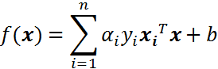

将上述公式用内积来表示：

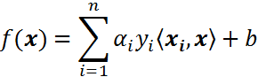

对于线性不可分，我们使用一个非线性映射，将数据映射到特征空间，在特征空间中使用线性学习器，分类函数变形如下：

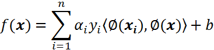

其中ϕ是从输入空间(X)到某个特征空间(F)的映射，这意味着建立非线性学习器分为两步：

- 首先使用一个非线性映射将数据变换到一个特征空间F；
- 然后在特征空间使用线性分类学习器学习。

如果有一种方法可以在特征空间中直接计算内积 <ϕ(xi),ϕ(x)>，就像在原始输入点的函数中一样，就有可能将两个步骤融合到一起建立一个分线性的学习器，这样直接计算的方法称为**核函数方法**。

这里直接给出一个定义：核是一个函数k，对所有x,z∈X，满足k(x,z)=<ϕ(xi),ϕ(x)>，这里ϕ(·)是从原始输入空间X到内积空间F的映射。

简而言之：如果不是用核技术，就会先计算线性映ϕ(x1)和ϕ(x2)，然后计算这它们的内积，使用了核技术之后，先把ϕ(x1)和ϕ(x2)的一般表达式<ϕ(x1),ϕ(x2)>=k(<ϕ(x1),ϕ(x2) >)计算出来，这里的<·，·>表示内积，k(·，·)就是对应的核函数，这个表达式往往非常简单，所以计算非常方便。

这种将内积替换成核函数的方式被称为**核技巧(kernel trick)**。

### 2、非线性数据处理

已经知道了核技巧是什么，但是为什么要这样做呢？我们先举一个简单的例子，进行说明。假设二维平面x-y上存在若干点，其中点集A服从 {x,y|x^2+y^2=1}，点集B服从{x,y|x^2+y^2=9}，那么这些点在二维平面上的分布是这样的：

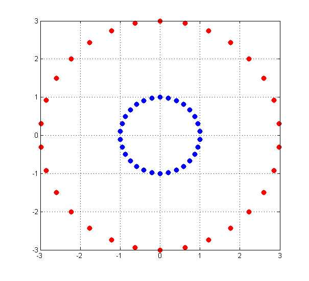

蓝色的是点集A，红色的是点集B，他们在xy平面上并不能线性可分，即用一条直线分割（虽然肉眼是可以识别的）。采用映射(x,y)->(x,y,x^2+y^2)后，在三维空间的点的分布为：

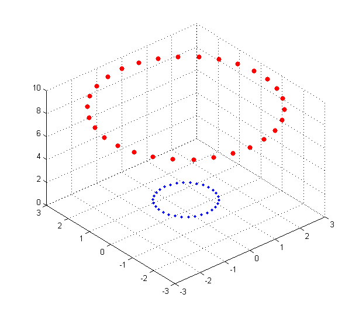

可见红色和蓝色的点被映射到了不同的平面，在更高维空间中是线性可分的（用一个平面去分割）。

上述例子中的样本点的分布遵循圆的分布。继续推广到椭圆的一般样本形式：

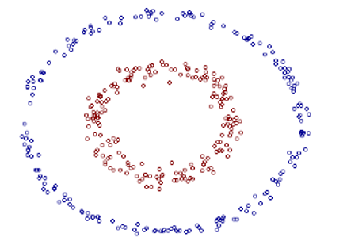

上图的两类数据分布为两个椭圆的形状，这样的数据本身就是不可分的。不难发现，这两个半径不同的椭圆是加上了少量的噪音生成得到的。所以，一个理想的分界应该也是一个椭圆，而不是一个直线。如果用X1和X2来表示这个二维平面的两个坐标的话，我们知道这个分界椭圆可以写为：

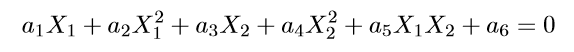

这个方程就是高中学过的椭圆一般方程。注意上面的形式，如果我们构造另外一个五维的空间，其中五个坐标的值分别为：

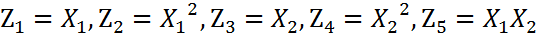

那么，显然我们可以将这个分界的椭圆方程写成如下形式：

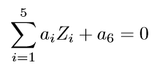

这个关于新的坐标Z1,Z2,Z3,Z4,Z5的方程，就是一个超平面方程，它的维度是5。也就是说，如果我们做一个映射 ϕ : 二维 → 五维，将 X1,X2按照上面的规则映射为 Z1,Z2,··· ,Z5，那么在新的空间中原来的数据将变成线性可分的，从而使用之前我们推导的线性分类算法就可以进行处理了。

我们举个简单的计算例子，现在假设已知的映射函数为：

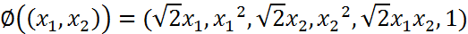

这个是一个从2维映射到5维的例子。如果没有使用核函数，根据上一小节的介绍，我们需要先结算映射后的结果，然后再进行内积运算。那么对于两个向量a1=(x1,x2)和a2=(y1,y2)有：

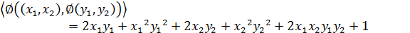

另外，如果我们不进行映射计算，直接运算下面的公式：

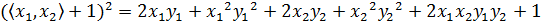

你会发现，这两个公式的计算结果是相同的。区别在于什么呢？

- 一个是根据映射函数，映射到高维空间中，然后再根据内积的公式进行计算，计算量大；
- 另一个则直接在原来的低维空间中进行计算，而不需要显式地写出映射后的结果，计算量小。

其实，在这个例子中，核函数就是：

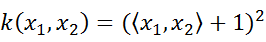

我们通过k(x1,x2)的低维运算得到了先映射再内积的高维运算的结果，这就是核函数的神奇之处，它有效减少了我们的计算量。在这个例子中，我们对一个2维空间做映射，选择的新的空间是原始空间的所以一阶和二阶的组合，得到了5维的新空间；如果原始空间是3维的，那么我们会得到19维的新空间，这个数目是呈爆炸性增长的。如果我们使用ϕ(·)做映射计算，难度非常大，而且如果遇到无穷维的情况，就根本无从计算了。所以使用核函数进行计算是非常有必要的。

### 3、核技巧的实现

通过核技巧的转变，我们的分类函数变为：

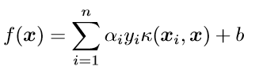

我们的对偶问题变成了：

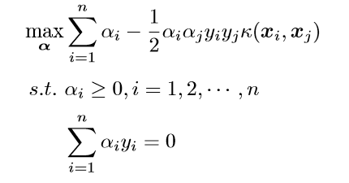

这样，我们就避开了高纬度空间中的计算。当然，我们刚刚的例子是非常简单的，我们可以手动构造出来对应映射的核函数出来，如果对于任意一个映射，要构造出对应的核函数就很困难了。因此，通常，人们会从一些常用的核函数中进行选择，根据问题和数据的不同，选择不同的参数，得到不同的核函数。接下来，要介绍的就是一个非常流行的核函数，那就是**径向基核函数**。

径向基核函数是SVM中常用的一个核函数。径向基核函数采用向量作为自变量的函数，能够基于向量举例运算输出一个标量。径向基核函数的高斯版本的公式如下：

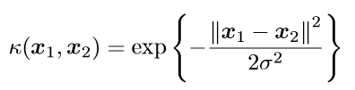

其中，σ是用户自定义的用于确定到达率(reach)或者说函数值跌落到0的速度参数。上述高斯核函数将数据从原始空间映射到无穷维空间。关于无穷维空间，我们不必太担心。高斯核函数只是一个常用的核函数，使用者并不需要确切地理解数据到底是如何表现的，而且使用高斯核函数还会得到一个理想的结果。如果σ选得很大的话，高次特征上的权重实际上衰减得非常快，所以实际上（数值上近似一下）相当于一个低维的子空间；反过来，如果σ选得很小，则可以将任意的数据映射为线性可分——当然，这并不一定是好事，因为随之而来的可能是非常严重的过拟合问题。不过，总的来说，通过调控参数σ，高斯核实际上具有相当高的灵活性，也是使用最广泛的核函数之一。

## 二、编程实现非线性SVM

接下来，我们将使用testSetRBF.txt和testSetRBF2.txt，前者作为训练集，后者作为测试集。数据集下载地址：[数据集下载](https://github.com/aimi-cn/AILearners/tree/master/data/ml/jqxxsz/6.SVM/)

### 1、可视化数据集

[Github代码地址](https://github.com/aimi-cn/AILearners/tree/master/src/py2.x/ml/jqxxsz/6.SVM/svm2.py)

先编写程序简单的看下数据集:
```python
#!/usr/bin/env python
# -*- encoding: utf-8 -*-
'''
@File    :   svm2.py
@Time    :   2019/06/17 17:13:43
@Author  :   xiao ming 
@Version :   1.0
@Contact :   xiaoming3526@gmail.com
@Desc    :   SVM支持向量机处理非线性数据
@github  :   https://github.com/aimi-cn/AILearners
'''

import matplotlib.pyplot as plt
import numpy as np
import random

'''
@description: 读取数据
@param：fileName - 文件名
@return: dataMat - 数据矩阵
        labelMat - 数据标签
'''
def loadDataSet(filename):
    dataMat = []; labelMat = []
    fr = open(filename)
    #逐行读取，滤除空格等
    for line in fr.readlines():
        lineArr = line.strip().split('\t')
        dataMat.append([float(lineArr[0]), float(lineArr[1])])
        labelMat.append(float(lineArr[2]))
    return dataMat,labelMat

'''
@description: 数据可视化
@param：dataMat - 数据矩阵
        labelMat - 数据标签
@return: None
'''
def showDataSet(dataMat,labelMat):
    #正样本
    data_plus = []     
    #负样本                             
    data_minus = []                                 
    for i in range(len(dataMat)):
        if labelMat[i] > 0:
            data_plus.append(dataMat[i])
        else:
            data_minus.append(dataMat[i])
    #转换为numpy矩阵
    data_plus_np = np.array(data_plus)              
    data_minus_np = np.array(data_minus)           
    #正样本散点图
    plt.scatter(np.transpose(data_plus_np)[0], np.transpose(data_plus_np)[1])   
    #负样本散点图
    plt.scatter(np.transpose(data_minus_np)[0], np.transpose(data_minus_np)[1]) 
    plt.show()

if __name__ == "__main__":
    dataMat,labelMat = loadDataSet('C:/Users/Administrator/Desktop/blog/github/AILearners/data/ml/jqxxsz/6.SVM/testSetRBF.txt')
    showDataSet(dataMat,labelMat)   
```

运行结果：

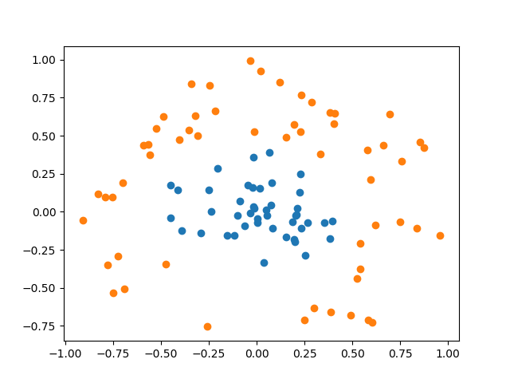

可见，数据明显是线性不可分的。下面我们根据公式，编写核函数，并增加初始化参数kTup用于存储核函数有关的信息，同时我们只要将之前的内积运算变成核函数的运算即可。最后编写testRbf()函数，用于测试。在svm2.py文件中，编写代码如下：[代码地址](https://github.com/aimi-cn/AILearners/tree/master/src/py2.x/ml/jqxxsz/6.SVM/svm2.py)

```python
if __name__ == "__main__":
    start = time.clock()
    testRbf()
    end = time.clock()
    t=end-start
    print("Runtime is:",t)
```
运行结果如下图所示：

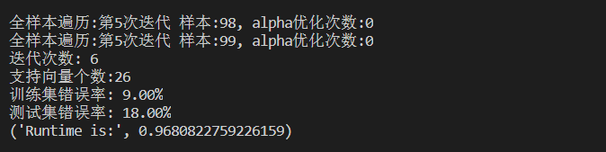

可以看到，训练集错误率为9%，测试集错误率都是18%，训练耗时0.97s 。可以尝试更换不同的K1参数以观察测试错误率、训练错误率、支持向量个数随k1的变化情况。你会发现K1过大，会出现过拟合的情况，即训练集错误率低，但是测试集错误率高。

## 三、Sklearn构建SVM分类器

你的老板要求：你写的那个手写识别程序非常好，但是它占用内存太大。顾客无法通过无线的方式下载我们的应用。
所以：我们可以考虑使用支持向量机，保留支持向量就行（knn需要保留所有的向量），就可以获得非常好的效果。

最早的那篇KNN识别手写数字的文章介绍了KNN的算法和数据集：[数据集介绍](https://blog.csdn.net/baidu_31657889/article/details/89095213)

使用的数据集还是kNN用到的数据集（testDigits和trainingDigits）：[下载地址](https://github.com/aimi-cn/AILearners/tree/master/data/ml/jqxxsz/2.KNN)

首先，我们先使用自己用python写的代码进行训练。创建文件svm_demo02.py文件，编写代码如下：[代码地址](https://github.com/aimi-cn/AILearners/tree/master/src/py2.x/ml/jqxxsz/6.SVM/svm_demo02.py)

SMO算法实现部分跟上文是一样的，我们新创建了img2vector()、loadImages()、testDigits()函数，它们分别用于二进制图形转换、图片加载、训练SVM分类器。我们自己的SVM分类器是个二类分类器，所以在设置标签的时候，将9作为负类，其余的0-8作为正类，进行训练。这是一种'ovr'思想，即one vs rest，就是对一个类别和剩余所有的类别进行分类。如果想实现10个数字的识别，一个简单的方法是，训练出10个分类器。这里简单起见，只训练了一个用于分类9和其余所有数字的分类器，运行结果如下：

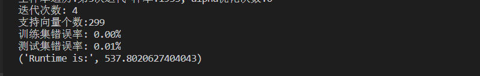

可以看到，虽然我们进行了所谓的"优化"，但是训练仍然很耗时，迭代10次，花费了537.8s。因为我们没有多进程、没有设置自动的终止条件，总之一句话，需要优化的地方太多了。尽管如此，我们训练后得到的结果还是不错的，可以看到训练集错误率为0，测试集错误率也仅为0.01%。

然后我们来看这个超级方便的方法--sklearn.svm.SVC

官方文档：[地址](https://scikit-learn.org/stable/modules/generated/sklearn.svm.SVC.html)

部分参数说明：SVC这个函数

- C：惩罚项，float类型，可选参数，默认为1.0，C越大，即对分错样本的惩罚程度越大，因此在训练样本中准确率越高，但是泛化能力降低，也就是对测试数据的分类准确率降低。相反，减小C的话，容许训练样本中有一些误分类错误样本，泛化能力强。对于训练样本带有噪声的情况，一般采用后者，把训练样本集中错误分类的样本作为噪声。
- kernel：核函数类型，str类型，默认为'rbf'。可选参数为：
  - 'linear'：线性核函数
  - 'poly'：多项式核函数
  - 'rbf'：径像核函数/高斯核
  - 'sigmod'：sigmod核函数
  - 'precomputed'：核矩阵
  - precomputed表示自己提前计算好核函数矩阵，这时候算法内部就不再用核函数去计算核矩阵，而是直接用你给的核矩阵，核矩阵需要为n*n的。


SVC很是强大，我们不用理解算法实现的具体细节，不用理解算法的优化方法。同时，它也满足我们的多分类需求。创建文件svm-svc.py文件，编写代码如下：[代码地址](https://github.com/aimi-cn/AILearners/tree/master/src/py2.x/ml/jqxxsz/6.SVM/svm_svc.py)
```python
#!/usr/bin/env python
# -*- encoding: utf-8 -*-
'''
@File    :   svm-svc.py
@Time    :   2019/06/17 21:20:49
@Author  :   xiao ming 
@Version :   1.0
@Contact :   xiaoming3526@gmail.com
@Desc    :   sklearn.svm.SVC实现手写体识别
@github  :   https://github.com/aimi-cn/AILearners
'''

# here put the import lib
import numpy as np
import operator
from os import listdir
from sklearn.svm import SVC
import time

def img2vector(filename):
    """
    将32x32的二进制图像转换为1x1024向量。
    Parameters:
        filename - 文件名
    Returns:
        returnVect - 返回的二进制图像的1x1024向量
    """
    #创建1x1024零向量
    returnVect = np.zeros((1, 1024))
    #打开文件
    fr = open(filename)
    #按行读取
    for i in range(32):
        #读一行数据
        lineStr = fr.readline()
        #每一行的前32个元素依次添加到returnVect中
        for j in range(32):
            returnVect[0, 32*i+j] = int(lineStr[j])
    #返回转换后的1x1024向量
    return returnVect
 
def handwritingClassTest():
    """
    手写数字分类测试
    Parameters:
        无
    Returns:
        无
    """
    #测试集的Labels
    hwLabels = []
    #返回trainingDigits目录下的文件名
    trainingFileList = listdir('C:/Users/Administrator/Desktop/blog/github/AILearners/data/ml/jqxxsz/2.KNN/trainingDigits')
    #返回文件夹下文件的个数
    m = len(trainingFileList)
    #初始化训练的Mat矩阵,测试集
    trainingMat = np.zeros((m, 1024))
    #从文件名中解析出训练集的类别
    for i in range(m):
        #获得文件的名字
        fileNameStr = trainingFileList[i]
        #获得分类的数字
        classNumber = int(fileNameStr.split('_')[0])
        #将获得的类别添加到hwLabels中
        hwLabels.append(classNumber)
        #将每一个文件的1x1024数据存储到trainingMat矩阵中
        trainingMat[i,:] = img2vector('C:/Users/Administrator/Desktop/blog/github/AILearners/data/ml/jqxxsz/2.KNN/trainingDigits/%s' % (fileNameStr))
    clf = SVC(C=200,kernel='rbf')
    clf.fit(trainingMat,hwLabels)
    #返回testDigits目录下的文件列表
    testFileList = listdir('C:/Users/Administrator/Desktop/blog/github/AILearners/data/ml/jqxxsz/2.KNN/testDigits')
    #错误检测计数
    errorCount = 0.0
    #测试数据的数量
    mTest = len(testFileList)
    #从文件中解析出测试集的类别并进行分类测试
    for i in range(mTest):
        #获得文件的名字
        fileNameStr = testFileList[i]
        #获得分类的数字
        classNumber = int(fileNameStr.split('_')[0])
        #获得测试集的1x1024向量,用于训练
        vectorUnderTest = img2vector('C:/Users/Administrator/Desktop/blog/github/AILearners/data/ml/jqxxsz/2.KNN/testDigits/%s' % (fileNameStr))
        #获得预测结果
        # classifierResult = classify0(vectorUnderTest, trainingMat, hwLabels, 3)
        classifierResult = clf.predict(vectorUnderTest)
        print("分类返回结果为%d\t真实结果为%d" % (classifierResult, classNumber)).decode('utf-8').encode('gb2312')
        if(classifierResult != classNumber):
            errorCount += 1.0
    print("总共错了%d个数据\n错误率为%f%%" % (errorCount, errorCount/mTest * 100)).decode('utf-8').encode('gb2312')
 
if __name__ == '__main__':
    start = time.clock()
    handwritingClassTest()
    end = time.clock()
    t=end-start
    print("Runtime is:",t)
```

代码和kNN的实现是差不多的，就是换了个分类器而已。运行结果如下：

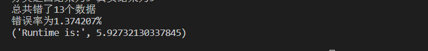

可以看到，训练和测试的时间总共加起来才5.9s。而且，测试集的错误率仅为1.37%。试着改变SVC的参数，慢慢体会一下吧~

总结一下：

SVM的优缺点

优点

-可用于线性/非线性分类，也可以用于回归，泛化错误率低，也就是说具有良好的学习能力，且学到的结果具有很好的推广性。
- 可以解决小样本情况下的机器学习问题，可以解决高维问题，可以避免神经网络结构选择和局部极小点问题。
- SVM是最好的现成的分类器，现成是指不加修改可直接使用。并且能够得到较低的错误率，SVM可以对训练集之外的数据点做很好的分类决策。

缺点

- 对参数调节和和函数的选择敏感。


