>搜索微信公众号:‘AI-ming3526’或者’计算机视觉这件小事’ 获取更多人工智能、机器学习干货

>csdn：https://blog.csdn.net/qq_36645271

>github：https://github.com/aimi-cn/AILearners
***

# 第七章 正则化

## 7.1 过拟合问题

### 7.1.1 什么是过拟合

让我们继续使用用线性回归来预测房价的例子来了解什么是**过拟合(over-fitting)**。下图通过建立以住房为面积为自变量的函数来预测房价。

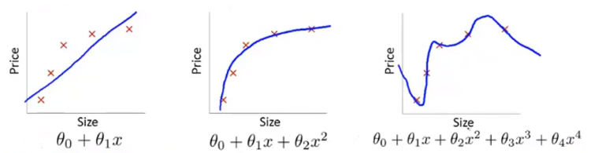

第一个模型用一次函数来拟合数据集，它是一个线性模型，**欠拟合(under-fitting)**，另一个说法是这个算法具有**高偏差(high-bias)**，其不能很好地拟合训练数据。第二个模型用二次函数来拟合数据集，其拟合效果很好。第三个模型用四次多项式进行拟合，那么我们就有五个参数，这样我们的曲线就能通过全部的五个训练样本。这看起来似乎很好的你喝了训练集，但因为它通过了所有的数据点，是一条扭曲的曲线，实际上我们不认为它是一个好的模型。这个问题我们称之为**过拟合(over-fitting)**，另一种说法是这个算法具有**高方差(high-variance)**。

总结来说，**过拟合(over-fitting)问题将会在变量过多的时候出现，这时训练出的假设能很好地拟合训练集（代价函数可能非常接近于0），它千方百计地拟合训练集，导致无法泛化(generalized)到新的样本中以至于无法预测因样本的价格**。这里的**泛化(generalize)**指的是一个假设模型应用到新样本的能力。新样本数据是指没有出现在训练集的房子。

同样的过拟合问题也可能在逻辑回归中出现。

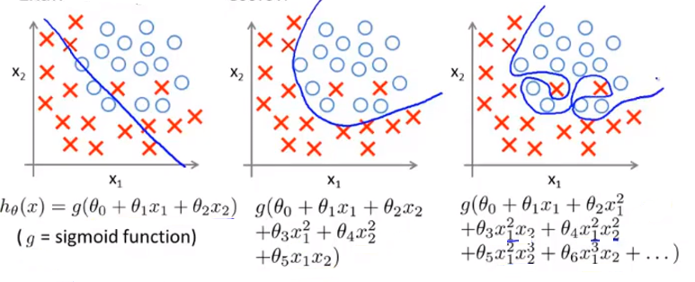

第一个模型用一条直线来分开正负样本，它不能很好地拟合数据，所以它是一个欠拟合的例子，或者说具有高偏差的假设模型。第二个模型在第一个模型的基础上加入了一些二次项，这使得我们的判定边界很好地拟合了数据。第三种情况用高阶多项式来拟合数据，那么逻辑回归的判定边界可能会变得扭曲，这不是一个用于预测的好的假设模型。这是一个过拟合例子，或者说是一个有高方差的假设模型，它无法做到很好地泛化到新样本。

### 7.1.2 如何解决过拟合问题

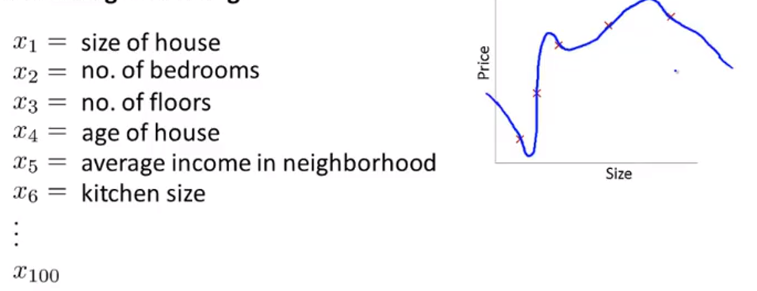

在之前的例子中，当我们使用一维或二维数据时，我们可以通过绘制出假设模型的图像，然后选择合适的多项式阶数。例如之前房价预测的例子，我们可以用上述方法，但是我们的学习问题可能需要很多变量，并且这不仅仅是选择多项式阶次的问题。过多的特征会增加绘图的难度，如果训练数据很少，那我们就会出现过拟合的问题。为了解决过拟合问题，我们有以下两个方法来解决：

1. 尽量减少选取变量的数量
   + 人工检查变量清单，并以此决定哪些变量更为重要，哪些特征需要保留，哪些应该舍弃。
   + 模型选择算法，它可以对需要保留和舍弃的变量进行自动选择。
2. **正则化(regularization)**
   + 尽量保留所有的特征变量，但是减少量级或参数$\theta_j$的大小。
   + 正则化在我们有许多特征，并且每个特征都对预测值$y$有一定贡献时非常有用。

## 7.2 代价函数

### 7.2.1 惩罚项

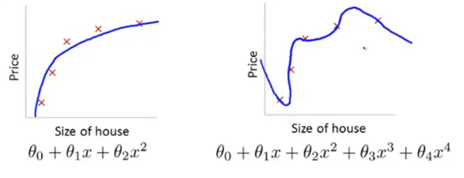

在之前的例子中，我们发现如果使用一个二次函数来拟合这些数据，会得到一个不错的结果，而用阶数过高的多项式去拟合数据，虽然看上去拟合效果很好，曲线通过了每一个数据点，但实际上这个函数过拟合了，泛化的不好。

现在，让我们在这个高阶函数中加入**惩罚项(penalize)**，使得参数$\theta_3,\theta_4$非常小，即我们要最小化其均方误差代价函数：
$$
min_\theta \frac{1}{2m}\sum^{m}_{i=1}(h_\theta(x
^{(i)})-y^{i})^2+1000\theta_3^2+1000\theta_4^2
$$
这里的1000只是随便一个比较大的数，假设我们要最小化这个函数，就要使$\theta_3$和$\theta_4$尽可能小，这样就可以近似看做去掉了假设函数$\theta_0+\theta_1x+\theta_2x^2+\theta_3x^3+\theta_4x^4$的最后两项，这样的话，**这个函数还是相当于二次函数，最后我们拟合的数据实际上就是一个二次函数加上了一些非常小的项**。

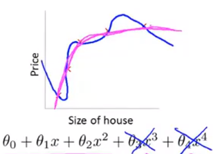

### 7.2.2 正则化的思想

如果我们的参数值$\theta_0,\theta_1,...,\theta_n$比较小，那么就意味着

+ 一个更简单的假设模型。
+ 更不容易出现过拟合的问题。

现在让我们通过房价预测的例子去理解正则化思想，它如何让假设模型变得更简单。

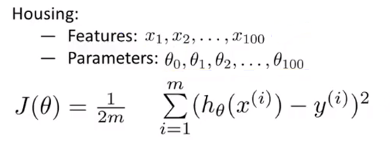

在这个例子中，我们有100个特征，与之前不同的是，我们不知道这里的$\theta_3$,$\theta_4$对应的是不是高阶项，所以我们很难预先找出其中哪个变量是相关度较低的，所以也就不知道选择那些参数来缩小他们的值。因此我们要做的就是修改代价函数来缩小所有的参数**。因为我不知道具体应该缩小哪些参数，所以这里在代价函数后面添加一个额外的正则化项(regularization term)来缩小每个参数的值**。

这里我们的正则化项的求和是从参数$\theta_1$开始的，没有给$\theta_0$增加惩罚项，这是约定俗成的。

### 7.2.3 带正则化项的代价函数

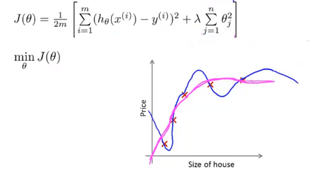

在我们的正则化项中，$\lambda$是正则化参数(regularization parameter)，**它的作用是控制两个不同目标之间的取舍，即更好地去拟合训练集的目标和将参数控制的更小的目标，从而保持假设模型的相对简单，避免出现过拟合的情况**。

例如在之前的房价预测的例子中，如果你依然想保留所有特征的高阶项，那么只要确保使用正则化项，就能得到这样一个**虽然不是二次函数的曲线，但是却性对更平滑、更简单**。

在正则化线性回归中，如果正则化参数$\lambda$被设置的太大的话，就意味着我们对参数的“惩罚”长度太大，那么参数相当于都约等于0，即可以看做把假设函数所有项都忽略了，只剩下$h_\theta(x)=\theta_0$，相当于用一条直线去拟合数据，导致欠拟合，偏差过高。

## 7.3 线性回归正则化

### 7.3.1 带正则化项的梯度下降

之前，在没有正则化项的情况下，我们用梯度下降法去最小化代价函数。现在**由于正则化线性回归中，我们的惩罚对象没有$\theta_0$，所以我们把对$\theta_0$的更新分离出来单独处理**。

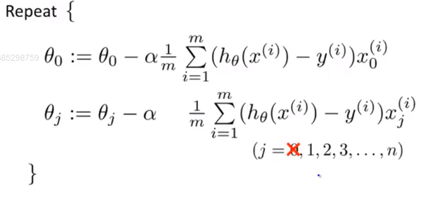

如果我们要用正则化项修改梯度下降算法，我们只需要在对除$\theta_0$以外的更新的式子后面加上$\frac{\lambda}{m}\theta_j$。

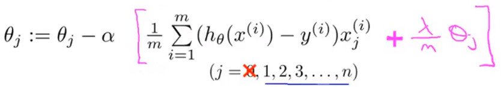

仔细观察上面的式子我们会发现，学习率$\alpha$后所乘的式子中包含$\theta_j$，所以我们将式子合并，就能得到下面的更新规则：

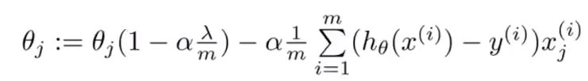

在这里，我们观察$1-\alpha\frac{\lambda}{m}$这一项就会发现，一般学习率$\alpha$会很小，训练集数量$m$会很大，所以这一项是一个比1略小的数（可以想象为0.99），这一项会让$\theta_j$向0的方向缩小了一点点。说的正是一点，就是$\theta_j$的平方范数(square  norm)变小了。后面的一项与我们添加正则化项之前的梯度下降更新规则一样。

**总结来说，当我们进行正则化线性回归时，我们要做的就是每次迭代时，都将$\theta_j$乘以一个比1略小的数，即每次把参数缩小一点，然后进行跟以前一样的更新操作**。

### 7.3.2 带正则化项的正规方程

与梯度下降相同，带正则化项的正规方程也需要在原式中添加正则化项：
$$
\theta=(X^TX+\lambda\left[
\begin{matrix}
0&0&0&...&0\\
0&1&0&...&0\\
0&0&1&...&0\\
0&0&0&...&0\\
0&0&0&...&1\\
\end{matrix}
\right])^{-1}X^Ty
$$
添加的项中的矩阵除了左上角的元素是0以外，其余对角元素都是1。一般来说，这个矩阵一般是一个$(n+1)×(n+1)$维矩阵。

说到正规方程，就不得不说到不可逆问题(non-invertible)。

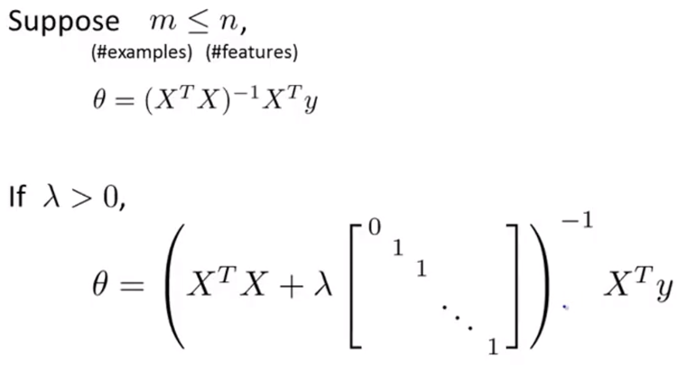

假设现在样本总数量(m)小于特征数量(n)，那么$X^TX$这个矩阵是不可逆的，或者说她是一个奇异矩阵或矩阵(singular)是退化(degenerate)的。幸运的是，在正则化中已经考虑到了这个问题。**只要正则化参数$\lambda$是严格大于0的，我们就可以确信括号里的式子一定不是奇异矩阵，因此，正则化还可以解决一些正规方程中的不可逆问题**。

## 7.4 逻辑回归的正则化

### 7.4.1 带正则化项的梯度下降

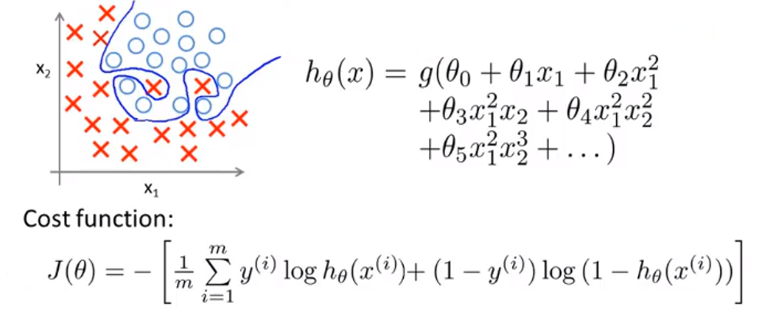

我们之前就知道，在逻辑回归中，如果使用高阶多项式去拟合数据，也会出现过拟合现象。为了使用正则化，我们需要对逻辑回归的代价函数进行修改：

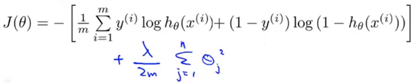

这一项的坐用是惩罚参数，以防止他们过大。这样做，即使当你拟合阶数很高且参数很多，只要添加了这个正则化项，保持参数较小，我们仍然可以得到一条更加合理的判定边界，如下图中紫色的边界所示：

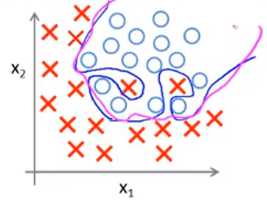

为了得到这条“更加合理”的判定边界，我们要使用梯度下降法来最小化参数。对于最初的梯度下降算法，它很类似于上一节中所讲到线性回归的梯度下降更新法则，也需要把$\theta_0$的更新规则分离出来。

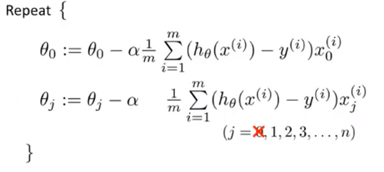

为了修改这个算法，使之成为正则化代价函数，要修改第二个式子为：

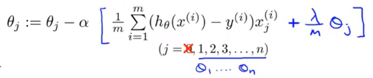

**虽然直到这里，这些式子看起来跟我们在线性回归中的一模一样，但是他们却有不同，因为它们的假设函数是不同的**。简单的总结一下，蓝色中括号中的这一项是定义的代价函数$J(\theta)$对$\theta_j$的偏导，这里的$J(\theta)$是我们刚才所定义的正则化代价函数。

### 7.4.2 带正则化项的高级优化

对于高级算法，我们要做的是要自己定义一个costFunction函数，它以参数向量theta作为输入，之后将它赋给fminunc，fminunc函数会使它最小化。这里要注意的是，在参数向量$\theta$中，向量下标是从0开始的，而在Octave中，坐标从1开始。

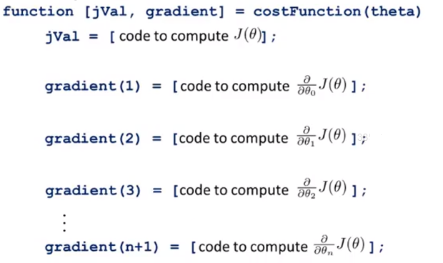

上面的costFunction会返回两个值，一个jVal，即计算代价函数的值。加入正则化后，代价函数$J(\theta)$也会有所改变——在原代价函数后加上一个正则化项，即

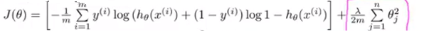

然后，另一个返回值是gradient，要注意在Octave中，其索引是从1开始的。相比较于未添加正则化项时，$\theta_0$的导数并没有发生改变：

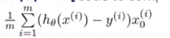

但是其他项都发生了改变，：

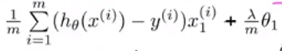

所以最后我们得到的带正则化的高级优化为：

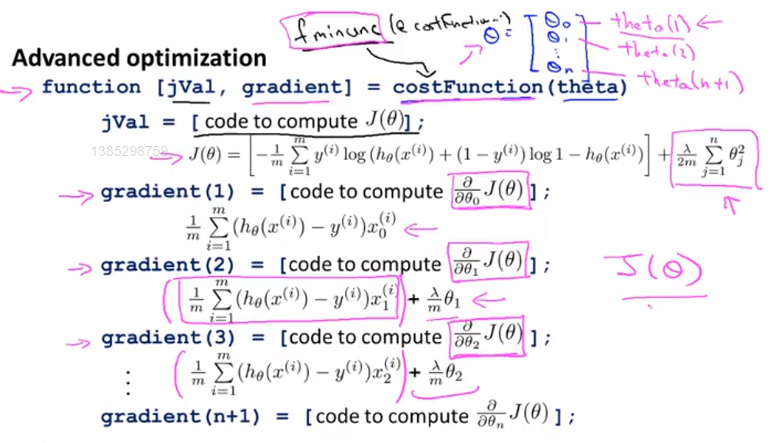