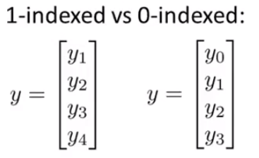
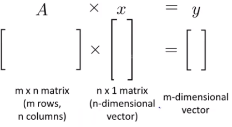
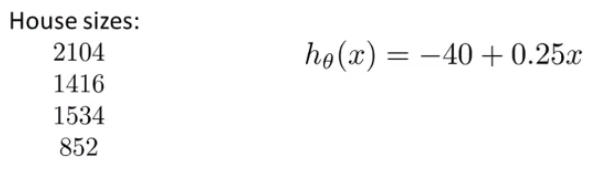
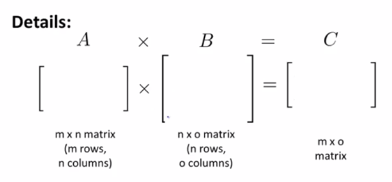
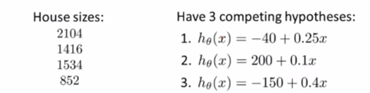
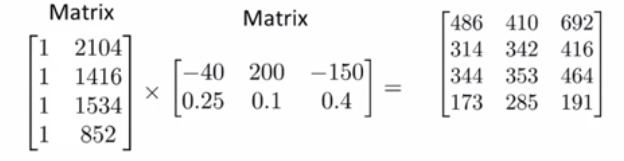
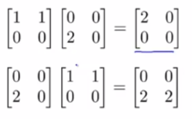
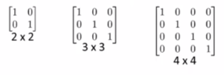

>搜索微信公众号:‘AI-ming3526’或者’计算机视觉这件小事’ 获取更多人工智能、机器学习干货

>csdn：https://blog.csdn.net/qq_36645271

>github：https://github.com/aimi-cn/AILearners

# 第三章 线性代数回顾

## 3.1 矩阵和向量

+ **矩阵(matrix)**：由数字组成的举行列阵，并写在方括号中。

+ **矩阵的维数(dimension of matrix)**：矩阵的行数乘列数

例如：
$$
A=\left[
\begin{matrix}
1402&191\\
1371&821\\
949&1437\\
1147&1448
\end{matrix}
\right]
$$

$A$是一个维度为$4\times2$维的矩阵。$A_{ij}$中下标$i$和$j$表示的是第$i$行，第$j$列所对应的那个项，如$A_{11}=1402$。**矩阵提供了一种很好的方式让你快速的整理、索引和访问大量数据**。

+ **向量(vector)**：一个向量是一种特殊的矩阵，它是一种只有一列的矩阵

例如：
$$
y=\left[
\begin{matrix}
460\\
232\\
315\\
178
\end{matrix}
\right]
$$
$y$是一个4维向量，意味着y是一个含有四个元素的向量。使用符号$y_i$来表示向量$y$中第$i$个元素，如$y_1=460$。

**就像大多数编程语言中的数组一样，矩阵和向量的下标也可以从0开始表示**。

事实上在大部分数学表达式中，下标从1开始的情况比较常见，而**对于很多机器学习的应用问题来说，下标从0开始为我们提供了一个更方便的符号表达**。

通常在书写矩阵和向量时，大多数人会使用大写字母来表示矩阵，用小写字母表示向量。

## 3.2 加法和标量乘法

+ **矩阵加法(matrix addition)**：如果你想将两个矩阵相加，只需要将两个矩阵的每一个元素都逐个相加。**只有维度相同的两个矩阵才能相加**。

例如：
$$
\left[
\begin{matrix}
2&0\\
2&5\\
3&1\
\end{matrix}
\right]+
\left[
\begin{matrix}
4&0.5\\
2&5\\
0&1
\end{matrix}
\right]=
\left[
\begin{matrix}
5&0.5\\
4&10\\
3&2
\end{matrix}
\right]
$$

+ **标量乘法(scalar multiplication)**：这里的标量可能是一个复杂的结构，代表一个实数,只需要将矩阵中的所有元素逐一与3相乘。

例如：
$$
3\times\left[
\begin{matrix}
1&0\\
2&5\\
3&1\
\end{matrix}
\right]=\left[
\begin{matrix}
3&0\\
6&15\\
9&3\
\end{matrix}
\right]=
\left[
\begin{matrix}
1&0\\
2&5\\
3&1\
\end{matrix}
\right]\times3
$$

## 3.3 矩阵向量乘法

### 3.3.1 矩阵向量乘法的定义

+ **矩阵向量乘法(matrix-vector multiplication)**：用$A$矩阵的第$i$行元素分别乘以向量$x$中的元素，并且想加起来。**矩阵向量乘法的前提是$A$矩阵的列数与$x$向量的行数相等**。

例如：
$$
\left[
\begin{matrix}
1&3\\
4&0\\
2&1
\end{matrix}
\right]
\left[
\begin{matrix}
1\\
5
\end{matrix}
\right]=
\left[
\begin{matrix}
16\\
4\\
7
\end{matrix}
\right]
\\1\times1+3\times5=16
\\4\times1+0\times5=4
\\2\times1+1\times5=7
$$
让$3\times2$的矩阵和一个$2\times1$的矩阵，也就是一个二维向量相乘，得到一个$3\times1$的矩阵。

### 3.3.2 矩阵向量乘法在机器学习中的实例

现在假设我们有四间房子和一个可以预测房价的假设函数。现在我们需要计算每个房子的预测值$h(x)$，我们可以使用矩阵向量相乘的方法来同时计算四间房子的预测值。
$$
\left[
\begin{matrix}
1&2104\\
1&1416\\
1&1534\\
1&852
\end{matrix}
\right]\times
\left[
\begin{matrix}
-40\\
0.25
\end{matrix}
\right]=
\left[
\begin{matrix}
463.5\\
314\\
343.5\\
173
\end{matrix}
\right]
$$
**通过这种方法，我们在编程的时候就能用一行代码来一次性预测出四间房子的价格而避免使用循环语句，使代码简洁，更有效率**。

## 3.4 矩阵乘法

### 3.4.1 矩阵乘法的定义

+ **矩阵乘法(matrix-matrix multiplication)**：目标矩阵$C$中的第$i$列由矩阵$A$与矩阵$B$中的第$i$列进行矩阵向量乘法运算获得。**矩阵乘法必须满足一个特征——矩阵的维度相互匹配，即第一个矩阵的列数目必须等于第二个矩阵中的行数目，并且最后得到的结果的维数为第一个矩阵的行数×第二个矩阵的列数。我们通过这种方法来解决线性回归中$\theta_0$和$\theta_1$的计算问题，而不需要使用梯度下降这种迭代方法。**

例如：
$$
\left[
\begin{matrix}
1&3&2\\
4&0&1
\end{matrix}
\right]
\left[
\begin{matrix}
1&3\\
0&1\\
5&2
\end{matrix}
\right]=
\left[
\begin{matrix}
11&10\\
9&14
\end{matrix}
\right]
$$
这个矩阵乘法的具体操作是将右侧$3\times2$维的矩阵拆分成两个$3$维列向量，之后分别与左侧的$2\times3$维的矩阵做向量乘法，最后将的到的结果合并。

### 3.4.2 矩阵向量乘法在机器学习中的实例

假设我们要预测四间房子的价格，但现在我们有三个假设。要想将这三个假设都用于这四间房子，就可以了通过矩阵乘法运算来提高效率。

在进行矩阵乘法运算之后，我们就会发现得到的目标矩阵的第一列就是第一个假设函数对四间房的价格做出的预测，第二列就是第二个假设函数对四间房的价格做出的预测，第三列就是第三个假设函数对四间房的价格做出的预测。**通过构建两个矩阵，就可以了快速的把这三个假设函数应用到这四间房子上。进行一次操作就得到了12种预测。**

## 3.5 矩阵乘法的性质

+ **交换律(commutative property)**：实数运算和标量运算可以使用交换律，但是**矩阵乘法不能使用交换律(not commutative)**。

例如：

又如假设矩阵$A$是一个$m\times n$维的矩阵，矩阵$B$是一个$n\times m$维的矩阵。若做矩阵运算$A\times B$,则会的到一个$m\times m$维的矩阵,若做矩阵运算$B\times A$,则会的到一个$n\times n$维的矩阵，结果矩阵维度发生变化。

+ **结合律(associative property)**：实数运算和标量运算可以使用结合律，**矩阵乘法也符合结合律**。

例如：有三个维数为$m\times m$的矩阵做矩阵乘法，则$A\times B\times C=(A\times B)\times C=A\times (B\times C)$

+ **单位矩阵(identity matrix)**：对角线元素为1，其余元素为0的矩阵，一般用$I$或$I_{n\times n}$表示。**在维度正确的情况下，矩阵$A$乘单位矩阵等于$I$乘矩阵$A$等于$A$。**

例如：

在矩阵乘法中，通常$AB$与$BA$是不等价的，但是$AI=IA=A$。

## 3.6 转置和逆

+ **矩阵的逆(inverse)**：假设$A$是一个$m\times{m}$维的矩阵,并且A可逆，则$AA^{-1}=A^{-1}A=I$。$m\times{m}$维的矩阵也可以成为一个方阵，因为其行数的与列数。**实际上只有方阵才有逆矩阵**。**不存在逆矩阵的矩阵我们称它为奇异矩阵(singular matrix)或退化矩阵(degenerate matrix)**。

例如：
$$
AA^{-1}=
\left[
\begin{matrix}
3&4\\
2&6
\end{matrix}
\right]
\left[
\begin{matrix}
0.4&-0.1\\
-0.05&0.075
\end{matrix}
\right]=
\left[
\begin{matrix}
1&0\\
0&1
\end{matrix}
\right]=I_{2\times2}
$$

+ **矩阵的转置(matrix transpose)**：假设$A$是一个$m\times{n}$维的矩阵,矩阵$B$等于$A$的转置，那么矩阵$B$是一个$m\times{n}$维的矩阵（维度和$A$相反），$B_{ij}=A_{ij}$。

例如：
$$
A=\left[
\begin{matrix}
1&2&0\\
3&5&9
\end{matrix}
\right]
B=A^T=\left[
\begin{matrix}
1&3\\
2&5\\
0&9
\end{matrix}
\right]
$$
其中$B_{12}=A_{21}=3$。