# 第九章 神经网络参数的反向传播算法

## 9.1 代价函数

### 9.1.1 神经网络在分类中的作用

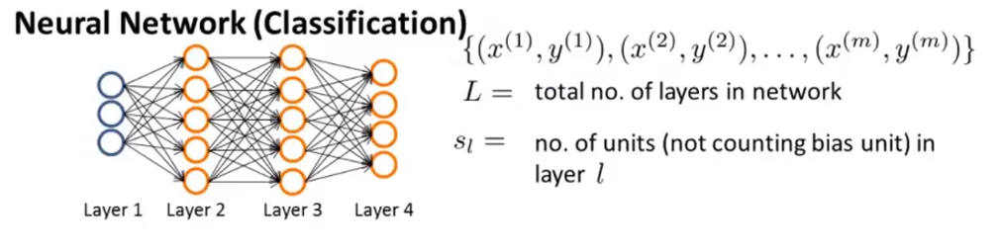

+ {$(x^{(1)}, y^{(1)}),...,(x^{(m)}, y^{(m)})$}：含有m组训练样本的训练集。
+ L：神将网络结构的总层数。对于上图来说，L=4.
+ $s_l$：第L层的神经单元数，**这其中不包括第L层的偏置单元**。例如上图中$s_1=3,s_2=5,s_4=s_L=4$。

对于分类问题，我们会将其分成两种情况考虑：即**二元分类(binary classification)**与**多元分类(multi-class classification)**。

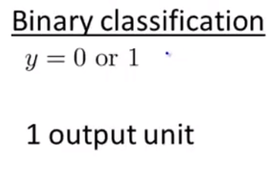

对于二元分类，由于$y$只能等于0或1，所以我们只有一个输出单元，其输出$h_\Theta(x)$为一个实数。在这种情况下，$s_L=1$。

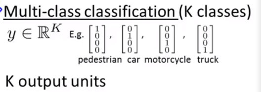

在多元分类中，会有K个不同的类，就会有K个输出单元，其输出$h_\Theta(x)$为一个K维向量。在这种情况下，$s_L=K$。

### 9.1.2 神经网络的代价函数

先让我们回顾一下逻辑回归的代价函数：

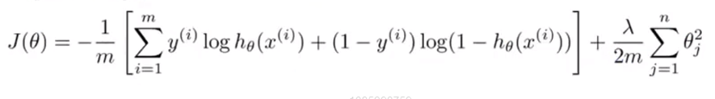

在逻辑回归中，我们通常要使$J(\theta)$最小化，一般会在最后加上一个正则化项，是一个$j$从1到$n$的求和，因为我们并没有把偏差项$\theta_0$正则化。

对于一个神经网络来说，我们的代价函数就会是这个式子的一般形式，这里不仅只有一个逻辑回归输出单元，而是K个。

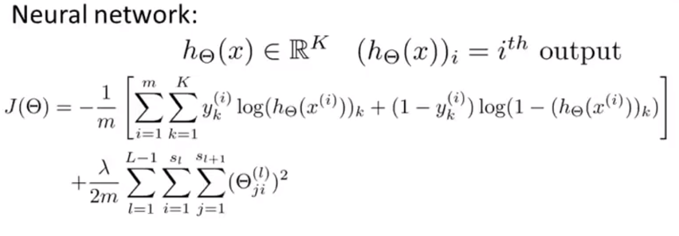

所以上图中的式子就是神经网络中的代价函数。上式中的第一部分$-\frac{1}{m}$乘以一个类似于我们在逻辑回归里的求和项，除了上式还加入了求$k$从1到的$K$所有和。这个求和项主要是$K$个输出单元之和。依次把每一个逻辑回归算法的代价函数按照四次输出的顺序加起来。这个求和符号应用于$y_k$和$h_k$，因为我们主要是将第$K$个输出单元的值和$y_k$的值的大小作比较，即最后得到的向量应该属于哪个分类。

最后，神经网络代价函数的正则化项也与逻辑回归有些不同。这里的正则化项是对$\Theta_{ij}^{(l)}$项对所有$i,j,l$的值求和。就像在逻辑回归中我们不加入偏置单元的值一样，这里要去除那些对应的偏置单元的项。具体地说，我们不对$\Theta_{ij}^{(l)}$中$i$为0的项求和，因为我们在计算激活函数时，会得到类似于$\Theta_{i0}^{(2)}a_0+\Theta_{i1}^{(2)}a_0+...$这样的项，这些含有0的项对应了$a_0$的项，这是一个类似于偏置单元的项。

正则化的那一项只是排除了每一层$\Theta_0$后，每一层的$\Theta_0$矩阵的和。最里层的循环$j$循环所有的行（由 $s_l$+1 层的激活单元数决定），循环$i$则循环所有的列，由该层（$s_l$层）的激活单元数所决定。

## 9.2 反向传播算法

### 9.2.1 梯度计算

在上一节中我们介绍了神经网络的代价函数，现在，让我们来看一下让代价函数最小化的算法——**反向传播算法(back propagation algorithm)**。

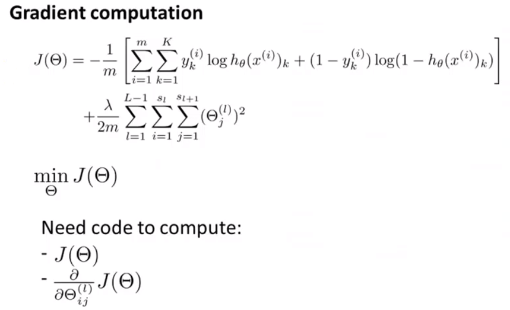

上图中我们给出了神经网络的代价函数，现在我们要设法找到参数$\Theta$使$J(\Theta)$取到最小值。所以这里我们需要计算$J(\Theta)$以及一些列偏导项。

让我们从只有一个训练样本说起。

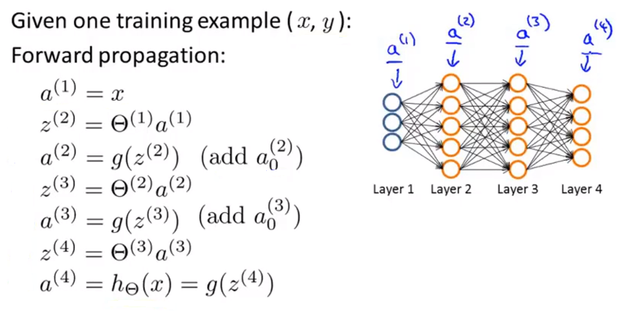

这里我们先使用向前传播，通过项量化的方法计算出神经网络结构里的每一个神经单元的激活值。

### 9.2.2 反向传播算法

反向传播算法从直观上说，就是对于每一个节点，我们计算$\delta_j^{(l)}$，它代表了第$l$层第$j$个节点的误差。这个$\delta$项在某种程度上就捕捉到了我们在这个节点的激活值得误差。在这里，我们还要回顾一下之前的一个定义——$a_j^{(l)}$，它代表了第$l$层第$j$个节点的激活值。

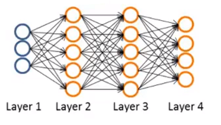

我们用上面这个四层($L=4$)神经网络的结构为例。对于每一个输出单元，我们将计算$\delta$项。

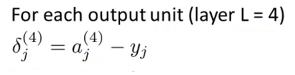

所以第四层第$j$个单元的$\delta$就等于这个单元的激活值减去训练样本里的真实值。这里的$y_j$就是我们训练集中向量$y$的第$j$个元素。接下来，我们把网络中前面几层的误差项$\delta$计算出来。

上面公式中的.*是MATLAB中的点乘符号，$g\prime(z^{(3)})$是对激活函数$g$在输入值为$z(3)$的时候所求的导数。$g\prime(z^{(3)})=a^{(3)} * (1-a^{(3)})$。

这里没有$\delta^{(1)}$项是因为第一次对应的是输入层，**那只表示我们在训练集里观察到的，所以不会存在误差**。

我们有了所有的误差的表达式后，便可以计算代价函数的偏导数了，假设$\lambda=0$，即我们不做任何正则化处理时有：
$$
\frac{\partial}{\partial\Theta_{ij}^{(l)}J(\Theta)}=a_j^{(l)}\delta_i^{(l+1)}
$$
在上述公式中：

+  $l$代表目前所计算的是第几层。

+ $j$ 代表目前计算层中的激活单元的下标，也将是下一层的第$j$个输入变量的下标。

+  $i$代表下一层中误差单元的下标，是受到权重矩阵中第$i$行影响的下一层中的误差单元的下标。

### 9.2.3 整合到一起

现在让我们把上面的内容整合到一起，来看看如何实现反向传播算法。

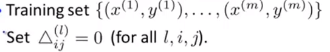

我们要做的第一件事就是固定这些带下标$ij$的$\Delta$，让其值都为0，它们将会被用来计算偏导项。

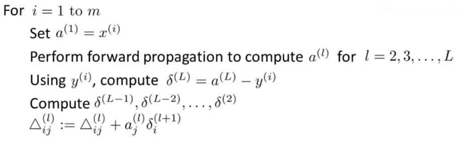

接下来我们将遍历我们的训练集。

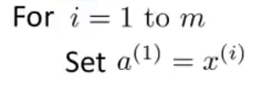

首先，对于第$i$个循环而言，我们将取出训练样本$(x^{(i)},y^{(i)})$，然后设定$a^{(1)}$，也就是输入层的激活函数为$x^{(i)}$。

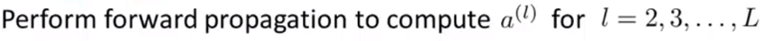

接下来我们运用正向传播，计算每一层的激活值。

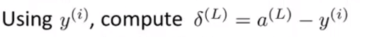

用样本的输出值$y^(i)$来计算这个输出值所对应的误差项$\delta(L)$。

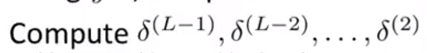

用反向传播分别计算$\delta$值一直到$\delta^{(2)}$。

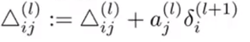

用$\Delta$来累计偏导数项。

最后，执行完for循环之后，我们跳出循环，然后计算下面的式子：

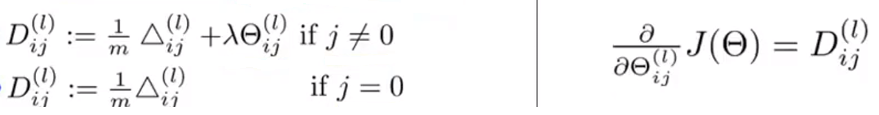一旦计算出来了这些$D$项，它正好就是代价函数关于每个参数的偏导数，之后就可以使用梯度下降或其他高级优化算法了。

## 9.3 反向传播算法的直观理解

### 9.3.1 向前传播

为了更好地理解反向传播，我们先进一步的研究向前传播的过程。

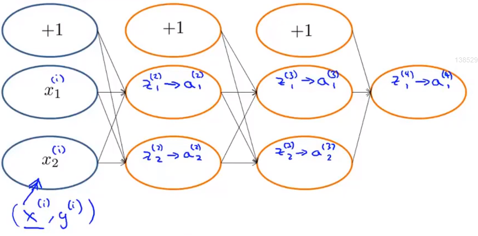

在进行向前传播时，我们有一些特定的样本，例如$(x^{(i)},y^{(i)})$。接下来进行如下步骤：

+ 我们将$x^{(i)}$传到输入层中，对其进行向前传播。
+ 传到第一个隐藏层时，我们要计算出$z^{(2)}_1$和$z^{(2)}_2$，**它们是输入单元的加权和**。
+ 然后我们将sigmoid激活函数应用到$z$值上，从而得到激活值$a^{(2)}_1$和$a^{(2)}_2$。
+ 然后继续向前传播，计算出$z^{(3)}_1$和$z^{(3)}_2$，之后再应用sigmoid激活函数得到$a^{(3)}_1$和$a^{(3)}_2$。
+ 最后我们得到$z^{(4)}_1$，再应用激活函数得到$z^{(4)}_1$。它是网络中最后输出的值。

现在，让我们关注一下第二个隐藏层中第二个隐藏单元，分别用紫色，红色和青色标注它的权值，那么$z^{(3)}_1=\Theta^{(2)}_{10}\times1+\Theta^{(2)}_{11}\times a^{(2)}_1+\Theta^{(2)}_{10}\times a^{(2)}_2$。

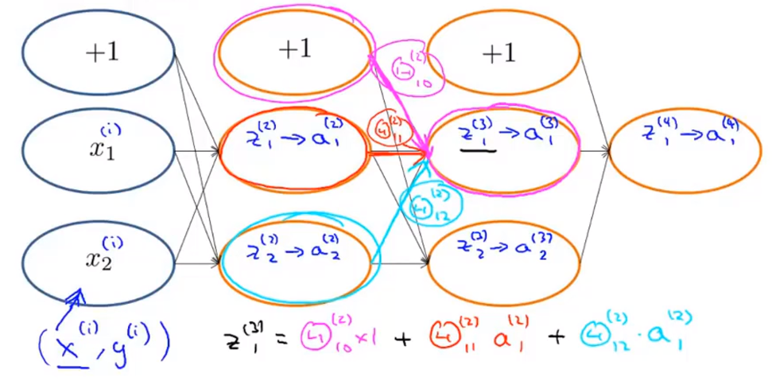

这就是向前传播。我们会发现反向传播算法与其大致相同，知识计算方向不一样而已。

### 9.3.2 神经网络的代价函数

为了更好地理解反向传播算法的过程，让我们先看一下神经网络的代价函数。

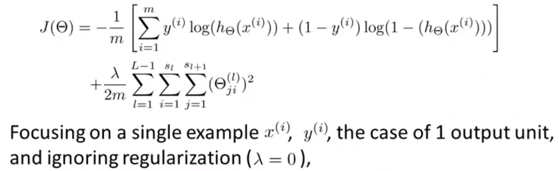

这个代价函数适用于只有一个输出单元的情况。现在让我们只关注一个训练样本$(x^{(i)},y^{(i)})$，因为只有一个输出单元，所以这里$y^{(i)}$是一个实数，并且忽略正则化项。简化的代价函数如下：

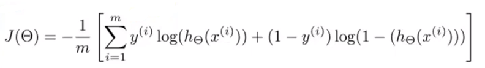

将这一个训练样本带入，我们会发现它的代价函数可以写成如下形式：

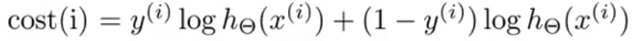

这个代价函数扮演了一个类似方差的角色，所以与其关注这个代价函数，可以把$cost(i)$近似的看成神经网络的输出值与实际值的方差：

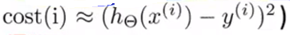

因此，它表示了神经网络预测样本值的准确程度，也就是网络的输出值和实际观测值$y^{(i)}$的接近程度。

### 9.3.3 反向传播算法

现在让我们看看反向传播的过程，一种直观的理解是反向传播算法就是在计算这些$\delta^{(l)}_j$项，我们可以把它们看作是在第$l$层中第$j$个单元得到的激活项的“误差”。用数学的知识去解释的话，$\delta^{(l)}_j$是代价函数关于$z^{(l)}_j$的偏导数。**它们衡量的是为了影响这些中间值，我们想要改变神经网络中的权重的程度进而影响整个神经网络的输出**$h(x)$。

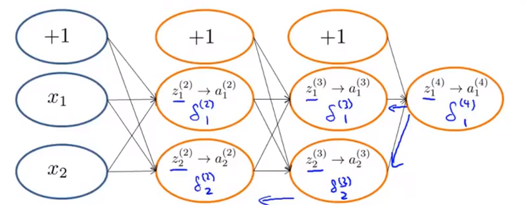

接下来让我们对反向传播算法有一个更直观的了解：

+ 对于输出层来说，如果我们设置$\delta^{(4)}_1=y^{(i)}-a^{(4)}_1$，这是一个误差值。
+ 然后，我们对这些值进行反向传播，并计算出前一层的$\delta$项，即$\delta^{(3)}_1$和$\delta^{(3)}_2$。
+ 然后继续向前传播，最后计算出$\delta^{(2)}_1$和$\delta^{(2)}_2$。

现在，让我们关注一下第一个隐藏层中第三个神经元的具体计算过程。与向前传播类似，我么分别用紫色和红色标注权值，用后一层中$\delta$项的加权和由对应边的强度来进行加权，即$\delta^{(2)}_2=\Theta^{(2)}_{12}\delta^{(3)}_1+\Theta^{(2)}_{22}\delta^{(3)}_2$。

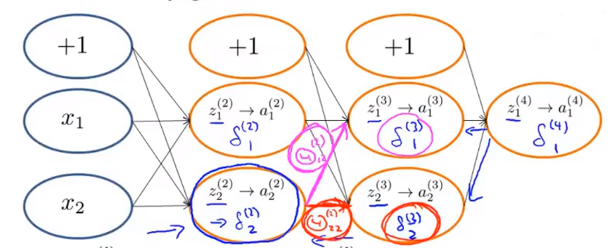

## 9.4 使用注意：展开参数

### 9.4.1 为什么要展开参数

在上节中，我们谈到了怎样使用反向传播算法计算代价函数的导数。在这一节，我们将介绍如何把你的参数从矩阵展开成向量，以便我们在高级最优化步骤中的使用需要。

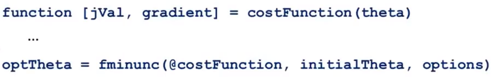

具体来讲，我们在执行代价函数时，输入参数是theta，函数返回代价值及导数值。然后我们可以将返回值传递给高级优化算法。这些程序默认给定的theta都是参数**向量(vectors)**，同时代价函数返回的梯度值也是一个向量。

但是在神经网络中，我们的参数不再是向量了，而变成了**矩阵(matrices)**。同样的，这些返回的梯度值$D^{(1)},D^{(2)},D^{(3)}$也是矩阵。

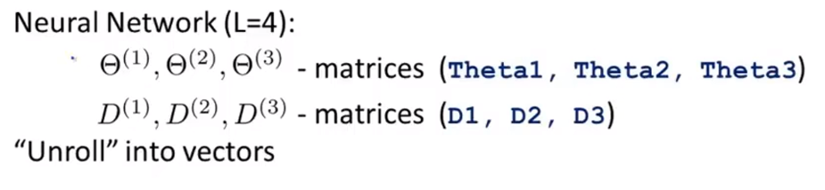

### 9.4.2 如何展开参数

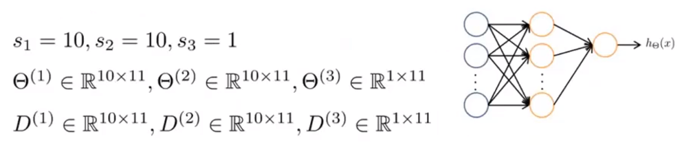

假设我们有一个输入层有10个输入单元，隐藏层有10个隐藏单元，最后的输出层只有一个输出单元的神经网络。再做这种情况下，$\Theta$和$D$的维度如上图所示。在octave中，如果想实现将矩阵转化为向量，就要使用下面的代码：

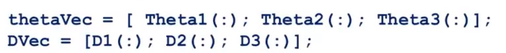

即将theta1,2,3中的所有元素取出，然后把它们全部展开成为一个很长的向量。

如果想实现将向量还原回矩阵，就要适用下面的代码：

例如还原theta1，我们先取出前110个元素，然后用reshape命令来改变矩阵的大小，从而得到矩阵theta1。

### 9.4.3 将展开的参数应用于学习算法

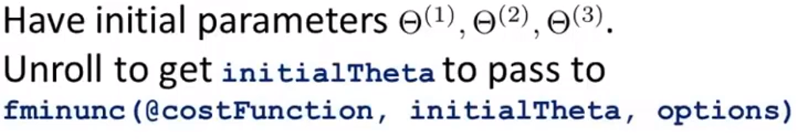

假设我们有一些初始化参数，我们要把它们展开成一个长向量，然后作为theta参数的初始值传入优化函数。另一件需要我们做的是就是实现代价函数，如下图：

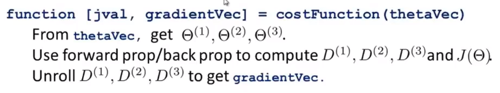

代价函数实现算法如下：

+ 使用thetaVec和reshape方法的到处是参数矩阵$\Theta^{(1)},\Theta^{(2)},\Theta^{(3)}$。
+ 进行向前传播和反向传播来计算出偏导数以及代价函数$J(\Theta)$。
+ 最后，取出这些导数值，然后展开它们，得到gradientVec。其可以由代价函数返回。

**使用矩阵表达的好处是在进行正向/反向传播时会更方便；用向量表达式的有点是当你使用一些高级优化算法时，这些算法会要求把所有参数展开成一个长向量的形式**。

## 9.5 梯度检验

当我们对一个较为复杂的模型（例如神经网络）使用梯度下降算法时，可能会存在一些不容易察觉的错误，意味着，虽然代价看上去在不断减小，但最终的结果可能并不是最优解。为了避免这样的问题，我们采取一种叫做**梯度的数值检验（Numerical Gradient Checking）**方法。这种方法的思想是通过估计梯度值来检验我们计算的导数值是否真的是我们要求的。

### 9.5.1 梯度的数值估计

假设要估计函数在$\theta$点的导数，即函数在这一点处切线的斜率。要想从数值上计算它的导数，我么首先要计算出$\theta+\epsilon$，然后再计算出$\theta-\epsilon$。之后，我们将这两点在函数图像上的点连接起来，那么这条红线就是该点导数的近似值。在数学上，这条红色直线的斜率等于该段的垂直高度初一该段的水平宽度，即$\frac{d}{d\theta}J(\theta)\approx \frac{J(\theta+\epsilon)-J(\theta-\epsilon)}{2\epsilon}$。

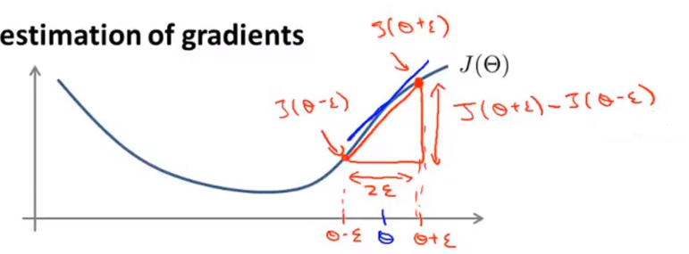

通常来说，$\epsilon$是一个很小的值，例如$10^{(-4)}$。当我们在octave中需要执行这样的计算时，需要执行以下代码：

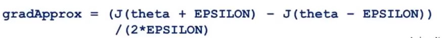

### 9.5.2 参数为向量时

在上一节中，我们只考虑了$\theta$是实数的情况，现在我们要考虑更普遍的情况，即$\theta$为参数向量的时候。

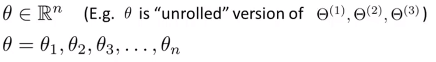

我们可以用类似的思想来计算所有的偏导数项：

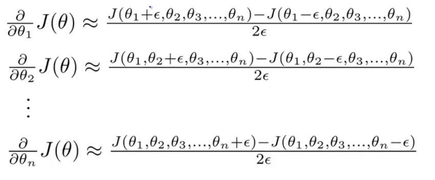

具体来说，求$\theta_1$的偏导时，可以通过增加$J$中的$\theta_1$得到，所以括号中是$\theta_1+\epsilon$，其余项不变。在octave中的代码实现如下：

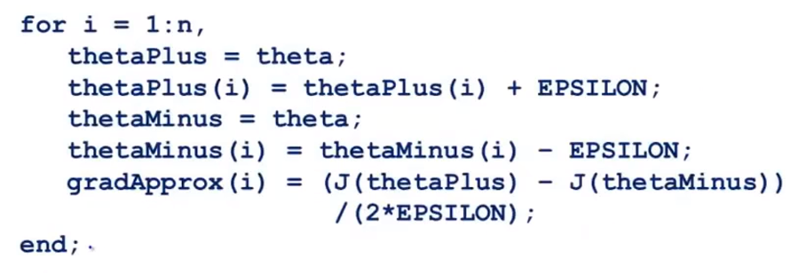

**当我们在神经网络中使用这种方法时，我们需要验证通过上述方法得到的偏导数与通过反向传播算法得到的偏导数在数值上是否非常接近**。如果二者十分接近，那么反向传播的实现就是正确的。

### 9.5.3 总结

在进行梯度检验时时，我们需要注意：

+ 通过反向传播来计算DVec($D^{(1)},D^{(2)},D^{(3)}$的展开形式)。
+ 实现数值上的梯度检验，计算出gradApprox。
+ 确保DVec和gradApprox都能得出相似的近似值。
+ 在你使用代码训练网络之前，要关掉梯度检验。因为梯度检验是一个计算量非常大的，运行速度非常慢的计算倒数的程序，相反的，反向传播算法是一个高性能的导数计算方法。所以一旦确定反向传播的实现是正确的，就应该关闭梯度检验。

## 9.6 随机初始化(random initialization)

### 9.6.1 为什么要进行随机初始化

当你执行一个例如梯度下降的算法时，我们需要为变量$\Theta$选取一些初始值，那么应该如何对$\Theta$设置初始值呢？**一般在逻辑回归中，我们会将初始值设为0，但是在训练神经网络时这样起不到任何作用**。

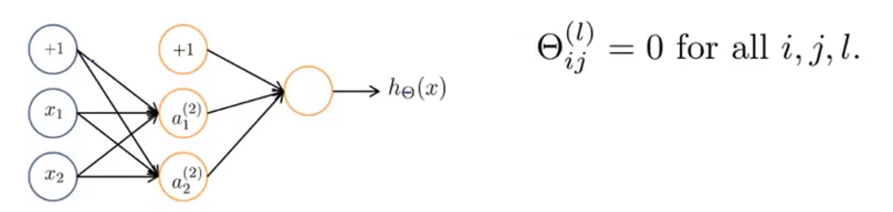

我们以上图中的神经网络为例。由于参数都是以0初始化的，所以隐藏层的权重相同，导致$a^{(2)}_1=a^{(2)}_2$，同理$\delta^{(2)}_1=\delta^{(2)}_2$。进一步去看，由于权重相同，那么它们的偏导数也就相同，这样会导致虽然迭代多次后值不为0，但是从同一个输入单元处罚的两条权重每次更新完后都是相等的。

所以每次更新之后，这两个隐藏单元的每个参数输入都是相等的。如果有不止两个隐藏单元，而是有很多隐藏单元，那么它们在计算相同的特征。所有的隐藏单元都以相同的函数作为输入，这是一种高度冗余的现象，因为这意味着最后的逻辑回归单元只能得到一个特征。

### 9.6.2 随机初始化

为了解决上节中的问题，我们要使用随机初始化。对于每一个$\Theta$值，我们将其初始化为一个范围在$[-\epsilon,\epsilon]$之间的随机值。在octave中可以通过如下代码实现：

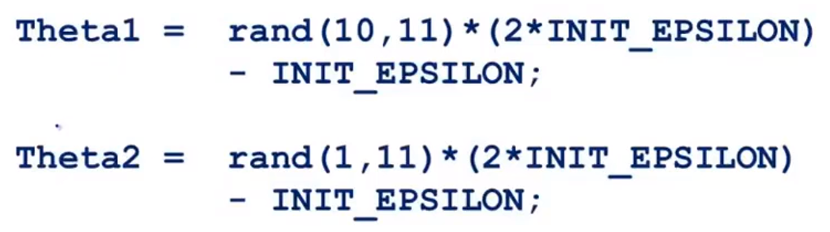

其中，rand方法会产生一个所有元素介于0到1之间的随机矩阵。注意，这里的$\epsilon$与我们在梯度检验中的$\epsilon$没有任何关系。

总而言之，为了训练神经网络，应该首先要将权重随机初始化为一个接近0的，范围在$[-\epsilon,\epsilon]$之间的随机值，然后进行反向传播，在进行梯度检验，最后使用梯度下降或其他高级优化算法来最小化代价函数。

## 9.7 组合到一起

### 9.7.1 选择一个神经网络

在训练一个神经网络时，我们要做的第一件事就是选择一种**网络架构(network architecture)**，即神经元之间的连接模式。

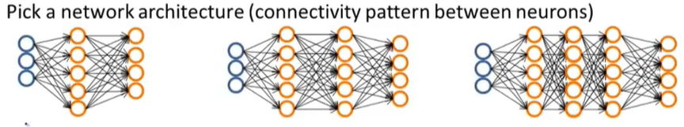

我们将按以下原则进行选择：

+ 输入层的单元数量：特征$x^{(i)}$的维度。
+ 输出层的单元数量：分类问题中分类的个数。
+ 隐藏层数：一个合理的默认选项是只是用单个隐藏层，如果使用多余一层的隐藏单元，那每一个隐藏层通常都应有相同的单元数。虽然神经元的数量越多，计算量越大，但是通常来说，隐藏单元还是越多越好。

### 9.7.2 训练一个神经网络

接下来要说的是训练一个神经网络需要实现的步骤：

1. 构建一个神经网络，然后随机初始化权重。通常我们把权重初始化为很小的，接近于0的值。
2. 使用向前传播算法，也就是对于该神经网络的任意一输入$x^{(i)}$，计算出对应的$h_\Theta(x^{(i)})$值。
3. 通过代码计算代价函数$J(\Theta)$。
4. 使用反向传播算法来计算偏导数项$\frac{\partial}{partial\Theta^{(l)}_{jk}}J(\Theta)$。通常，反向传播算法在执行时需要使用一个for循环进行遍历，如下图所示。

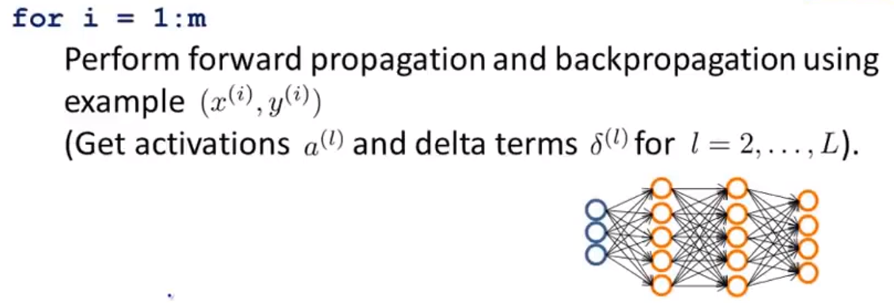

5. 使用梯度检查，来比较已经计算得到的偏导数项与用反向传播算法得到的偏导数值，以确保两种方法得到的值近似。之后要停用梯度检查。
6. 使用一个最优化算法和反向传播算法相结合，来最小化关于$\Theta$的代价函数$J(\Theta)$。

对于神经网络来说，代价函数$J(\Theta)$是一个非凸函数(non-convex)，理论上可能停留在局部最小值的位置。实际上，梯度下降算法和其他一些高级优化方法理论上都能收敛于局部最小值，但是一般来讲，在实际操作中，尽管我们不能保证这些优化算法一定会得到局部最优值，但项梯度下降这类算法，在最小化代价函数$J(\Theta)$的过程中表现得很不错。

## 9.8 无人驾驶

本章视频可在吴恩达及机器学习[课时80](<https://study.163.com/course/courseLearn.htm?courseId=1004570029#/learn/video?lessonId=1051773836&courseId=1004570029>)中观看。

