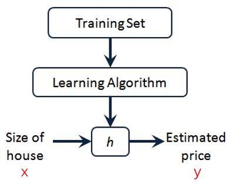
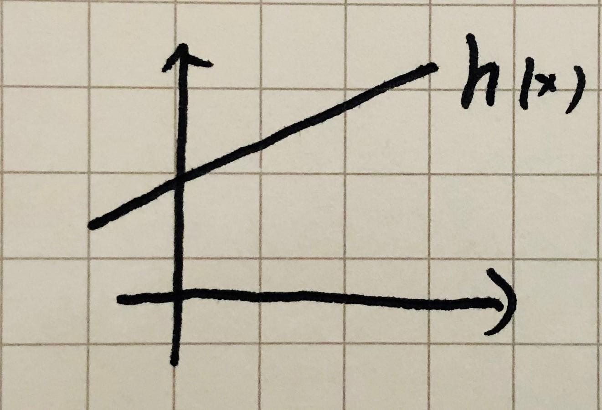
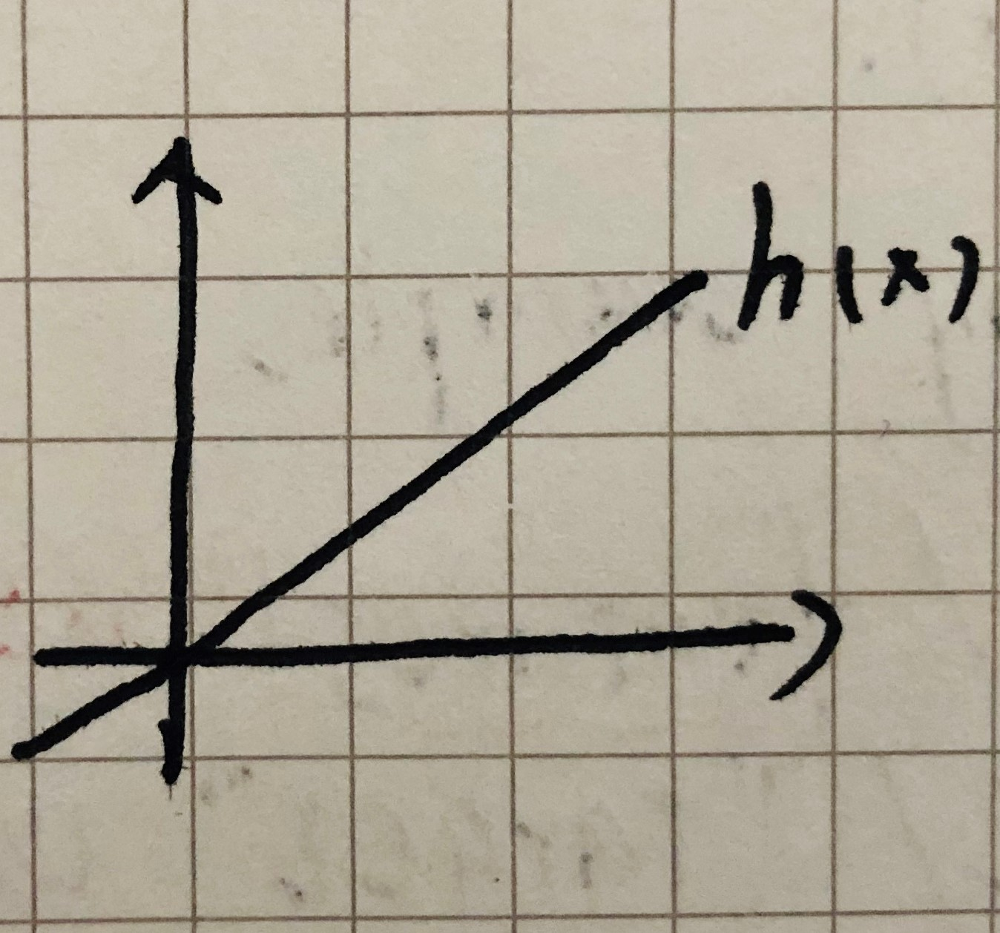
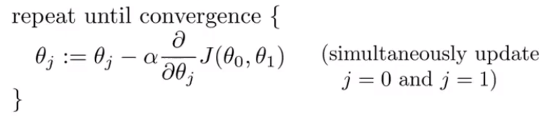
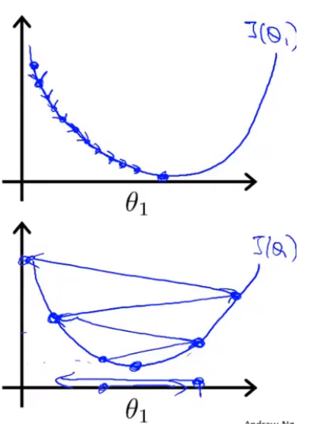
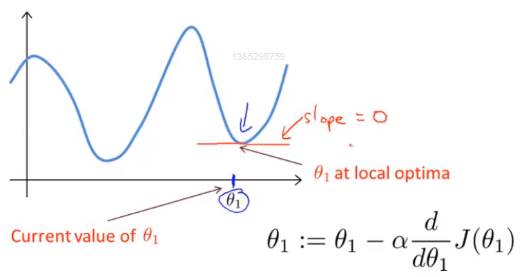
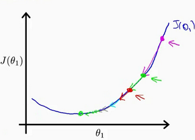
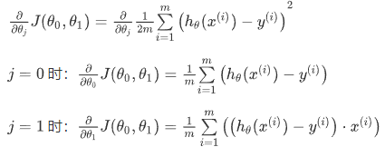
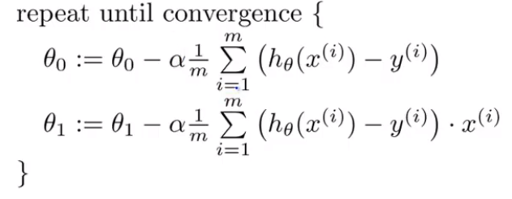

>搜索微信公众号:‘AI-ming3526’或者’计算机视觉这件小事’ 获取更多人工智能、机器学习干货

>csdn：https://blog.csdn.net/qq_36645271

>github：https://github.com/aimi-cn/AILearners

# 第二章 单变量线性回归

## 2.1 模型表示

### 2.1.1 知识回顾

首先，让我们回顾一下什么是监督学习：对于数据集中每个数据来说，我们给出“正确答案”。其中，最常用的监督学习算法解决的两类问题包括：

1. 回归问题：使用监督学习算法预测线性输出。例如通过房子的面积来预测房价。
2. 分类问题：使用监督学习算法预测离散输出。例如通过肿瘤的大小来预测肿瘤是良性的还是恶性的。

在本章我们先介绍回归问题

### 2.1.2 线性回归数据集的表示

以之前房屋交易问题为例，假设我们的线性回归问题中使用的数据集（Training Set）如下：

我们将用来描述这个数据集的一些符号定义如下：

+ **m**——数据集中数据的总量。
+ **x**——输入的变量(input variable)/特征(features)。
+ **y**——输出的变量(output variable)/“目标变量(target variable)”。
+ **(x,y)**——训练集中的一实例。
+ **(x^(i)^,y^(i)^)**——训练集中第i个实例。

### 2.1.3 线性回归假设函数的表示

接下来我们用h来表示学习算法的解决方案，这个方案也被称为**假设函数(hypothesis)，在这里，h是一个从x到y的映射**。

我们用$ h_\theta(x)=\theta_0+\theta_1x $来表示假设函数h，它是一个预测y是关于x的线性函数，其简写形式为$ h(x) $。回到房价预测的例子中，我们其实是将训练集“喂”给我们的学习算法，进而得到一个假设函数h，然后再将我们要预测的房屋尺寸的变量“喂”给假设函数h，从而预测出房屋的价格。

**由于在上面的假设函数只输入了一个特征，所以这样的问题叫做单变量线性回归问题(linear regression with one variable)。**

## 2.2 代价函数

### 2.2.1 提出问题

我们给定数据集与假设函数，那么该如何对参数进行选择。

代价函数(cost function)有助于我们弄清楚如何用一条更好的直线将我们的训练集中的数据进行拟合。

### 2.2.2 代价函数

接下来我们要做的便是为我们的模型即选择合适的**参数**（**parameters**）$\theta_0 $和 $\theta_1$，使得假设函数$h_\theta(x)$尽量接近我们训练数据集中的y。我们选择的参数决定了我们得到的直线相对于我们的训练集的准确程度。模型所预测的值与训练集中实际值之间的差距（下图中蓝线所指）就是**建模误差**（**modeling error**）。

在线性回归中，我们要解决一个最小化问题，尽量减少假设输出与真实数据之间的平方差，在对所有训练样本进行分求和，最后尽量减小平方误差，在这里我们给出**代价函数(cost function)**的数学定义定义如下：
$$
J(\theta_0,\theta_1)=\frac {1} {2m}\sum_{i=1} ^m(h_\theta(x^{(i)})-y^i)^2
$$
代价函数也被称作平方误差函数，有时也被称为平方误差代价函数，我们可以从上述公式所求预测值与真实值误差的平方看出。它是解决回归问题最常用的手段了。

由于上面的代价函数有两个参数，所以我们用matlab在三维空间中绘制出其图像如下图所示。从图像中我们可以很容易的找出使得$J(\theta_0,\theta_1)$最小的点。

## 2.3 代价函数的直观理解I

单看代价函数的数学定义可能会有些抽象，那么现在让我们来通过一些例子来获取直观感受，弄清楚代价函数在干什么。

### 2.3.1 提出一个简化模型

结合根据上一节中的代价函数，我们提出一个完整的线性回归模型。

假设函数：$ h_\theta(x)=\theta_0+\theta_1x $
参数：$\theta_0 $, $\theta_1$
代价函数：$J(\theta_0,\theta_1)=\frac {1} {2m}\Sigma_{i=1} ^m(h_\theta(x^{(i)})-y^i)^2$
目标：minimize$J(\theta_0,\theta_1)$

**现将假设函数做一个简化处理，让$\theta_0 =0$,只剩下$\theta_1$一个参数，这样我们就可以在一个二维平面画出代价函数$J(\theta_1)$的图像**，有助于我们更好地观察代价函数在干什么，从而更好地理解代价函数背后的数学意义。简化后的线性回归模型如下。

+ 假设函数：$ h_\theta(x)=\theta_1x $
+ 参数： $\theta_1$
+ 代价函数：$J(\theta_1)=\frac {1} {2m}\Sigma_{i=1} ^m(h_\theta(x^{(i)})-y^i)^2$
+ 目标：minimize$J(\theta_1)$

**这里学习算法的优化目标是找到一个$\theta_1$的值来将$J(\theta_1)$最小化。**

### 2.3.2 代价函数的直观理解

**在上面的图像中，假设函数$ h_\theta(x) $是关于数据特征x的函数，而代价函数$J(\theta_1)$是关于参数$\theta_1$的函数，它控制着函数的斜率。**

对于每个$\theta_1$的值，都对应着一个不同的假设函数（例如上图左边函数图像中的浅蓝线条，粉色线条，深蓝线条所表示的函数对应着不同的$\theta_1$的值）。对于每个不同的$\theta_1$的值，我们可以个巨这些值绘制出$J(\theta_1)$的图像如上图右边的函数图像所示。例如当$\theta_1=1$时，假设函数完全拟合所有数据，所以代价函数的值为0。

## 2.4 代价函数的直观理解II

在上一节中，我们通过简化线性回归模型即令$\theta_0 =0$来在一个二维平面上直观的理解代价函数。**但是实际应用中的情况往往不能讲模型简化，所以当$\theta_0 \neq0$时，我们可以用轮廓图或登高曲线图来绘制$J(\theta_0,\theta_1)$的图像。**

通过这些图形，我希望你能更好地理解这些代价函数所表达的值是什么样的，它们对应的假设是什么样的，以及什么样的假设对应的点，更接近于代价函数的最小值。

## 2.5 梯度下降

### 2.5.1 为什么要使用梯度下降

在对代价函数的数学含义有了进一步的只直观解后，我们需要一种有效的算法，能够自动地找出这些使代价函数取最小值的参数和来。当然我们也不希望编个程序把这些点画出来，然后人工的方法来读出这些点的数值，这很明显不是一个好办法。我们会遇到更复杂、更高维度、更多参数的情况，而这些情况是很难画出图的，因此更无法将其可视化，所以我们真正需要的是编写程序来找出这些最小化代价函数的和的值。

### 2.5.2 什么是梯度下降

**梯度下降(gradient descent)**是一个用来求函数最小值的算法，我们将使用它来最小化代价函数$J(\theta_0,\theta_1)$。

+ 前提：有代价函数$J(\theta_0,\theta_1)$
+ 目标：找出参数$\theta_0 $, $\theta_1$来最小化$J(\theta_0,\theta_1)$
+ 框架：
  1. 随机找出参数组合$(\theta_0,\theta_1)$。（**$\theta_0,\theta_1$的初始值是什么并不重要，但一般令$\theta_0=0,\theta_1=0$**）
  2. 不断改变$\theta_0 $, $\theta_1$的值来减小代价函数$J(\theta_0,\theta_1)$的值，直到达到一个局部最小值（**local minimum**）。（因为我们并没有尝试完所有的参数组合，所以不能确定我们得到的局部最小值是否便是全局最小值（**global minimum**），选择不同的初始参数组合，可能会找到不同的局部最小值。）
+ 梯度下降算法：

**在梯度下降算法中，$\alpha$表示学习率(learning rate),我们用它来控制梯度下降过程中我们''迈"出多大步子。梯度下降算法的一个特点就是可能会得到非常不同的局部最优解。**

为了更好地理解梯度下降算法，我们可以想象一下你正站立在红色“山”上，在梯度下降算法中，我们要做的就是旋转360度，你会发现最佳的下山方向，之后通过“小碎步”下山。走完第一步后，你再看看周围，然后再次想想，我应该从什么方向迈着小碎步下山？然后你按照自己的判断又迈出一步。重复上面的步骤，直到你接近局部最低点的位置。

### 2.5.3 梯度下降算法中需要注意的一个小细节

在批量梯度下降中，我们每一次都同时让所有的参数减去学习速率乘以代价函数的导数。在梯度下降的过程中我们要更新$\theta_0 $和$\theta_1$，并且要**同步更新**。正确的更新方法如下：

如果我们在计算$temp1$之前就先对$\theta_0$进行了更新，那么$temp1$中的$\theta_0$就不是以前的$\theta_0$了。所以我们该计算公式右边的部分，通过那一部分计算出和的值，然后同时更新$\theta_0 $和$\theta_1$**。当人们提到梯度下降时，那就意味着参数要同步更新**。

## 2.6 梯度下降的直观理解

在上一节中，我们给出了一个数学上关于梯度下降的定义，本节我们将通过绘制函数图像的方法，更直观地感受一下这个算法是做什么的，以及梯度下降算法的更新过程有什么意义。我们回顾上节所学的梯度下降算法如下：

**在这里我们要特别注意$\theta_0 $和$\theta_1$要做到同步更新**。

### 2.6.1 对学习率$\alpha$的理解

根据梯度下降中梯度的更新规则$\theta_j:=\theta_j-\alpha\frac{\partial}{\partial \theta_j}J(\theta)$，求偏导$\alpha\frac{\partial}{\partial \theta_j}J(\theta)$得到的是损失函数$J(\theta)$斜率。当斜率为正时，$\theta_j-\alpha\frac{\partial}{\partial \theta_j}J(\theta)$为小于原来的$\theta$，所以更新后的$\theta$就会变小，梯度向“左”移动，如下图左侧函数图像所示。当斜率为负时，$\theta_j-\alpha\frac{\partial}{\partial \theta_j}J(\theta)$大于原来的$\theta$，所以更新后的$\theta$就会变大，梯度向”右“移动，如下图右侧侧函数图像所示。

### 2.6.2 学习率$\alpha$对梯度更新的影响

+ **如果$\alpha$太小**，即学习率太小，**梯度更新的素的可能会很慢**，因此可能会需要很多步才能到达全局最低点。

+ **如果$\alpha$太大**，即学习率太大，那么梯度下降法可能会越过最低点，并在一次次的迭代中，一次次越过最低点，最后离最低点越来越远。所以学习率太大，**不仅会导致无法收敛，甚至还会发散**。

### 2.6.3 一个特例

梯度下降算法的目的就是帮助我们自动的找到局部最低点时的参数$\theta$。但是，如果我们把梯度下降的初始化参数直接放在局部最低点时，梯度下降算法有会怎么做呢？

假设你将初始化参数放在在局部最低点，那么这一点的导数将等于零，梯度更新其实什么都没做，它也不会改变参数的值。这也解释了为什么**即使学习率保持不变时，梯度下降也可以收敛到局部最低点**。

例如在上图的损失函数中，想找到它的最小值，首先在紫色点处初始化梯度下降算法。如果我更新一步梯度下降，它会带我到绿色的点，因为这个点斜率比较大，所以导数也会比较大。现在，在这个绿色的点，如果我再更新一次梯度，你会发现斜率没有紫色的点处那么大，即导数没有刚才大，移动的幅度也就没有上一次更新那么大。随着我接近最低点，导数越来越接近零，所以，再进行一步梯度下降时，的导数项是更小的，更新的幅度就会更小。因此，**随着梯度下降法的运行，你移动的幅度会自动变得越来越小，直到最终移动幅度非常小，你会发现，已经收敛到局部极小值**。

**总结来说，在梯度下降法中，当我们接近局部最低点时，梯度下降法会自动采取更小的幅度，所以实际上没有必要再另外减小学习率$\alpha$**。

## 2.7 线性回归中的梯度下降

### 2.7.1 线性回归与梯度下降的关系

在学习本节之前我们要先搞清楚之前所学的线性回归的假设函数$h_\theta(x)$,损失函数$J(\theta_0,\theta_1)$和梯度下降之间的关系。

+ $h_\theta(x)$：我们可以把假设函数$h_\theta(x)$理解为我们所要训练的“模型”，这个“模型”由参数$\theta$决定。
+ $J(\theta_0,\theta_1)$：我们可以把最小化损失函数$J(\theta_0,\theta_1)$理解为求解参数$\theta$的一种途径。
+ 梯度下降：我们可以把梯度下降理解为自动最小化损失函数的一种方法。

**总的来说，我们就是通过梯度下降来自动最小化损失函数从而得到参数$\theta$用来构建我们的线性回归模型。**

### 2.7.2 线性回归中梯度下降公式的推导

**对我们之前的线性回归问题运用梯度下降法，关键在于求出代价函数的导数**，进而进行梯度更新，即将梯度下降法应用到最小化平方差代价函数：

所以，线性回归中的梯度下降公式为：

### 2.7.3 批量梯度下降

我们刚刚使用的算法，有时也称为**批量梯度下降(batch gradient descent)**。**批量梯度下降**”，指的是在梯度下降的每一步中，我们都用到了所有的训练样本，在计算微分求导项时，我们需要进行求和运算。因此，批量梯度下降法这个名字说明了我们需要考虑所有这一"批"训练样本，而事实上，也有其他类型的梯度下降法，不用考虑整个的训练集，而是每次只关注训练集中的一些小的子集。

除了梯度下降以外，在高等数学中存在一个解法可以直接求解代价函数$J(\theta_0,\theta_1)$的最小值而不需要使用梯度下降的迭代算法，它被称之为**正规方程组法**。在实际中，相比于正规方程组法，梯度下降更适用于更大的数据集。