>搜索微信公众号:‘AI-ming3526’或者’计算机视觉这件小事’ 获取更多人工智能、机器学习干货

>csdn：https://blog.csdn.net/qq_36645271

>github：https://github.com/aimi-cn/AILearners
# 第五章 Octave教程

## 5.1 基本操作

**在Octave中，我们可以使用PS1('>>')指令来改变命令提示符。%后跟的是注释**。

```octave
>>a = 3; %分号的作用是在敲下回车后可以阻止打印输出
>>a = pi;
>>disp(a)
3.1416
>>disp(sprintf('2 decimals:%0.2f'),a) %这里的格式化输出有点类似C语言
2 decimals:3.14
>>disp(sprintf('6 decimals:%0.6f'),a)
6 decimals:3.141593
>>A = [12; 34; 56] %分号的作用是矩阵换行到下一行
A = 
    1 2
    3 4
    5 6
>>v = 1: 0.1: 2 %v从1开始，步长为0.1，一直增加到2
v = 
	1.0 1.1 1.2 1.3 1.4 1.5 1.6 1.7 1.8 1.9 2.0
>>v = 1: 6 %没有规定步长时默认为1
v = 
	1 2 3 4 5 6
>>ones(2, 3) %用来生成一个维度为2×3的所有元素都为1的矩阵
ans = 
	1 1 1
	1 1 1
>>c = 2 * ones(2, 3)
c = 
	2 2 2
	2 2 2
>>w = zeros(2, 3) %用来生成一个2×3的零矩阵
w = 
	0 0 0
>>w = randn(1, 3) %得到一个维度为1×3的随机矩阵，随机值介于0到1之间
w = 
	0.91744 0.14359 0.84860
>>w = -6 + sqrt(10)*(randn(1, 10000))；
>>hist(w) %绘制出变量w的直方图
```

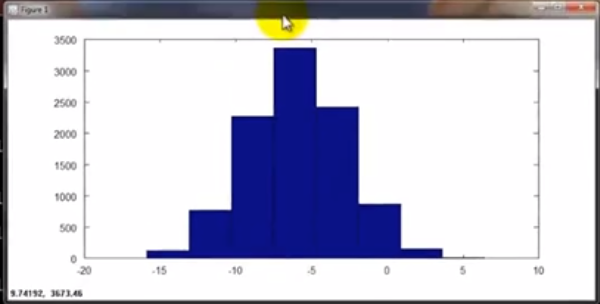

```octave
>>hist(w, 50) %绘制出变量w的有50个竖条的直方图
```

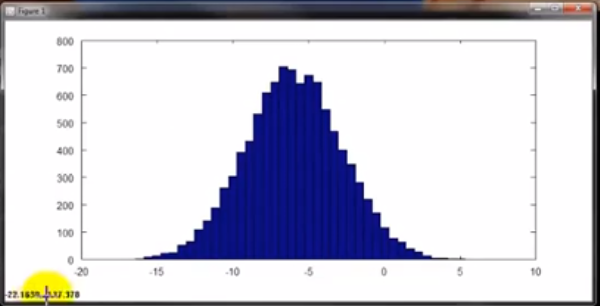

```octave
>>eye(4) %生成一个4×4的单位矩阵
ans = 
Diagonal Matrix
	1 0 0 0
	0 1 0 0
	0 0 1 0
	0 0 0 1
>>help eye %可以使用help指令查看eye中的一些操作
```

## 5.2 移动数据

如果你有一个机器学习问题，你怎样把数据加载到 Octave*中？
```octave
>>A = [12; 34; 56];
>>size(A) %返回矩阵的维度，所返回的是一个维度为1×2的矩阵
ans = 3
>>length(A) %返回矩阵A最大维度的大小，一般对向量使用
ans = 3
>>pwd %显示当前路径
>>load featuresX.dat %加载当前路径下的文件featuresX.dat
>>load priceY.dat
>>who %能显示出现在octave中所有的变量
```

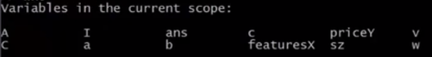
```octave
>>featuresX %显示featuresX中的数据
>>whos %显示更加详细的变量信息
```

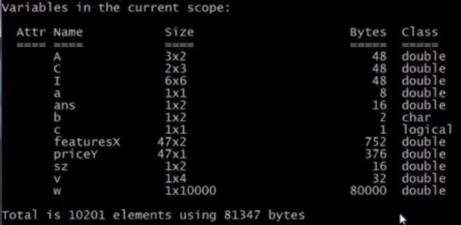

```octave
>>clear %删除变量指令
>>v = priceY(1: 10) %将向量Y中的前10个元素赋给v
>>save hello.mat v; %将变量v保存为一个名为hello.mat的文件，其中数据为二进制格式
>>save hello.txt v -ascii %将变量v保存为一个名为hello的txt文件，数据用ASCII码编码
>>A(3, 2) %索引A矩阵的第3行第2列的元素
ans = 6
>>A(2, :) %冒号在这里代表所在行/列的所有元素
ans = 3 4
>>A(:, 2)
ans = 
	2
	4
	6
>>A([1, 3], :) %A中第一索引为1和3的所有元素
ans = 
	1 2
	5 6
>>A(:, 2) = [10; 11; 12]
ans = 
	1 10
	3 11
	5 12
>>A = [A, [100, 101, 102]] %在A矩阵的右侧新添一列
A = 
	1 10 100
	3 11 101
	5 12 102
>>A(:) %将A矩阵中的所有元素放到一个向量中
ans = 
	1
	3
	5
	11
	12
	13
	100
	101
	102
>>A = [1 2; 3 4; 5 6];
>>B = [11 12; 13 14; 15 16];
>>C = [A B] %将B矩阵接在A矩阵右侧
C = 
	1 2 11 12
	3 4 13 14
	5 6 15 16
>>C = [A; B] %将B矩阵接在A矩阵的下面
C = 
	1 2
	3 4
	5 6
	11 12
	13 14
	15 16
```

## 5.3 计算数据
```octave
>>A = [1 2; 3 4; 5 6];
>>B = [11 12; 13 14; 15 16];
>>C = [1 1; 2 2];
>>V = [1; 2; 3];
>>A * C
ans = 
	5 5
	11 11
	17 17
>>A .* B %点乘，A与B中对应元素相乘
ans = 
	11 24
	39 59
	75 96
>>A ./ V %点除，可以用此命令取倒数
ans = 
	1.00000
	0.50000
	0.33333
>>log(v) %对V中所有元素取对数
>>exp(v) %以e为底，以V中元素为指数的幂运算
>>abs(v) %求V中所有元素的绝对值
>>V + ones(length(v), 1) %对V中每个元素都加1
>>A` %求A矩阵的转置
>>a = [1 15 2 0.5];
>>val = max(a); %返回a中最大的元素
>>[val, ind] = max(a) %val是a中最大的元素，ind是a中该元素的索引
val = 15
ind = 2
>>max(A) %得到A矩阵中每一列的最大值
ans = 5 6
>>a < 3 %a中每一个元素与3比较，返回一个布尔值
ans = 1 0 1 1
>>find(a < 3) %找到a中所有小于3的元素并返回它们的索引
ans = 1 3 4
>>A = magic(3) %生成幻方，常用这个函数便捷的生成一个3×3的矩阵
A = 
	8 1 6
	3 5 7
	4 9 2
>>[r, c] = find(A >= 7) %找出A中大于等于7的元素，r，c分别表示它们的所在行、列
r = 
	1
	3
	2
c = 
	1
	2
	3
>>sum(a) %求和函数
>>prod(a) %求积函数
>>floor(a) %向下取整
>>ceil(a) %向上取整
>>max(A, [], 1) %得到A中每一列的最大值，1表示从A的第一维度去取值
ans = 8 9 7
>>max(A, [], 2) %得到每一行的最大值
ans = 
	8
	7
	9
>>max(max(A)) %求A矩阵中的最大值
ans = 9
>>A = magic(9);
>>sum(sum(A .* eye(9))) %求A的对角线元素之和
>>sum(sum(A .* flipud(eye(9)))) %flipud表示使矩阵垂直翻转，可以用来求矩阵A的副对角线之和
>>pinv(A) %求逆
```

## 5.4 数据绘制


```octave
>>t = [0: 0.01: 0.98];
>>y1 = sin(2 * pi * 4 * t);
>>plot(t, y1) %横轴是变量t，纵轴是变量y1的正弦函数 
```


```octave
>>hold on %在已有的图像上绘制新的图像
>>y2 = cos(2 * pi * 4 * t);
>>plot(t, y2); %横轴是变量t，纵轴是变量y2的余弦函数 
>>xlabel('time');
>>ylabel('value') %给x轴y轴打上标签
```


```octave
>>title('my plot'); %给图像加标题
>>legend('sin', 'cos'); %给图像加图例
>>print –dpng 'myplot.png' %保存图像为png格式
```


```octave
>>subplot(1, 2, 1); %将图像分为一个1*2的格子，也就是前两个参数，然后它使用第一个格子，也就是最后一个参数1的意思
>>axis([0.5, 1, -1, 1]) %改变x轴，y轴的刻度
```

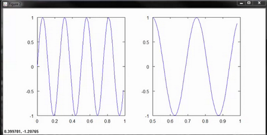


```octave
>>A = magic(5);
>>imagesc(A) %绘制一个5×5的矩阵，由彩色格图构成，不同颜色对用不同的值，用于可视化矩阵
```

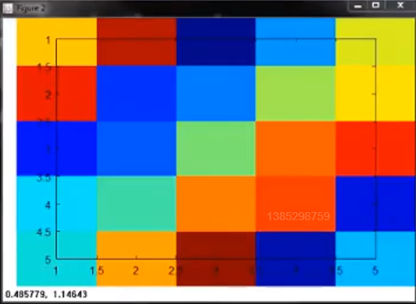

```octave
>>imagesc(A), colorbar, colormap gray %生成一个灰度分布图，并在右边加入一个颜色条
```


5.5 控制语句：for，while，if语句

```octave
>>v = zeros(10, 1);
>>for i = 1 : 10,
>	v(i) = 2^i;
>end; %循环结束必须加end;
v = 
	2
	4
	8
	16
	32
	64
	128
	256
	512
	1024
>>i = 1;
>>while i <= 5,
>	v(i) = 100;
>	i = i + 1;
>end; %v的前5位被赋值为100
>>i = 1;
while true,
>	v(i) = 999
>	i = i + 1
>	if i == 6,
>		break;
>	end;
>end; %999覆盖了v的前5个元素
>>v(1) = 2;
>>if v(1) ==1,
>	disp('The value is one');
>elseif v(1) == 2,
>	disp('The value is two');
>else
>	disp('The value is not one or two');
>end;
The value is two
```

**在Octave中定义一个函数，你需要创建一个文件，用你的函数名来命名，然后以.m的后缀结尾**。

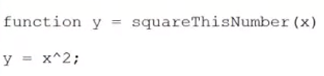

第一行代码是要告诉Octave我们想得到**一个**返回值，并将它存放在变量y中。另外，这个函数有一个自变量x。

**在调用函数前，先用pwd指令查看路径**，必须在当前路径下才能调用函数。

```octave
>>squareThisNumber(5)
ans = 25
>>addpath('C:\users\JermaineZ\Desktop') %使用这条命令添加参数中的路径到octave的搜索路径
```

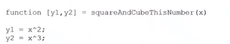

**octave的函数与其他编程语言不通，可以有两个返回值**。


```octave
>>[a, b]squareAndCubeThisNumber(5)
a = 25
b = 125
```


接下来我们要来编写一个函数来计算不通$\theta$值所对应的代价函数$J$。

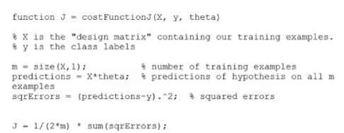

## 5.6 向量化

**对数据进行向量化操作，能让你的代码变得更加简洁，高效**。接下来让我们看一个例子。假设函数$h_\theta(x)=\sum_{i=0}^n \theta_jx_j$。若要计算$h_\theta(x)$，就要求和，但是换一种思维方式，**可以把$h_\theta(x)$看成$\theta^tx$，即两个向量的内积**，这样就会使代码更加高效简洁。以下是两种情况代码的对比。

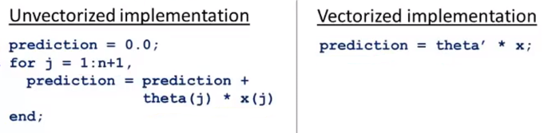

所以，与其写一个for循环，不如只写一行代码。相同的，向量化的思想也可以应用在不同的编程语言中。

出了代价函数，我们该如何向量化梯度下降呢？让我们再来回顾一下梯度下降的更新规则：

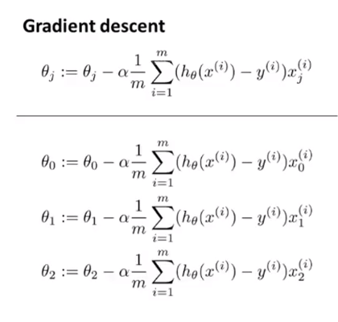

我们可以把梯度下降的更新规则看做$\theta:=\theta-\alpha\delta$，而这里的$\delta=\frac{1}{m}\sum_{i=1}^m(h_\theta(x^{(i)})-y^{(i)})x^{(i)}$。

在新的更新规则中，$\theta$是一个$n+1$维的向量，$\alpha$是一个实数，$\delta$也是一个$n+1$维的向量。**其本质是在做向量减法**。

我们再看$\delta$中的内容。对于每一个$\delta$所对应的$h_\theta(x^{(i)})-y^{(i)}$是一个实数，$x^{(i)}$是一个$n+1$维向量。**其本质是用一个实数乘特征向量$x$，所以$\delta$的本质就是一个向量**。

在这里我也将吴恩达老师的课件贴在这里，以便加深理解。

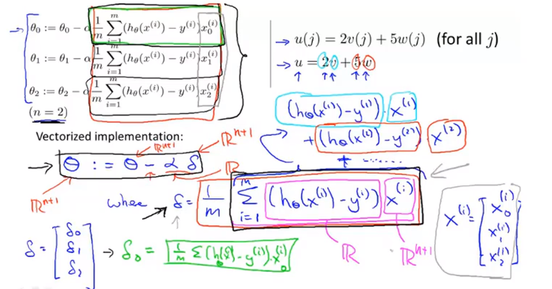