# 第八章 神经网络：表述

## 8.1 非线性假设

### 8.1.1  机器学习中的例子

假设有一个监督学习分类问题，如果使用逻辑回归来解决这个问题，我们可以构造一个包含很多非线性项的逻辑回归函数。

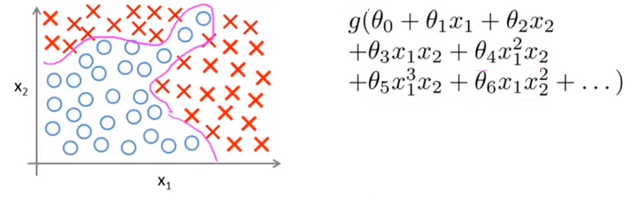

当我们要解决的问题只有$x_1,x_2$两个特征时，这种方法得到的效果确实不错，**因为我们可以把$x_1$和$x_2$的所有组合都包含到多项式中**。但在许多机器学习问题中，我们所拥有的特征往往不止两项。例如房价预测的问题中，假如我们有100个特征，若使用逻辑回归，其中二次醒的个数大约是$\frac{n^2}{2}$个。**项数过多，最后的结果可能导致过拟合**。

### 8.1.2 计算机视觉中的例子

假设我们要用机器学习算法来训练一个分类器来检测图像，判断其是否为一辆汽车。对于人来说，我们开到的是一辆汽车，但是对于计算机来说，我们选取其中一小部分，它看到的却是一个数据矩阵或者说表示像素强度值的网格。

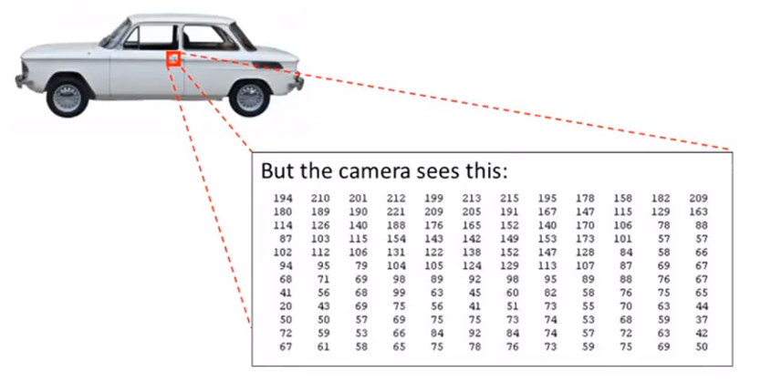

具体而言，当我们用机器学习算法构造一个汽车识别器时，我们要提供一个带标签的样本集，其中一部分是各种各样的汽车，另一部分不是汽车。将这个样本集输入给学习算法，从而训练出一个分类器。

### 8.1.3 非线性假设

为了理解引入非线性假设的必要性，我们从学习算法的训练样本中找出了一些汽车图片与不是汽车的图片。我们从这些图片中选择一组像素位点，并在坐标系中标出这幅汽车图片的位置。之后，我们分别用“+”代表汽车图片，“-”代表非汽车图片，将数据根据两个像素点的像素强度全部标注在坐标系中，我们会发现它们分布在坐标系中的不同区域，因此我们需要一个非线性假设来对这两种样本进行分类。

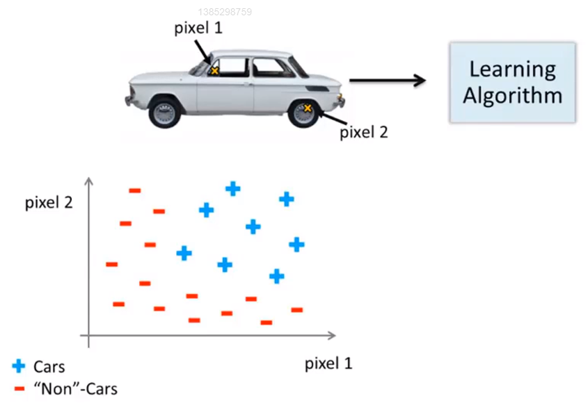

这里，假设我们只使用$50\times50$像素的图片，我们依然会的到2500个像素点。因此特征向量的元素数量为2500，特征向量$x$就是包含了所有像素强度（灰度图片为0-255）的列表,$n=2500$。如果使用RGB(red,green,blue)彩色图片，那么$n=7500$。因此，如果我们要通过包含所有的二次项特征来学习的到非线性假设，那么我们就需要300万个特征，成本太高。

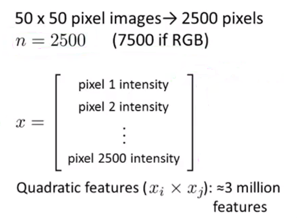

只是包括平项或者立方项特征，简单的逻辑回归算法并不是一个在$n$很大时学习复杂的非线性假设的好办法，因为特征过多。**神经网络(neural networks)在学习非线性假设上呗证明是一种很好得算法，即使输入特征空间或$n$很大也能轻松搞定**。

## 8.2 神经元与大脑

### 8.2.1 神经网络的历史与背景

神经网络是一种很古老的算法，**它最初产生的目的是制造能模拟大脑的机器**。神经网络逐渐兴起于二十世纪八九十年代，应用得非常广泛。但由于各种原因，在90年代的后期应用减少了。最近，神经网络又东山再起了。其中一个原因是：神经网络算法需要更强的算力。大概是由于近些年计算机的运行速度变快，才足以真正运行起大规模的神经网络。正是由于这个原因，如今的神经网络对于许多应用来说是最先进的技术。

人类要想通过机器去模仿大脑的工作原理，我们得写很多不同的软件来模拟所有复杂事情。但其实，大脑处理的方法，只需"一个"单一的学习算法就可以了。

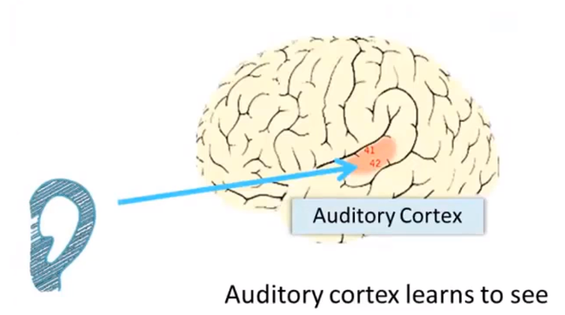

大脑的这一部分的这一小片红色区域是我们的听觉皮层，它靠耳朵接收信息。耳朵接收到声音信号，并把声音信号传递给你的听觉皮层，正因如此，我们才能听懂别人说的话。

神经系统科学家做了下面这个有趣的实验，把耳朵到听觉皮层的神经切断。在这种情况下，将其重新接到一个动物的大脑上，这样从眼睛得到的视神经的信号最终将传到听觉皮层。如果这样做了。那么结果表明听觉皮层将会学会“看”。这里的“看”代表生物学上的意义。所以，如果你对动物这样做，那么动物就可以完成视觉辨别任务，它们可以看图像，并根据图像做出适当的决定。它们正是通过脑组织中的这个部分完成的。

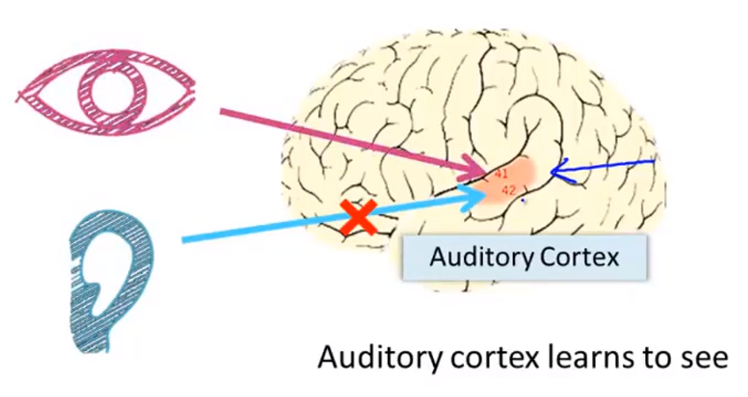

下面再举另一个例子，这块红色的脑组织是你的躯体感觉皮层，这是你用来处理触觉的，如果你做一个和刚才类似的重接实验，那么躯体感觉皮层也能学会“看”。

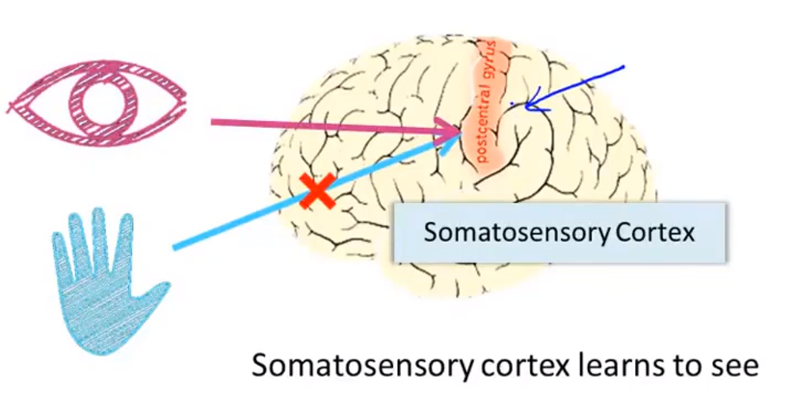

这个实验和其它一些类似的实验，被称为神经重接实验，从这个意义上说，如果人体有同一块脑组织可以处理光、声或触觉信号，那么**也许存在一种学习算法，可以同时处理视觉、听觉和触觉，而不是需要运行上千个不同的程序，或者上千个不同的算法来做这些大脑所完成的成千上万的事情**。也许我们需要做的就是找出一些近似的或实际的大脑学习算法，然后实现它，让大脑自己学习如何处理这些不同类型的数据。人类的大脑是如此的神奇以至于我们可以把几乎任何一种传感器接入到大脑的几乎任何一个部位，之后，大脑就会学习如何去处理它。

### 8.2.2 一些例子

下面再举几个例子：

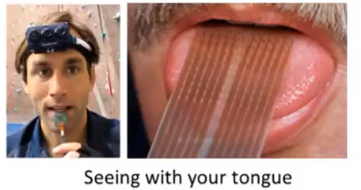

这张图是用舌头学会“看”的一个例子。它的原理是：这实际上是一个名为**BrainPort**的系统，它现在正在**FDA** (美国食品和药物管理局)的临床试验阶段，它能帮助失明人士看见事物。它的原理是，你在前额上带一个灰度摄像头，面朝前，它就能获取你面前事物的低分辨率的灰度图像。我们将一根线连接在舌头上安装的电极阵列上，那么每个像素都被映射到你舌头的某个位置上，可能电压值高的点对应一个暗像素，电压值低的点对应于亮像素。使用这种系统就能让你我在几十分钟里就学会用我们的舌头“看”东西。

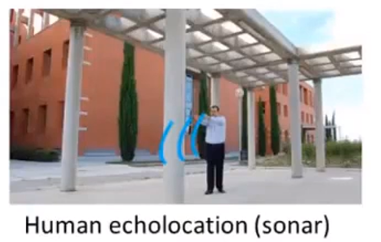

这是第二个例子，关于人体回声定位或者说人体声纳。我们有两种方法可以实现：你可以弹响指，或者咂舌头。不过现在有失明人士，确实在学校里接受这样的培训，并学会解读从环境反弹回来的声波模式—这就是声纳。如果你搜索**YouTube**之后，就会发现有些视频讲述了一个令人称奇的孩子，他因为癌症眼球惨遭移除，虽然失去了眼球，但是通过打响指，他可以四处走动而不撞到任何东西，他能滑滑板，他可以将篮球投入篮框中。

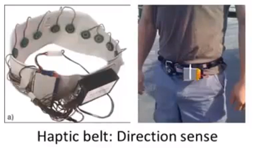

第三个例子是触觉皮带，如果你把它戴在腰上，打开蜂鸣器，朝向北的那个就会发出嗡嗡声。它可以使人拥有方向感，用类似于鸟类感知方向的方式。

还有一些离奇的例子：

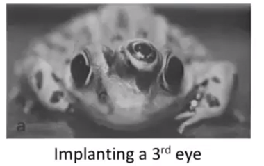

如果你在青蛙身上插入第三只眼，青蛙也能学会使用那只眼睛。

因此，这非常令人惊奇，你能把几乎任何传感器接入到大脑中，大脑的学习算法就能找出学习数据的方法，并处理这些数据。从某种意义上来说，如果我们能找出大脑的学习算法，然后在计算机上执行大脑学习算法或与之相似的算法，也许这将是我们向人工智能迈进做出的最好的尝试。

## 8.3 模型表示1

### 8.3.1 神经元在大脑中的样子

在大脑的中的神经元里，我们需要注意三点：

+ 神经元有像这样的细胞体。
+ 神经元有很多输入通道，叫做**树突(dendrite)**，可以把他们想象成输入电线，他们来接收其他神经元的信息。
+ 三神经元有一条输出通道，叫**轴突(axon)**，用来给其他神经元传递信号。

**总而言之，神经元是一个计算单元，他从输入通道接收一定数目的信息，并做一些计算，然后将结果通过它的轴突传送到其他节点**。

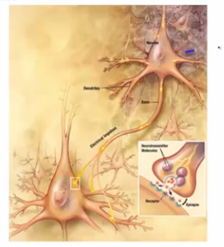

### 8.3.2 单个神经元在神经网络中的样子

在一个神经网络中，我们将使用一个很简单的模型，来模拟神经元的工作。我们将神经元模拟成一个逻辑单元。

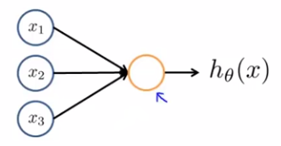

上图中的黄色圆圈代表类似于神经元细胞体的东西。我们通过输入通道传递给它一些信息，然后神经元做一些计算，并通过输出通道输出计算结果。

通常我们神将网络的输入节点只有$x_1,x_2,x_3$，但有必要的时候会加入一个额外的节点$x_0$，它有时候也被称作**偏置单元(bias unit)**或**偏置神经元(bias neuron)**。$x_0$**总是等于1**。

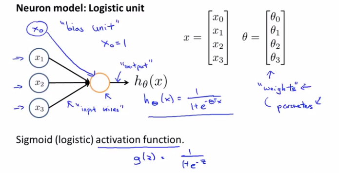

最后，我们还要讨论一下神经网络中一些术语的问题。我们可以说上图是一个带有sigmoid或logistic**激活函数(activation function)**的人工神经单元。所以在神经网中，激活函数是指非线性函数$g(z)=\frac{1}{1+e^{-\theta^Tx}}$的另一个术语。同时，在一些神经网络的相关文献中，我们也会把参数$\Theta$称为模型的**权重(weights)**。

### 8.3.3 多个神经元在神经网络中的样子

上一节我们介绍了单个神经单元，但神经网络其实是一组神经元连接在一起的集合。

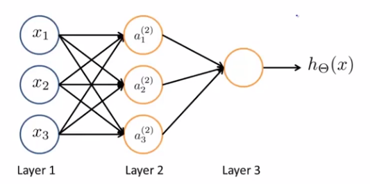

其中$x_1,x_2,x_3$是**输入单元（input units）**，我们将原始数据输入给它们。$a_1,a_2,a_3$是中间单元，它们负责将数据进行处理，然后呈递到下一层。 最后是输出单元，它负责计算$h_\theta(x)$。

神经网络模型是许多逻辑单元按照不同层级组织起来的网络，每一层的输出变量都是下一层的输入变量。下图为一个3层的神经网络，第一层成为**输入层（Input Layer）**，最后一层称为**输出层（Output Layer）**，中间一层成为**隐藏层（Hidden Layers）**。我们为每一层都增加一个**偏置单元（bias unit）**：

隐藏层不止局限于一个，实际上非输入层或非输出层的层都是隐藏层。

### 8.3.4 神经网络在做什么

为了解释神经网络具体的计算步骤，还有一些属于需要解释：

+ $a_i^{(j)}=$第j层第i个神经元的激活项。
+ $\Theta^{(j)}=$权重矩阵，它控制从某一层到下一层的映射。

对于上一张图片的计算如下：

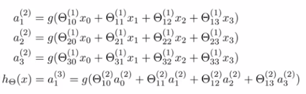

例如第一个隐藏单元$a_1^{(2)}$等于sigmoid激活函数作用在括号内的**线性组合**上的结果。

在上述神经网络中，有3个输入单元，3个隐藏单元，$\Theta^{(1)}$**控制着从3个输入单元到3个隐藏单元的映射的参数矩阵**，所以在这里，$\Theta^{(1)}$是一个$3\times4$的矩阵。更一般的，如果一个神经网络在第$j$层有$s_j$个单元，在$j+1$层有$s_{j+1}$个单元，那么矩阵$\Theta^{(j)}$，即控制第$j$层到第$j+1$层映射的矩阵的维度为$s_{j+1}\times(s_j+1)$。

总结来说，定义一个神经网络，其中定义了函数$h$从输入到输出$y$的映射，这些假设被参数化，将参数记为$\Theta$。改变$\Theta$，就能得到不同的假设。	

## 8.4 模型表示2

### 8.4.1 向量化向前传播(forward propagation)

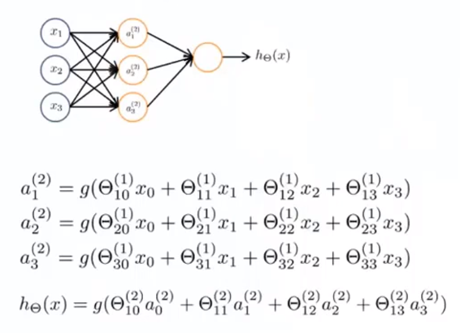

以上图中的神经网络为例，其计算步骤也已给出，通过它们来计算出三个隐藏单元的激活值，然后利用它们计算出最后的假设函数$h_\Theta(x)$。

现在让我们将函数g括号里的多项式定义为$z_i^{(j)}$的形式，例如$a_1^{(2)}=g(z_1^{(2)})$。在这里，上标2表示这些值与第二层相关，即与隐藏层相关。**这些z值都是某个特定的神经元的输入值$x_0,x_1,x_2,x_3$的加权线性组合**。

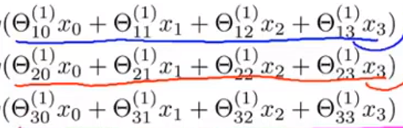

现在，观察上图中的这些数字，我们会发现其对应了矩阵向量乘法$\Theta^{(1)}x$。**根据这一点，我们就能将神经网络的计算向量化了**。

具体而言，让我们做出以下定义：

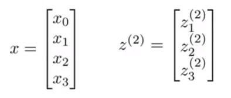

接着，我们向量化$a_1^{(2)},a_2^{(2)},a_3^{(2)}$的计算：

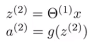

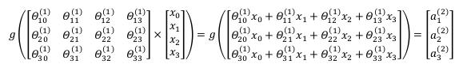

目前，我们使用向量化方法可以计算出$a_1^{(2)},a_2^{(2)},a_3^{(2)}$，还剩下隐藏层的偏置单元$a_0^{(2)}$没有计算：

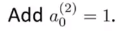

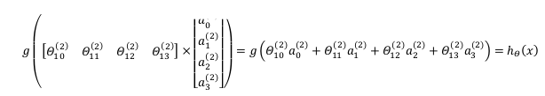

最后，我们需要对假设函数的输出值的计算向量化：

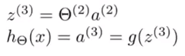

这个计算$h_\Theta(x)$的过程也称为前向传播。这样命名是因为我们从输入单元的激活项开始，然后向前传播给隐藏层并计算隐藏层的激活项，然后我们继续向前传播，并计算出输出层的激活项。

### 8.4.2 更好地理解神经网络

通过这种向前传播算法，我们也能更好地理解神经网络的作用以及为什么它能够学习非线性假设函数。

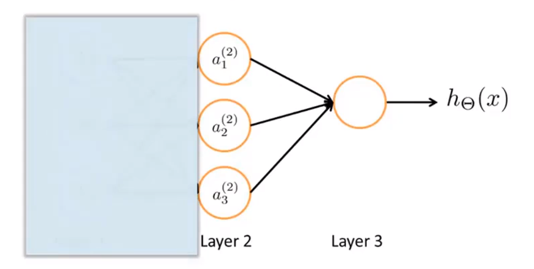

**让我们先把这个网络左侧的部分遮住，只观察右侧的部分，我们会发这很像一个逻辑回归**。也就是用输出层的节点（一个逻辑回归单元），来预测$h(x)$的值，即$h(x)=g(\Theta_0a_0+\Theta_1a_1+\Theta_2a_2+\Theta_3a_3)$，其中$a_1,a_2,a_3$的值由隐藏层的三个单元计算得出。

总结来说，这个神经网络的作用就像逻辑回归，但它不是用原本的$x_1,x_2,x_3$作为特征，而是用$a_1,a_2,a_3$作为新的特征。我们可以把$a_0,a_1,a_2,a_3$看成更为高级的特征值，也就是$x_0,x_1,x_2,x_3$的进化体，并且它们是由$x$与$\Theta$决定的，因为是梯度下降的，所以$a$是变化的，并且变得越来越厉害，所以这些更高级的特征值远比仅仅将$x$次方厉害，也能更好的预测新数据。 **这就是神经网络相比于逻辑回归和线性回归的优势**。

### 8.4.3 其他神经网络的架构(architectures)

神经网络中神经元的链接方式称为神经网络的架构。

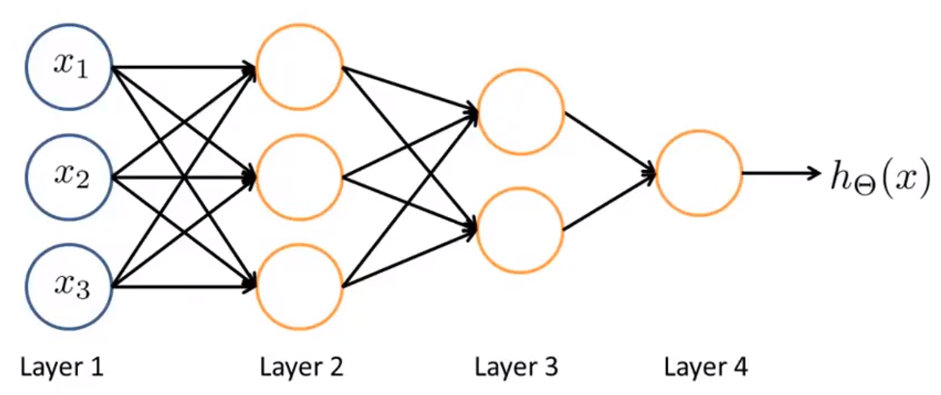

如上图中的神经网络，其包含了两个隐藏层，那么他就可以训练得到更复杂的参数$\Theta$，进而得到更好的非线性假设函数。

## 8.5 例子和直观理解1

从本质上讲，神经网络能够通过学习得出其自身的一系列特征。在普通的逻辑回归中，我们被限制为使用数据中的原始特征$x_1,x_2,...,x_n$，我们虽然可以使用一些二项式项来组合这些特征，但是我们仍然受到这些原始特征的限制。在神经网络中，原始特征只是输入层，在我们上面三层的神经网络例子中，第三层也就是输出层做出的预测利用的是第二层的特征，而非输入层中的原始特征，我们可以认为第二层中的特征是神经网络通过学习后自己得出的一系列用于预测输出变量的新特征。

### 8.5.1 非线性分类的例子

假设我们有两个输入特征$x_1,x_2$，它们都是二进制的，只能取0或1。

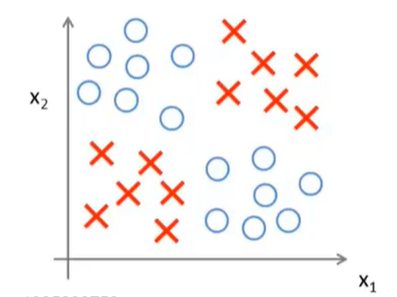

我们用查号表示正样本，用圆圈表示负样本。我们想做的事学习一个非线性判断边界来区分正负样本。如何用神经网络来解决真个问题呢？接下来，我们将这个例子简化：

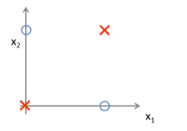

具体来说，我们需要计算目标函数(这里使用XNOR)：

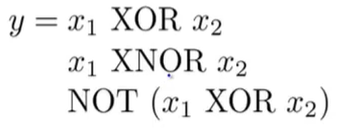

Tips：

+ XOR：异或，如果a、b两个值不相同，则异或结果为1。如果a、b两个值相同，异或结果为0。
+ XNOR：同或，如果a、b两个值不相同，则同或结果为0。如果a、b两个值相同，同或结果为1。

### 8.5.2 拟合AND运算的神经网络

假设有两个二进制输入$x_1,x_2$，目标函数为$y=x_1ANDx_2$。现在要想用只含有一个神经单元的神经网络来实现AND运算，我们需要对网络中的权重进行赋值，如下图所示。

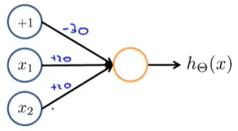

这就意味着假设模型为$h(x)=g(-30+20x_1+20x_2)$。接下来让我们看一下这个已经被赋有参数的神经网络是如何工作的。让我们我们所使用的sigmoid激活函数的图像：

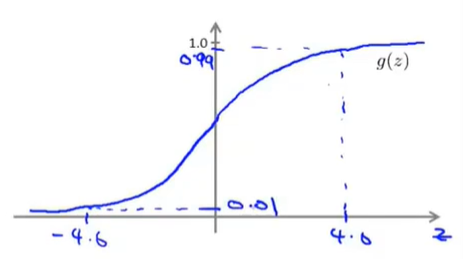

根据函数图像，我们尝试$x_1,x_2$对应的4中输入组合，并画出真值表：

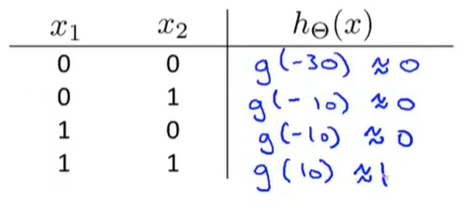

通过观察真值表的结果，我们可以得到$h_\Theta(x) \approx x_1ANDx_2$。

### 8.5.3 拟合OR运算的神经网络

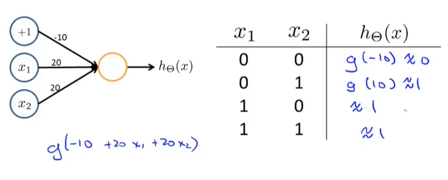

OR与AND整体一样，只是参数的取值不同。

## 8.6 例子和直观理解2

### 8.6.1 拟合NOT运算的神经网络

这里的神经网络只有一个输入特征$x_1$和一个偏置单元。参数的设置以及真值表如下图所示：

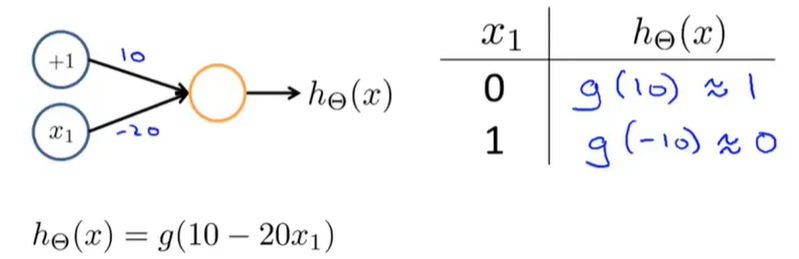

**总结来说，若想要实现逻辑非运算，就要在于其得到非结果的变量前放一个很大的负权重**。

### 8.6.2 拟合XNOT运算的神经网络

现在，我们要把前三块独立的神经网络组合起来，用来计算$x_1XNORx_2$。

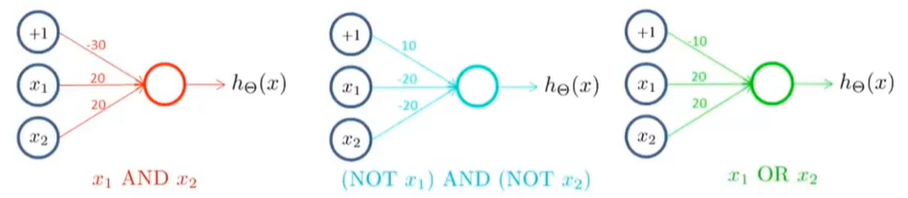

这里我们再回顾一下上一节中留下的问题：我们想要得到的可以计算XNOT的神经网络的简化图如下。很显然，我们需要一个非线性决策边界来区分正负样本：

让我们画出组合后的神经网络与真值表：

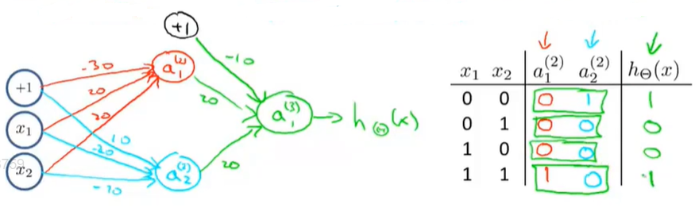

因此，这个神经网络有一个输入层，一个隐藏层和一个输出层，最后得到一个非线性的决策边界，用以计算XNOR函数。

### 8.6.3 用多层神经网络进行手写体识别

视频可在吴恩达及机器学习[课时70](<https://study.163.com/course/courseLearn.htm?courseId=1004570029#/learn/video?lessonId=1051730025&courseId=1004570029>)中观看。

## 8.7 多元分类

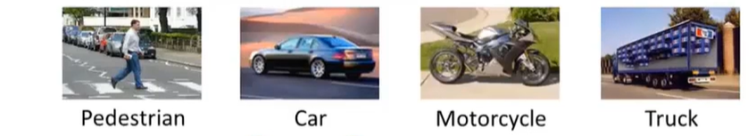

**要在神经网络中实现多类别分类，采用的方法本质上是一对多法(one-versus-all)的拓展**。

假设有一个计算机视觉的例子，出了气吃意外，我们还要识别其他三类对象。这样的话，我们就要建立一个有四个输出单元的神经网络，那么神将网络的输出$h_\Theta(x)$将是一个包含4个数字的向量。那么，我们将会用第一个输出单元来判断图像是否是一个行人，用第二个输出单元来判断图像是否是一辆车，用第三个输出单元来判断图像是否是一辆摩托车，用第四个输出单元来判断图像是否是一辆卡车。

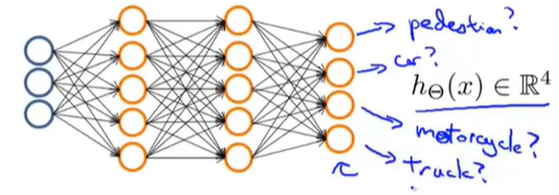

神将网络的可能输出与对应结果如下：

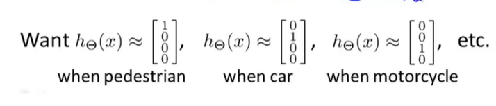

我们对这种设定下的训练集的表示方法如下：

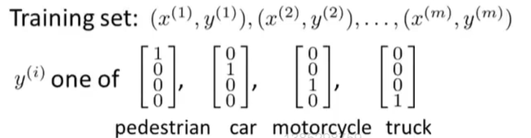

与之前$y$只代表一个数字不同，这里的$y$是一个向量，$x$是图片。在这里，我们希望找到一种方法，让神经网络输出一些数值，让$h_\Theta(x)\approx y^{(i)}$。