>搜索微信公众号:‘AI-ming3526’或者’计算机视觉这件小事’ 获取更多人工智能、机器学习干货

>csdn：https://blog.csdn.net/qq_36645271

>github：https://github.com/aimi-cn/AILearners# 第六章 逻辑回归
***
## 6.1 分类问题

### 6.1.1 分类的例子

在分类问题中，我们要预测的变量$y$是离散的值，并尝试预测的是结果是否属于某一个类（例如正确或错误）例如：

+ 电子邮件：垃圾邮件/不是垃圾邮件。
+ 网上转账：诈骗/不是诈骗。
+ 肿瘤：恶性/良性。

### 6.1.2 二元分类

我们将**因变量(dependent variable)**可能属于的两个类分别称为**负类（negative class）**和**正类（positive class）**。因变量$y\in \{0,1\}$ ，其中 0 表示负类，如良性肿瘤；1 表示正类，如恶性肿瘤。**注意，这里$y$只能取0和1这两个值**。

在两个类别中，到底哪个是正类，哪个是负类，即哪个是0，哪个是1是任意的。但是人们往往约定负类表示没有哪样东西，正类表示具有我们要寻找的东西。例如上面，良性肿瘤表示我们“没有”肿瘤，所以是负类，即1；恶性肿瘤表示我们“有”肿瘤，所以是正类，即0。

在肿瘤预测问题中，我们可以用线性函数来做分类，如下图所示。

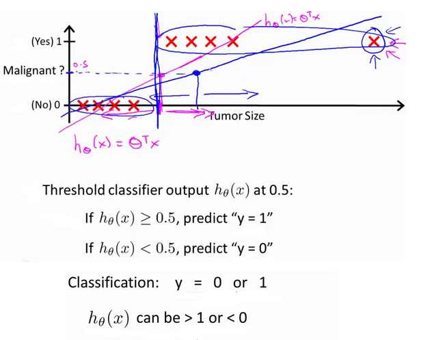

对于线性回归，我们可以设置分类器阈值为0.5。如果假设函数输出的值大于0.5，可以预测为$y=1$；如果小于0.5，可以预测$y=0$。对于初始的八个数据点来说，分类效果还可以，但是如果加入上图中右上角的第九个数据点，线性回归对分类问题的就不是那么好了。

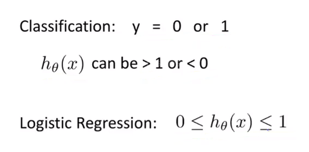

并且假设函数的输出值可能远大于1或者远小于0，所以把线性回归应用于分类问题中通常不是一个好主意。因此在这里我们提出**逻辑回归(logistic regression)**，其特点在于算法的输出或者说是预测值一直介于0到1之间，并不会大于1或小于0。虽然算法名称中有“回归”二字，但它是一种分类算法。

## 6.2 假设表示

### 6.2.1 逻辑回归模型

+ 目标：$0\leq h_\theta(x) \leq1$
+ 假设函数：$h_\theta(x)=\theta^Tx$
+ sigmoid/logistic 函数：$g(z)=\frac{1}{1+e^{-z}}$
+ 两式联立：$h_\theta(x)=\frac{1}{1+e^{-\theta^Tx}}$

在和是哪个数公式中，sigmoid函数和logistic函数其实是一种函数的不同名称，其函数图像如下：

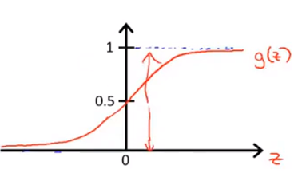

因为$g(z)$的值在0和1之间，那么$h(x)$的值一定在0和1之间。有了假设函数之后，我们就要用参数$\theta$拟合我们的数据。

### 6.2.2 模型的解释

我们的假设$x$的输出$h_\theta(x)$输出了某个数字，我们会把这个数字当做对一个输入$x$，$y=1$的概率估计，下面是一个例子：

假设现在有一个病人，我们把他的肿瘤大小数据“喂”给我们的假设函数。假设我们的假设函数的输出是0.7，那么对于一个特征为$x$的患者，$y=1$的概率是0.7。换句话说，我们将要告诉病人，这个肿瘤有70%的可能是恶性肿瘤。正式表达为$h_\theta(x)=P(y=1|x;\theta)$，即在给定$x$的条件下$y=1$的概率。

由于这是一个分类任务，$y$的取值必须是0或1，因此根据$h_\theta(x)$我们也能计算$y=0$的概率，因为：

+ $P(y=0|x;\theta)+P(y=1|x;\theta)=1$
+ $P(y=0|x;\theta)=1-P(y=1|x;\theta)$

## 6.3 判定边界

### 6.3.1 进一步理解逻辑回归

在上述公式中，假设函数$h_\theta(x)$输出的是给定$x$和参数$\theta$时，$y=1$的估值概率假设：

+ 当$h_\theta(x)\geq0.5$时($\theta^Tx\geq0$)，预测$y=1$。
+ 当$h_\theta(x)<0.5$时($\theta^Tx<0$)，预测$y=0$。

结合上面公式与函数图像我们可以看出：

+ 当$z\geq0$时，$g(z)\geq0.5$。
+ 那么，当$\theta^Tx\geq0$时，$h_\theta(x)=g(\theta^Tx)\geq0.5$。
+ 同理，当$z<0$时，$g(z)<0.5$。
+ 那么，当$\theta^Tx<0$时，$h_\theta(x)=g(\theta^Tx)<0.5$。

如果我们要决定预测$y=1$或$y=0$，取决于估值概率是大于0.5还是小于0.5,。相当于若需要预测$y=1$，只需要$\theta^Tx\geq0$；若需要预测$y=0$，只需要$\theta^Tx<0$。

### 6.3.2 决策边界

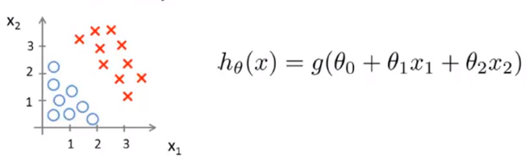

现在假设我们有一个数据集书上图所示，以及假设函数。假设现在参数已经拟合好，$\theta_0,\theta_1,\theta_2$分别为-3,1,1。根据第一小节中的知识我们可以知道，只要满足$\theta^Tx\geq0$，即$-3+x_1+x_2\geq0$，我们的假设函数就会预测$y=1$的可能性更大，即$x_1+x_2\geq3$时，$y=1$。将$x_1+x_2=3$这条直线表示在数据集中，我们可以发现它将数据集分成了两部分。

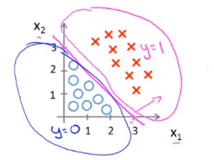

其中$x_1+x_2\geq3$的区域，即右上角的区域为$y=1$的区域，$x_1+x_2<3$的区域，即左下角的区域为$y=0$的区域.我们给这条直线一个名字——**决策边界(decision boundary)**。

**决策边界是假设函数的属性，有参数$\theta$决定，它不是数据集的属性。$\theta$一经决定，决策边界也就被决定**。

### 6.3.3 非线性决策边界

让我们来看一个更加复杂的例子，我们依旧用“叉”表示正样本，用“圈”表示负样本。在这里，逻辑回归可以像多变量线性回归中一样，添加额外的高阶多项式项，如下图所示。现在我们依旧假设参数以拟合好，分别为-1,0,0,1,1。

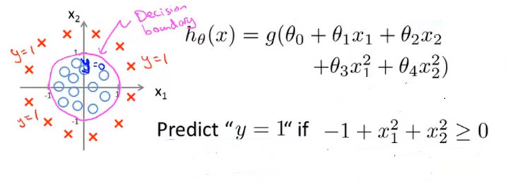

决策边界的选定与线性例子中的相同，只不过这里的决策边界更加复杂，而不是用直线分开正负样本。

## 6.4 代价函数

### 6.4.1 如何拟合逻辑回归中的参数

在这一节中，我们要学习如何拟合逻辑回归模型的参数$\theta$。具体来说，我们要定义用来拟合参数的优化目标或者代价函数。

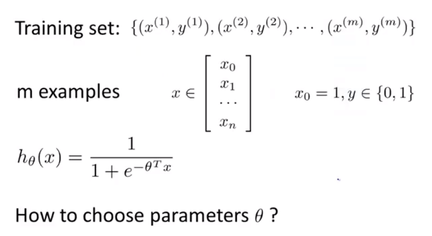

在上述问题中，$x$是一个$n+1$维的向量，$y$只能取0和1。

### 6.4.2 代价函数

我们首先对线性回归中的代价函数做一些改变。这里我们不写原先的$\frac{1}{2m}$，而是把$\frac{1}{2}$放到求和符号里面，然后用$cost(h_\theta(x^{(i)}),y^{(i)}$来表示求和符号里的式子。现在代价函数就能更强出的被表达为$\frac{1}{m}$乘以这个$cost$项在训练集范围上的求和。然后去掉$cost$这个式子中的上标对代价函数进行简化，就可以将这个代价函数理解为它是在输出的预测值是$h(x)$，而实际标签是$y$的情况下我们希望学习算法所付出的代价。

**这个代价函数在线性回归里很好用，但在逻辑回归中，如果我们能最小化$J(\theta)$，那么它也能工作，但实际上它会变成参数$\theta$的非凸函数(non-convex)**。

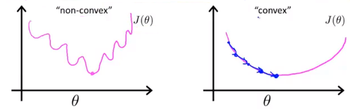

因为逻辑回归中的$h_\theta(x)$是一个复杂的非线性函数，用它计算出来的$J(\theta)$就会是一个非凸函数，其具有许多局部最优解，如上图左边的函数图像所示，使用梯度下降就不能保证收敛到局部最小值，所以这里不能使用这个代价函数。

### 6.4.3 逻辑回归的代价函数

在逻辑回归中，我们定义：

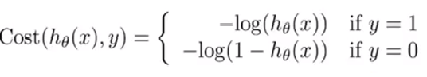

这个代价函数看起来非常复杂，让我们通过图像来直观的对其进行理解。由于$h_\theta（x）$只能取0到1之间的数，所以我们只取[0,1]上的图像。在画代价函数的图像前，让我们先回顾一下对数函数(log(x))的图像。

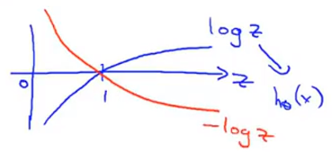

当$y=1$时，如果$h_\theta(x)=1$，也就是说假设函数的预测值是1，那么我们的代价值应该等于0。但是当$h_\theta(x)$趋于0，那么$cost$的值趋于无穷。这相当于你预测一个病人的肿瘤是良性肿瘤($h_\theta(x)=0$),但实际他的肿瘤是恶性肿瘤($y=1$)，那么我们的代价值就会很大，算法将会被“惩罚”。

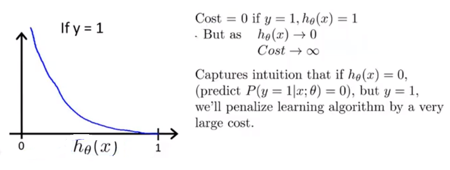

这是$y=1$的情况，同理，让我们看一下$y=0$的情况。让我们先画出-log(1-x)的图像如下：

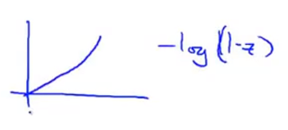

之后我们画出$y=0$时的图像。其图像的特点为在$h_\theta(x)$趋于1时图像激增，也就是说如果最后发现$y=0$，而我们却几乎非常肯定的预测$y=1$的概率是1，那么我们就要付出非常大的代价值。

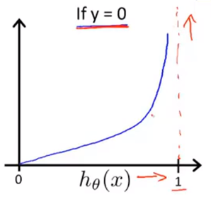

## 6.5 简化的代价函数和梯度下降

### 6.5.1 逻辑回归代价函数

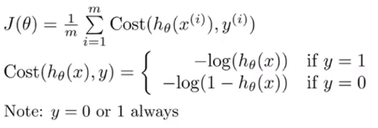

在这里，对于分类问题，在我们的训练集中，甚至不在训练集中的样本，$y$的值总是等于0或1的，这是由$y$的数学定义决定的。因此，我们可以将$cost$的两个式子合并成一个等式，这将使我们更方便的写出代价函数，并推导出梯度下降。具体的，代价函数将写为：
$$
Cost(h_\theta(x),y)=-ylog(h_\theta(x))-(1-y)log(1-h_\theta(x))
$$
在这里，我们都知道$y$只能取0和1。

+ 当$y=1$的时候$Cost(h_\theta(x),y)=-ylog(h_\theta(x))$。与上面$y=1$是等式相同。
+ 当$y=0$的时候$Cost(h_\theta(x),y)=-log(1-h_\theta(x))$。与上面$y=$是0等式相同。

通过这种方式定义的代价函数只是把两个式子写成一种更紧凑的形式而不需要区分$y=1$或$y=0$来写。这样逻辑回归的代价函数如下：

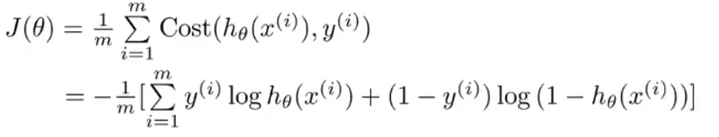

**这个式子是从统计学中的极大似然法(maximum likelihood)得来的，它是统计学中为不同模型快速寻找参数的方法，同时它还有一种较好的性质——它是凸函数**。

+ 为了拟合参数$\theta$：最小化代价函数$J(\theta)$。
+ 为了根据新的$x$做预测：用拟合得到的$\theta$输出$h_\theta(x)=\frac{1}{1+e^{-\theta^Tx}}$。

另外，我们假设的输出，实际上就是输入为$x$，以$\theta$为参数时$y=1$的概率，即$P(y=1|x;\theta)$。所以接下来要做的就是弄清楚如何最小化代价函数$J(\theta)$，这样我们才能拟合出参数$\theta$。

### 6.5.2 梯度下降

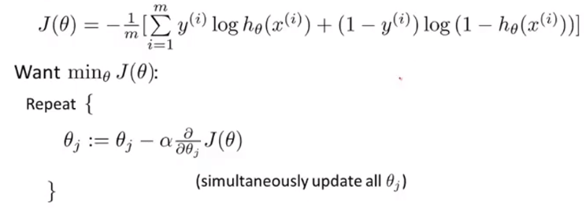

如果要最小化这个关于$\theta$的函数，我们要反复更新每个参数，即用它自己减去学习率$\alpha$乘以后面的导数项。我们计算后面的偏导数项如下：
$$
\frac{\partial}{\partial\theta_j}J(\theta)=\frac{1}{m}\sum_{i=1}^{m}(h_\theta(x^{(i)})-y^{(i)})x_j^{(i)}
$$
之后把这个偏导数项放回原来的式子里，我们就可以将梯度下降算法写成如下形式：

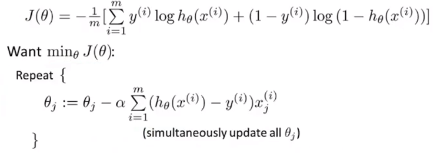

在这里我们会发现逻辑回归的梯度下降的更新规则与线性回归在形式上是相同的，但是他们却不是一个算法。逻辑回归中假设$h_\theta(x)$的定义已经改变，因此，即使参数更新的规则看起来相同，但是**由于假设函数的定义发生了变化，所以二者不同**。

在这里，监控梯度下降过程的方法与之前相似——画出代价函数随迭代步数变化的函数。

## 6.6 高级优化

### 6.6.1 梯度下降

在我们学习高级优化前，让我们换个角度再来看什么是梯度下降。

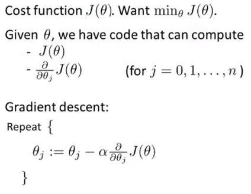

在梯度下降中，我们有代价函数$J(\theta)$，并且我们要使它最小化。那么我们要做的是编写代码，当输入参数$\theta$时，它会计算出两样东西——$J(\theta)$以及$j$从0到n时的偏导数项。假设我们已经完成了这两步，那么梯度下降要做的就是反复执行这些更新，从而更新参数$\theta$。其实我们只需要编写代码来计算导数项，但是如果你希望还能监控代价函数的收敛性，那我们还需要编写代码来计算代价函数和偏导数项。

### 6.6.2 高级优化算法

除了梯度下降以外，还有其他一些优化算法更高级、更复杂，如共轭梯度法(conjugate gradient)，BFGS和L-BFGS。这三种算法有许多有点：

+ 不需要手动选择学习率$\alpha$，在给出计算导数项和代价函数的方法之后，这些算法有一个“只能内循环”，称为线搜索算法(line search algorithm)，它可以自动尝试不同的学习速率$\alpha$并自动选择一个好的学习率$\alpha$。它甚至可以为每次迭代选择不同的学习速率。
+ 收敛速度比梯度下降快。

缺点就是他们比梯度下降复杂。

### 6.6.3 使用优化算法的例子

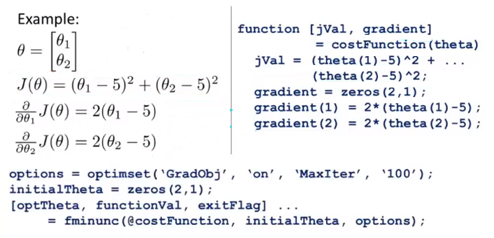

现在我们有一个包含两个参数的问题，通过最小化代价函数，我们可以得到$\theta_1=5$，$\theta_2=5$，同时代价函数分别对两个参数求偏导后的结果也如上图所示。用Octave实现代价函数如图右上所示。这个函数的作用是返回两个自变量，第一个自变量jVal是我们计算的代价函数$J(\theta)$，第二个自变量gradient是一个向量，对应着偏导数项。运行完这个costFunction函数之后就可以调用高级的优化函数fminunc，它在Octave中表示无约束最小化函数(minimization unconstrained)。其调用方式如下：

+ 你要设置几个options，这个 options 变量作为一个数据结构可以存储你想要的options，所以‘GradObj’和‘On’，意思是设置梯度目标参数为打开(on)，这意味着你现在确实要给这个算法提供一个梯度，然后设置最大迭代次数，‘MaxIter’和‘100’表示最大迭代次数为100。
+ 我们给出一个参数$\theta$d的猜测初始值，它是一个2×1的向量。
+ 调用fminunc，这里的‘@’符号表示指向我们刚刚定义的costFunction函数的指针。如果你调用它，它就会使用众多高级优化算法中的一个，当然你也可以把它当成梯度下降，只不过它能自动选择学习速率，你不需要自己来做。然后它会尝试使用这些高级的优化算法，就像加强版的梯度下降法，为你找到最佳的值。

在Octave中运行效果如下：

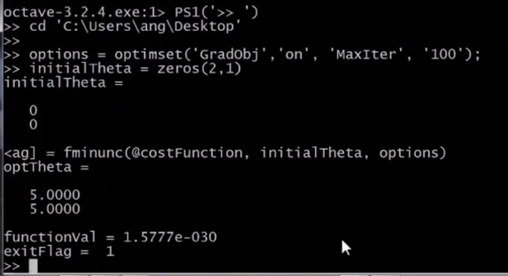

这里的exitFlag=1证明代价函数已经是收敛了的。

### 6.6.4 高级优化在逻辑回归中的应用

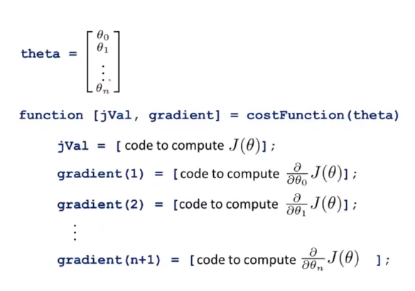

在上图中，我们混合使用了Octave代码与数学公式。这里有$n+1$个参数，**但在Octave中，标号是从1开始的，所以这里的$\theta_0$一般在Octave中写成$theta(1)$**。在这里，首先我们需要写一个costFunction函数，它为逻辑回归求得代价函数。

总结来说，无论是线性回归还是逻辑回归，我们都要

+ 先编写代码来实现他们的代价函数，返回函数值以及梯度。
+ 再滴哦用高级优化函数对其进行最小化直至收敛，得到我们需要的参数。

## 6.7 多类别分类：一对多

### 6.7.1 多类别分类问题

我们用三个例子来了解什么是**多类别分类(multiclass classification)**问题：

+ 假如说你现在需要一个学习算法能自动地将邮件归类到不同的文件夹里，或者说可以自动地加上标签，那么，你也许需要一些不同的文件夹，或者不同的标签来完成这件事，来区分开来自工作的邮件、来自朋友的邮件、来自家人的邮件或者是有关兴趣爱好的邮件，那么，我们就有了这样一个分类问题：其类别有四个，分别用$y=1,y=2,y=3,y=4$来代表。

+ 第二个例子是有关药物诊断的，如果一个病人因为鼻塞来到你的诊所，他可能并没有生病，用$y=1$这个类别来代表；或者患了感冒，用$y=2$来代表；或者得了流感用$y=3$来代表。

+ 第三个例子：如果你正在做有关天气的机器学习分类问题，那么你可能想要区分哪些天是晴天、多云、雨天、或者下雪天。

对上述所有的例子，$y$可以取一个很小的数值，比如1 到3、1到4或者其它数值，以上说的都是多类分类问题，值得注意的是，对于下标是0 1 2 3，还是 1 2 3 4 都不重要，**其实怎样标注都不会影响最后的结果**。

下图是**二元分类(binary classification)**与**多元分类(Multi-class classification)**可视化数据集的对比。在多元分类中，我们用三种符号代表三种不同的类别。

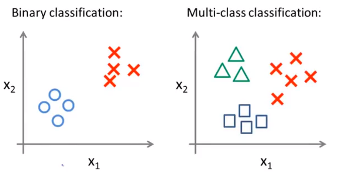

### 6.7.2 一对多

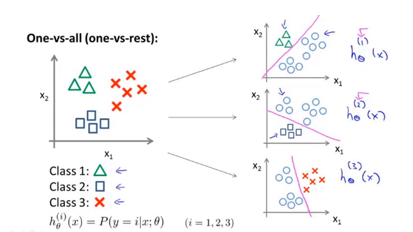

**一对多(one-vs-all)**方法有时也被称为**一对余(one-vs-rest)**方法，**其核心思想是将这个数据集转换为三个独立的二元分类为题**。

是偶先我们将类别1(class 1)设定为正类，将类别2(class 2)和类别3(class 3)设定为负类，则会形成一个新数据集如上图所示。这时，我们要拟合一个分类器$h_\theta^{(1)}(x)$。这里的三角形代表正样本，其值为1，圆圈代表负样本，其值为0，这样我们就能得到一个决策边界。之后我们对类别2和类别3也进行这样的处理。

总而言之，我们拟合出三个分类器，对于$i=1,2,3$，我们拟合分类器$h_\theta^{(i)}(x)$来尝试估计出给定$x$和$\theta$时，$y=i$的概率。我们这三个分类器都针对其中一种情况进行训练。最后为了做出预测，我们给出一个新的输入值$x$，期望获得预测，我们要做的就是分别在这三个分类器中输入$x$，然后选择$h$最大的类别，即选出可信度最高，效果最好的那个分类器。无论$i$是多少，输出的值就是我们要预测的那个值。