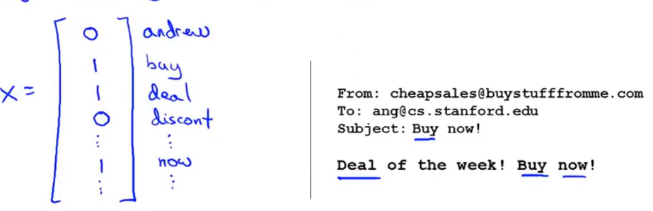
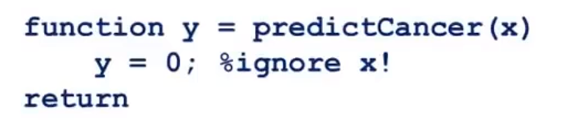
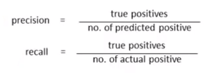
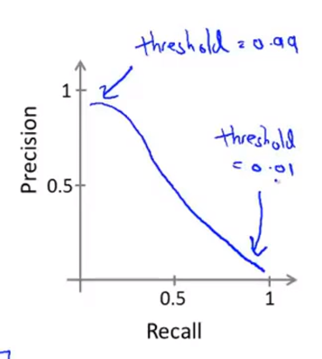
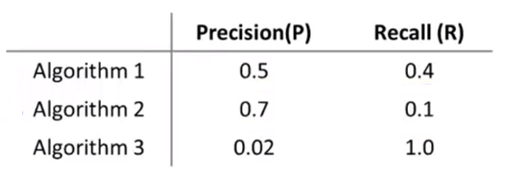
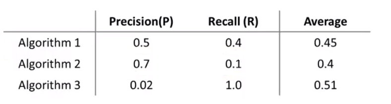
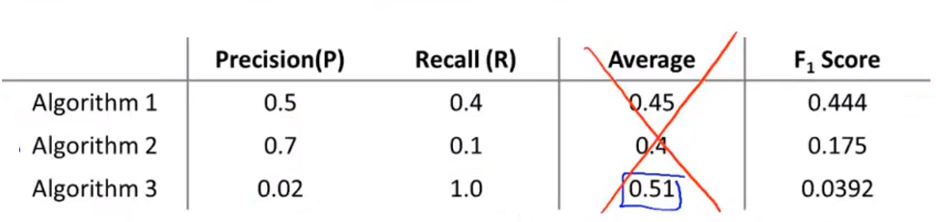
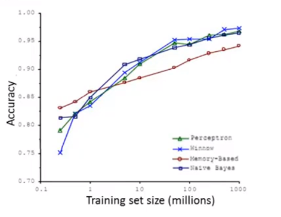

# 第十一章 机器学习系统的设计

## 11.1 确定执行的优先级

### 11.1.1 邮件分类的例子

我们以一个垃圾邮件分类器算法为例进行讨论。为了应用监督学习，我们首先要做的决定是如何选择并表达特征向量$x$。通过向量特征$x$和分类标签$y$，我们就能训练一个分类器。我们可以选择一个由100个最常出现在垃圾邮件中的词所构成的列表，根据这些词是否有在邮件中出现，来获得我们的特征向量（出现为1，不出现为0），维度为100。

比如说，如果一封邮件的片段包含单词deal,buy,discount，它可能是一封垃圾邮件，如果包含andrew,now,可能不是垃圾邮件。我们可以找到100个这样的单词。

现在，我们将一封邮件中的所有句子拆分成单词并排序，编码成一个特征向量。我们将第一一个特征向量$x$，如果邮件中出现词表中的单词，对应特征为1，若没有出现，对应为0。

这样我们就可以用特征向量来表示这封文件。虽然我们只选择了100个单词来举例，但在实际中，我们会从训练集中挑出出现频率最多的n个单词，n一般介于10000到50000之间。

### 11.1.2 制作一个垃圾邮件分类器

假设我们正在制作一个垃圾邮件分类器，我们可以参考一下方法来降低错误率：

+ 收集更多的数据

+ 基于邮件的路由信息使用更复杂的特征变量来描述邮件。
+ 关注邮件正文，并构建更复杂的特征。比如单词discount和discounts是否应该被视为同一个词、大小写问题，标点符号的使用等。
+ 设计一些更加复杂的算法，来检测单词中故意出现的拼写错误，例如m0rtgage,med1cine,w4tches等。

## 11.2 误差分析

### 11.2.1 推荐方法

当我们准备从事研发机器学习产品或者开发机器学习应用时，通常来说，构建一个学习算法的推荐方法为：

+ 通过一个简单的算法来快速的实现它，然后通过交叉验证来测试数据
+ 然后画出相应的学习曲线以及检验误差，来找出你的算法是否存在高偏差或高方差的问题，之后再来决定是否使用更多的数据或特征等。
+ **误差分析(error analysis)**：例如在实现一个垃圾邮件分类器的时候，要观察交叉验证集的情况，看一下被算法错误分类的文件。通过查看这些被错误分类的文件，可以找出其蕴含的规律，这样就会启发你如何去设计新的特征，并指导你改进算法。

### 11.2.2 误差分析

假设我们的邮件分类系统中有500个交叉验证集，我们的算法错误分类了100个。这时我们就应该手动检查这100个数据并基于以下情况对其分类：

+ 这是哪种类型的邮件，例如卖假药的邮件，卖假货的邮件，钓鱼邮件，其他类型的邮件。
+ 观察有什么线索或是额外特征能够帮助算法识别这种邮件。

通过手工检查，确定哪种类型的邮件被错误分类的最多，那么就要对症下药，更改算法。因此，**误差分析(error analysis)**是一种手动的去检查算法出现的错误的过程，通过这种方法，我们可以更高效的实现算法。

**总的来说，通过一个简单粗暴的算法实现，你可以很快找到算法的不足所在和难以处理的样本类型，然后把经精力中在它们身上**。

### 11.2.3 数值估计(numerical evaluation)的重要性

当你改进学习算法时，如果我们的算法能够返回一个数值评价指标来估计算法执行的效果，将会很有帮助。结果可能有对有错，但数字可以告诉我们学习算法的效果有多好。

例如当我们在做邮件分类使，是否要将discount,discounts,discounted,discounting作为一个词。这时我们就需要用到词干提取工具，这个工具会专注于单词的前几个字母，如discou，并把带有这几个字母的单词当成一个单词来处理。但词干提取工具是一把双刃剑，例如它会把universe和university当成一个词。

这时，我们可以通过数值估计的方法来判断进行词干提取到底是不是一个好主意。最简单的，我们可以通过交叉验证，在使用和不使用词干提取时各自的错误率来估计算法的效果。对于这个特定的问题，这个单一规则的数值评价指标就叫做交叉验证错误率。

通过一个单一规则的数值评价指标，你可以观察误差率是变大了还是变小了，你可以通过它更快的实践新的想法，它能直接告诉你你的想法能提高还是降低学习算法的表现。推荐在交叉验证集上来做误差分析而不是在测试集上。

## 11.3 类偏斜的误差度量

### 11.3.1 癌症分类的例子

跟之前一样，我们假设$y=1$表示患者患有癌症，$y=0$表示他们没有癌症。假设我们用测试集检验了训练的逻辑回归模型，并且发现它只有1%的错误，因此我们99%会做出正确诊断。

这看起来跟不错，但是，假如我们发现在测试集中只有0.5%的患者真正得了癌症，因此，在我们的筛选程序里，只有0.5%的患者患了癌症。因此，在这个例子中1%的错误率就显得没有那么好了。举一个具体的例子：

上述代码不是机器学习代码，它忽略了输入值$x$，并且总让$y=0$，因此它总是预测每人得癌症。那么这个算法实际上只有0.5%的错误率，这甚至比我们之前用机器学习算法得到的1%的错误率更好。上述情况发生在正样本的数量与负样本的数量相比非常非常少的情况下，我们把这种情况叫做**偏斜类(skewed classes)**。

因此使用分类误差或者分类精确度来作为评估度量可能会产生如下问题：假如我们有一个算法，它的精度是99.2%(0.8%的误差)。当我们对算法做出了一些改动，使它的精确度上涨为99.5%(0.5%的误差)，那么这到底算不算是对算法的提升呢？

用某个数作为评估度量值的好处就是它可以帮助我们迅速决定我们是否需要对算法做出一些改进。当我们的精确度从99.2%到99.5%时到底是提高了算法的准确度还是说我们只是把代码替换成了例如总是预测$y=0$。

**因此，如果你有一个偏斜类，用分类精确度并不能很好地衡量算法**。当我们遇到偏斜类时，我们希望有一个不同的误差度量值。

### 11.3.2 查准率(precision)/召回率(recall)

假设我们正在使用测试集来评估一个分类模型，对于测试集中的样本，每个测试集中的样本都会等于0或1。我们的分类算法要做的是做出值的预测，并且学习算法会为每一个测试集中的实例做出预测，预测值也等于0或1。

+ 如果有一个样本它实际所属的类是1，预测的类也是1，那么我们把这个样本叫做**正确肯定/真阳性(true positive)**。
+ 如果有一个样本它实际所属的类是0，预测的类也是0，那么我们把这个样本叫做**错误否定/真阴性(true negative)**。
+ 如果有一个样本它实际所属的类是0，预测的类是1，那么我们把这个样本叫做**错误肯定/假阳性(false positive)**。
+ 如果有一个样本它实际所属的类是0，预测的类也是0，那么我们把这个样本叫做**正确否定/假阴性(false negative)**。

|            |              | 预测值       |             |
| :--------- | :----------- | :----------- | ----------- |
|            |              | **Positive** | **Negtive** |
| **实际值** | **Positive** | **TP**       | **FN**      |
|            | **Negtive**  | **FP**       | **TN**      |

这样我们就有了一个另一种方式来评估算法的表现。我们要计算两个数字，查准率和召回率：

+ **查准率(precision)**：对于我们所有的预测，在预测的患有癌症的病人中，有多大比率的病人是真正患有癌症的。查准率越高越好。

$$
\frac{True\space positive}{predicted\space positive}=\frac{True\space positive}{True\space positive+false\space positive}
$$

+ **召回率(recall)**：如果所有的病人确实患有癌症，有多大比率我们正确预测他们得了癌症。召回率越高越好。

$$
\frac{True\space positive}{actual\space positive}=\frac{True\space positive}{True\space positive+false\space negative}
$$

通过引入查准率和召回率，即使我们有非常偏斜的类，算法不能总是通过预测$y=0$或$y=1$来“欺骗”我们，因为他们不能获得高的查准率和召回率。例如算法总是预测$y=0$，即没人有癌症，那么这个分类模型的召回率就为0，因为它不会有真阳性(true positive)。

## 11.4 查准率和召回率的权衡

11.4.1 权衡查准率和召回率

先让我们回顾一下上一节中查准率和召回率的公式：

我们继续用癌症分类的例子。假设我们用逻辑回归训练了数据，输出概率在0-1之间的值。通常我们会做出如下预测：

+ 如果$h_\theta(x)\leq0.5, y=1$。
+ 如果$h_\theta(x)>0.5, y=0$。

但是现在假如我们希望在我们非常确定的情况下才预测一个病人患有癌症，那我们就需要修改算法，将临界值从0.5改为0.7。**如果我们这样做，那我们的模型会有较高的查准率，较低的召回率**。

现在假如我们希望避免遗漏掉患有癌症的病人(避免假阴性)，那我们就需要修改算法，将临界值从0.5改为0.3。**如果我们这样做，那我们的模型会有较低的查准率，较高的召回率**。

其实，一个更加普遍的原则是，阈值的选取取决于你想要什么。因此，总体来说，对于大多数回归模型，我们需要权衡查准率和召回率，当我们改变临界值时，我们可以画出曲线来权衡二者。

### 11.4.2 $F_1$值

现在我们就有一个问题，那就是是否可以自动选择临界值。换句话说，如果我们有不同的算法，我们如何比较不同的查准率和召回率。

现假设我们有3个算法，我们如何决定哪一个算法是最好的：

现在我们有两个数字评估指标，但这并不能帮助我们判断哪一个算法更好，我们需要的是一个数字评估指标。为了得到一个数字评估指标，我们普遍的做法是取平均值：

但这并不是一个很好地解决办法。例如我们之前的例子中总是预测$y=1$，我们会得到非常高的召回率和非常低的查准率。在上述例子中，算法3可能就是这么一种情况，但它的平均值得分比算法1和算法2都高。

因此，提出了F公式：
$$
F_1\space Score=2\frac{PR}{P+R}
$$
根据F公式，我们可以得到：

所以我们认为算法1是最好的。

**F值会考虑一部分查准率和召回率的平均值，但是它会给查准率和召回率中较低的值更高的权重**。

## 11.5 机器学习数据

### 11.5.1 一个小例子

一项研究易混淆词分类的算法中，使用不同学习算法的效果与将使用到不同训练数据集上两者的比较。这项研究中使用了感知机(perceptron)，winnow，基于内存的学习算法(memory-bases)以及朴素贝叶斯(naive bayes)。

这项研究改变了数据集的大小，并尝试将这些学习算法用于不同大小的训练数据集中，并得到了如下效果：

横坐标代表训练集的大小，纵坐标表示精确度。得到的结果相当明显，随着训练以及数据集的增大，许多算法有时倾向于依赖一些细节，并且表现出相当相似的性能，但真正提高性能的是你能够给予一个算法大量的训练数据。

### 11.5.2 大数据基本原理

我们假设在我们的机器学习问题中，特征值$x$包含了足够的信息，这些信息可以帮助我们用来准确地预测$y$，例如，如果我们采用了一些容易混淆的词，如：**two**、**to**、**too**，假如说它能够描述$x$，捕捉到需要填写的空白处周围的词语，那么特征捕捉到之后，我们就希望有对于“早饭我吃了__鸡蛋”，那么这就有大量的信息来告诉我中间我需要填的词是“两个”(**two**)，而不是单词 **to** 或**too**，因此特征捕捉，哪怕是周围词语中的一个词，就能够给我足够的信息来确定出标签 $y$是什么。换句话说，从这三组易混淆的词中，我应该选什么词来填空。

那么让我们来看一看，大量的数据是有帮助的情况。假设特征值有足够的信息来预测$y$值，假设我们使用一种需要大量参数的学习算法，比如有很多特征的逻辑回归或线性回归，或者用带有许多隐藏单元的神经网络，那又是另外一种带有很多参数的学习算法，这些都是非常强大的学习算法，它们有很多参数，这些参数可以拟合非常复杂的函数，因此我要调用这些，我将把这些算法想象成低偏差算法，因为我们能够拟合非常复杂的函数，而且因为我们有非常强大的学习算法，这些学习算法能够拟合非常复杂的函数。很有可能，如果我们用这些数据运行这些算法，这种算法能很好地拟合训练集，因此，训练误差就会很低了。

现在假设我们使用了非常非常大的训练集，在这种情况下，尽管我们希望有很多参数，但是**如果训练集比参数的数量还大，甚至是更多，那么这些算法就不太可能会过度拟合**。

另一种考虑这个问题的角度是为了有一个高性能的学习算法，我们希望它不要有高的偏差和方差。对于偏差问题，我们用具有很多参数的学习算法来保证；对于方差问题，我们用非常大的训练集来保证。将二者结合，我们就会得到一个低方差以及低偏差的学习算法。

总结来说，如果你有大量的数据，而且你训练了一种带有很多参数的学习算法，那么这将会是一个很好的方式，来提供一个高性能的学习算法。

数据选取的关键步骤：

+ 首先，一个人类专家看到了特征值 $x$，能很有信心的预测出$y$值吗？因为这可以证明 $ y$ 可以根据特征值$x$被准确地预测出来。
+ 其次，我们实际上能得到一组庞大的训练集，并且在这个训练集中训练一个有很多参数的学习算法吗？

