# 第十三章 聚类

## 13.1 无监督学习简介

### 13.1.1 监督学习(supervised learning)

以下是一个典型的监督学习问题。我们有一个有标签的训练集，我们的目标是找到能够区分正样本和负样本的决策边界，在这里，**监督学习是指我们有一系列标签，然后用假设函数去拟合它**。

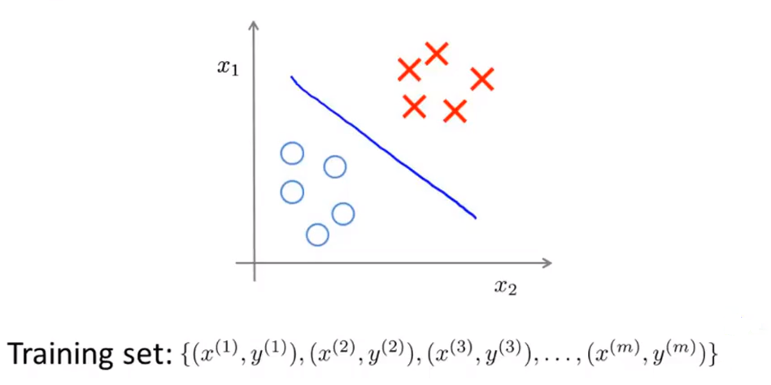

### 13.1.2 无监督学习(unsupervised learning)

与之相反的是，**在无监督学习中，我们的数据并不带有任何标签**。无监学习中要做的是我们要将这系列无标签的数据输入到算法中，然后让算法找到一些隐含在数据中的结构。

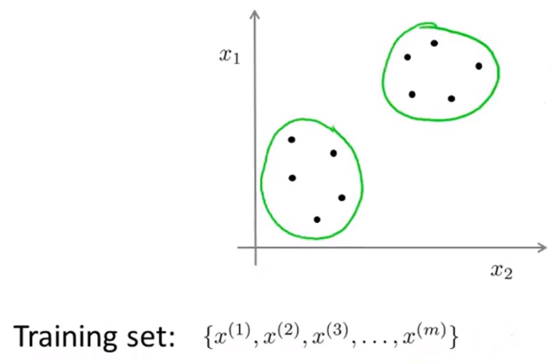

通过图中这些数据，我们能通过算法找到的一个结构就是这个数据集中的点可以分成两组分开的**点集/簇(clusters)**。这种能够找出圈出的这些簇的算法叫做**聚类算法(clustering algorithm)**。

### 13.1.3 聚类算法的应用

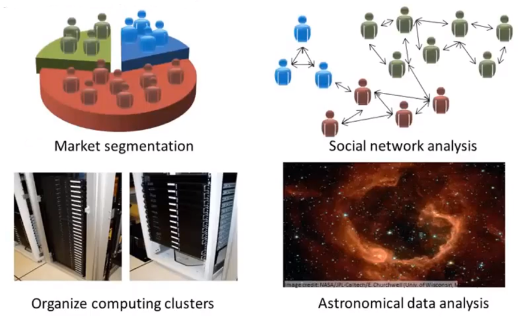

+ 市场分割。也许你在数据库中存储了许多客户的信息，而你希望将他们分成不同的客户群，这样你可以对不同类型的客户分别销售产品或者分别提供更适合的服务。
+ 社交网络分析。事实上有许多研究人员正在研究这样一些内容，他们关注一群人，关注社交网络，例如**Facebook**，**Google+**，或者是其他的一些信息，比如说：你经常跟哪些人联系，而这些人又经常给哪些人发邮件，由此找到关系密切的人群。
+ 组织计算机集群。使用聚类算法来更好的组织计算机集群，或者更好的管理数据中心。
+ 分析天文数据。研究如何利用聚类算法了解星系的形成，然后用这个知识，了解一些天文学上的细节问题。

## 13.2 K-means算法

### 13.2.1 K-means算法的直观理解

K-means算法是一个迭代算法，它会做两件事情，第一是**簇分配(cluster assignment)**，第二个是**移动聚类中心(move centroid)**。

现在假设我们有一个没有标签的数据集，并且我想将它分为两个簇。若我们执行K-means算法，具体操作如下：

+ 首先随机生成两点，叫做聚类中心(cluster centroids)。随机生成两个点的原因是我们想把数据聚成两类。

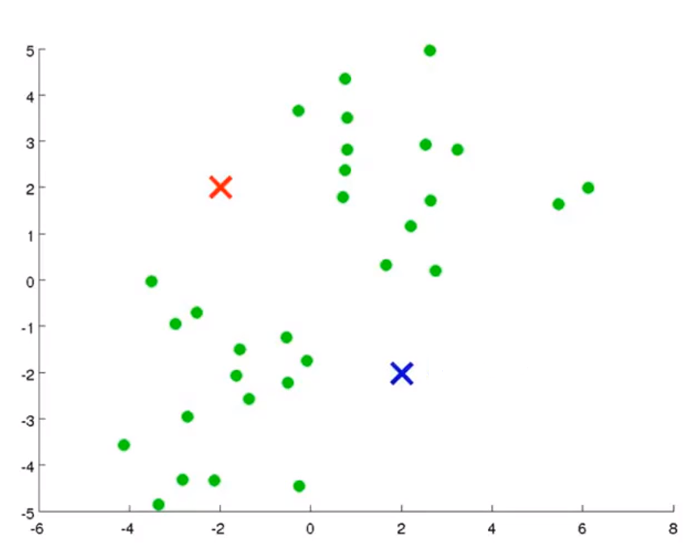

+ 然后进行簇分配。其中，我们要遍历每个样本，然后根据每一个点是与红色聚类中心更近还是与蓝色聚类中心更近来将每个数据点分配给两个聚类中心之一。

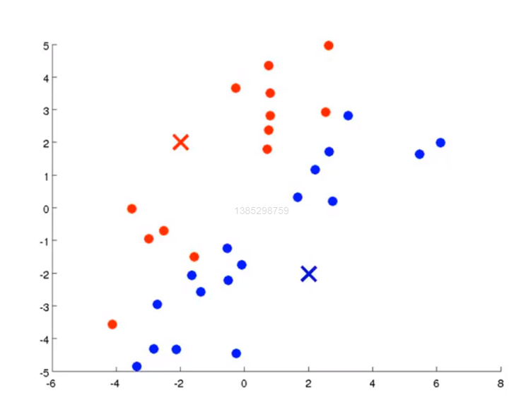

+ 接下来来移动聚类中心。我们要做的是将两个聚类中心移动到同色的点的均值处。具体来说，要找出所有红色的点，然后计算出它们的均值，也就是所有红色点的平均位置，然后把红色的聚类中心移动到这里来，同理，蓝色也相同。

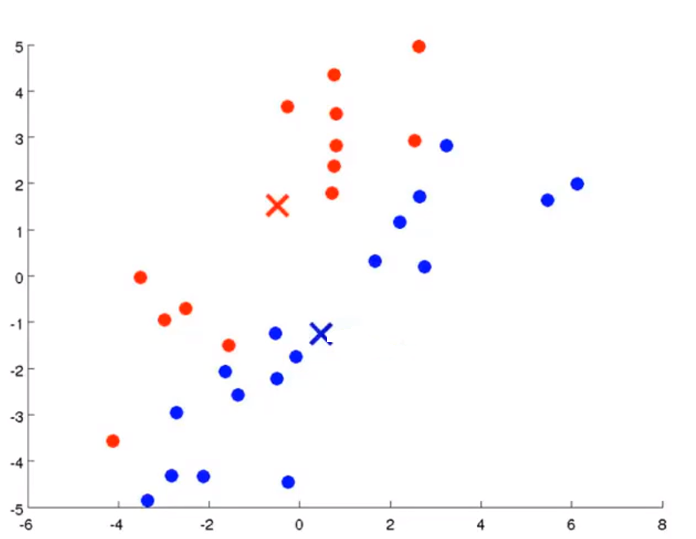

+ 接下来我们进行迭代，继续执行簇分配和移动聚类中心的步骤，直到聚类中心不再改变。此时，我们说K均值已经**聚合(converged)**。

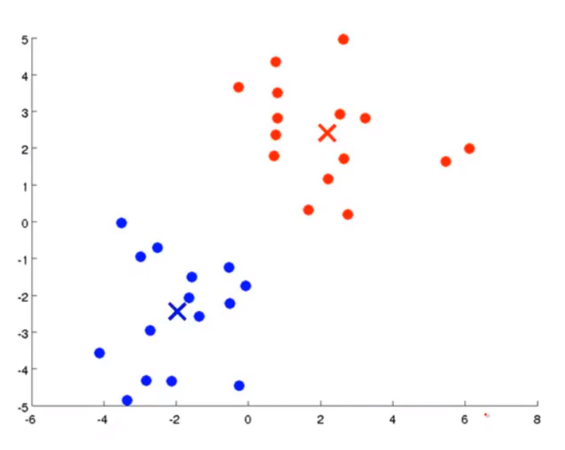

### 13.2.2 K-means算法的规范格式

+ 输入：
  + 参数$K$，表示你想从数据中聚类出的簇的个数。
  + 一系列无标签的数据集{$x^{1},x^{2},...,x^{m}$}。
  + 我们约定$x^{(i)}\in R^n$（舍弃$x_0=1$），所以我们的训练样本是$n$维向量而不是$n+1$维。
+ 随机初始化$K$个聚类中心，我们记做$\mu_1,\mu_2,...\mu_K\in R$。
+ K-means算法内循环：
  + for $i=1$ to $m$：
    + $c^{(i)}$:=第1到第$K$个最接近$x^{(i)}$的聚类中心（簇分配）。
  + for $k=1$ to $K$：
    + $\mu_k$:=这个簇中所有点的均值。假设某一个聚类中心$\mu_2$，包含一些训练样本$x^{(1)},x^{(5)},x^{(6)},x^{(10)}$，即$c^{(1)}=2,c^{(5)}=2,c^{(6)}=2,c^{(10)}=2$。在移动聚类中心的时候，我们要计算出这四个的平均值，即$\mu_2=\frac{1}{4}[x^{(1)}+x^{(5)}+x^{(6)}+x^{(10)}]\in R^n$。
    + 如果存在一个没有点的聚类中心，最常见的方法就是直接移除那个聚类中心，之后最终会得到$K-1$个簇而不是$K$个簇。但有时候我们确实需要$K$个簇，这时可以重新随机初始化这个聚类中心。

### 13.2.3 K-means算法分离不好的簇

实际中，K-means算法也会用于看起来并不能很好地分成几个簇的数据，例如T恤尺寸的例子。我们现在有人的身高和体重的样本数据，然后根据它们确定T恤的尺寸(S,M,L)。

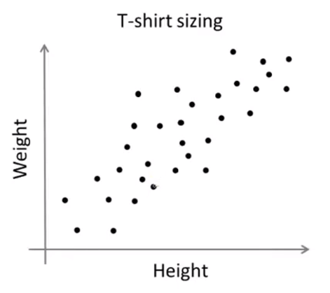

K-means算法可能会将数据点分为下图中的三簇。虽然这些数据不像刚才能够明确分成三簇，但还是能将这些数据分为几个簇。

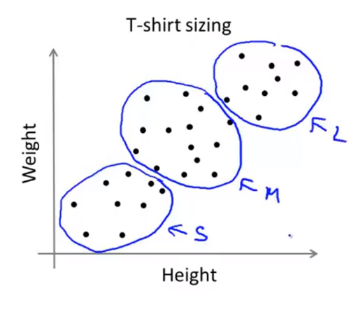

## 13.3 优化目标

### 13.3.1 K-means算法优化目标

当运行K-means算法时，我们将会对两组变量进行跟踪：

+ $c^{(i)}$，它表示的是当前样本$x^{(i)}$所属的那个簇的索引或是序号。
+ $\mu_k$，它表示第$k$个聚类中心的位置。
+ $\mu_c^{(i)}$，它表示$x^{(i)}$所属的那个簇的聚类中心。

例如$x^{(i)}$被划分为第5个簇，那意味着$c^{(i)}$，即$x^{(i)}$的索引等于5，因此，$\mu_c^{(i)}=\mu_5$。

通过这样的表述方法，我们就可以写出K-means聚类算法的优化目标了：

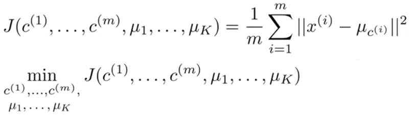

K-means算法最小化的代价函数就是函数$J$，它的参数是$c^{(1)}$到$c^{(m)}$，$\mu_1$到$\mu_k$，这些参数会随算法的运行不断变化。右侧是优化目标，即每个样本$x^{(i)}$到其所属的聚类中心距离的平方值，图像解释如下，其中的红色线段就是距离：

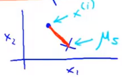

那么K-means算法要做的事情就是找到参数，以最小化代价函数$J$。这个代价函数有时候也叫**失真代价函数(distortion cost function)**。

### 13.3.2 K-means算法的一些细节

在K-means算法的第一步——簇分配中。我们要把每一个点划分给各自所属的聚类中心。我们可以用数学知识证明这个分配步骤——实际上就是在最小化代价函数$J$，即我们要保持最近的聚类中心，也就是$\mu_1$到$\mu_k$的位置固定不变。因此第一步要做的不是改变聚类中心的位置，而是要去选出$c^{(1)},c^{(2)}$到$c^{(m)}$来最小化这个代价函数。

然后是K-means算法的第二步——移动聚类中心。这一步做的是选择$\mu$值，来最小化$J$关于聚类中心的位置$\mu_1$到$\mu_k$。

**其实，K-means算法实际上就是把以上两个系列的变量分成两半然后分别最小化代价函数关于这两组变量，然后保持迭代**。

## 13.4 随机初始化

之前我们讨论了许多K-means算法的细节，但我们没有过多讨论如何初始化聚类中心，**这可以引导我们讨论如何使算法避开局部最优**。有几种不同的方法可以用来随机初始化聚类中心，但事实证明有一种方法比其他大多数方法更好。

### 13.4.1 随机初始化概述

+ 当运行K-means算法时，我们应该把菌类中心数值$K$设置为比训练样本数量$m$小的值。
+ 随机挑选$K$个训练样本。
+ 设定$\mu_1$到$\mu_K$，让它们等于这$K$个样本。

让我们来看一个具体的例子。我们假设$K=2$，为了初始化聚类中心，我们随机挑选2个样本，如下图所示：

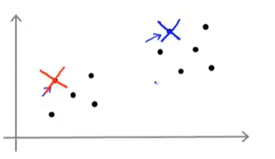

上图的选择非常好，但是有时候事与愿违，我们随机选择的2个样本可能如下图所示。

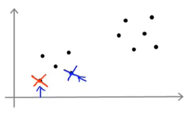

通过上面两张图，我们可能会猜到K-means算法最终可能会收敛得到不同的结果，这取决于聚类的初始化状态。

### 13.4.2 局部优化

具体而言，K-means算法可能会落在局部最优，如果给定以下的数据，这看起来像有3个簇。

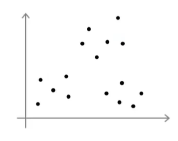

如果我们运行K-means算法时，我们可能会得到全局最优解：

但实际上，随机初始化的结果不一定非常好，就有可能得到不同的局部最优解,：

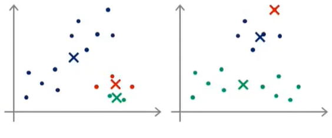

局部最优实际上指的是代价函数$J$不能很好的最小化，从而导致的局部最优。如果我们担心K-means算法落在局部最优，我们可以尝试多次随机初始化，并多次运行K-means算法，以此来保证我们最终能得到一个足够好的结果。

### 13.4.3 随机初始化的具体做法

以下是随机初始化的具体做法：

+ 决定运行K-means算法的次数，这里假设为100次。
+ 运行K-means算法，得到一系列聚类结果和一系列聚类中心。
+ 用我们得到的聚类结果和聚类中心计算代价函数$J$。
+ 在完成100次过程后，在得到的100中结果中选择代价最小的一个。

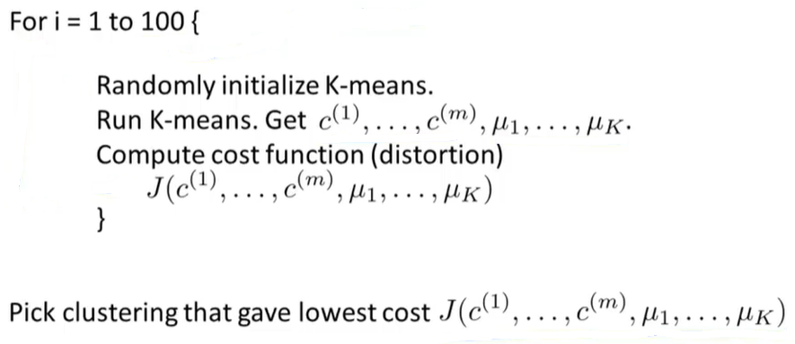

事实证明，当聚类数在2到10之间时，多次随机初始化通常能够找到较好的局部最优解；但$K$大于10时，这么做一般不会有太大的改善。

## 13.5 选择聚类数量

### 13.5.1 什么样的聚类数量才是正确的

对于如何选择聚类数量$K$，这个个问题没有准确的答案，也没有可以自动处理的方法。到现在，最好的方法是通过观察可视化图来进行选择。

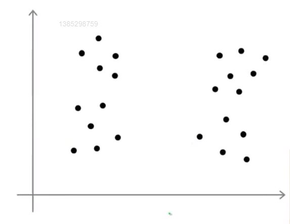

通常在数据中，有多少个聚类是不清楚的，例如上图的数据，有些人会认为有4个簇，即$k=4$

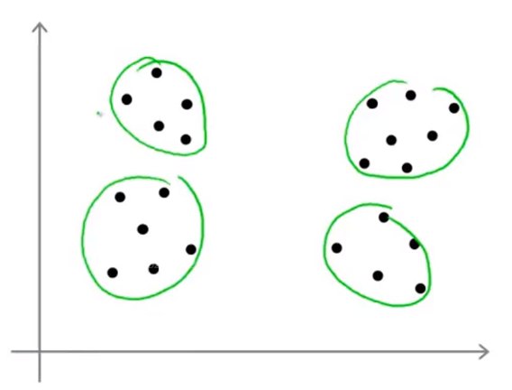

有的人认为有两个簇，即$K=2$。

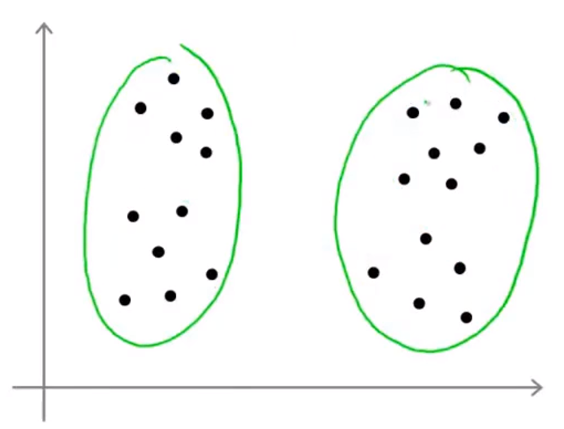

直接观察数据集通常会得到模棱两可的答案，这就是无监督学习的一部分，因为我们的数据没有标签，因此并不总是有一个明确的答案。也正是因为这个原因，用算法自动来选取聚类数量非常困难。

### 13.5.2 选择$K$的值

**肘部法则(elbow method)**：改变$K$，计算代价函数$J$。随着簇的数量的增加，我们会得到一条类似于下图的曲线。

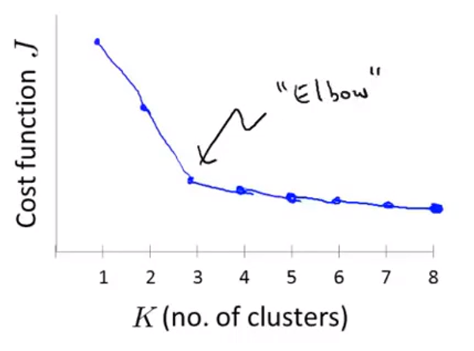

通过观察上图我们可以发现$K=3$的点像人类的肘关节一样，其左边的代价函数值下降的很快，右侧的很慢，所以我们就选择$K=3$。

上图的结果看起来很好，但实际上，“肘部法则”并不是很常用，因为在实际的聚类问题中，我们往往会得到一条看上去相当模糊的曲线，并没有一个清晰地拐点。

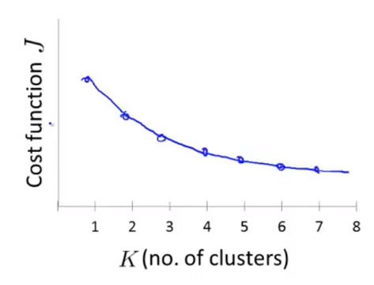

总的来说，“肘部法则”是一个值得尝试的方法，但不能期望它能够解决任何问题。

除此之外，还有一种选择簇数目的方法。通常人们使用K-means算法是为了得到一些聚类用于后面的目的，例如之前说过的市场分割或组织计算机集群。如果我们可以得到一个评估标准，那么决定聚类的数量更好的方法就是看哪个聚类数量能更好的应用于后续目的。

例如T恤尺寸的例子。我们可以将T恤分为3个聚类或5个聚类，如下图所示：

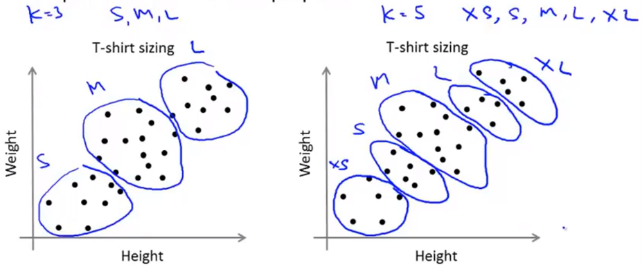

我们可以从商业的角度去思考如何分类能更好的满足顾客需求以及卖出更多T恤。是需要更多T恤尺寸来更好的满足顾客还是需要更少T恤尺寸来获取更多的利润。因此这会帮你选择聚类数量。