# 第十二章 支持向量机

## 12.1 优化目标

### 12.1.1 逻辑回归回顾

为了描述**支持向量机(support vector machine)**，我们先从逻辑回归开始，然后做一些小小的改动，来得到一个支持向量机。

+ 逻辑回归的假设函数：

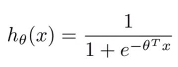

+ sigmoid激活函数图像：

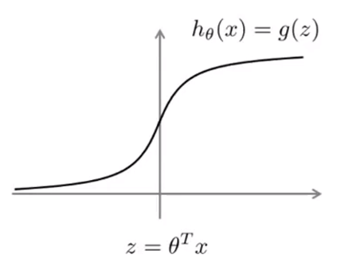

+ 逻辑回归的作用：
  + 如果样本中$y=1$，我们希望$h(x)\approx1$，那么$\theta^Tx>>0$。
  + 如果样本中$y=0$，我们希望$h(x)\approx0$，那么$\theta^Tx<<0$。
+ 逻辑回归的代价函数：

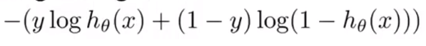

这里的代价函数没有求和，代表了每个单独训练样本对逻辑回归的总体目标函数所做的“贡献”。之后再将$h_\theta(x)$带入得到下式：

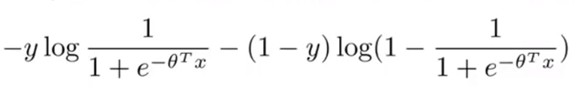

现在让我们考虑两种情况——$y=1$和$y=0$因为在这两种情况下代价函数只有一项有用。

+ 加入$y=1$（我们希望$\theta^Tx>>0$），这时目标函数中只有第一项起作用：

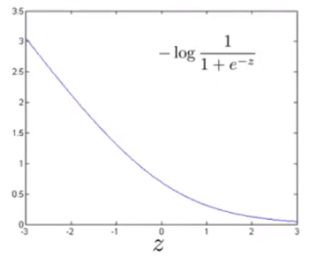

在上图中，我们可以看到当$z$很大时，也就是$\theta^Tx$很大时，函数所对应的值会变得很小，也就是它对代价函数的影响很小，这也解释了为什么逻辑回归在“看见”$y=1$这样的样本时会将$\theta^Tx$设置成一个很大的值。

为了构建支持向量机，我们要从这个代价函数开始，然后进行小量修改：

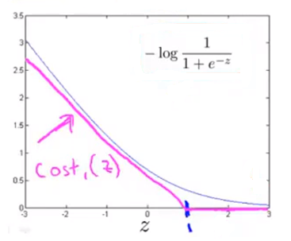

新的代价函数从1开始，1的右侧是水平的，左侧是一条和逻辑回归幅度相似的直线（这条直线的斜率并不是很重要）。我们把这个新的代价函数命名为$cost_1(z)$。**新的代价函数的作用于逻辑回归很相似，但支持向量机拥有计算上的优势，并且使得之后的优化问题变得更简单**。

+ 加入$y=0$（我们希望$\theta^Tx<<0$），这时目标函数中只有第二项起作用：

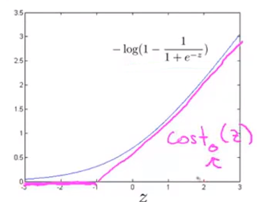

与$y=1$时的情况相同，我们用一个新的代价函数来代替逻辑回归的代价函数，并将它命名为$cost_0(z)$。

### 12.1.2 支持向量机

让我们先来回顾一下逻辑回归的代价函数：

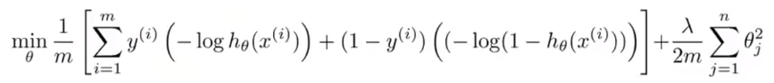

与之前不同的是，我们把min前面的符号放到了括号里。对于支持向量机而言，我们要做的实际上是把括号里的两个部分换成$cost_1(\theta^Tx^{(i)})$和$cost_0(\theta^Tx^{(i)})$。

除此之外，我们还要对支持向量机的的代价函数做一些改变：

+ 去除$\frac{1}{m}$这一项。这样同样能得到参数的最优值，因为$\frac{1}{m}$只是一个常数。
+ 在逻辑回归中，目标函数有两项——代价函数(A)和正则化项(B)，我们要做的是平衡着两项。我们要做的不是计算$A+\lambda B$，而是**通过设定不同的正则化参数以便能够权衡两项，即我们现在多大程度上去适应训练集，还是更多的去保持正则化参数足够小**。在支持向量机中，我们会使用另一个参数C来权衡。

最后我们就得到了支持向量机的代价函数：

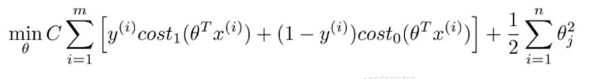

与逻辑回归不同的是，SVM并不会输出概率，相对的，支持向量机进行了一个直接的预测，预测$y=1$还是$y=0$。
$$
h_\theta(x)=\begin{cases}
1& \text{if $\theta^Tx\geq0$}\\
0& \text{otherwise}
\end{cases}
$$

## 12.2 大间距的直观理解

### 12.2.1 大间距分类器

有时候人们会把支持向量机叫做大间距分类器(large margin classifiers)，下图是支持向量机的代价函数：

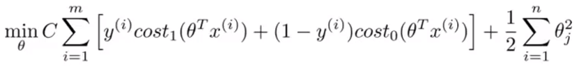

下图中左边我们画出关于$z$的代价函数$cost_1(z)$，在右边画出关于$z$的代价函数$cost_0(z)$。

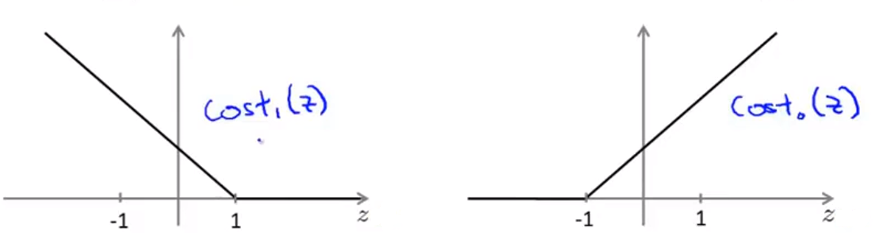

现在我们要讨论的是如何使这些代价函数变得更小。

+ 当$y=1$时，那么仅当$z\geq1$时，有$cost_1(z)=0$。
+ 当$y=0$时，那么仅当$z\leq-1$时，有$cost_1(z)=0$。

但是，支持向量机的要求更高，不仅仅要能正确分开输入的样本，即不仅仅要求$\theta^Tx>0$，我们需要的是比0值大很多，比如大于等于1，我也想这个比0小很多，比如我希望它小于等于-1，这就相当于在支持向量机中嵌入了一个额外的安全因子，或者说安全的间距因子。

### 12.2.2 支持向量机的决策边界

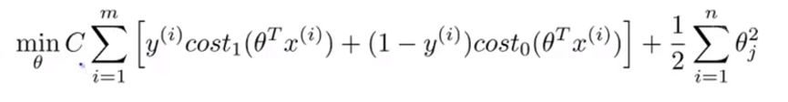

如果在上图支持向量机的损失函数中，**我们将C的值设置的非常大**，那么最小化优化目标的时候，我们将迫切希望找到一个值，能让第一项等于0。

+ 无论何时$y^{(i)}=1$：$\theta^Tx^{(i)}\geq1$。
+ 无论何时$y^{(i)}=0$：$\theta^Tx^{(i)}\leq-1$。

现在我们要把优化问题看作是通过参数选择来使第一项等于0，那么优化问题就会变成最小化：
$$
C\times0+\frac{1}{2}\sum_{i=1}^{n}\theta_j^2
$$
这个式子受以下条件限制：

+ $\theta^Tx^{(i)}\geq1$，如果$y^{(i)}=1$。
+ $\theta^Tx^{(i)}\leq-1$，如果$y^{(i)}=0$。

这也就是说，当我们解决这个优化问题的时候，会得到一个很有趣得决策边界。

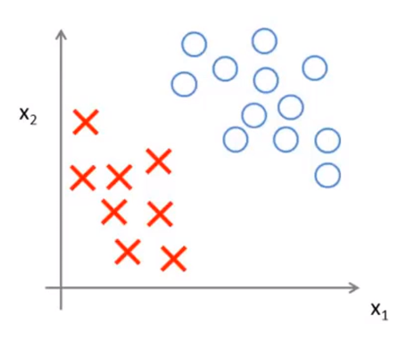

加入我们现在有上图中的数据集，其中有正样本和负样本，并且这个数据集是线性可分的，并且存在多条直线可以将其分开。

我们可以用绿色的线和紫色的线将数据分开，但是效果不好。支持向量机会选择黑色的线。

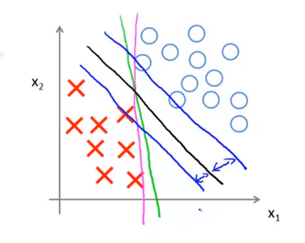

观察黑色的线和蓝色的线可知，其决策边界和训练样本的最小距离要更大一些，在分离样本时表现也会更好一些。这个距离叫做支持向量机的**间距(margin)**，这使得支持向量机具有鲁棒性，因为它在分离数据时，会尽量用大的距离去分开，这也是为什么有时候把支持向量机叫做大间距分类器。

### 12.2.3 大间距分类器与异常点(outliers)

在前面要强调的是，以下情况均出现在C值很大的情况下。

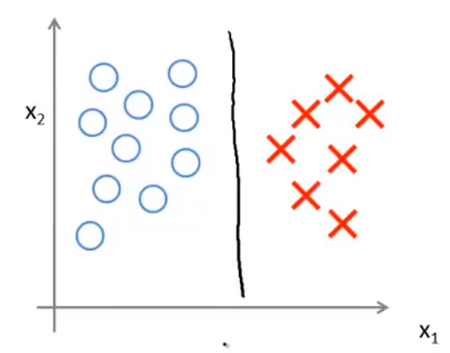

在给定上图数据集之后，大间距分类器可能会用黑色的线来区分正负样本。**但是它会对异常点非常敏感**。

现在假设我们假如一个额外的正样本，为了正确的做出区分，最后学习到的决策边界可能会变成紫色的直线。

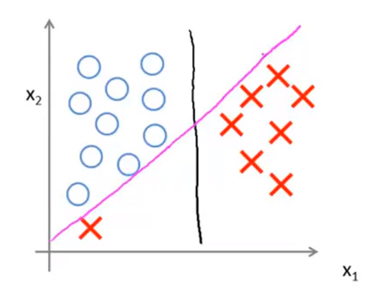

只因为一个异常点就将决策边界从黑色直线变为紫色直线并不理想，但是如果我们不将C的值设置的那么大，那我们最后得到的决策边界还是那条黑色的线。同时，通过这个例子也能说明C类似于$\frac{1}{\lambda}$，可以让避免模型出现过拟合和欠拟合。

在实际中，当使用支持向量机的时候，如果C的值不是非常大时，它就可以忽略异常点，来得到正确处理的结果。

## 12.3 大间距分类器背后的数学原理

### 12.3.1 向量的内积

假设我们现在有两个向量：

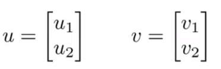

+ $u^Tv$：向量的内积(inner product)。
+ $||u||$：$u$的范数或长度，根据毕达哥斯拉定理(Pythagoras theorem)，$||u||=\sqrt{u_1^2+u_2^2}$。

在坐标系中，求向量的内积，首先要把向量$v$投影到向量$u$上，接下来就是要测量一下投影的长度$p$($p$是有符号的)，即红色线的长度。

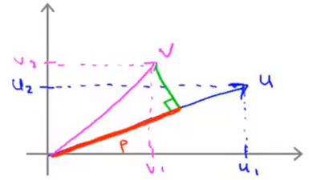

那么$u^Tv=p\cdot||u||=u_1v_1+u_2v_2$。

### 12.3.2 支持向量机的优化目标函数

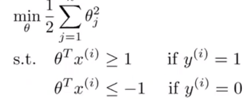

为了简化模型，我们现在这里设置$\theta_0=0$，即截距为0，$n=2$，即只有$x_1,x_2$两个特征。那么上式就可以展开如下：
$$
min_\theta \frac{1}{2}\sum_{j=1}^{n}\theta_j^2=\frac{1}{2}(\theta_1^2+\theta_2^2)=\frac{1}{2}(\sqrt{\theta_1^2+\theta_2^2})^2=\frac{1}{2}||\theta||^2
$$
展开后我们注意到，括号里的式子等于向量$\theta$的范数。对于优化目标函数来说，**支持向量机做的是最小化参数向量**$\theta$**的范数的平方**。

在这里，我们可以将$\theta^Tx^{(i)}$与上面$u^Tv$做比较，画出图像：

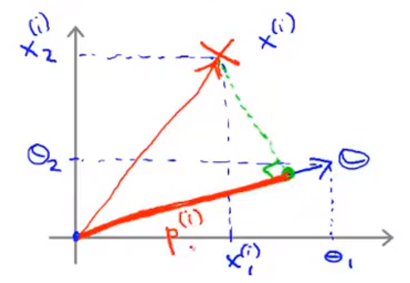
$$
\theta^Tx^{(i)}=p^{(i)}\cdot||\theta||=\theta_1x_1^{(i)}+\theta_2x_2^{(i)}
$$
这告诉我们这两种条件现在可以表述为：

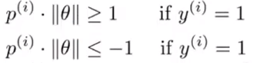

现在，在下面的数据集中，我们继续用简化的条件，看看支持向量机会选择什么样的决策边界。

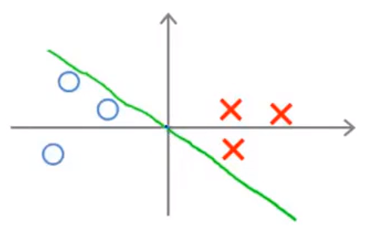

这个决策边界的选择不是很好，因为其边界很小，距离训练样本很近。现在让我们一起分析一下支持向量机为什么不会选择这样的决策边界。

参数向量$\theta$事实上是与决策边界90度正交。在下图中，我们分别选取一个正样本和一个负样本向参数$\theta$做投影，分别得到$p^{(1)}>0$（红色）和$p^{(2)}<0$（紫色）。从图中我们可以看出$p^{(i)}$是非常小的数，但是对于正样本而言，我们需要$p^{(i)} \cdot||\theta||\geq1$。如果这里的$p^{(1)}$特别小，那就意味着$||\theta||$特别大，$p^{(2)}$同理。但是优化目标函数要做的是视图找到一套参数$\theta$，来使它的范数足够小，因此下图中的$\theta$的方向选择不是非常好。

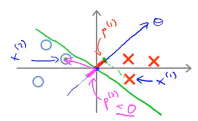

支持向量机可以最小化参数$\theta$，使$||\theta||$变小，那么投影长度变长，**即间距变长**，得到一个比较好的决策边界。

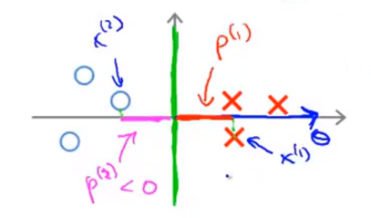

## 12.4 核函数I

### 12.4.1 非线性决策边界

假如我们要给一个训练集找一个非线性决策边界来区分正负实例，我们可以构造一个复杂多项式特征的集合，如下图所示：

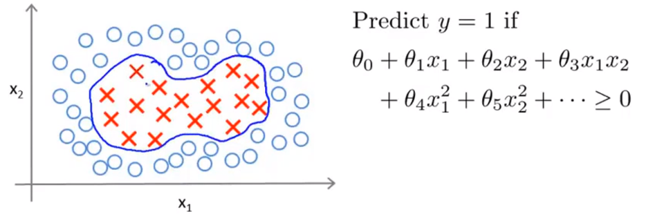

现在，我们要引入一个新的符号，看成用$\theta_0+\theta_1f_1+\theta_2f_2+\theta_3f_3+...$来计算决策边界，其中，$f_1=x_1,f_2=x_2,f_3=x_1x_2,f_4=x_1^2,f_5=x_2^2,...$。我们知道，这些高阶项是一种得到更多特征的方式，那么是否有比这些高阶项更好地特征呢？

### 12.4.2 核函数(kernel)

现在我们有一个可以构造新特征$f_1,f_2,f_3$的方法。为了简便，我们只定义3个新特征。

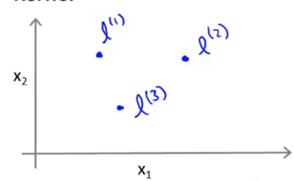

对于$x_1,x_2$，我们要手动选取一些点$l^{(1)},l^{(2)},l^{(3)}$，并称它们为标记(landmark)。接下来我们要定义新的特征。给定一个实例$x$：
$$
f_1=similarity(x,l^{(1)})=exp(- \frac{||x-l^{(1)}||^2}{2\sigma^2})\\
f_2=similarity(x,l^{(2)})=exp(- \frac{||x-l^{(2)}||^2}{2\sigma^2})\\
f_3=similarity(x,l^{(3)})=exp(- \frac{||x-l^{(3)}||^2}{2\sigma^2})
$$
这里的$f$是一种相似度的度量，即训练样本和每个标记的相似度。相似度函数就是一个核函数，这里我们用的其实是高斯核函数(Gaussian kernel)，$\sigma$是高斯核函数的参数。

### 12.4.2 核函数与相似度

首先让我们关注第一个特征:

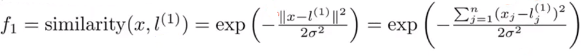

+ 假设$x\approx l^{(1)}$，即$x$与其中一个标记非常接近：

$$
f_1\approx exp(-\frac{0^2}{s\sigma^2})\approx1
$$

+ 假设$x$距离$l^{(1)}$很远：

$$
f_1=exp(-\frac{(larger\space number)^2}{2\sigma^2})\approx0
$$

因此，这些特征的作用是衡量$x$到标记$l$的相似度。如果$x$非常接近于标记，那么特征$f$非常接近于1，反之特征$f$会接近于0。

在上图中的三个标记里，每一个标记都定义一个新的特征。也就是说给定一个训练样本，我们可以计算出三个新的特征$f_1,f_2,f_3$。

### 12.4.3 一个例子

假如我们现在有两个特征变量$x_1,x_2$。特征图如下所示：

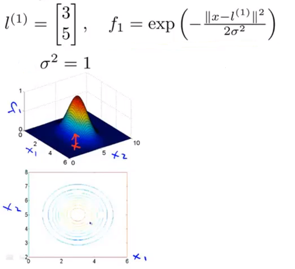

在上图中，我们会发现当$x=[3;5]$的时候，$f_1=1$，因为它正好在最大值上。如果$x$往周围移动，距离越远，$f_1$的值就越接近0。它衡量了$x$到第一个标记有多近。

现在，我们改变高斯核函数的参数，令$\sigma^2=0.5$：

通过观察上图我们会发现，核函数看起来还是相似的，只是凸起部分的宽度变窄了，那么我们从最高点下降到0的速度会变得很快。

与此相反，如果我们增大了$\sigma^2$，那么我们从点$l$往旁边移动，特征值变量的减小速度会变得比较慢。

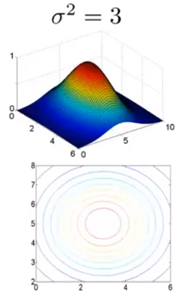

### 12.4.4 预测函数

给定一个训练样本$x$，我们准备计算出三个特征变量，即$f_1,f_2,f_3$。

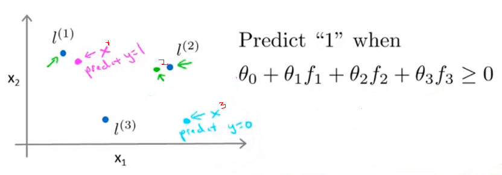

现假设我们的参数值$\theta_0=-0.5,\theta_1=1,\theta_2=1,\theta_3=0$。并且有一个训练样本$x^{(1)}$处于紫色点处，$x^{(2)}$处于绿色点处，$x^{(3)}$处于青色点处。

+ $x^{(1)}$距离$l^{(1)}$近，$l^{(2)},l^{(3)}$远，所以$f_1\approx1$,$f_2,f_3\approx0$带入上式得$\theta_0+\theta_1f_1+\theta_2f_2+\theta_3f_3\approx0.5\geq0$。预测$y=1$。
+ $x^{(2)}$距离$l^{(2)}$近，$l^{(1)},l^{(3)}$远，所以$f_2\approx1$,$f_1,f_3\approx0$带入上式得$\theta_0+\theta_1f_1+\theta_2f_2+\theta_3f_3\approx0.5\geq0$。预测$y=1$。
+ $x^{(3)}$距离$l^{(3)}$近，$l^{(1)},l^{(2)}$远，所以$f_3\approx1$,$f_1,f_2\approx0$带入上式得$\theta_0+\theta_1f_1+\theta_2f_2+\theta_3f_3\approx-0.5\leq0$。预测$y=0$。

我们发现对于接近$l^{(1)},l^{(2)}$的点，我们的预测值都是1，远离它们的点预测值是0。我们可以通过标记点和相似性函数来定义新的特征变量从而训练复杂的非线性边界。

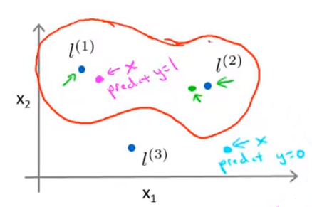

## 12.5 核函数II

### 12.5.1 如何选择标记

在上一节中，我们选择3个标记点$l^{(1)},l^{(2)},l^{(3)}$，他能够使我们定义相似度函数，也称之为核函数，这使我们能够构造一个预测函数。

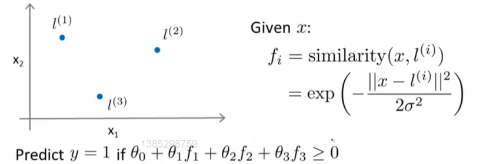

那么，我们该如何选择这些标记点。

在我们的数据集中有一些正样本和负样本，我们选取每一个样本点，在必要时直接使用它们，即直接将训练样本作为标记点。这样做还能说明特征函数基本上是在描述每一个样本距离样本集中其他样本的距离。

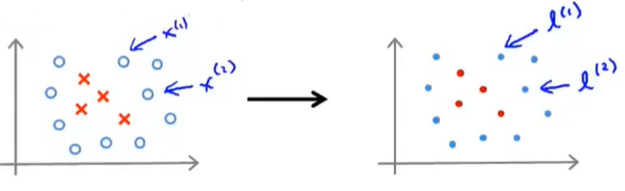

### 12.5.2 带有核函数的支持向量机

现在让我们具体的列出整个过程的大纲：

+ 给定$m$个训练样本。
+ 选取$m$个训练样本完全一样的位置作为标记点。
+ 当给定样本$x$，这个样本$x$可以属于训练集，测试集，也可以属于交叉验证集，之后我们来计算特征$f_1,f_2,...$，之后得到特征向量$f$。
+ 如果有一个训练样本$(x^{(i)},y{(i)})$，那么$f^{(i)}$就是我们用于描述训练样本的特征向量。

在给定核函数和相似度函数后我们该如何使用简单的支持向量机？

如果我们已经学习的到了参数$\theta$，再给定$x$的值，并对样本$x$做出预测，我们要先计算特征向量$f$，之后计算$\theta^Tf=\theta_1f_1+\theta_2f_2+...+\theta_mf_m$。若其大于等于0，则预测$y=1$。

以上是当参数$\theta$已知时得到的，但是我们又该如何得到参数$\theta$呢？

其实当我们使用支持向量机学习算法，尤其是当我们解决最小化代价函数时，就已经最小化了参数$\theta$。

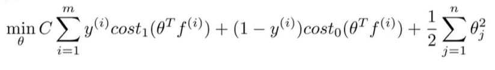

只不过现在我们先不用$\theta^Tx^{(i)}$和原始的特征，而是用$\theta^Tf^{(i)}$代替来做预测，最小化代价函数后，我们就会得到参数$\theta$。

此外还有一些细节就是相应地修改代价函数为：$\sum^{n=m}_{j=1}\theta_j^2$。代价函数在具体实施过程中，我们还需要对最后的正则化项进行些微调整，在计算$\sum^{n=m}_{j=1}\theta\theta^T$时，我们用$\theta M\theta^T$代替$\theta\theta^T$，其中$M$是根据我们选择的核函数而不同的一个矩阵。这样做的原因是为了简化计算。

理论上讲，我们也可以在逻辑回归中使用核函数，但是上面使用 来简化计算的方法不适用与逻辑回归，因此计算将非常耗费时间。

另外，支持向量机也可以不使用核函数，不使用核函数又称为**线性核函数**(**linear kernel**)，当我们不采用非常复杂的函数，或者我们的训练集特征非常多而样本非常少的时候，可以采用这种不带核函数的支持向量机。

### 12.5.3 如何选择支持向量机中的参数

在支持向量机中，参数$C$的作用与$\frac{1}{\lambda}$相似。所以：

+ 当$C$较大时，相当于$\lambda$较小，可能会导致过拟合，高方差。
+ 当$C$较小时，相当于$\lambda$较大，可能会导致欠拟合，高偏差；

$C$只是我们要选择的其中一个参数，另一个要选择的参数是高斯核函数中的$\sigma^2$。

+ 当$\sigma^2$过大时，对应的相似度函数$exp(- \frac{||x-l^{(i)}||^2}{2\sigma^2})$如图，相对比较平滑，变化比较缓慢，这会给模型带来较高的偏差。

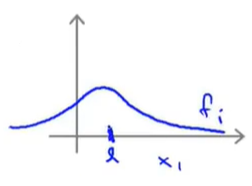

+ 当$\sigma^2$过小时，对应的相似度函数$exp(- \frac{||x-l^{(i)}||^2}{2\sigma^2})$如图，相对比较不平滑，变化比较剧烈 ，这会给模型带来较高的方差。

## 12.6 使用支持向量机

### 12.6.1 知识回顾

支持向量机算法，提出了一个特别优化的问题。但我们真的不建议你自己编程来求解参数。用以解决支持向量机最优化问题的程序很复杂，且已经有研究者做了很多年数值优化了。因此，强烈建议使用高优化软件库中的一个，而不是尝试自己落实一些数据，例如liblinear和libsvm。

尽管我们不需要去为支持向量机的优化自己编写程序，但是我们自己仍需选择参数$C$，以及选择核函数或相似函数，例如：

+ 不使用核函数，即使用线性核函数。这种核函数适用于特征数很大，但样本数很小时，只想拟合一个线性的判定边界而不是去拟合一个非常复杂的非线性函数。因为样本数量太少可能会导致过拟合。
+ 使用高斯核函数。这种核函数适用于当特征数很小，但样本数很大时，我们想要拟合一个相当复杂的非线性决策边界。在这种情况下，我们需要自己选择参数$\sigma^2$。

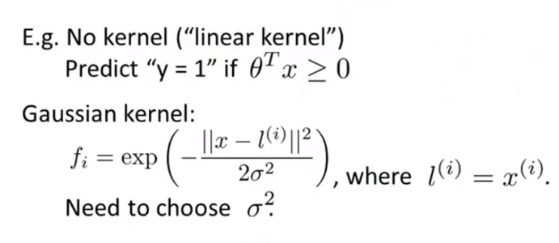

### 12.6.2 高斯核函数（相似函数）

若要使用octave来实现高斯核函数，我们可以使用如下代码：

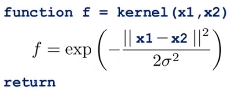

在这里我们要注意的是，**如果我们有大小不一样的特征变量，那在使用高斯函数之前，要将这些特征变量的大小按比例归一化**。

因为在高斯核函数中，因为有$n$为特征，所以我们需要计算：
$$
||x-l||=(x_1-l_1)^2+(x_2-l_2)^2+(x_3-l_3)^2+...+(x_n-l_n)^2
$$
如果此时特征向量的值的范围很不一样，例如在房价预测中，$x_1\in[100,1000]$为面积，$x_2\in[1,5]$为卧室的数量，$(x_1-l_1)^2$就会变得非常大，那么在这个式子中距离就要房子的大小而决定，忽略了卧室的数量。为了避免这种情况，就要进行放缩。

### 12.6.3 核函数的其它选择

当我们尝试使用支持向量机的时候，我们最有可能用到的两个核函数是线性核函数或高斯核函数。但是不是所有我们可能提出来的相似函数都是有效的核函数，这些函数都需要满足**默塞尔定理(Mercer`s Theorem)**。除了上面所说的两个核函数以外，还有很多核函数满足默塞尔定理。例如：

+ **多项式核函数(polynomial kernel)**
+ **字符串核函数(string kernel)**
+ **卡方核函数(chi-square kernel)**
+ **直方相交核函数(histogram intersection kernel)**
+ ......

### 12.6.4 支持向量机在多类分类中的应用

很多支持向量机的包已经内置了多分类的函数，除此之外，另一个做多分类的方法是使用**一对多(one-vs-all)**的方法。即如果我们有$k$个类别，我们将训练$k$个支持向量机，用来把每个类别从其他类别中区分开来。我们会得到$k$个参数$\theta^{(1)},\theta^{(2)},...,\theta^{(k)}$。其中$\theta^{(1)}$是试图从其他类别中识别出$y=1$的类别。最后，我们用最大的$\theta^Tx$来预测类别$i$。

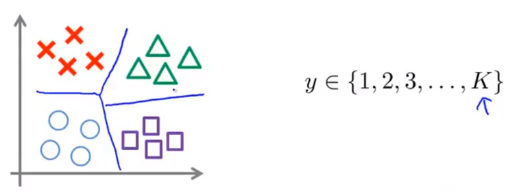

### 12.6.5 逻辑回归与支持向量机

对于什么时候该使用逻辑回归，什么时候该使用支持向量机，下面是一些普遍使用的准则：

$m$为特征数，$n$为训练样本数。

+ 如果相较于$m$而言，$n$要大许多，即训练集数据量不够支持我们训练一个复杂的非线性模型，我们选用逻辑回归模型或者不带核函数的支持向量机。

+ 如果$n$较小，而且$m$大小中等，例如$n$在 1-1000 之间，而$m$在10-10000之间，使用高斯核函数的支持向量机。

+ 如果$n$较小，而$m$较大，例如$n$在1-1000之间，而$m$大于50000，则使用支持向量机会非常慢。解决方案是创造、增加更多的特征，然后使用逻辑回归或不带核函数的支持向量机。

值得一提的是，神经网络在以上三种情况下都可能会有较好的表现，但是训练神经网络可能非常慢，**选择支持向量机的原因主要在于它的代价函数是凸函数，不存在局部最小值**。