# 第十五章 异常检测

## 15.1 问题的动机

### 15.1.1 异常检测的例子

假设我们是飞机引擎制造商，在引擎制造生产线上，我们要进行质量控制测试。为了进行测试，我们会收集一些列飞机引擎的特征变量，例如引擎运转时产生的热量或者引擎的震动等等。之后，我们把数据画成图，可能如下图所示：

上图中每个查代表的都是无标签的数据。这样，**异常检测(anomaly detection)**问题可以定义如下：我们假设现在我们制造了一个新的引擎，异常检测问题就是我们希望知道这个新的飞机引擎是否有某种异常或者说我们希望判断这个引擎是否需要进一步测试，因为如果它看起来像一个正常的引擎，那么就可以直接发送给客户而不需要进一步的测试，如下图所示：

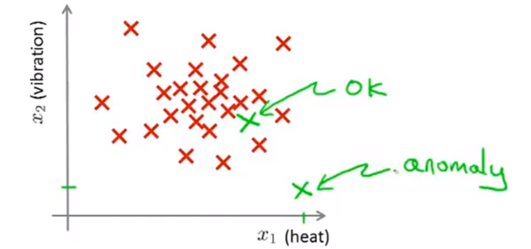

### 15.1.2 异常检测

异常检测更加正式的定义：我们有一些数据并假设它们都是正常的（不是异常的），我们需要一个算法来告诉我们一个新的样本数据是否是异常的。

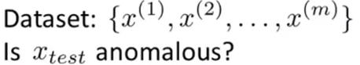

我们要采取的方法是，给定无标签的训练集，我们对数据进行建模，即$p(x)$（概率模型），之后我们会设定一个阈值，如：

+ $p(x_{test})<\epsilon$，标记为异常。
+ $p(x_{test}) \geq \epsilon$，标记为正常。

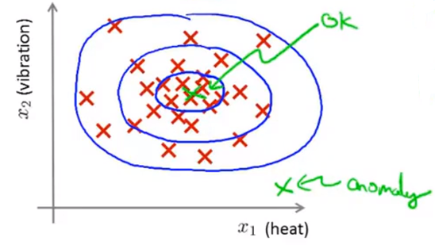

例如在上图中，中心点的概率相当大，而稍微远离中心区域的点概率会小一些，更远的地方的点它们的概率将更小，而在这这歪的点将成为异常点，

### 15.1.3 异常检测应用案例

+ 欺诈检测。假设某网站有许多用户，并且大家都在从事不同的活动。我们可以建立一个模型来表示用户表现出各种行为的可能性，之后就能通过它来看哪些用户的$p(x)<\epsilon$来发现网站上奇怪的用户，从而让网站防止欺诈行为。
+ 工业制造。例如之前的飞机引擎制造。
+ 数据中心的计算机监控。

## 15.2 高斯分布

### 15.2.1 高斯（正态）分布(Gaussian/Normal distribution)

假设$x$是一个实数的随机变量，如果$x$的概率分布服从高斯分布，那么它将记做$x$~$N(\mu,\sigma^2)$。这里的$N$表示normal。高斯分布有两个参数：

+ 均值$\mu$。$\mu$控制钟形曲线的中心位置。
+ 方差$\sigma^2$。$\sigma$（标准差）控制这个钟形曲线的宽度。

高斯分布图像如下：

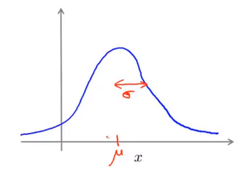

这个曲线控制了$x$取不同值时的概率。高斯分布的数学公式如下：
$$
p(x;\mu,\sigma^2)=\frac{1}{\sqrt[]{2\pi}\sigma}exp(-\frac{(x-\mu)^2}{2\sigma^2})
$$

### 15.2.2 高斯分布的例子

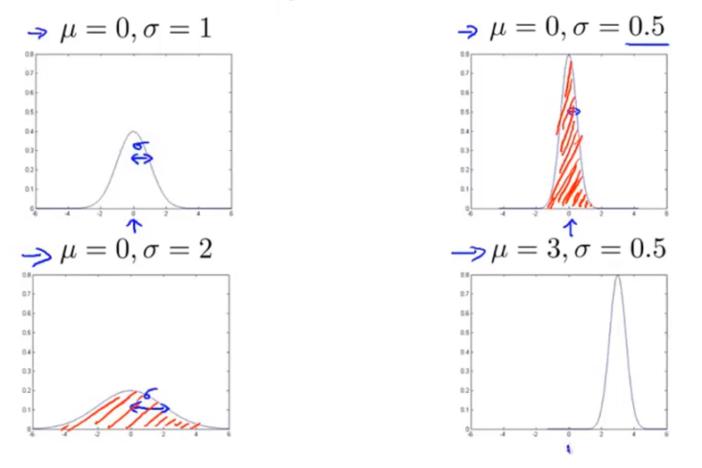

当$\mu$发生改变时，曲线发生平移，当$\sigma$发生改变时，曲线的“高低胖瘦”发生改变。**但是无论参数如何变化，曲线与x轴围成的面积始终为1。**

### 15.2.3 参数估计

现假设我们有一个含有$m$个数据的训练样本，它们都是实数。**参数估计(parameter estimation)**问题就是假设这些样本来自一个高斯分布的总体，但我们不知道这个高斯分布的参数，所以我们要估计出这些参数值。中心位置就是对全部样本求平局值，宽度由已知的$\mu$求得，即：
$$
\mu=\frac{1}{m}\sum_{i=1}^mx^{(i)}\\
\sigma^2=\frac{1}{m}\sum_{i=1}^m(x^{(i)}-\mu)^2
$$
其实，这里的估计实际就是对$\mu$和$\sigma^2$的**极大似然估计(maximum likelihood estimation)**。

## 15.3 算法

### 15.3.1 密度估计(density estimation)

假设我们现在有一个包含$m$个样本的数据集，每一个数据都是$n$维。我们处理异常检测的方法是，用数据建立起概率模型$p(x)$，以试图找出哪些特征出现的概率比较高，哪些比较低。若每一个数据都是分散的且服从高斯分布，那么我们可以建模如下：
$$
p(x)=p(x_1;\mu_1,\sigma_1^2)p(x_2;\mu_2,\sigma_2^2)p(x_3;\mu_3,\sigma_3^2)...p(x_n;\mu_n,\sigma_n^2)=\Pi_{j=1}^np(x_j;\mu_j,\sigma_j^2)
$$
其实，上述等式相当于从$x_1$到$x_n$上的独立假设。不过在实践中，结果证明，无论这些特征量是否近乎独立，算法的效果都很不错。

### 15.3.2 异常检测算法

为了构建一个**异常检测算法(anomaly detection algorithm)**，我们可以：

+ 第一步是选择出能帮我们指出那些返程样本的特征量$x_i$。
+ 下一步是给出训练集，即$m$个未标记的样本，之后进行参数拟合，其中：

$$
\mu=\frac{1}{m}\sum_{i=1}^mx^{(i)}\\
\sigma^2=\frac{1}{m}\sum_{i=1}^m(x^{(i)}-\mu)^2
$$

+ 最后，我们给出一个新案例，要想知道它是否异常，我们可以计算$p(x)$的值，如果这个值很小，那么就可以将这一项标注为异常：

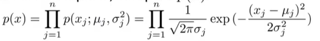

### 15.3.3 异常检测算法的案例

通过观察并计算上图数据，我们可以得到：

+ 在特征量$x_1$中，$\mu_1=5,\sigma_1=2$。
+ 在特征量$x_2$中，$\mu_2=3,\sigma_2=1$。

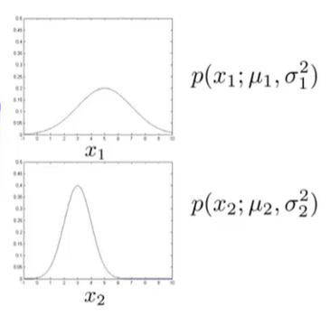

如果我们绘制出$p(x)$的图像，即$x_1,x_2$的乘积，会得到一个类似于下图的曲面：

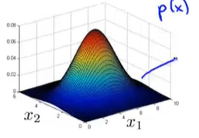

给定一组特等的$x_1,x_2$的值，其在3D曲面图所对应的高度就是$p(x)$的值。

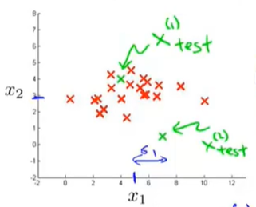

现在让我们来看两个新的样本$x_{test}^{(1)},x_{test}^{(2)}$，并假设我们的阈值$\epsilon=0.02$。我们通过计算两个新样本的$p(x)$值并与阈值比较来判断它们是否异常：

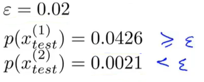

事实上我们可以改良这个方法。我们观察这个三维曲面，可以发现$x_1,x_2$对应曲面非常高的位置时，对应的都是无异常情况，而紫色区域概率都很小，所以标注为异常。因此，可以定义一个区域范围，其外部都为异常，内部都为正常。

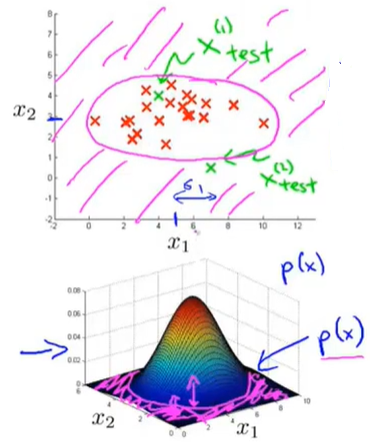

## 15.4 开发和评价一个异常学习系统

### 15.4.1 实数评估的重要性

**实数评估(real-number evaluation)**的主要思想是：当我们为某个应用开发一个学习算法的时候，需要进行一系列的选择，例如选择使用什么特征等等。如果我们有某种方法通过返回一个实数来评估我们的算法，那么对这些选择做出决定往往会容易的很多。

到目前为止，我们都把异常检测看做一个无监督学习问题，因为我们一直使用的是无标签的数据。但是如果我们有一些带标签的数据来指明哪些是异常样本，哪些是正常样本，这就是我们认为的能评估异常检测算法的标准方法。所以，为了能够快速开发出这样一个算法评估系统，我们可以假设我们有一些带标签的数据。

我们还以飞机引擎制造为例：现在我们有一些带标签的数据，$y=1$代表无异常，$y=0$代表异常。

+ 训练集：把训练集看做无标签的，所以它是一个很大的正常样本的集合。有时候即使里面有一些异常样本，我们仍把它看做正常样本的集合。
+ 交叉验证集/测试集：在这两个用来测试异常检测系统性能的集合中，我们包含一些已知是异常的样本。

具体来说，假设我们有10000个正常产品，20个异常产品，那么：

+ 训练集：6000个正常的产品。我们用这些无标签数据（**其实我们知道绝大部分都是正常产品**）来拟合$p(x)$。
+ 交叉验证集：2000个正常产品$(y=0)$，10个异常产品$(y=1)$。
+ 测试集：2000个正常产品$(y=0)$，10个异常产品$(y=1)$。

其他的数据分类方法，如训练集使用6000个正常数据，然后剩下的4000个同时作为交叉验证集和测试集，这种做法不是非常推荐。

### 15.4.2 算法评估

在我们给定训练集，交叉验证集以及测试集后，我们评估异常算法的步骤如下：

+ 用无标签训练集来拟合模型$p(x)$。
+ 对于交叉验证集和测试集，我们要用它来进行预测$y$：

$$
y=\begin{cases}
1& \text{if $p(x)<\epsilon(anomaly)$}\\
0& \text{if $p(x)\geq \epsilon(nomal)$}
\end{cases}
$$

这和我们在监督学习中做的非常相似，所以我们可以通过算法预测成功的次数来对算法进行评估。我们的数据可能会很倾斜，因为正常数据额数量会远远大于异常数据。

一些可能的评价指标：

+ 真阳性(true positive)，假阳性(false positive)，假阴性(false negative)，真阴性(true negative)。
+ 精度(precision)/召回(recall)。
+ F_1 Score。

最后，还有一点要说的是，在异常检测算法中，我们还有一个参数$\epsilon$，它是用来决定什么时候把一个样本当做异常样本的阈值。我们可以使用交叉验证集在不同的$\epsilon$中选择一个能够最大化$F_1\space score$的。

## 15.5 异常检测与监督学习对比

在我们评估异常检测算法时，我们开始使用了一些带有标签的数据，因此我们会产生一个疑惑——加入我们有带标签的数据，为什么我们不直接用一个监督学习算法来尝试直接学习我们的带标签数据呢？

### 15.5.1 异常检测和监督学习适用的场景 

让我们来看看一下什么时候使用异常检测算法更有效，什么时候使用监督学习算法更有效。

+ 异常检测
  + 正常例子数量非常少，异常例子数量非常多。我们可以用异常例子拟合$p(x)$，用正常例子做交叉验证集和测试集。
  + 有许多不同类型的异常，例如航空发动机有许多不同途径可能导致异常。因此，在这种情况下，我们只有很少数量的正样本，对一个算法就很难从小数量的正样本中去学习异常是什么，尤其是未来可能出现的异常看起来可能会与现在的截然不同。如果是这种情况，那么更有可能的是对负样本用高斯分布模型$p(x)$来建模，而不是费尽心思对正样本建模。
+ 监督学习
  + 在合理的范围内有大量正样本和负样本。
  + 有足够数量的正样本或一个已经能识别正样本的算法，尤其是我们认为未来可能出现的正样本与我们当前训练集中的正样本类似。这时，监督学习能够查看大量正样本和负样本来学到相应特征，并且能够尝试区分正样本和负样本。

**这二者关键的不同点在于，在异常检测中，我们通常只有很少量的正样本，因此对于一个学习算法而言不可能从这些正样本中学习到足够的知识**。

### 15.5.2 一些异常检测和监督学习的应用

+ 异常检测
  + 欺诈检测。
  + 工业制造。
  + 数据中心的机器监视。

+ 监督学习
  + 垃圾邮件分类。
  + 天气预报。
  + 癌症分类。

## 15.6 选择要使用的功能

### 15.6.1 非高斯(non-gaussian)分布特征

在异常检测算法中，我们要做的一件事就是使用高斯分布来对特征建模。通常我们会绘制出数据，以确保这些数据在进入异常检测算法前看上去比较接近高斯分布。但有时候即使数据不是高斯分布，算法也能运行。

如果我们绘制出的数据如下图所示，它看上去非常接近高斯分布，那我们就可以直接将其输入到算法中。

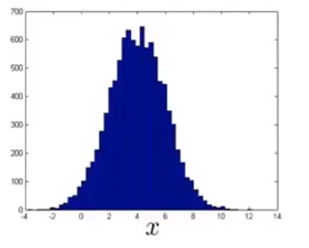

但如果我们绘制出的图像如下图所示，其是一个非常不均匀的分布。

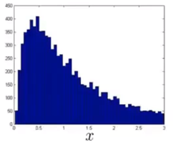

如果我们的数据是这样的，那么我们一般会对其进行一些转换，使它看上去更像高斯分布。虽然我们也能将分布不均匀的数据输入算法中，但数据越接近高斯分布，算法运行得就越好。对于上图中的数据，我们可以做一次对数转换，如下图所示：

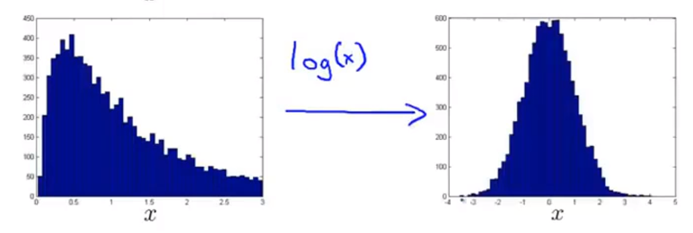

除了取对数外，我们还可以进行$log(x+c)$，平方根等变换，这而变换都是为了让我们的数据看上去更接近高斯分布。

在Octave中的动态演示可参照吴恩达机器学习[课时128](<https://study.163.com/course/courseLearn.htm?courseId=1004570029#/learn/video?lessonId=1052401649&courseId=1004570029>)。

### 15.6.2 异常检测中的误差分析

在异常检测中，我们希望$p(x)$的值在正常样本的情况下比较大，在异常样本的情况下比较小。但一个常见的问题是，如果$p(x)$是可比较的，例如样本正常和异常时$p(x)$的值都比较大。

让我们看来看一个具体的例子：假设我们的无标签数据只有一个特征$x_1$，我们要用一个高斯分布来拟合它（蓝色曲线）。现在，我们有一个异常样本（绿色叉），定期额它被“淹没”在一堆正常样本中，它有很高的概率，但我们的额算法没能将它标记为异常样本，如下图所示：

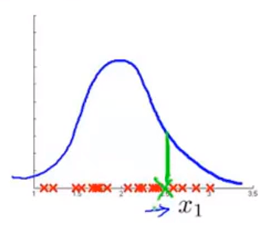

假设这代表的是飞机引擎的制造，那么我们会去查看训练样本，看看具体是哪一个飞机引擎出错了，并查看是否能通过这个错误样本找出一个新的特征来帮助算法找出异常样本，如下图所示：

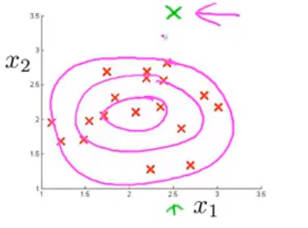

此时，异常检测算法在中间区域的数据有较高的概率，然后越到外层概率越小。

总结来说，异常检测中的误差分析就是观察哪里发生了错误，找到没有被标记出来的异常样本，并根据它找出一些新的特征。有了这个新特征，就能更容易的将异常样本从正常样本中区别出来。

## 15.7 多元高斯分布

### 15.7.1 例子：检测数据中心的计算机

现在，假设我们有如下图所示的无标签数据，两个特征变量分别为**CPU负载(CPU load)**和**内存使用(memory use)**。

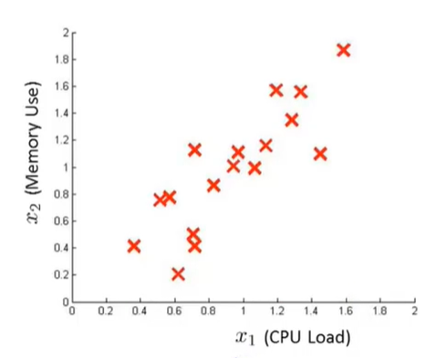

我们现在分别将两个特征分开，然后用高斯分布来建模。

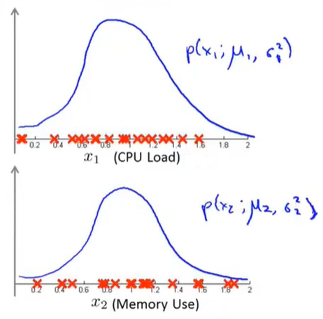

这就是异常检测算法给$x_1,x_2$建模的方法。现假设我们的测试集中有一个位于绿色叉位置的样本，其坐标大概为(0.4,1.5)。图中的正常数据看起来大都集中在蓝色的区域中，绿色数据看起来像是一个异常数据。但是，对于单独特征的高斯分布，绿色样本看起来就与其它正常样本没太大区别，所以异常检测算法不会将这个样本点标记为异常。

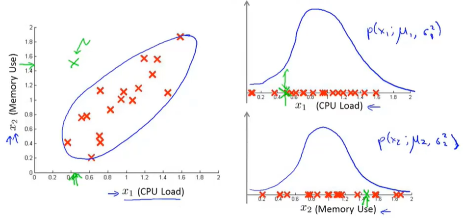

其实，异常检测算法不能一直到上图中蓝色的椭圆，所表示的正常样本概率高的范围，相反，它认为不同区域是正常样本的的概率不同。

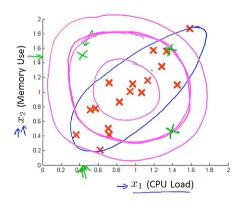

为了解决这种问题，我们提出了一种改良版的异常检测算法。

### 15.7.2 多元高斯分布

我们有$n$维特征$x$，我们不要为$p(x_1),p(x_2)$分别建模，而是要建立一个整体的$p(x)$模型，所以多元高斯分布参数是向量$\mu$和$\Sigma$，它们分别是$n$维向量和$n\times n$维矩阵，即：
$$
p(x;\mu;\Sigma)=\frac{1}{(2\pi)^{\frac{n}{2}}|\Sigma|^{\frac{1}{2}}}exp(-\frac{1}{2}(x-\mu)^T\Sigma^{-1}(x-\mu))
$$

### 15.7.3 多元高斯分布的例子

让我们来看一个二维的例子。在这种情况下，$p(x)$在$x_1,x_2$都为0的情况下取最高值，然后这个概率随着高斯曲线的二维钟形的面衰减。

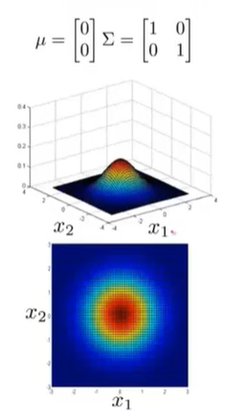

让我们改变一下参数$\Sigma$。它是协方差，用来衡量方差，或者说特征变量$x_1,x_2$的变化。在这种情况下，“鼓包”的宽度会变小，高度会变大，因为概率分布的积分必须等于1。

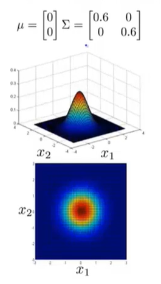

相反的，如果我们增大$\Sigma$那么“鼓包”会变大，高度会变小。

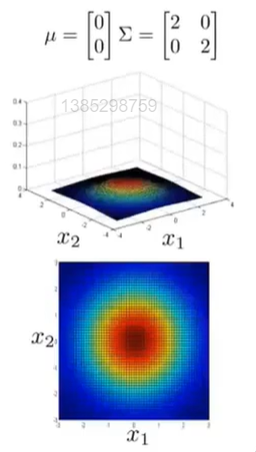

若我们只改变对角线上的一个元素，此时会减小第一个特征变量的方差，同时保持第二个特征变量的方差不变。

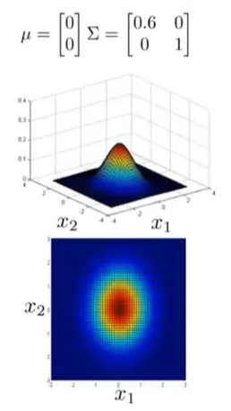

与此同时，我们还可以给两个高度相关的特征变量进行建模。如果我们改变协方差矩阵$\Sigma$的非对角线上的元素，我们会得到一个更加窄高的，并沿着$x=y$这条线的分布。

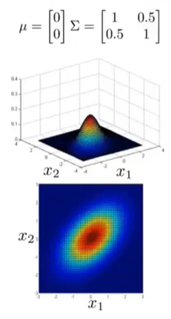

相反，我们还可以通过设置协方差矩阵非对角线上的数让两个特征变量负相关。

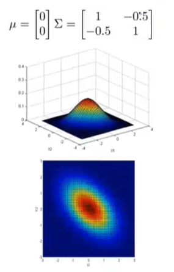

除了可以更改协方差矩阵外，我们还可以改变平均参数$\mu$，它会改变峰值位置。

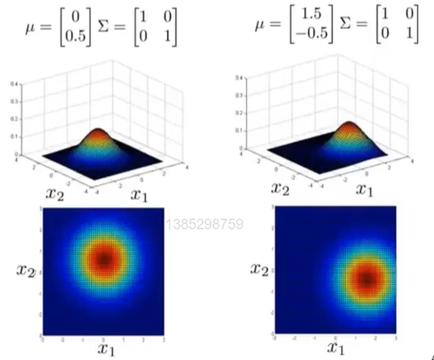

**多元高斯分布最重要的优势就是它能够让我们描述两个特征变量之间可能存在的正相关或是负相关**。

## 15.8 使用多元高斯分布进行异常检测

### 15.8.1 多元高斯分布

首先让我们回顾一下之前的多元高斯分布的参数，公式，以及参数不同时的几个例子。

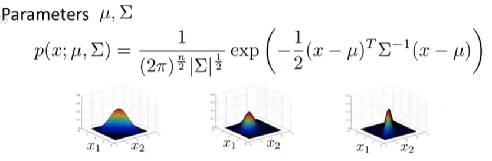

那么，现在让我们来看看参数拟合的问题。假设我们现在有一组样本，都是$n$维向量，并且服从多元高斯分布，那我们的参数拟合如下：

### 15.8.2 使用多元高斯分布进行异常检测

当我们知道了如何拟合参数后，我们开发异常检测算法的步骤如下：

+ 使用数据集来拟合$p(x)$。

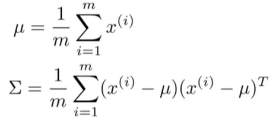

+ 给定一个新样本$x$，计算：

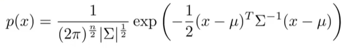

+ 如果$p(x)<\epsilon$，则标记为异常样本，否则为正常样本。

如果我们将其可视化出来，图像大致如下图所示，越靠近中间的部分概率越大。

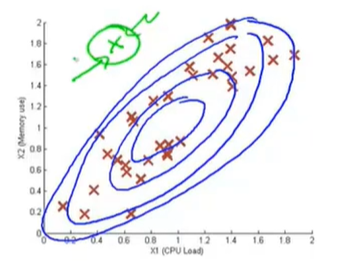

### 15.8.3 与原始模型的关系

我们的原式模型为：

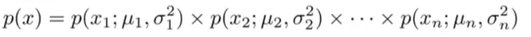

原始模型对比多元高斯模型来说，**原始模型实际上对应的是一种特殊情况下的多元高斯分布**。这种特殊情况是限制多元高斯分布的$p(x)$，所以由这个概率分布方程得到的椭圆是轴对齐的，而不是有角度的。

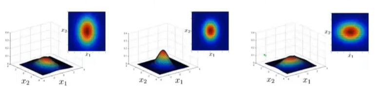

其实，我们还可以通过数学证明原始模型实际上对应的是一种特殊情况下的多元高斯分布。多元高斯分布$p(x)$的计算公式如下：

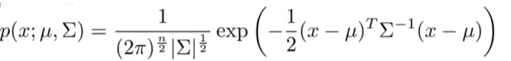

当协方差矩阵$\Sigma$在非对角线上都是0的时候，这两个模型完全相同。

### 15.8.4 如何选择原始模型与多元高斯模型

原始模型被使用的频率更频繁一些，多元高斯模型虽然用的少一些，但它在捕捉特征间关系方面有着很多优点。

|                   原始模型                   |           多元高斯模型           |
| :------------------------------------------: | :------------------------------: |
| 需要手动创造一个额外特征来捕捉异常的组合值。 | 能够自动捕捉不同特征之间的关系。 |
|    计算成本较低，可以适应巨大数量的特征。    |      计算成本高，计算缓慢。      |
|           特征数很少时也可以使用。           |     样本数量必须大于特征数。     |

原高斯分布模型被广泛使用着，如果特征之间在某种程度上存在相互关联的情况，我们可以通过构造新新特征的方法来捕捉这些相关性。如果训练集不是太大，并且没有太多的特征，我们可以使用多元高斯分布模型。

