# 第十六章 推荐系统

## 16.1 问题规划

### 16.1.1 为什么要将推荐系统

+ **推荐系统(recommender system)**是机器学习中的一个重要的应用。现在，在硅谷有很多团体试图建立很好的推荐系统。因此，如果你考虑网站像亚马逊，或网飞公司或易趣，或iTunes Genius，有很多的网站或系统试图推荐新产品给用户。如，亚马逊推荐新书给你，网飞公司试图推荐新电影给你，等等。这些推荐系统，根据浏览你过去买过什么书，或过去评价过什么电影来判断。这些系统会带来很大一部分收入，比如为亚马逊和像网飞这样的公司。因此，对推荐系统性能的改善，将对这些企业的有实质性和直接的影响。同时，推荐系统在学术界它占了很小的份额，但在许多有能力构建这些系统的科技企业，他们似乎在很多企业中占据很高的优先级。
+ 我们想通过推荐系统讨论机器学习中的一些大思想，并和大家分享。在之前的课程中，我们也看到了，对机器学习来说，特征是很重要的，你所选择的特征，将对你学习算法的性能有很大的影响。因此，在机器学习中有一种大思想，它针对一些问题，可能并不是所有的问题，而是一些问题，有算法可以为你自动学习一套好的特征。因此，不要试图手动设计。

### 16.1.2 例子：预测电影评分

假设我们有一个视频网站，并让用户用0到5星来评价不同的电影。现在我们有四名用户，五部电影，他们分别对电影进行打分。

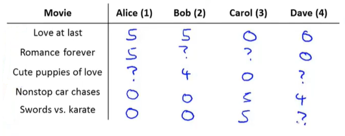

下面我们下来介绍一些符号及其含义：

+ $n_u$：用户数量。
+ $n_m$：电影数量。
+ $r(i,j)$：用户$j$是否给电影$i$评分，$r(i,j)=1$时表示评价。
+ $y(i,j)$：用户$j$给电影$i$的评分，它是从0到5的数字（这一项只有在$r(i,j)=1$时才被定义）。

因此，推荐系统的问题是，给出了$r(i,j)$和$y(i,j)$的数据，然后去查找那些没有被评级的电影，并试图预测这些电影的评级。那我们的工作就是相处一个学习算法，让它能自动为我们填补这些缺失值的算法，从而为用户推荐他们感兴趣的内容。

## 16.2 基于内容的推荐算法

### 16.2.1 基于内容的推荐算法

为了给没有被打分的电影预测分数，我们假设每一部电影都有一个对应的特征集。特别的，假设有特征$x_1$用来衡量一部电影为爱情片的程度，$x_2$来衡量一部电影为动作片的程度。

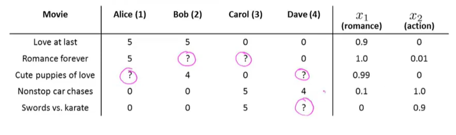

如果我们有这样的特征，那么每部电影就可以用一个特征向量来表示。例如第一部电影，我们再给它加一个额外的截距特征$x_0=1$，之后我们就得到了$x^{(1)}=[1,0.9,0]$。

现在，为了预测评分，我们可以把每个用户的评价预测值看做一个线性回归问题。对于每一个用户$j$，我们要学习参数向量$\theta^{(j)}\in R^{n+1}$，然后预测用户$j$评价电影的$i$值，也就是参数向量$\theta$与特征向量$x^{(i)}$的内积。

假设现在我们要预测Alice对第三部电影的评价，其学习参数为向量$\theta^{(1)}$，那么这部电影就会有某个参数向量$x^{(3)}=[1,0.99,0]$。假设我们现在已经得到了其学习参数向量$\theta^{(1)}=[0,5,0]$，那我们的预测值将会是$(\theta^{(1)})^Tx^{(3)}=4.95$。

所以，我们在这里的操作就是对每一个用户应用了一个不同的线性回归副本，四个人都有自己的学习参数，我们用它来预测他们的评价，并表示成一个方程，表示电影包含爱情和动作的程度。

### 16.2.2 问题的公式

现在让我们正式的将问题表示出来：

+ $r(i,j)$=1：如果用户$j$对电影$i$做出了评价（否则等于0）。
+ $y(i,j)$=用户$j$给电影$i$的评分（这一项只有在$r(i,j)=1$时才被定义）。
+ $\theta^{(j)}$=每个用户的参数。
+ $x^{(i)}$=特定电影的一个特征向量。
+ 对于每一个用户$j$的每一步电影$i$，我们会做出预测：$(\theta^{(j)})^T(x^{(i)})$。
+ $m^{(j)}$=用户$j$打过分的电影数量。

现在，为了学习参数$\theta^{(j)}$，我们就要最小化该线性回归函数模型的代价函数：

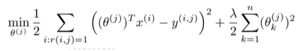

其中$i:r(i,j)$表示我们只计算那些用户$j$评过分的电影。在一般的线性回归模型中，误差项和正则项应该都是乘以$\frac{1}{2m}$在这里我们将$m$去掉。并且我们不对方差项$\theta_0$进行正则化处理。

当构建推荐系统时，我们不仅要学习单个用户的参数，我们要学习的是所有用户的参数，所以我们要在原来的基础上添加一些额外的求和，并最小化这个总体优化目标函数，之后我们就能得到所有用户的参数并对所有用户进行预测。

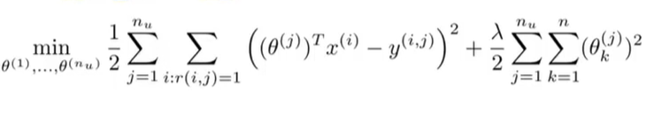

接下来，为了实现最小化，我们使用梯度下降算法：

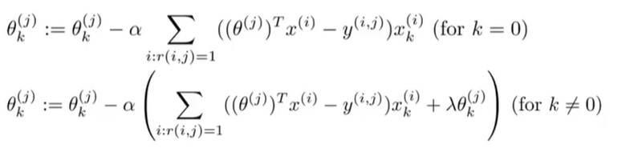

**基于内容的推荐算法是将变量应用到线性回归中，因为我们假设变量是已有的，即我们有描述电影内容的特征量，并用其做出预测**。但是对于许多电影来说，我们并没有这样的特征量，或是很难获取这些特征，所以接下来我们会介绍另一种推荐系统。

## 16.3 协同过滤

### 16.3.1 问题动机

在之前我们的数据集中，我们假定每一部电影都有一些人来评价并告诉我们电影中的一些特征值。但是事实上很难去花费时间以及金钱让每个人都实际地看完每一部电影然后告诉我们这些信息，而且我们通常还想要更多的特征。

所以现在我们假设我们有一个数据集，但是不知道特征值是多少。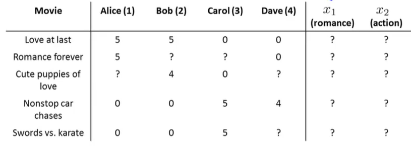

但是我们知道每一位用户对不同种类电影的喜爱程度。所以我们就可以得到四个人的参数如下：

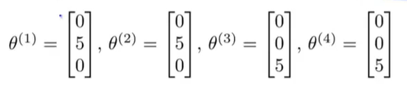

如果我们能够根据用户喜好从他们那里得到这些参数$\theta$的值，那么我们理论上就可以推测出每部电影的$x_1$以及$x_2$的值。比如我们观察电影1，我们只Alice和Bob喜欢这部电影，而Carol和Dave不喜欢它，并且通过每位用户不同的参数，我们大概可以了解到这是一部爱情片而不太可能是动作片。

以上只是一个简化的例子，我们真正需要知道的是，特征向量$x^{(1)}$应该是什么，才能让：
$$
(\theta^{(1)})^Tx^{(1)}\approx 5\\(\theta^{(2)})^Tx^{(1)}\approx 5\\(\theta^{(3)})^Tx^{(1)}\approx 0\\(\theta^{(4)})^Tx^{(1)}\approx 0
$$
一般来说，我们可以继续进行列举，并试着去寻找电影还有什么合适的特征。

### 16.3.2 优化算法

假设我们的用户告诉了我们他们的偏好，即$\theta^{(1)},...,\theta^{(n)}$的值，而我们想要学习电影$i$的特征向量$x^{(i)}$，我们能做的就是提出下列优化问题：

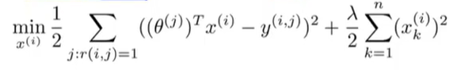

我们要最小化这个平方误差，从而选择特征$x^{(i)}$，让所有已经评价过电影的用户$j$，算法会预测出用户会如何评价某电影，并且这个预测值在平方误差的形式中，要尽量接近于用户实际的评分。

这是我们如何从一部特定的电影中学习到特征的方法，但我们要做的是学习出所有电影的所有特征，所以我们要再加上一个求和项：

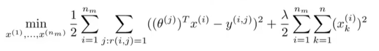

### 16.3.3 协同过滤

+ 在基于内容的推荐算法中，我们是给定$x^{(1)},...x^{(n_m)}$，然后估计$\theta^{(1)},...,\theta^{(n_u)}$。
+ 在协同过滤算法中，我们是给定$\theta^{(1)},...,\theta^{(n_u)}$然后估计$x^{(1)},...x^{(n_m)}$。

则有些类似于鸡和蛋的问题。我们能做的是随机地猜取一些$\theta$值，用它们学习获得不同电影的特征，然后再使用基于内容的推荐算法，更好地对参数$\theta$进行估计，通过这些$\theta$，又能得到更好地特征，以此类推。我们把这个迭代过程不断进行，最终算法将会收敛得到一组合理的电影特征以及一组合理的对不同用户的参数估计。

## 16.4 协同过滤算法

### 16.4.1 协同过滤优化目标

假设我们有电影特征，就能解出下图最小化问题，找到用户参数$\theta$。

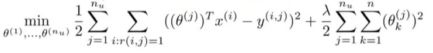

同时，假设我们拥有参数$\theta$，我们也可以用它估计特征$x$。

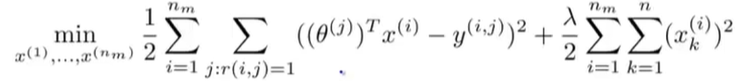

接下来我们要做的就是不停地重复这些计算。但实际上，存在一个更有效的算法能够同时将$x$和$\theta$计算出来。这种方法就是将两个优化目标函数结合起来，定义一个新的优化目标函数$J$。

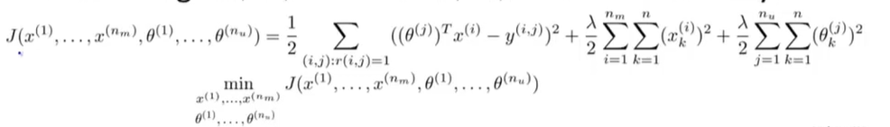

为了更好地理解这个合并的优化目标函数，我们先看：

+ 第一个目标函数中的平方误差项，它是对所有用户$j$的求和，还有所有被该用户评过分的电影总和。这其实是将所有$(i,j)$对全加起来，每一项对应被某一用户评分过的某一电影，$j$求和的意思是对每个用户评分的所有电影求和。

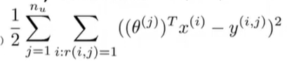

+ 第二个目标函数正好相反，它表示对于每部电影$i$将所有对它评分过的用户$j$求和。

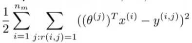

这两个求和运算都是对所有$r(i,j)=1$的$(i,j)$对进行求和，即所有评分的用户-电影对进行求和。

现在我们要做的是将最终的代价函数视为特征$x$和用户参数$\theta$的函数，对其整体最小化，作为一个既关于$x$，又关于$\theta$的函数。这和之前的算法唯一不同的是不需要反复计算。

最后要注意的是，当我们以这种形式去学习特征变量时，我们不再考虑截距项。因为我们现在是在学习所有的特征，我们没有必要将一个特征值硬编码为1，因为如果算法真正需要一个特征永远为1，它可以选择靠自己去获得1这个数值。若果将其定死，算法就丧失了学习的灵活性。

### 16.4.2 协同过滤算法

+ 将参数$x$与$\theta$初始化为一些比较小的随机值。
+ 用梯度下降或其他高级优化算法把代价函数最小化。

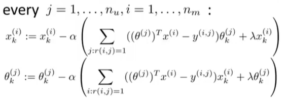

+ 给定一个参数为$\theta$的用户以及一部征为$x$的电影，我们就可以通过计算$\theta^Tx$来预测用户给这部电影的评分。

## 16.5 矢量化：低秩矩阵分解

### 16.5.1 协同过滤

之前，我们介绍了协同过滤算法，现在，让我们来学习一下这个算法的向量化实现。首先先将我们数据集中所有用户对电影的评分写入矩阵中。

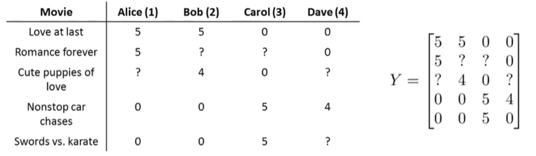

给定矩阵$Y$，我们就可以通过另一种方法写出协同过滤算法的所有预测评分。尤其是如果我们想查看某一个用户对某一个电影的评分预测，用户$j$对电影$i$的评分预测由公式$(\theta^{(j)})(x^{(i)})$给出。

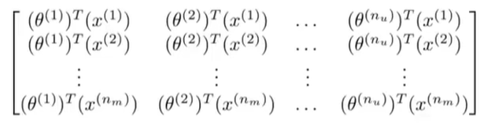

现在，给定这个预测评分矩阵，我们可以使用一个比较简单的向量化方法来写出它们。

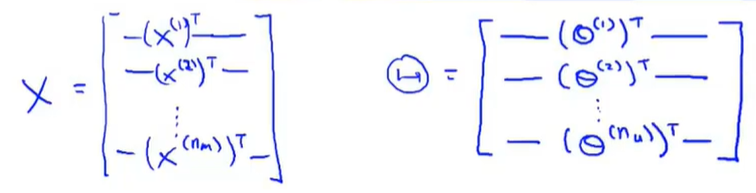

在定义了特征矩阵$X$以及用户矩阵$\Theta$之后，预测矩阵就可以向量化的表示为$X\Theta^T$。

这个协同过滤算法有另一个名字——**低秩矩阵分解(low rank matrix factorization)**。

### 16.5.2 找到相关的电影

协同过滤算法还能实现其他一些功能，例如，给定一个商品，我们就可以找到与之相关的其他商品。

这里，我们还以电影为例。假设对于每一部电影$i$，我们已经学到一个属性向量$x^{(i)}$，其中$x_1=romance,x_2=action,x_3=comedy,x_4=...$。虽然这些特征难以被理解，但通常算法将会学到一些有意义的特征，它可以捕捉到一部电影最重要的特征。

在学习完这些特征以后，如果我们想向喜欢电影$j$的用户推荐新的电影，我们可以衡量两个电影的相似度。例如电影$i$有一个特征向量$x^{(i)}$，如果我们能找到另一个电影$j$，使得$x^{(i)}$和$x^{(j)}$的距离很小，那么就表示这两部电影很相似，就可以给用户推荐这不电影了。

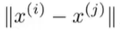

## 16.6 实施细节：均值规范化

### 16.6.1 一个例子

为了更好地理解**均值规范化(mean normalization)**，现在我们假设有一个没有给任何电影评分的用户，现在让我们来看看协同过滤算法会怎么做。

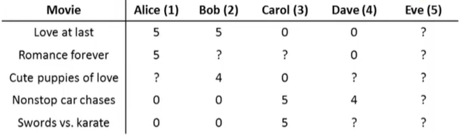假设我们要学习两个特征，即$n=2$，以及Eve的参数向量$\theta^{(5)}\in R^2$。如果我们看优化目标的第一项，由于Eve没有给任何电影打过分，所以对于她来说没有电影满足$r(i,j)=1$这个条件，所以第一项完全不影响$\theta^{(5)}$的值。

真正影响的只有最后的正则化项，所以我们的$\theta^{(5)}$来自于最小化的正则化项。又由于正则化项会让我们的参数接近于0，所以我们会得到$\theta^{(5)}=[0,0]$。

接下来当我们要预测Eve如何给电影打分时，我们会通过$\theta^{(5)}x^{(i)}$来计算，结果一定为0，因此我们将预测她给所有电影的评分都为0。

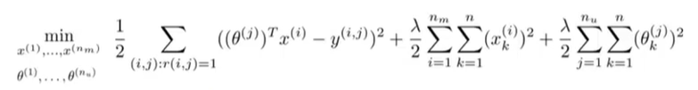

但是当Eva对所有电影评分都为0时，我们无法向她推荐电影，所以这种方法不太好。均值归一化的想法可以让我们解决这个问题。

### 16.6.6 均值归一化

进行均值归一化前，让我们首先把所有用户对电影的评分放到矩阵中。

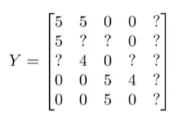

之后计算每个电影所得评分的均值，并将其存在向量$\mu$中。

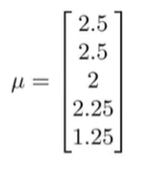

接下来我们要减去均分，得到：

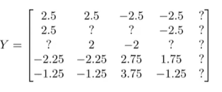

这样做可以将每个电影评分都归一化，使得均分为0。

接下来我们将对均值归一化后的数据集使用协同过滤算法，假设它们就是我从用户那里得到的数据，并用它来学习参数$\theta^{(j)}$和特征$x^{(i)}$。

当我们想要做电影评分预测时，步骤如下：
$$
(\theta^{(j)})^T(x^{(i)})+\mu_i
$$
其中$x$和$\theta$都是从均值归一化的数据集中学习出的参数，但是因为我们已经对数据集减去了均值，所以为了给电影$i$预测评分，我们需要把均值加回来。

具体来说，对于用户Eve，由于她没有给任何一部电影打分，所以$\theta^{(5)}=[0,0]$，之后我们会得到对特定电影$i$，我们预测Eve的评分是$(\theta^{(5)})^T(x^{(i)})+\mu_i$。若$\theta^{(5)}=[0,0]$，即最终的评分将为$\mu_i$。相较于之前评分全是0，这样做更有意义。