# 第十四章 降维

## 14.1 目标I：数据压缩

### 14.1.1 把数据从二维压缩到一维

假设我们收集了一个有很多特征的数据集，我们先在图中画出两个。这两个特征分别是一个物体的长度的单位——厘米(cm)和英寸(inches)，这是一种高度冗余的表示。所以，我们现在想将数据减少到一维。

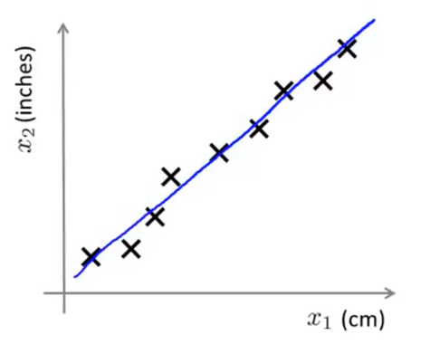

虽然这个例子有些牵强，但是当我们有成千上万个特征时，我们就会很容易混淆。在上图中，厘米长度与英寸长度被四舍五入，这就是为什么这些例子并不是完美地落在一条直线上。

另外一个例子是对飞行员能力进行调查。此时，我们的两个特征分别为飞行员的**驾驶技术(pilot skill)**和飞行员的**快乐程度(pilot enjoyment)**。这两个特征的相关性很强，所以我们可能真正关注的是红色线方向的飞行员**能力(pilot aptitude)**这一特征。

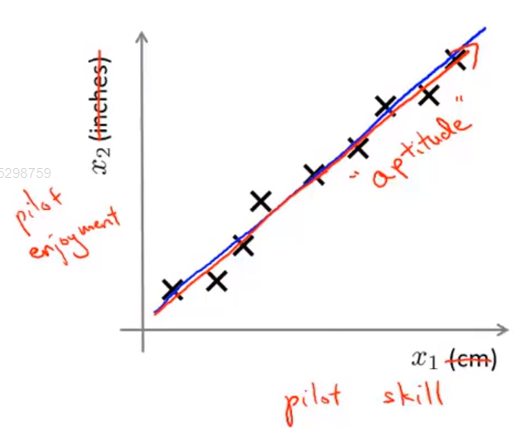

现在让我们把不同的样本用不同的颜色标出来。这里，**降维(reduce the dimension)**可以理解为要找到一条大多数样本所在的线，并且所有数据都投影在上面。

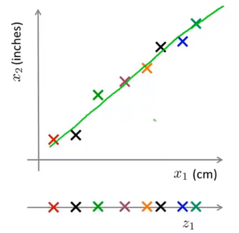

通过这种做法，我们就能够测量出每个样本在线上的位置，并建立新的特征$z_1$。比起之前需要一个二维向量，现在我们只用一个实数就能确定数据的位置。

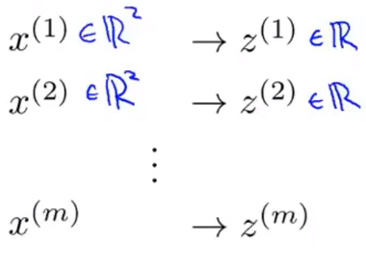

总结来说，我们通过将数据投影在绿色的线上，那么就只需要一个实数就能指定点在直线上的位置，这样就能把内存的需求减半，并让算法运行得更快。

### 14.1.2 把数据从三维压缩到二维

现在假设我们有如图所示的训练集：

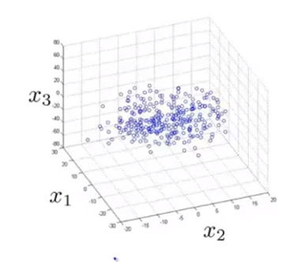

通过观察我们可以看出这些数据其实大概都分布在一个平面内，所以我们降维的方法就是把所有的数据都投影到一个二维平面上，这时，我们的数据就可以用一个二维向量来表示，而不是更加复杂的三维向量了。

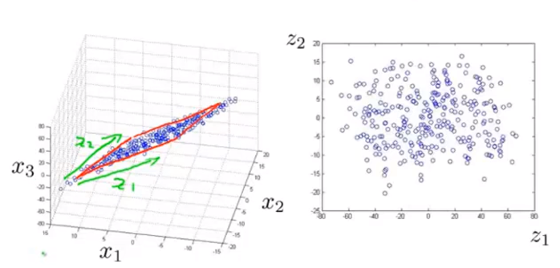

关于这个例子的动态演示可以参考吴恩达机器学习[课时115](<https://study.163.com/course/courseLearn.htm?courseId=1004570029#/learn/video?lessonId=1052316982&courseId=1004570029>)。

## 14.2 目标II：可视化

在许多机器学习问题中，**可视化(visualization)**能很好地帮助我们对学习算法进行优化，并且能更好地了解我们的数据，此时，降维可以帮助我们，让我们看一个例子。加入我们收集了以下数据：

其中包含GDP，人均GDP，人类发展指数，平均寿命等50个特征。若我们想通过可视化去更好地理解这些数据，那我们很难绘制一个50维的数据。

此时，通过降维，相比每个国家都用50维的特征来表示，我们最好用一个二维的向量去表示它。这样做的话，我们就能用两个数字来表述五十个数字，并且把这些国家在二维平面上表示出来。

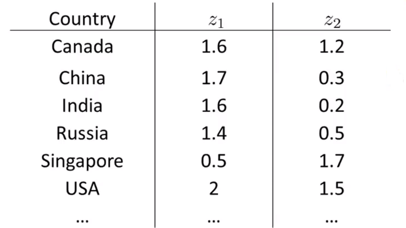

在将数据从五十维降到二维时，降维算法的输出通常不是我们所希望的具有物理意义的特征，我们通常需要明白这些特征大致意味着什么。但是如果我们把这些特征画出来，我们可能从图中找出答案。

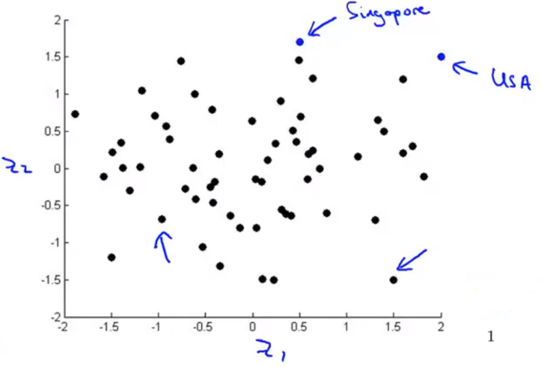

在图中，每一个点表示一个国家。$z_1$轴大致相当于国家的总体规模或是国家的总体经济活跃度，$z_2$大概对应于人均GDP或个人幸福指数。例如，最右上角的国家可能是发达国家，例如美国，它有着较高的GDP并且具有较高的人均GDP。而左下角的国家可能是贫困国家。

## 14.3 主成分分析问题规划I

### 14.3.1 主成分分析问题(principal component analysis PCA)的公式

假设现在我们有一组二维数据，我们想将它降到一维，即找到一条能够将数据投影到上面的直线。我们可能会选择下图中红色的直线，因为所有样本点投影到这条直线的距离都非常小。

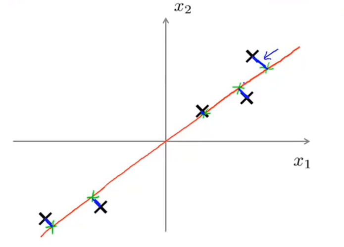

类似的，PCA要做的就是找到一个低维平面，然后将数据投影在上面，并且使蓝色小线段长度的平方和最小。这些蓝色线段有时候也被称为**投影误差(projection error)**。

**另外，再应用PCA之前，常规的做法是先进行均值归一化(mean normalization)和特征规范化(feature scaling)使得两个特征变量其均值为0，并且其数值在课比较的范围之内**。

除了上图中的红色直线外，我们还可以将数据投影在紫色直线上，但这样做投影误差将会非常大，这也是为什么PCA会选择红色的线进行投影而不是紫色的。

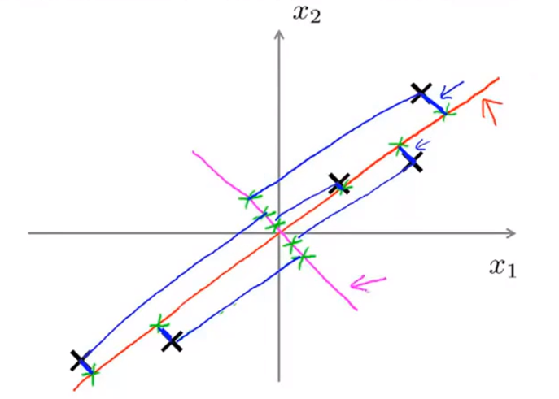

正式的说，PCA做的是，如果想将数据从二维降到一维，我们要试着找一个向量，将数据投影在上面并最小化投影误差。**若PCA得到的向量方向相反，并不影响降维，因为无论向量朝那个方向，数据都会投影在通一条直线上**。

上面的例子描述了数据从二维降到一维的情况。但是在实际应用中，我们一般都会有$N$维数据，并且我们想将其降到$K$维。在这种情况下我们找的就不是单个向量对数据进行投影，而是$K$个方向来对数据进行投影，并最小化投影误差。

让我们来看一个例子。假设我们现在有一个三维的点云，现在，我们要找出一对向量，并通过其确定一个二维平面，之后将数据投影在上面。

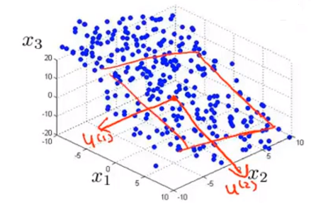

之后，扩展到$N$维数据中，我们就要找出一组$K$维向量，然后将这些数据投影到这$K$个向量展开的线性子空间上，并最小化投影误差。

### 14.3.2 PCA与线性回归的关系

因为在之前二维数据降维到一维数据时，我们画的图类似于线性回归，但事实上，PCA不是线性回归，它们是两种不同的算法。

+ 当我们处理线性回归时，我们要做的是输入$x$的值并预测$y$的值。因此在线性回归中，我们是去拟合一条直线来最小化点和直线之间的平方误差，即最小化下图中蓝色线段（垂直于$x$轴）的平方。

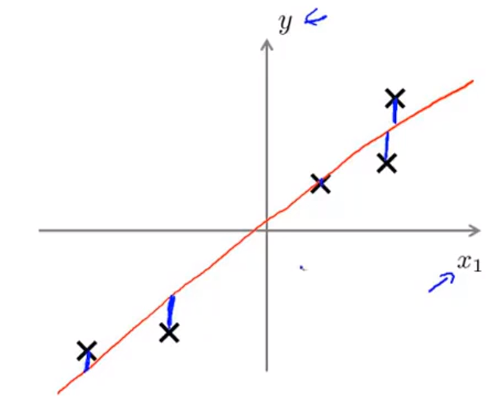

+ 当我们处理PCA时，它要做的是试图最小化这些蓝色线段的长度（垂直于投影直线），即它们的最短正交距离。

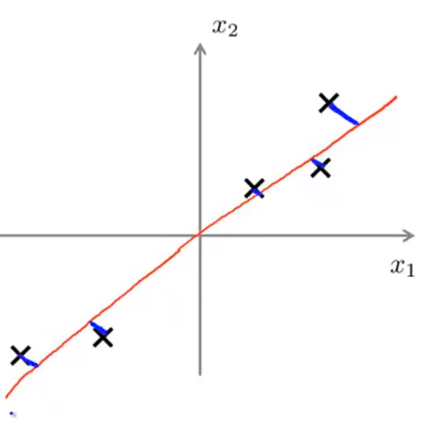

同时，不同的数据集也会产生不同的效果。一般来说，当我们处理线性回归时，我们要试图通过输入的$x$来预测一个特别的变量$y$。然而在PCA中，没有区别对待，其中所有的变量都同等对待，没有一个是特殊的。

## 14.4 主成分分析问题规划II

### 14.4.1 数据预处理

在使用PCA算法前，我们首先要进行**数据预处理(data preprocessing)**。给定一个交易例子的集合，我们一定要执行均值标准化，根据数据的不同，还有可能要进行特征缩放。

对于均值标准化，我们首先计算每个均值的特征，然后用减去它的均值取代每个特征$x$，这将使得每个特征的均值正好为0。

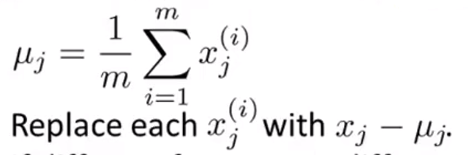

### 14.4.2 PCA算法

在做完数据预处理后，PCA算法就会去试图寻找一个低维子空间对数据进行投影，同时最小化平方投影误差。

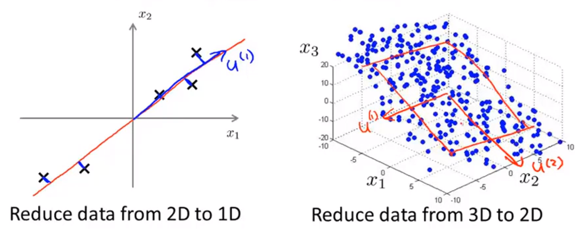

正如前几节所讲，降维使高维的特征可以用低维的新特征去表示，那么我们如何去计算这个新的特征呢？

假设我们想把$n$维的数据降到$k$维，我们要做的是：

+ 首先计算**协方差(convariance matrix)**，用$\Sigma$来表示。

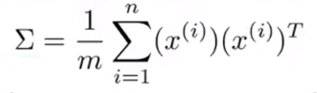

+ 然后在Octave中计算矩阵$\Sigma$的**特征向量(eigenvector)**。在Octave中，svd代表**奇异值分解(singular value decomposition)**。

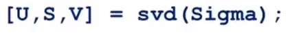

其中，协方差矩阵Sigma是一个$n\times n$维的矩阵，因为协方差的计算公式中$x^{(i)}$是$n\times 1$维向量，$(x^{(i)})^T$是$1\times n$维向量，所以二者做矩阵乘法得到的就是一个$n\times n$维矩阵。svd的输出是三个矩阵$U,S,V$，其中我们真正需要的是矩阵$U$，它也是一个$n\times n$维矩阵。如果我们观察矩阵$U$就会发现它如下图所示：

如果我们想将数据从$n$维减小到$k$维，我们需要做的是提取前$k$个向量，这给定了我们$k$个我们想要投影的方向。

接下来我们要做的是获取我们的原始实数域数据集$x\in R^n$，找到一个低秩的表示$z\in R^k$。具体来说，我们要获取矩阵$U$的前$k$列并构建一个新的$n\times k$维的矩阵$U
_{reduce}$，之后令$z=U
_{reduce}^Tx$。

最后让我们总结一下PCA算法：

+ 进行均值归一化，确保每一个特征都是均值为0的以及进行特征缩放。
+ 数据预处理结束后，计算载体矩阵Sigma。

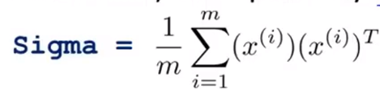

+ 应用svd得到$U,S,D$。

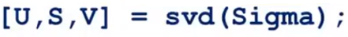

+ 得到要降维的矩阵$U$的前$k$列。

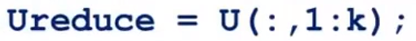

+ 定义如何从一个特征向量$x$到降维的表示$z$。

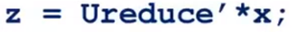

## 14.5 主成分数量选择

由于这节在各大学习网站上的视频都没有中英字幕，因本人水平有限，为了不误导大家，这节直接引用[黄海广博士的笔记](<http://www.ai-start.com/ml2014/html/week8.html#header-n284>)。

主要成分分析是减少投射的平均均方误差。

训练集的方差为：

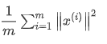

我们希望在平均均方误差与训练集方差的比例尽可能小的情况下选择尽可能小的$k$值。

如果我们希望这个比例小于1%，就意味着原本数据的偏差有99%都保留下来了，如果我们选择保留95%的偏差，便能非常显著地降低模型中特征的维度了。

我们可以先令$k=1$，然后进行主要成分分析，获得$U_{reduce}$和$z$，然后计算比例是否小于1%。如果不是的话再令$k=2$，如此类推，直到找到可以使得比例小于1%的最小$k$值（原因是各个特征之间通常情况存在某种相关性）。

还有一些更好的方式来选择$k$，当我们在**Octave**中调用“**svd**”函数的时候，我们获得三个参数：$U,S,V$。

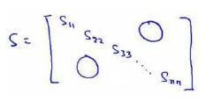

其中的$S$是一个$n\times n$的矩阵，只有对角线上有值，而其它单元都是0，我们可以使用这个矩阵来计算平均均方误差与训练集方差的比例：

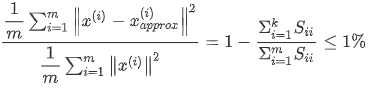

也就是：

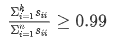

压缩过数据后，我们可以采用如下方法来近似地获得原有的特征：

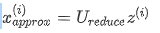

## 14.6 压缩重现

之前，我们一直把PCA 当做一种压缩算法，它可以把一个1000维的数据压缩成100维的特征向量。所以，如果这是一个压缩算法，就应该有办法从这个压缩表示回到原来高维数据的一种近似表示。

在PCA算法中，我们会把样本投影到一条直线上，之后我们就只需要一个实数$z_1$就能表示原来的二维数据。

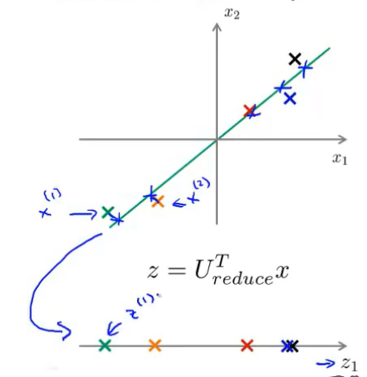

如果我们给定一个$z\in R$，我们要把它映射回一个近似表示$x\in R^2$，及原来的数据，这个方程为$x_{approx}=U_{reduce}z$。并且PCA的意图就是如果平方投影误差不太大，这样$x_{approx}$就会很接近原先用来求$z$的$x$值了，如下图所示：

总的来说，**压缩重现(reconstruction from compressed representation)**就是从低维表示$z$回到未压缩的数据表示，得到一个原来数据$x$的近似。

## 14.7 应用PCA的建议

### 14.7.1 加速监督学习的方法

假设我们的训练样本都是带标签的，并且特征的维度非常高，假设为10000维，例如计算机视觉中的样本。对于这种非常高维的特征，算法的运行效率将会变得非常慢，这事，我们就能用PCA进行降维，从而使算法运行得效率更高。我们一般会：

+ 首先，检查已被标记的训练集，并抽取输入，这样我们就得到一个无标签的训练集。
+ 接下来使用PCA得到原始数据的低维表示，例如1000维。
+ 此时，不同于之前的数据集$(x^{(m)},y^{(m)})$，我们得到了一组新的训练样本$(z^{(m)},y^{(m)})$。
+ 将得到的新的训练样本输入到算法，例如逻辑回归中，学习得到假设函数$h_\theta(z)$。
+ 最后，如果我们有一个新测试样本$x$，我们可以将它通过PCA的映射关系进行映射获得对应的$z$，之后再带入到假设函数中。

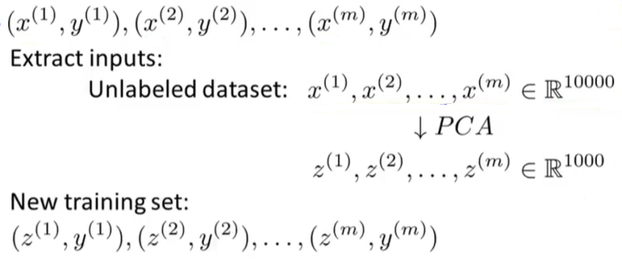

要注意的是，PCA所做的是定义一个从$x$到$z$的映射，这个映射只能通过在训练集上运行的PCA来定义。具体而言，PCA学习得到的这个映射所做的就是计算一系列参数，并进行特征缩放和均值归一化。我们应该只在训练集上拟合这些参数，而不是交叉验证集或者在测试集上。只有在训练集上找到所有这些参数后，就可以把这个映射用在交叉验证集或者测试集的其它样本中了。

其实，在上述例子中我们将10000维的数据减少到1000维，这其实是不切实际的，在许多问题中我们的确能减少数据的维度，大概$\frac{1}{5}$到$\frac{1}{10}$，而且仍然保留大部分的方差，几乎不影响性能，而且使用低维数据，我们的算法会变得更快。

### 14.7.2 PCA的应用

到目前为止，我们所讨论的PCA有如下应用：

+ 压缩数据

  + 减少存储数据所需的硬盘空间。
  + 加速学习算法。
+ 可视化

### 14.7.3 PCA的错误使用：防止过拟合

加入我们有$x^{(i)}$，其有$n$个特征，但如果我们压缩这些数据，将特征数减少到$k$，这个维度比原先低很多，因此，过拟合的可能性会更小。所以，就会有人认为PCA是一种防止过拟合的方法。

这是一种不好的做法。其实，并不是说该方法效果不好，如果用PCA降维去防止过拟合，它的效果可能会很好，**但这不是一种解决过拟合的好的方式**。相反，如果你担心过拟合，用正则化的方法去解决才是最好的方法。

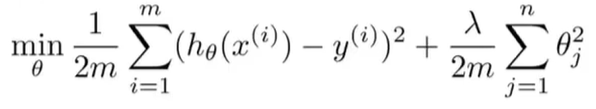

具体的一些细节，我们可以通过回顾PCA的是如何工作的。它不需要使用标签$y$，仅仅使用输入$x^{(i)}$，去寻找低维数据来近似数据，所以**PCA会舍掉一些信息**。所以如果99%的方差信息被保留，但它也会丢失掉一些有价值的信息。事实证明，即使保留了99%的方差，只是用正则化常常会带来与PCA至少一样好的效果，并且正则化的效果通常会更好，**因为当我们使用线性回归或逻辑回归时，最小化问题实际上是知道$y$的值的，所以不会丢失掉一些有价值的信息，而PCA不使用标签，更有可能丢失掉一些有价值的信息**。

### 14.7.4 PCA的其它错误使用

PCA是一个很好的算法，但是许多人却在不该使用它的时候滥用PCA。例如许多人在设计机器学习系统时，会用以下计划：

+ 获取训练集。
+ 运行PCA。
+ 使用逻辑回归训练。
+ 在测试集上进行测试。

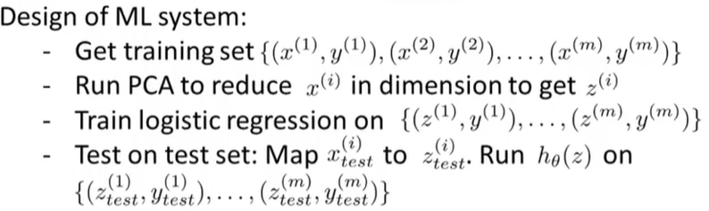

这些人往往都不考虑如果不使用PCA会怎样。**其实，在这里要建议大家直接做我们想做的事，首先使用原始数据，只有在这么做不能达到目的的情况下才考虑使用PCA**。