# 第十章 应用机器学习的建议
## 10.1 决定下一步做什么
### 10.1.1 机器学习中的一些问题
在懂机器学习的人当中，依然存在着很大的差距，一部分人确实掌握了怎样高效有力地运用这些学习算法。而另一些人可能就不是那么熟悉了。他们可能没有完全理解怎样运用这些算法，因此总是把时间浪费在毫无意义的尝试上。我们要做的是确保你在设计机器学习的系统时，你能够明白怎样选择一条最合适、最正确的道路。

为了解决这一问题，我们仍然使用房价预测的例子。假如你我们经完成了正则化线性回归，也就是最小化代价函数$J$的值。在你得到你的学习参数以后，你要将你的假设函数放到一组新的房屋样本上进行测试。假如说你发现在预测房价时产生了巨大的误差，现在你的问题是要想改进这个算法，接下来应该怎么办？

+ 获取更多的训练样本。（有时候获得更多的训练数据实际上并没有作用）
+ 尝试选用更少的特征。（熊特征中仔细挑选一部分来防止过拟合）
+ 尝试选用更多的特征。
+ 增加多项式特征的方法。
+ 减小正则化参数$\lambda$。
+ 增大正则化参数$\lambda$。

上面的每一条建议可能都会需要大量的时间，并且最后得到的效果不一定会很好。接下来我们会介绍一种方法，教你合理的去选择上面的建议。
### 10.1.2 机器学习诊断法(machine learning diagnostic)
这里所谓的**诊断(diagnostic)**指的是一种测试法，我们通过执行这种测试，能够了解算法在哪里出了问题，并且告诉你想要改进一种算法的效果，什么样的尝试才是有意义的。

诊断法的执行和实现是需要花些时间来理解和实现，但是这么做确实是把时间用在了“刀刃”上。它能帮你节约时间，提早发现某些方法是无效的。

## 10.2 评估假设

### 10.2.1 评估你的假设函数

当我们确定学习算法的参数的时候，我们考虑的是选择参量来使训练误差最小化。**但事实证明，仅仅是因为这个假设具有很小的训练误差，并不能说明它就一定是一个好的假设函数**。例如之前的过拟合假设函数的例子，它推广到新的训练集上是不适用的。

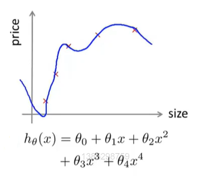

那么如何判断一个假设是否过拟合呢？通常在一个简单的例子中，我们可以通过画图来观察假设函数是否过拟合，但对于有很多特征的例子，想要通过画出假设函数来观察其是否过拟合就变得很难甚至是不可能的了。

### 10.2.2 评估假设函数的方法

假设我们有一组数据，现在为了确保我们能对假设函数进行评估，我们要将这些数据分成两部分。第一部分是训练集，第二部分是测试集。其中，一种对数据分割的典型方法是按7:3的比例分割。

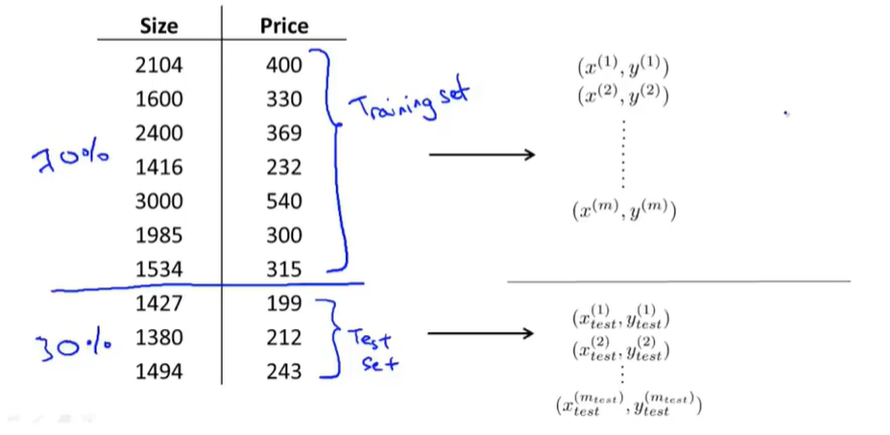

分割后，我们仍用$m$来表示训练样本的总数，用$m_{test}$来表示测试样本的总数。**最后要强调的是，我们的数据最好是无序、随机的**。

### 10.2.3 评估假设函数的例子

在训练/测试线性回归时，我们可以采用以下步骤：

+ 首先，你需要对训练集进行学习得到参数$\theta$（最小化训练误差$J(\theta)$）。注意，这里使用的是训练集中70%的数据。
+ 计算出测试误差$J_{test}(\theta)$。具体的方法是将你在训练集中学习得到的参数$\theta$放到测试误差中，并计算出测试误差：

$$
J_{test}(\theta)=\frac{1}{2m_{test}}\sum_{i=1}^{m_{test}}(h_\theta(x_{test}^{(i)})-y_{test}^{(i)})^2
$$

对于分类问题，比如使用逻辑回归时，我们可以采用以下步骤：

+ 首先，我们要从70%的训练数据中学习得到参数$\theta$。
+ 计算出测试误差$J_{test}(\theta)$：

$$
J_{test}(\theta)=-\frac{1}{m_{test}}\sum_{i=1}^{m_{test}}y_{test}^{(i)}\log h_\theta(x_{test}^{(i)})+(1-y_{test}^{(i)})\log h_\theta(x_{test}^{(i)})
$$

+ 错误分类(0/1错误分类)：

$$
err(h_\theta(x),y)=
\begin{cases}
1& \text{if $h_\theta\geq0.5,y=0$}\\
& \text{if $h_\theta<0.5,y=1$}\\
0& \text{otherwise}
\end{cases}
$$

​	这样，我们就能应用错误分类误差来定义测试误差：
$$
Test\space error=\frac{1}{m_{test}}\sum_{i=1}^{m_{test}}err(h_\theta(x_{m_{test}}^{(i)}),y_{test}^{(i)})
$$

## 10.3 模型选择和训练、验证测试集

### 10.3.1 过拟合问题

在前面我们已经接触过许多会过拟合问题了。在过拟合的情况中学习算法，即便对训练集拟合的很好，也并不代表这是一个好的假设。这就是为什么训练集误差不能用来判断该假设对新样本的拟合好坏。

通常情况下，如果你的参数对某个数据集拟合的很好，比如训练集或是其他数据集，那么用统一数据集计算得到的误差，比如训练误差，并不能很好地估计出实际的泛化误差，即该假设对新样本的泛化能力。

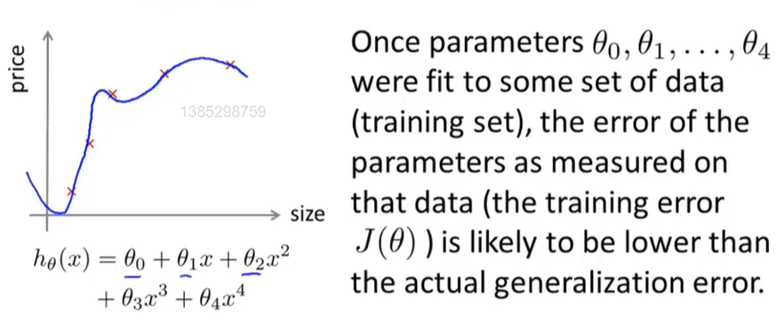

### 10.3.2 模型选择中的问题

假如你现在要选择能最好地拟合数据的多项式次数，我们先定义一个新的参数$d$，用它代表你应该选择的多项式次数。

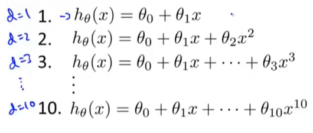

假设我们现在要在上图10个模型中选择一个，即一个多项式次数，用它来拟合模型并估计这个拟合好的模型的假设对新样本的泛化能力，我们可以一次选择每个模型，然后最小化训练误差，得到参数向量$\theta^{(i)}$。

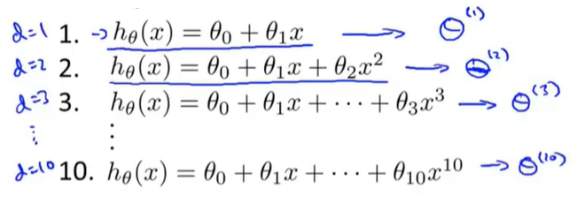

接下来，我们要对所有这些模型求出测试集误差$J_{test}(\theta^{(i)})$。即取每一个假设和它相应的参数，然后计算出它在测试集的性能。

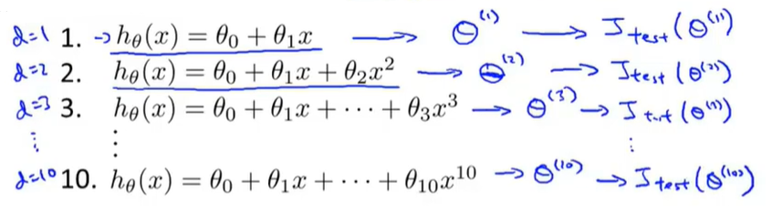

最后，为了在这些模型中选出最好的一个，我们应该看哪一个模型有最小的测试误差。现在假设我们选择了$d=5$的模型，即五次多项式模型，现在我们想知道的是这个模型的泛化能力如何。

我们可以观察这个五次多项式假设模型对测试集的拟合情况，但这样仍然不能公平的估计出这个假设的泛化能力。其原因在于我们使用**测试集**拟合了一个额外的参数$d$，因此，我们的参数向量$\theta^{(5)}$在测试集上的性能很可能是对泛化误差过于乐观的估计，假设很可能对于测试集的表现好过新的数据集。

### 10.3.3 假设分析

为了解决模型选择的问题，我们会通过将数据分为**训练集(training set)**，**交叉验证集(cross validation set)**和**训练集(test set)**。这些数据典型的分配比例是3:1:1。

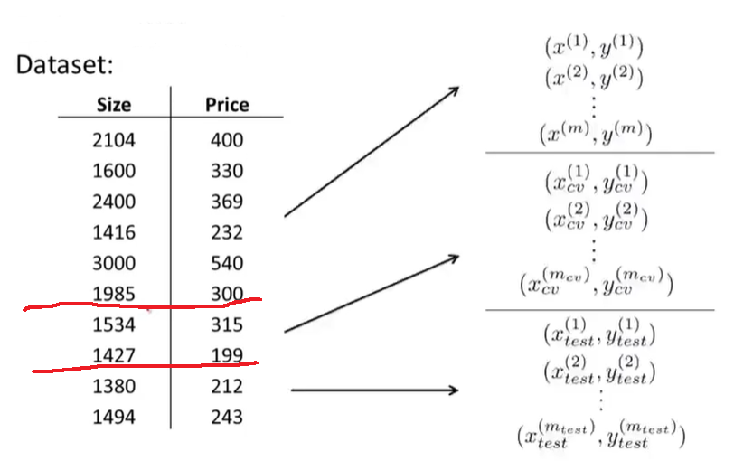

在定义完训练集，交叉验证集和训练集之后，我们就可以定义训练误差。

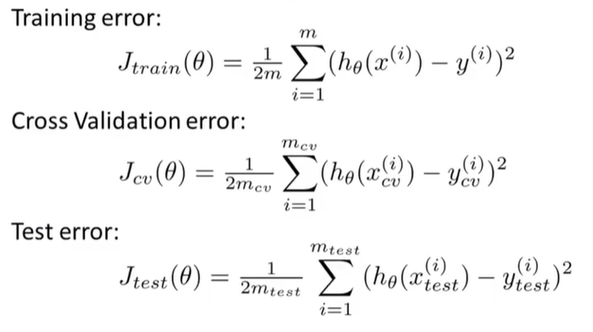

### 10.3.4 模型的最终选择

现在，在面对之前模型选择的问题时，我们先对每一个模型，最小化其代价函数，的到对应模型的一个参数向量$\theta^{(i)}$。接下来，我们不像原来一样用测试集来测试这些假设，而是用交叉验证集来测试，然后计算出$J_{cv}(\theta^{(i)})$来观察这些假设模型在交叉验证集上的效果如何，。然后我们选择交叉验证误差最小的假设作为我们的模型。

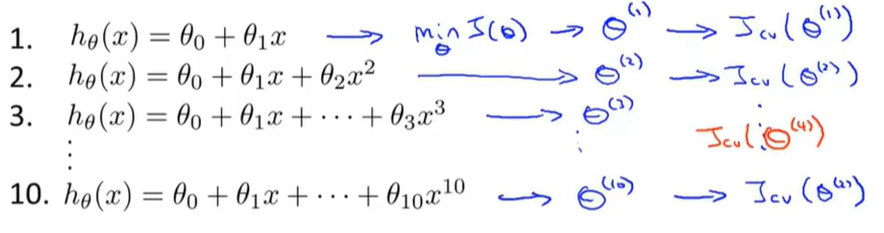

现假设$d=4$的模型是最好的，之后，我们就可以用剩下的测试集计算出$J_{test}(\theta^{(4)})$，并用它来衡量我们选出的模型的泛化误差了。

## 10.4 诊断偏差与方差

当你运行一个学习算法时，如果这个算法的表现不理想，那么多半是出现两种情况：要么是**偏差(bias)**比较大，要么是**方差(variance)**比较大。换句话说，出现的情况要么是欠拟合，要么是过拟合问题。

### 10.4.1 偏差/方差

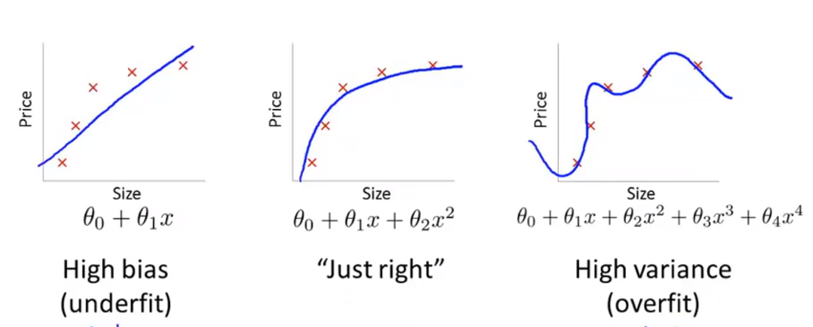

像之前一样，如果用一条简单的直线来拟合数据，可能会造成欠拟合，出现**高偏差(high bias)的问题**；而如果用很复杂的假设来拟合时，可能会完美拟合训练集，但是会过拟合,出现高**方差(high variance)**的问题；而用中等复杂度的假设，对数据的拟合可能刚刚好。

### 10.4.2 判断偏差与方差

我们通常会通过将训练集和交叉验证集的代价函数误差与多项式的次数绘制在同一张图表上来帮助分析：

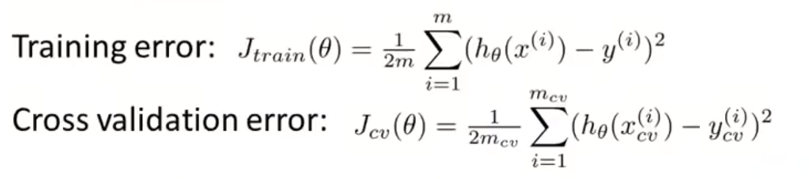

下面让我们画出这个示意图。横坐标表示多项式的次数，例如，在图的左边，假设$d=1$，对应简单的函数；而在横坐标的右边，$d$的值比较大对应更复杂的函数。让我们来把训练误差和交叉验证误差画在这张图上。

对于训练误差来说，我们的训练集将会拟合的越来越好，即如果$d=1$，则对应较大的训练误差，而如果多项式次数很高时，训练误差将会很低。这里我们用紫色的线表示$J_{train}(\theta)$。对于交叉验证误差，如果$d=1$，意味着用一个简单函数来拟合，这不能很好地拟合训练集，所以交叉验证误差比较大；如果用中等大小的多项式来拟合时，那我们会得到一个更小的交叉验证误差；如果$d$太大，那就会出现过拟合的情况，交叉验证误差会很大。这里我们用红色的线表示$J_{cv}(\theta)$。

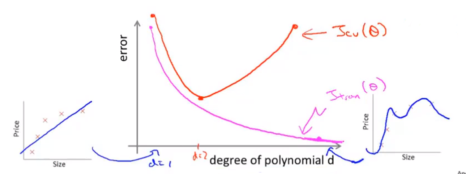

通过这幅图，我们也能更好地理解偏差和方差的概念。具体来说，假设我们提出了一个学习算法，而这个算法却并没有表现得像你期望的这么好（训练误差或交叉验证误差太大），我们可以通过如下方法来判断我们的模型出现的问题：

+ 高偏差（欠拟合）：
  + $J_{train}(\theta)$将会很大。
  + $J_{train}(\theta)\approx J_{cv}(\theta)$。
+ 高方差（过拟合）：
  + $J_{train}(\theta)$将会很小。
  + $J_{cv}(\theta)>>J_{train}(\theta)$。

## 10.5 正则化和偏差，方差

### 10.5.1 线性回归与正则化

假设我们要对一个高阶多项式进行拟合，为了防止过拟合，我们要给损失函数加上一个正则化项，让参数尽可能的小。

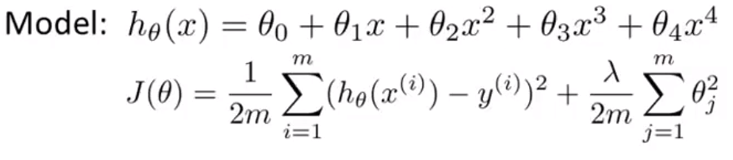

在此前提下，让我们考略三种情况。

+ 第一种情况是$\lambda$非常大。在这种情况下，所有的参数将会被“惩罚“的很重，基本上都接近于0，所以最终得到的假假设函数是一条近似水平的直线。因此这个假设处于高偏差，对数据及严重欠拟合。
+ 第二种情况是$\lambda$非常小。假设此时$\lambda=0$，这时我们对所有参数几乎没有“惩罚”，通常会得到高方差，结果过拟合。
+ 第三种情况是$\lambda$大小适中。这时我们才能得到一组对数据处理比较合理的$\theta$参数值。

### 10.5.2 选择正则化参数$\lambda$

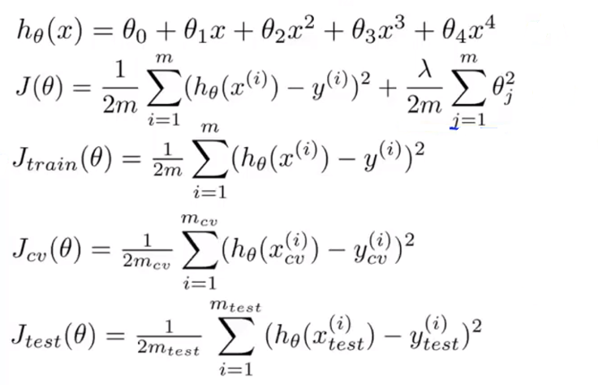

上述公式中，第一个公式是我们的模型，第二个公式是学习算法的目标，最后三个公式都是平均的误差平方或是不使用正则化项时训练集、验证集合测试集的误差平方和的一半。

我们自动选择正则化参数的方法如下：

+ 选取一系列想要尝试的$\lambda$值。

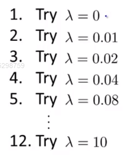

+ 从第一个模型开始，最小化代价函数$J(\theta)$。这样我们就能得到参数向量$\theta^{(i)}$。

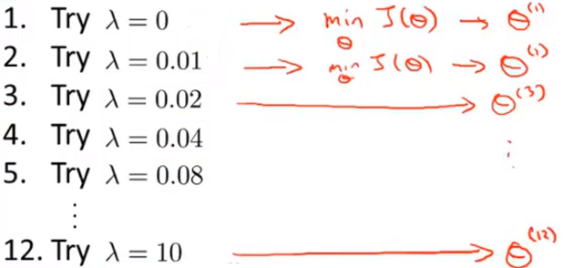

+ 接下来我们可以利用这些参数，用交叉验证集来评价它们

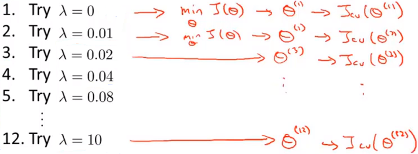

+ 最后，我们选取所有模型中交叉验证集误差最小的那个模型。

### 10.5.3 偏差/方差关于正则化参数$\lambda$的函数

在这里，我们要把训练误差和交叉验证误差画在一张图上，用来观察正则化参数变化时，它们的表现如何。

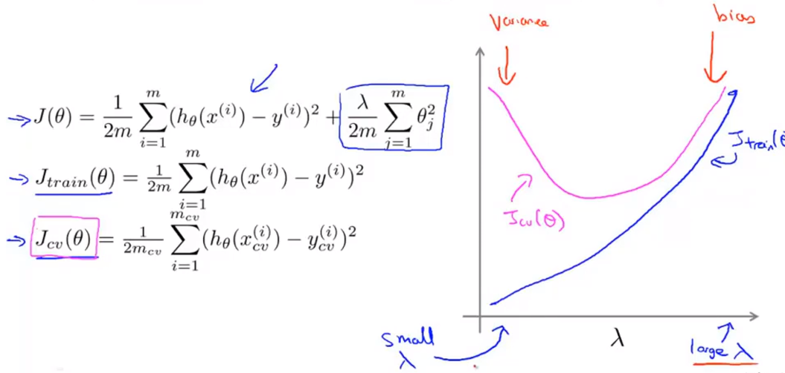

**如果$\lambda$很小，说明几乎没有使用正则化，过拟合，高方差；如果$\lambda$很大，欠拟合，高偏差**。所以对于$J_{train}(\theta)$来说，$\lambda$很小时，$J_{train}(\theta)$很小，$\lambda$很大时，$J_{train}(\theta)$很大。对于$J_{cv}(\theta)$来说，无论$\lambda$和大或是很小，分别会出现欠拟合和过拟合的问题，所以误差都会很大。总会有中间的某个$\lambda$值刚好合适。

## 10.6 学习曲线

### 10.6.1 绘制学习曲线

学习曲线是将训练集误差和交叉验证集误差作为训练集样本数量（$m$）的函数绘制的图表。我们可以使用学习曲线来判断某一个学习算法是否处于偏差、方差问题。学习曲线是学习算法的一个很好的**合理检验**（**sanity check**）。

为了绘制学习曲线，我们一般先绘制出训练集的平均误差平方和$J_{train}(\theta)$或者交叉验证集的平均误差平方和$J_{cv}(\theta)$关于参数$m$（样本数量）的函数。假设现在我们有100个训练样本，但我们要认为的减小训练集，限制自己只使用10,20,30或40个训练样本，然后画出这些小训练集的误差图像。

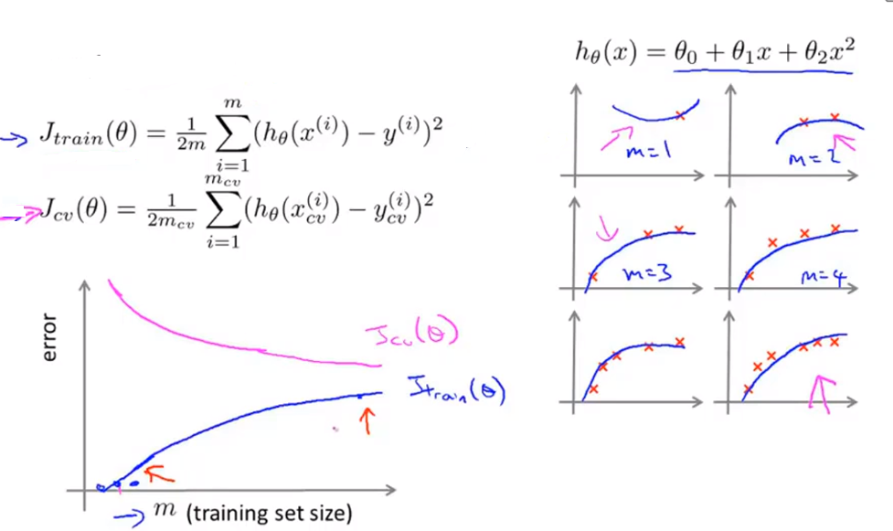

现假设我们只有一个训练样本，并用二次函数来拟合。由于只有一个训练样本，拟合的结果很好；如果有两个训练样本，二次函数也能够很好地拟合；同样的，二次函数也能很好地拟合三个训练样本。即$m\leq3$时，训练误差均为0，训练误差的值很小。当$m$逐渐增大时，将每一个数据都拟合的很好就变得越来越困难，训练误差的值变大。

交叉验证集相反。价差验证集的误差就是在没有见过的交叉验证集上的误差。当训练集很小的时候，泛化程度不会很好。使用一个更大的训练集时，才有可能得到能够更好拟合数据的假设。

**总的来说，当训练较少行数据的时候，训练的模型将能够非常完美地适应较少的训练数据，但是训练出来的模型却不能很好地适应交叉验证集数据或测试集数据**。

### 10.6.2 高偏差情况下的学习曲线

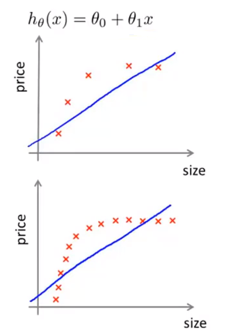

在高偏差的情况下，我们用一条直线来拟合数据，当只有五个训练数据时假设如图。当我们增大样本容量时，这条直线基本不会改变。

随着数据量的增加，我们会得到跟之前的假设差不多的一条直线。当$m$增大到某个值时，就会找到那条最可能你和数据的直线，泛化效果依旧很差，所以交叉验证集误差会很快水平，不再变化。又因为参数很少，数据很大，训练集误差和交叉验证集误差将会非常接近。

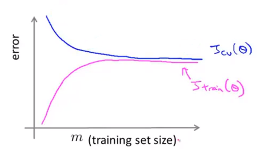

要补充的是，高偏差问题可以由很高的交叉验证误差和训练误差反应出来。同时，**如果一个学习算法有高偏差，随着我们增加训练样本对于改善算法表现无益**。

### 10.6.3 高方差情况下的学习曲线

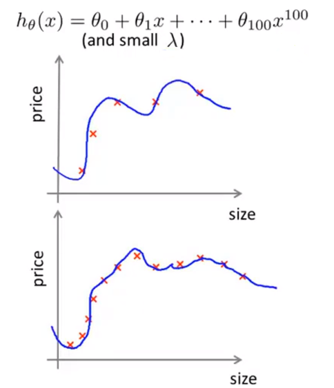

在高方差的情况下，我们用很高次的多项式以及很小的正则化参数$\lambda$拟合数据，当只有五个训练数据时我们会拟合的非常好。当我们增大样本容量时，可能还是会出现过拟合的情况，但是对数据的拟合变难了。

随着数据量的增加，我们会发现训练集误差的值也随之增大，但是由于还是存在过拟合的现象，总的来说训练集误差还是很小。在高方差的情形中，机设函数对数据过拟合，因此交叉验证误差将会一直非常大。

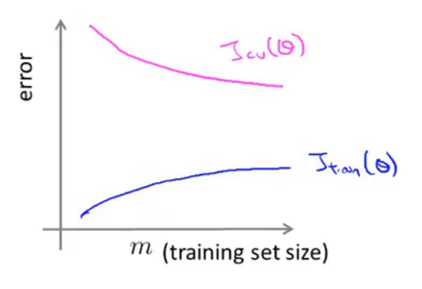

在高方差的情况下，训练误差和交叉验证误差之间有一段很大的距离。在高方差的情况下，增加样本数量对改进算法是有帮助的。

## 10.7 决定接下来做什么

我们已经介绍了怎样评价一个学习算法，其中讨论了模型选择问题，偏差和方差的问题。那么这些诊断法则怎样帮助我们判断，哪些方法可能有助于改进学习算法的效果，而哪些可能是徒劳的呢？让我们再次回到最开始的例子，在那里寻找答案。

### 10.7.1 在线性回归中应该如何做

假设我们使用带正则化的线性回归预测房价，然而，当你使用心得测试集去测试你的假设时，你发现出现了许多错误，那么接下来，我们可以：

+ 收集更多的训练数据集。     ->解决高方差问题。
+ 减少特征数量。                     ->解决高方差问题。
+ 增加特征数量。                     ->解决高偏差问题。
+ 增加多项式特征。                 ->解决高偏差问题。
+ 增大$\lambda$。                                  ->解决高偏差问题。（$\lambda$减小，$\theta$增大,拟合更好）
+ 减小$\lambda$。                                  ->解决高方差问题。（$\lambda$增大，$\theta$减小,拟合更差）

### 10.7.2 在神经网络中应该如何做

当你在进行神经网络的拟合的时候，其中一个选择是选用更简单的神经网络模型，比如只有很少甚至只有一个隐藏层并且只有少量隐藏单元。**这样的神经网络参数不会很多，容易欠拟合**。但是计算量比较小。

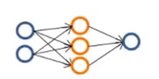

与之相对的另外一种情况是，拟合较大型的神经网络，比如每一层中的隐藏单元数很多，或者有多个隐藏层。**这种比较复杂的神经络参数一般比较多，更容易出现过拟合**。如果出现过拟合，可以使用正则化方法来修正。这种结构一般计算量比较大。

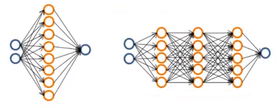

对于神经网络层数的选择，通常使用一个隐藏层是比较合理的默认选项。