>搜索微信公众号:‘AI-ming3526’或者’计算机视觉这件小事’ 获取更多人工智能、机器学习干货

>csdn：https://blog.csdn.net/qq_36645271

>github：https://github.com/aimi-cn/AILearners
# 第四章 多变量线性回归

## 4.1 多维特征

在之前的章节中，我们学习了单变量线性回归，及模型中只包含一个变量（特征）。但是我们清楚，在使用机器学习算法去解决一个实际问题时，只包含一个变量（特征）的模型是不能够满足我们的需求的，所以在这里，我们将从例子、定义以及模型三个方面来介绍**多变量(multiple variables/features)线性回归**。

### 4.1.1 一个小例子

这里我们还以之前的房价预测为例，我们为这个模型加入例如卧室数量、楼层数以及房子的使用时长等多个特征，构成一个含有多个变量的模型，模型中的特征为$(x_1,x_2,...,x_n)$。

对于这个问题，我们就需要对这个含有多个变量的问题进行建模。

### 4.1.2 定义

+ $n$ = 特征的数量(number of features)
+ $x^{(i)}$ = 输入的第$i$个训练样本的特征(input of $i^{th}$ training example)
+ $x_j^{(i)}$ = 输入的第$i$个训练样本的特征的值(value of feature $j$ in $i^{th}$ training example)

例如，在上面的例子中，$n$ = 4，$x^{(2)} = \left[
\begin{matrix}
1416\\
3\\
2\\
40\end{matrix}
\right]$，$x_3^{2}$ = 2。

### 4.1.3 假设函数

+ **单变量线性回归**：$h_\theta (x) = \theta_0+\theta_1 x$
+ **多变量线性回归**：$h_\theta (x) = \theta_0+\theta_1 x_1+\theta_2 x_2+...+\theta_n x_n$

在多变量线性回归的模型公式中，有$n+1$个参数和$n$个变量，为了方便表示，将$x_0$的值设为1($x_0^{(i)}=1$)，所以特征向量$x$是一个从0开始标记的$n+1$维向量。即
$$
x = \left[
\begin{matrix}
x_0\\
x_1\\
x_2\\
...\\
x_n\end{matrix}
\right]\in R^{n+1}
,\theta = \left[
\begin{matrix}
\theta_0\\
\theta_1\\
\theta_2\\
...\\
\theta_n\end{matrix}
\right]\in R^{n+1}\\
h_\theta x = \theta_0+\theta_1 x_1+\theta_2 x_2+...+\theta_n x_n=\theta^Tx
$$

## 4.2 多变量线性回归中的梯度下降

### 4.2.1 多变量线性回归中的梯度下降的定义

与单变量线性回归类似，在多变量线性回归中，我们也构建一个表示所有建模误差的平方和的代价函数。

+ **假设(hypothesis)**：$h_\theta (x) = \theta_0+\theta_1 x_1+\theta_2 x_2+...+\theta_n x_n=\theta^T x$
+ **参数(parameters)**：$\theta_0,\theta_1,\theta_2,...,\theta_n$
+ **代价函数(cost function)**：$J(\theta_0,\theta_1,\theta_2,...,\theta_n)= \frac{1}{2m}\sum_{i=1}^m(h_\theta(x^{i})-y^{i})^2$
+ **梯度下降(gradient descent)**：

即，

### 4.2.2 多变量线性回归中的梯度下降与单变量的对比

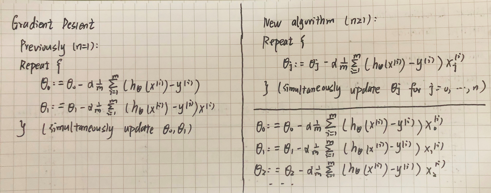

在多变量线性回归梯度下降中，我们可以发现第一条更新规则（$\theta_0$的更新规则）与之前相同，因为我们之前有$x^{i}_0=1$的规定。$\theta_1$的更新规则也与之前相同，只不过这里我们使用$x_1$来表示第一个特征量。现在，我们有多个特征值，那么我们就可以用相似的更新规则。

## 4.3 梯度下降法实践1-特征缩放

### 4.3.1 特征缩放(feature scaling)

**特征缩放(feature scaling)**，是为了保证在面对多为特征问题时，让这些特征都具有相近似的尺度。

例如在房价预测的例子中，假设我们有两个特征$x_1=$房屋面积(0-2000),$x_2=$卧室数量(1-5)。这样的特征选择会让随时函数的图像为一个又高又瘦的椭圆形等线图。在这种椭圆上使用梯度下降法，你的梯度最终可能需要花很长一段时间并且可能会来回波动，最终才能收敛到全局最小值。**解决这种问题有效方法是进行特征缩放**。

在这里，我们令
$$
x_1=\frac{房屋面积}{2000}(0\leq x_1\leq1)\\
x_2=\frac{卧室数量}{5}(0\leq x_2\leq1)
$$

这样做是为了确保所有特征都能尽量缩放到$-1\leq x\leq1$之间**。其实这里的区间并不是固定的，只要合理，能让不同的特征方索道一个近似相同的区间，梯度下降就会正常工作。

### 4.3.2 均值归一化(mean normalization)
**均值归一化(mean normalization)**，是用特征缩放中的$x_i-\mu_i$来替换$x_i$从而让特征有接近0的均值。之后$x_j=\frac{x_j-\mu_j}{s_j}$，其中，$\mu_j$是特征$x_j$在训练集中的平均值，$s_j$是这个特征值的范围（最大值-最小值）。**很显然，我们不需要把这一步应用到$x_0$中，因为$x_0$总是等于1**。

回到上面房价预预测的例子中，令
$$
x_1=\frac{房屋面积-1000}{2000}(平均面积=1000)(-0.5\leq x_1\leq0.5)\\
x_2=\frac{卧室数量-2}{5}(平均卧室数量=2)(-0.5\leq x_2\leq0.5)
$$
其实特征缩放的范围都是一个近似值而不是固定值，只要将特征装换为将近似的范围都是可以的。**特征缩放其实并不需要太精确，它只是为了让梯度下降能够运行的更快一点，收敛所需的迭代次数更少一点而已**。

## 4.4 梯度下降法实践2-学习率

### 4.4.1 梯度下降回顾

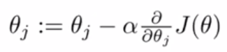

梯度下降法的更新规则如上，那么在我们使用这个更新规则时，有以下两个问题：

+ "调试(debugging)"：如何确保梯度下降算法正常工作？
+ 如何选择学习率$\alpha$？

### 4.4.2 确保梯度下降正确运行

梯度下降算法所做的事情就是找到一个$\theta$的值，并希望它能够最小化代价函数$J(\theta)$。我们很难提前判断出梯度下降算法需要多少次迭代才能收敛，所以我们通常画出代价函数$J(\theta)$随迭代次数的变化的函数图像，进而**对梯度下降过程进行监控**。

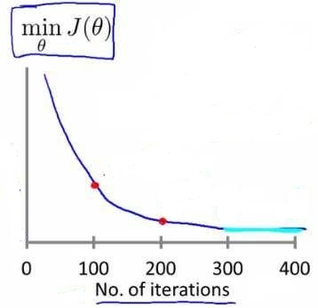

如果梯度下降算法正常运行，$J(\theta)$应该在每次迭代后都会下降，直到最后收敛。

另外也可以进行一些自动的收敛测试，也就是让一种算法来告诉你梯度下降算法是否已经收敛——如果代价函数$J(\theta)$一步迭代后的下降小于一个很小的值$\epsilon$，这个测试就判断函数已收敛。**实际上阈值$\epsilon$是非常难选择的，画图的方法更好一些**！

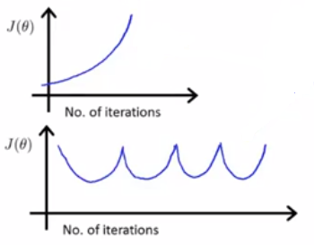

当我们观察到代价函数$J(\theta)$随迭代次数的变化的函数图像如上图所示时，说明梯度下降算法没有正常工作，应该使用一个更小的学习率$\alpha$。数学家已经证明：

+ 只要学习率$\alpha$足够小， 那么每次迭代之后代价函数$J(\theta)$都会下降。
+ 但如果学习率$\alpha$太小，梯度下降算法可能会收敛的很慢。

### 4.4.3 总结

+ 如果学习率$\alpha$太小：收敛缓慢。
+ 如果学习率$\alpha$太大：可能不会在每一次迭代后收敛；可能越过局部最小值导致发散。
+ 建议尝试的学习率$\alpha$的大小：0.001；0.01；0.1；1......（每隔10倍取一个值）。

## 4.5 特征和多项式回归

### 4.5.1 特征选择

在这里，我们还以房价预测为例：

假设你有两个特征，分别是房子临街的宽度(frontage)和垂直宽度(depth)，那么我们可以建立一个线性回归模型:

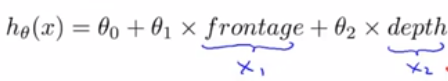

但是当你在运用线性回归时，你不一定非要直接用给出的$x_1,x_2$作为特征，其实我们可以创造新的特征。例如在上述预测房价的例子中，我们可以认为真正能够决定房子大小的是我们所拥有的土地面积的大小，因此我们也已创建一个新特征$Area(x)=frontage(x_1)\times depth(x_2)$。于是我可以将这个式子作为我们新的假设函数$h_\theta(x)=\theta_0+\theta_1x$。**有时候通过定义新的特征，可能会得到一个更好地模型**。

### 4.5.2 函数模型选择

有时候直线可能并不适合去拟合所有的数据，曲线可能是一个更好地选择。如下图所给出的数据点。

在上图中二次函数对数据前半段拟合的很好，但是后半段由于二次函数的性质，曲线下降，不能很好地拟合后半段数据，所以这里三次函数更适合。**我们可以使用多元线性回归(multiple linear regression)的方法将模型与数据进行拟合**。

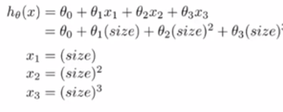

为了将这两个定义相互对应起来，我们将$x_1$特征设为房子的面积，将$x_2$特征设为房子面积的平方，将$x_3$特征设为房子面积的立方，然后再应用线性回归的方法，我们就可以拟合这个模型。**如果行这样进行特征选择，特征缩放就显得更为重要了**。

除了三次方函数，凭借对其他函数图像及性质的了解，我们还有更加合理的选择，如平方根函数：

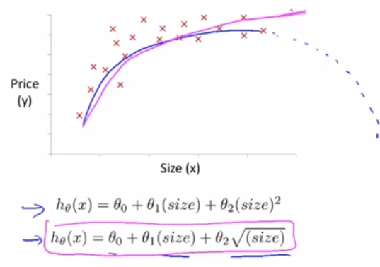

## 4.6 正规方程

到目前为止，我们都在使用梯度下降算法，它**是一种迭代算法，经过梯度下降的多次迭代来收敛到全局最小值**。相反的，**正规方程(normal equation)**提供了一种求$\theta$的解析解法，所以我们不再需要运行迭代算法，而是可以直接一次性求解$\theta$的最优值。**可以说只需要一步就能得到最优值**。

### 4.6.1 对正规方程的理解

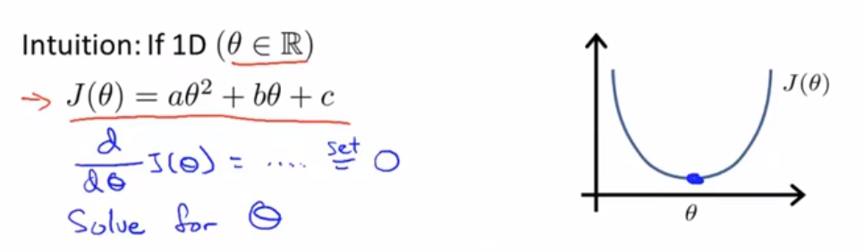

在上面这个简单的例子中我们可以看到，要想解得使$J(\theta)$最小的$\theta$，只需要让$J(\theta)$关于$\theta$的导数等于0，之后解出的$\theta$值即可。但在实际问题中，参数$\theta$往往不是一个实数，而是一个$n+1$维的向量，代价函数是这个向量的函数，如下图所示：

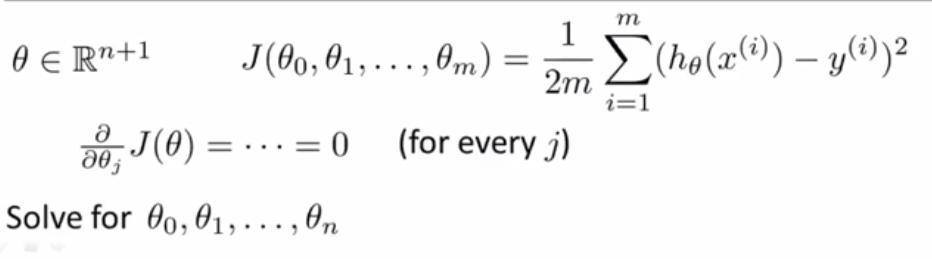

那么有最小化这个代价函数，就要对参数$\theta_j$求$J$的偏导数，然后把它们全部置0，然后求出$\theta_0,\theta_1,...,\theta_n$的值，这样就能得到最小化代价函数$J$的$\theta$值。

现在让我们通过一个例子来进一步理解正规方程。

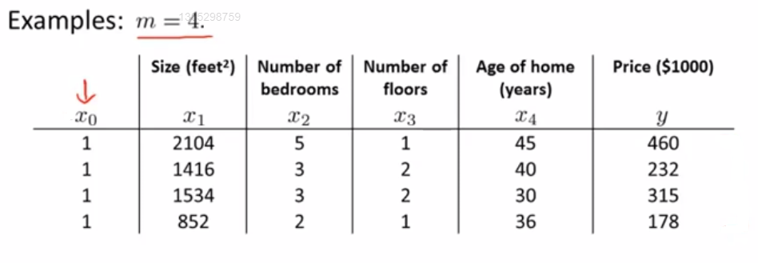

为了在上述数据中实现正规方程法，要在数据集中加上一列，以对应额外的特征变量$x_0$，之后构建矩阵$X$，它包含了训练样本的所有特征变量，以及向量$y$，它包含了所有的预测值。

最后可以用矩阵$X$和向量$y$通过下面的公式来计算使得代价函数最小化的$\theta$。

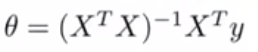

正规方程的通用形式为：

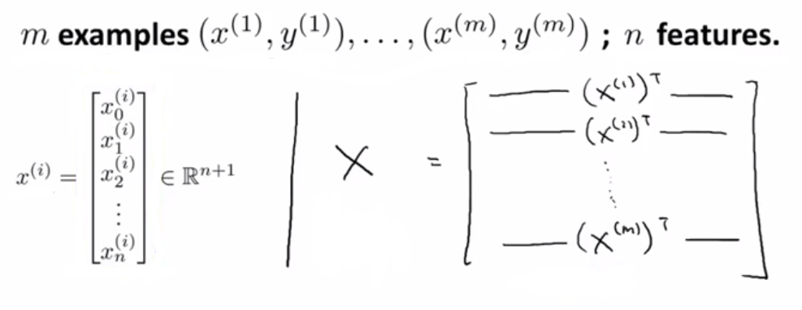

**这里的矩阵$X$也称为设计矩阵(design matrix)**。构建设计矩阵的方法，就是取第一个训练样本，也就是第一个向量，取它的转置，作为设计矩阵的第一行，之后以此类推。

**在使用正规方程的过程中，无需进行特征缩放**。

### 4.6.2 正规方程与梯度下降的优缺点

+ **梯度下降(gradient descent)的缺点**
  + 需要对学习率$\alpha$进行选择。
  + 需要多次迭代。
+ **正规方程(normal equation)的缺点**
  + 需要计算$(X^TX)^{-1}$。
  + 特征变量的数量n很大时运行缓慢。
+ **梯度下降(gradient descent)的优点**
  + 在特征变量很多的情况下也能运行的相当好。
+ **正规方程(normal equation)的优点**
  + 不需要对学习率$\alpha$进行选择。
  + 不需要多次迭代。

总结一下，只要特征变量的数目并不大，标准方程是一个很好的计算参数$\theta$的替代方法。具体地说，只要特征变量数量小于一万，通常使用标准方程法，而不使用梯度下降法。

## 4.7 正规方程及不可逆性（可选）

### 4.7.1 正规方程及其不可逆性

在上一节中提出的求解正规方程中参数$\theta$的公式中，如果矩阵$X^TX$**不可逆(non-invertible)**怎么办？其实这种问题很少发生，因为矩阵不可逆通常有两种最常见的原因：

+ 数据中包含了许多多余特征。

  例如在房价预测的例子中$x_1=size\ in\ feet^2,x_2=size \ in \ m^2$，因为1米等于3.28英尺，你的这两个特征值将始终满足$x_1=3.28 x_2$，那么这两个特征是不可以用一个线性方程联系起来，这样$X^TX$将是不可逆的。

+ 特征过多。

  例如特征数大于训练样本的数量。遇到这种情况时，一般都会看是否能删除某些特征，或者使用**正则化(regularization)**方法。

总之在使用正规方程法前，先看看是否有重复的特征，若有就将它删除，直到没有多余的为止。之后再检查是否有过的特征，若特征数量太多，可以删除一些影响不太大的特征或者考虑使用正则化的方法。

### 4.7.2 公式的推导

这里我直接转载了黄海广博士的推导过程。

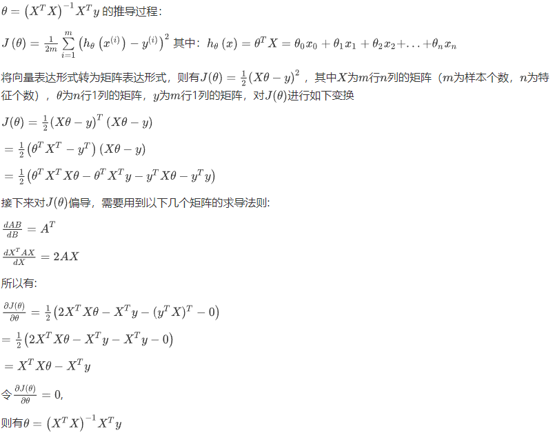