# 第三章中文分词技术

> 搜索微信公众号:‘AI-ming3526’或者’计算机视觉这件小事’ 获取更多干货  
> github：https://github.com/aimi-cn/AILearners  

​	本章将讲解中文自然语言处理的第一项核心技术：中文分词技术。在语言理解中，词是最小的能够独立活动的有意义的语言成分 将词确定下来是理解自然语言的第 步，只有跨越了这 步，中文才能像英文那样过渡到短语划分 概念抽取以及主题分析，以至自然语言理解，最终达到智能计算 最高境界 因此，每个 NLP 工作者都应掌握分词技术。

本章的要点包括：

- 中文分词的概念与分类
- 常用分词（包括规则分词 统计分词以及混合分词等）的技术介绍
- 开源中文分词工具一一Jieba 简介
- 实战分词之高频词提取

## 3.1[中文分词简介](https://baike.baidu.com/item/%E4%B8%AD%E6%96%87%E5%88%86%E8%AF%8D/371496?fr=aladdin)

​	“词”这个概念一直是汉语语言学界纠缠不清而又绕不开的问题 “词是什么”（词的抽象定义）和“什么是词”（词的具体界定），这两个基本问题迄今为止也未能有一个权威、明确的表述，更无法拿出令大众认同的词表来 主要难点在于汉语结构与印欧体系语种差异甚大，对词的构成边界方面很难进行界定 比如，在英语中，单词本身就是“词”
的表达，一篇英文文章就是“单词”加分隔符（空格）来表示的，而在汉语中，词字为基本单位的，但是一篇文章的语义表达却仍然是以词来划分的。因此，**在处理中文文本时，需要进行分词处理，将句子转化为词的表示。这个切词处理过程就中文分词**，它通过计算机自动识别出句子的词，在词间加入边界标记符，分隔出各个词汇 整个过程看似简单，然而实践起来却很复杂，主要的困难在于分词歧义。以NLP 分词的典语句，“结婚的和尚未结婚的”，应该分词为“结婚／的／和／尚未／结婚／的”，还是 “结婚 / 的 / 和尚／未／结婚／的”？这个由人来判定都是问题，机器就更难处理了 此外，像未登录词、分词粒度粗细等都是影 分词效果的重要因素。

​	自中文自动分词被提出以来，历经将近30年的探索，提出了很多方法，可主要归纳为“规则分词”和“统计分词”和“混合分词（规则＋统计）”这三个主要流派，规则分词是最早兴起的方法。，主要是通过人工设立词库，按照一定方式进行匹配切分，其实现简单高效，但对新同很难进行处理。随后统计机器学习技术的兴起，应用于分词任务上后，就有了统计分词，能够较好应对新词发现等特殊场景然而实践中，单纯的统计分词也有缺陷， 就是太过于依赖语料的质量，因此实践中多是采用这两种方法的结合，即混合分词。

## 3.2 规则分词

​	基于规则的分词是一种机械分词方法，主要是通过维护词典，在切分语句时，将语句的每个字符串与词表中的词进行逐一匹配，找到则切分，否则不予切分

​	按照匹配切分的方式，主要有**正向最大匹配法** 、**逆向最大匹配法**以及**双向最大匹配法**三种方法。

### 3.2.1 正向最大匹配法

​	正向最大匹配（Maximum Match Method , MM法）的基本思想为：假定分词词典中的最长词有i个汉字字符，则用被处理文挡的当前字串中的前i个字作为匹配字段，查找字典。若字典中存在这样的一个字词，则匹配成功，匹配字段被作为一个词切分出来。如果词典中找不到这样的一个i字词，则匹配失败，将匹配宇段中的最后一个字去掉，对剩下的字串重新进行匹配处理如此进行下去，直到匹配成功，即切分出一个词或剩余字串的长度为零为止。这样就完成了一轮匹配，然后取下一个 字字串进行匹配处理，直到文档被扫描完为止。

其算法描述如下：

1. 从左向右取待切分汉语句的m个字符作为匹配字段，m为机器词典中最长词条的字符数。
2. 查找机器词典并进行匹配。若匹配成功， 则将这个匹配字段作为一个词切分出来。若匹配不成功，则将这个匹配宇段的最后一个字去掉，剩下的字符串作为新的匹配字段，进行再次匹配， 重复以上过程，直到切分出所有词为止。


​	比如我们现在有个词典，最长词的长度为 ，词典中存在‘南京市长”和“长江大桥”两个词。现采用正向最大匹配对句子“南京市长江大桥”进行分词，那么首先从句子中取出前五个字“南京市长江”，发现词典中没有该词，于是缩小长度，取前4个字“南京市长”，词典中存在该词，于是该词被确认切分 再将剩下的“江大桥”按照同样方式切
分，得到“江” “大桥”，最终分为“南京市长” “江” “大桥” 3个词，显然，这种结果还不是我们想要的。

### 3.2.2 逆向最大匹配法

​	逆向最大匹配（ Reverse Maximum Match Method, RMM 法）的基本原理与 MM法相同，不同的是分词切分的方向与MM法相反逆向最大匹配法从被处理文挡的末端开始匹配扫描，每次取最末端的i个字符（i为词典中最长词数）作为匹配字段，若匹配失败，则去掉匹配字段前面的一个字，继续匹配。相应地，它使用的分词词典是逆序词典， 其中的每个个词条都将按逆序方式存放。在实际处理时，先将文档进行倒排处理，生成逆序文档然后，根据逆序词典，对逆序文档用正向最大匹配法处理即可。

由于汉语中偏正结构较多，若从后向前匹配，可以适当提高精确度 所以，逆向最大匹配法比正向最大匹配法的误差要小 统计结果表明，单纯使用正向最大匹配的错误率为 /169 ，单纯使用逆向最大匹配的错误率为 11245 比如之前的 “南京市长江大桥”，按照逆向最大匹配，最终得到“南京市” “长江大桥” 。当然，如此切分并不代表完全正
确，可能有个叫“江大桥”的“南京市长”也说不定。

### 3.2.3 双向最大匹配法

​	双向最大匹配法（ Bi-directction Matching met ）是将正向最大匹配法得到的分词结果和逆向最大匹配法得到的结果进行比较，然后按照最大匹配原则 ，选取词数切分最少的作为结果。双向最大匹配准确率较高，据统计中文中90%左右的句子，正向最大匹配和逆向最大匹配完全重合且正确，只有大概9.0%的句子两种方法得到的结果不一样，但其中一个必是正确的，只有不到1.0%的句子使用两种方法得到的结果重合却是错的，或者两种匹配方法切法不同，但结果都不对（歧义检测失败）。

前面举例的“南京市长江大桥”，采用该方法，中间产生“南京市／ 长江／大桥”和“南京市／长江大桥”两种结果，最终选取词数较少的“南京市 长江大桥”这一结果。

下面是一段实现逆向最大匹配的代码：

```
class RMM(object):
    def   __init__(self,dic_path):
        self.dictionary = set()
        self.maximum = 0
        #读取词典
        with open(dic_path,'r',encoding='utf8') as f:
            for line in f:
                line = line.strip()
                if not line:
                    continue
                self.dictionary.add(line)
                self.maximum = max(len(line), self.maximum)


    def cut(self,text):
        result = []
        index = len(text)
        while index > 0:
            word = None
            for size in range(self.maximum, 0, -1):
                if index - size < 0:
                    continue
                piece = text[(index - size):index]
                if piece in self.dictionary:
                    word = piece
                    result.append(word)
                    index -= size
                    break
            if word is None:
                index -= 1
        return result[::-1]

    def main():
        text = '南京市长江大桥'

        tokenizer = RMM('./data/imm_dic.utf8')
        print(tokenizer.cut(text))


RMM.main()
```

运行结果：['南京市', '长江大桥']


## 3.3 统计分词

随着大模语料库的建立，统计机器学习方法研究发展基于统计的中文分词算法渐渐成为主流。

其主要思想是把每个词看做是由词的最小单位的各个字组成的，如果相连的字在不同的文本中出现的次数越多，就证明这相连的字很可能就是一个词。因此我们就可以利用字与字相邻出现的频率来反应成词的可靠度，统计语料中相邻共现的各个字的组合的频度，当组合频度高于某一个临界值时，我们便可认为 字组可 会构成一个词语。

基于统计的分词，一般要做如下两步操作：

建立统计语言模型

对句子进行单词划分，然后对划分结果进行概率计算，获得概率最大的分词方式。这里就用到了统计学习算法，如隐含马尔可夫（ HMM ）、条件随机场（ CRF）等

### 3.3.1 语言模型

语言模型在信息检索、机器翻译、语音识别中承担着重要的任务 用概率论的专业术语描述语言模型就是 为长度为 的字符串确定其概率分布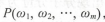，其中 W1到Wm 依次表示文本中的各个词语 一般采用链式法则计算其概率值， 如式（ 3 .1 ）所示：

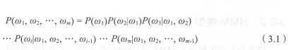


观察式（ 3.1 ）易知，当文本过长时，公式右部从第三项起的每一项计算难度都很大。为解决该问题，有人提出 n元模型（ n-gram model ）降低该计算难度。所谓n元模型就是在估算条件概率时，忽略距离大于等于n的上文词的影响，因此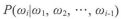的计算可简化为式（3.2）：

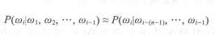

当n=1时称为一元模型（ uni gram model ），此时整个句子的概率可表示为：=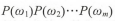

观察可知，在一元语 模型中，整个句子的概率等于各个词语概的乘积。言下之意就是各个词之间都是相互独立的，这无疑是完全损失了句中的词序信息 所以 元模型的效果并不理想。

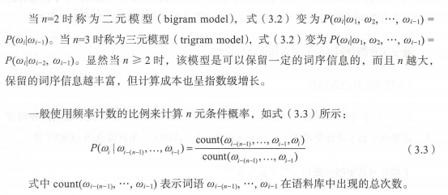

由此可见，当 越大时，模型包含的词序信息越丰富，同时计算量随之增大与此同时，长度越长的文本序列出现的次数也会减少，如按照公式(3.3)估计n元条件概率时，就出现分子分母为零的情况 因此，一般在n元模型中需要配合相应的平滑算法解决该问题，如[拉普拉斯平滑算法](https://blog.csdn.net/wsj998689aa/article/details/40303561)等。

### 3.3.2 HMM 模型

隐含马尔可夫模型 （HMM ）是将分词作为字在字串中的序列标注任务来实现的。其基本思路是：每个字在构造一个特定的词语时都占据着一个确定的构词位置（ 即词位 ），现规定每个字最多只有四个构词位置：即B（词首）、M（词中）、E（词尾）、和S（单独成词）。

那么下面句子 （1）的分词结果就可以直接表示成如 （2）所示的逐字标注形式：

（1）中文 /分词 /是/文本处理/不可或缺/的/ 一步！

（2）中/B文/E分/B词/E是/S文/B本/M处/M理/E不/B可/M或/M缺/E的/S一/B步/E!/S

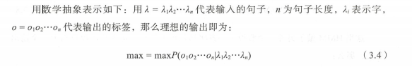

在分词任务上， o即为 B、M、E、S这4种标记，λ为诸如“中” “文”等句子中的每个字（包括标点等非中文字符）

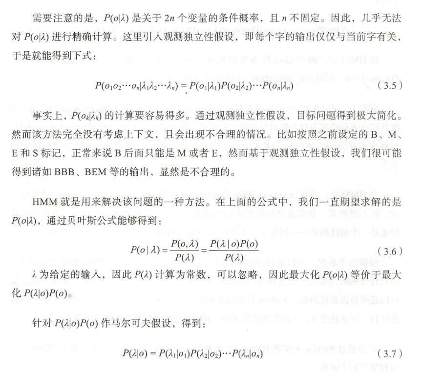

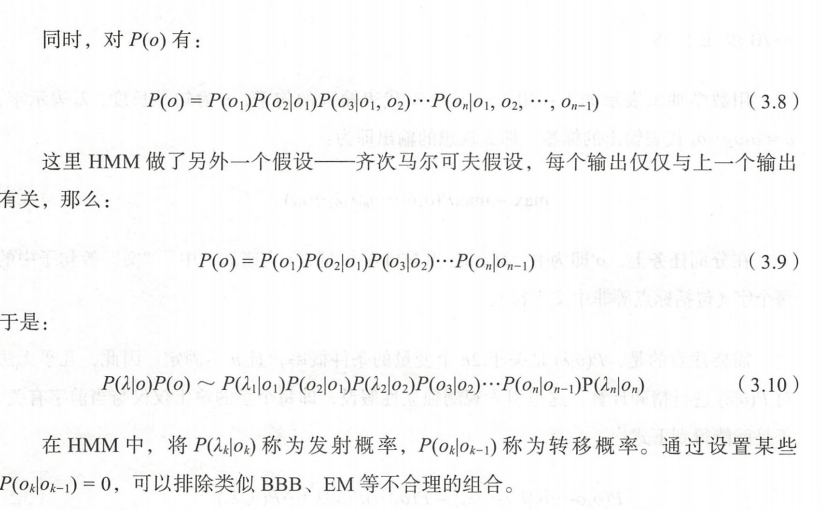


事实上，式（ 3.9） 的马尔可夫假设就是一个二元语言模型（ bigram model ）， 将齐次马尔可夫假设改为每个输出与前两个有关时，就变成三元语言模型（ trigram model）。当然在实际分词应用中还是多采用二元模型，因为相比三元模型，其计算复杂度要小不少。

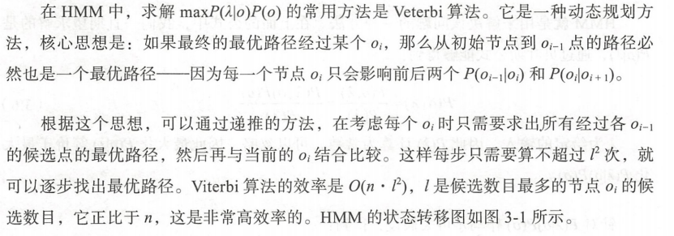

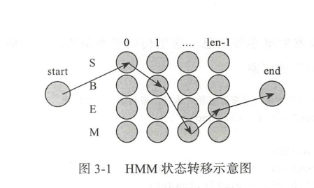

下面是HMM的实现类代码：

```
class HMM(object):
    def __init__(self):
        pass
    def try_load_model(self, trained):
        pass
    def train(self, path):
        pass    
    def viterbi(self, text, states, start_p, trans_p, emit_p):
        pass    
    def cut(self, text):
        pass
```

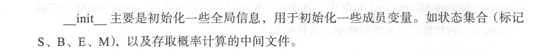

```
def __init__(self):
        import os

        # 主要是用于存取算法中间结果，不用每次都训练模型
        self.model_file = './data/hmm_model.pkl'

        # 状态值集合
        self.state_list = ['B', 'M', 'E', 'S']
        # 参数加载,用于判断是否需要重新加载model_file
        self.load_para = False
```

try_load_model 接收一个参数，用于判 是否加载中间文件结果 当直接加载中间结果时，可 不通过语料库训练，直接进行分词调用。否则该函数用于初始化概率、转移概率以及发射概率等信息 这里初始概率是指 ，一句话第一 个字被标记成"S""B""E""M"的概率

```
 # 用于加载已计算的中间结果，当需要重新训练时，需初始化清空结果
    def try_load_model(self, trained):
        if trained:
            import pickle
            with open(self.model_file, 'rb') as f:
                self.A_dic = pickle.load(f)
                self.B_dic = pickle.load(f)
                self.Pi_dic = pickle.load(f)
                self.load_para = True

        else:
            # 状态转移概率（状态->状态的条件概率）
            self.A_dic = {}
            # 发射概率（状态->词语的条件概率）
            self.B_dic = {}
            # 状态的初始概率
            self.Pi_dic = {}
            self.load_para = False
```

train 函数主要用于通过给定的分词语料进行训练 语料的格式为每行一句话（这里以逗号隔开也算 句），每个词以空格分隔，示例中采用了人民日报的分词语料，放置于chapter3/ data/trainCorpus. txt_ utf8 该函数主要通过对语料的统计， 得到 HMM所需的初始概率、转移概率以及发射概率。代码如下：

```
 # 计算转移概率、发射概率以及初始概率
    def train(self, path):

        # 重置几个概率矩阵
        self.try_load_model(False)

        # 统计状态出现次数，求p(o)
        Count_dic = {}

        # 初始化参数
        def init_parameters():
            for state in self.state_list:
                self.A_dic[state] = {s: 0.0 for s in self.state_list}
                self.Pi_dic[state] = 0.0
                self.B_dic[state] = {}

                Count_dic[state] = 0

        def makeLabel(text):
            out_text = []
            if len(text) == 1:
                out_text.append('S')
            else:
                out_text += ['B'] + ['M'] * (len(text) - 2) + ['E']

            return out_text

        init_parameters()
        line_num = -1
        # 观察者集合，主要是字以及标点等
        words = set()
        with open(path, encoding='utf8') as f:
            for line in f:
                line_num += 1

                line = line.strip()
                if not line:
                    continue

                word_list = [i for i in line if i != ' ']
                words |= set(word_list)  # 更新字的集合

                linelist = line.split()

                line_state = []
                for w in linelist:
                    line_state.extend(makeLabel(w))
                
                assert len(word_list) == len(line_state)

                for k, v in enumerate(line_state):
                    Count_dic[v] += 1
                    if k == 0:
                        self.Pi_dic[v] += 1  # 每个句子的第一个字的状态，用于计算初始状态概率
                    else:
                        self.A_dic[line_state[k - 1]][v] += 1  # 计算转移概率
                        self.B_dic[line_state[k]][word_list[k]] = \
                            self.B_dic[line_state[k]].get(word_list[k], 0) + 1.0  # 计算发射概率
        
        self.Pi_dic = {k: v * 1.0 / line_num for k, v in self.Pi_dic.items()}
        self.A_dic = {k: {k1: v1 / Count_dic[k] for k1, v1 in v.items()}
                      for k, v in self.A_dic.items()}
        #加1平滑
        self.B_dic = {k: {k1: (v1 + 1) / Count_dic[k] for k1, v1 in v.items()}
                      for k, v in self.B_dic.items()}
        #序列化
        import pickle
        with open(self.model_file, 'wb') as f:
            pickle.dump(self.A_dic, f)
            pickle.dump(self.B_dic, f)
            pickle.dump(self.Pi_dic, f)

        return self
```

cut 用于切词，其通过加载中间文件，调用 veterbi 函数来完成 veterbi 函数Veterbi算法的实现，是基于动态规划的一种实现现，主要是求最大概率的路径。其输入参数为初始概率 转移概率以及发射概率，加上需要切分的句子 veterbi函数和cut函数代码如下：

```
def viterbi(self, text, states, start_p, trans_p, emit_p):
        V = [{}]
        path = {}
        for y in states:
            V[0][y] = start_p[y] * emit_p[y].get(text[0], 0)
            path[y] = [y]
        for t in range(1, len(text)):
            V.append({})
            newpath = {}
            
            #检验训练的发射概率矩阵中是否有该字
            neverSeen = text[t] not in emit_p['S'].keys() and \
                text[t] not in emit_p['M'].keys() and \
                text[t] not in emit_p['E'].keys() and \
                text[t] not in emit_p['B'].keys()
            for y in states:
                emitP = emit_p[y].get(text[t], 0) if not neverSeen else 1.0 #设置未知字单独成词
                (prob, state) = max(
                    [(V[t - 1][y0] * trans_p[y0].get(y, 0) *
                      emitP, y0)
                     for y0 in states if V[t - 1][y0] > 0])
                V[t][y] = prob
                newpath[y] = path[state] + [y]
            path = newpath
            
        if emit_p['M'].get(text[-1], 0)> emit_p['S'].get(text[-1], 0):
            (prob, state) = max([(V[len(text) - 1][y], y) for y in ('E','M')])
        else:
            (prob, state) = max([(V[len(text) - 1][y], y) for y in states])
        
        return (prob, path[state])

    def cut(self, text):
        import os
        if not self.load_para:
            self.try_load_model(os.path.exists(self.model_file))
        prob, pos_list = self.viterbi(text, self.state_list, self.Pi_dic, self.A_dic, self.B_dic)      
        begin, next = 0, 0    
        for i, char in enumerate(text):
            pos = pos_list[i]
            if pos == 'B':
                begin = i
            elif pos == 'E':
                yield text[begin: i+1]
                next = i+1
            elif pos == 'S':
                yield char
                next = i+1
        if next < len(text):
            yield text[next:]
```

**测试代码：**

```
hmm = HMM()
hmm.train('./data/trainCorpus.txt_utf8')

text = '这是一个非常棒的方案！'
res = hmm.cut(text)
print(text)
print(str(list(res)))
```

输出：['这是', '一个', '非常', '棒', '的', '方案', '！']

### 3.3.3 其他统计分词算法

[条件随机场](https://blog.csdn.net/weixin_42039090/article/details/80658023)（ CRF ）也是一种基于马尔可夫思想的统计模型 在隐含马尔可夫中，有个很经典的假设，那就是每个状态只与它前面的状态有关 这样的假设显然是有偏差的，于是学者们提出了条件随机场算法，使得每个状态不止与他前面的状态有关，还与他后面的状态有关 该算法在本节将不会重点介绍，会在后续章节详细介绍。

神经网络分词算法是深度学习方法在 NLP 上的应用 通常采用 CNN LSTM 等深度学习网络自动发现一些模式和特征，然后结合 RF softmax 等分类算法进行分词预测基于深度学习的分词方 ，我们将在后 介绍完深度学习相关知识后，再做拓展。

对比机械分词法，这些统计分词方法不需耗费人力维护词典，能较好地处理歧义和未登录词，是目前分词中非常主流的方法。但其分同的效果很依赖训练语料的质量，且计算量相较于机械分词要大得多。

## 3.4 混合分词

事实上，目前不管是基于规则的算法、 还是基于 HMM、CRF或者 deep learning的方 其分词效果在具体任务中，其实差距并没有那么明显 在实际工程应用中，多是基于一种分词算法，然后用其他分词算法加以辅助 最常用的方式就是先基于词典的方式进行分词，然后再用统计分词方法进行辅助 如此，能在保证词典分词准确率的基础上，对未登录词和歧义词有较好的识别，下节介绍的 Jieba 分词工 便是基于这种方法的实现、

## 3.5 申文分词工具一一[Jieba](https://pypi.org/project/jieba/)

jieba [Github网址](https://github.com/fxsjy/jieba)

安装及简介见上方网址

Jieba分词结合了基于规则和基于统计这两类方法 首先基于前缀词典进行词图扫描，前缀词典是指词典中的词按照前 包含的顺序排列，例如词典中出现了“上”，之后以“上”开头的词都会出现在这一部分，例如“上海”，进而会出现“上海市”，从而形成一种层级包含结构。如果将词看作节点，词和词之间的分词符作边，那么一种分词方案则对应从第一个字到最后一个字的一条分词路径。因此，基于前缀词典可以快速构建包含全部可能分词结果的有向无环图，这个图中包含多条分词路径，有向是指全部的路径都始于第一个字、止于最后一个字 ，无环是指节点之间不构成闭环。基于标注语料，使用动态规划的方法可以找出最大概率路径，并将其作最终的分词结果对于未登录词， ieba 使用了基于汉字成词的 HMM 模型，采用了 iterbi 算法进行推导。

### 3.5.1 Jieba 的三种分词模式

**Jieba提供了种分词模式：**

- 精确模式：试图将句子最精确地切开，适合文本分析
- 全模式： 把句子中所有可以成词的词语都扫描出来，速度非常快，但是不能解决歧义
- 搜索引擎模式：在精确模式的基础上，对长词再次切分，提高召回率，适合用于搜索引擎分词

下面是使用这 种模式的对比代码：

```
import jieba

sent = '中文分词是文本处理不可或缺的一步！'
#全模式：把句子中所有可能成词的词语都扫描出来
seg_list = jieba.cut(sent, cut_all=True)
print('全模式：', '/ ' .join(seg_list)) 

#精确模式：将句子最精确的切开
seg_list = jieba.cut(sent, cut_all=False)
print('精确模式：', '/ '.join(seg_list)) 

seg_list = jieba.cut(sent)  
print('默认精确模式：', '/ '.join(seg_list))

#搜索引擎模式：在精确模式的基础上对长词再次切分，提高召回率
seg_list = jieba.cut_for_search(sent)  
print('搜索引擎模式', '/ '.join(seg_list))
```

运行结果：

```
全模式： 中文/ 分词/ 是/ 文本/ 文本处理/ 本处/ 处理/ 不可/ 不可或缺/ 或缺/ 的/ 一步/ / 
精确模式： 中文/ 分词/ 是/ 文本处理/ 不可或缺/ 的/ 一步/ ！
默认精确模式： 中文/ 分词/ 是/ 文本处理/ 不可或缺/ 的/ 一步/ ！
搜索引擎模式 中文/ 分词/ 是/ 文本/ 本处/ 处理/ 文本处理/ 不可/ 或缺/ 不可或缺/ 的/ 一步/ ！
```

可以看到，全模式和搜索引模式下， Jieba将会把分词的所有可能都打印出 。一般直接使用精确模式 可，但是在某些模糊匹配场景下，使用全模式或搜索引擎模式更适合。

### 3.5.2 实战之高频词提取

高频 一般是指文档中出现频率较高且非常无用的词语，其一定程度上代表了文档的焦点所在，对单篇文档，可以作为一种关键词来看。对于如新闻这样的多篇文挡，可以将其作为热词 ，发现舆论焦点。

高频词提取其实就是自然语言处理中的TF（Term Frequency）策略 其主要有以下干扰项：

- 标点符号：一般标点符号无任何价值，需要去除。
- 停用词：诸如“的”“是”“了”等常用词无任何意义，也需要剔除。

下面采 Jieba分词，针对搜狗实验室的新闻数据进行高频词的提取。

数据见 chaptr3/ data/news下 ，包括9个目录，目录下均为txt文件， 代表不同领域的新闻 该数据本质上是一个分类语料，这里我们只挑选其中一个类别，统计该类的高频词。

首先进行数据读取：

该方法用于加载指定路径下的数据

```
#jieba分词示例
def get_content(path):
    
    with open(path, 'r', encoding='gbk', errors='ignore') as f:
        content = ''
        for l in f:
            l = l.strip()  # strip():只能删除开头或是结尾的字符，不能删除中间部分的字符
            content += l #文本中的几段合成一个文本
        return content
```

定义高频词统计 函数 其输入是一个词的数组：

```
def get_TF(words, topK=10):
    
    tf_dic = {}
    for w in words:
        tf_dic[w] = tf_dic.get(w, 0) + 1
    return sorted(tf_dic.items(), key = lambda x: x[1], reverse=True)[:topK]
 #此方法用于过滤掉停用词，包括逗号等标点符号
def stop_words(path):
    with open(path,encoding='utf-8', errors='ignore') as f:
        return [l.strip() for l in f]
```

最后主函数如下 ，这里仅列举了求出高 词的前10个：

```
#分词
def main():
    import glob
    import random
    import jieba
    
    files = glob.glob('./data/news/C000013/*.txt')# 获取指定目录下的所有文档
    #print('files:',files[:5])
    corpus = [get_content(x) for x in files]# 针对每一个文本提取其内容组成一个列表
    print(len(corpus))
    
    sample_inx = random.randint(0, len(corpus))
    print(sample_inx)
    
    
    import jieba.posseg as psg
    split_words1= list(jieba.cut(corpus[sample_inx]))
    split_words2 = [x for x in jieba.cut(corpus[sample_inx]) \
                    if x not in stop_words('./data/stop_words.utf8')]

    
    print('原始样本：'+corpus[sample_inx])
    print('样本分词效果：'+'/ '.join(split_words1))
    print('样本的topK（10）词：'+str(get_TF(split_words1)))
    print('过滤掉停用词后样本的topK（10）词：'+str(get_TF(split_words2)))
```

运行上述代码可以实现分词以及高频词展示，实际上常用的中文分词器在分词效果上差距不是特别大，但在特定场景下表现并不是那么尽如人意。通常情况下我们需要自己定义词典，用于提升分词效果。jieba提供了这个功能

用户可以加载自定义词典：

```
jieba.load_userdict('./data/user_dict.utf8')
```

Jieba 要求的用户词典格式一般如下：

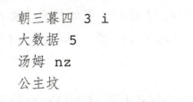

每一行为三个部分 词语、词频（可省略）、词性（可省略），用空格隔开，顺序不可颠倒，该词典文件需为 utf8 编码

加载自定义词典演示：

```
import jieba 
#加载系统词典
jieba.set_dictionary('./data/dict.txt.big')

print('自定义词典内容：')
with open('./data/user_dict.utf8', 'r',encoding='utf8') as f:
    for l in f:
        print(l)

print('------华丽的分割线-------')
sent = 'jieba分词非常好用，可以自定义金融词典！'
seg_list = jieba.cut(sent)
print('加载词典前:', '/ '.join(seg_list))

jieba.load_userdict('./data/user_dict.utf8')
seg_list = jieba.cut(sent)
print('加载词典后:', '/ '.join(seg_list))
```

运行结果：

```
自定义词典内容：
大波浪 10
jieba分词 n
金融词典 7  
------华丽的分割线-------
加载词典前: jieba/ 分词/ 非常/ 好用/ ，/ 可以/ 自定义/ 金融/ 词典/ ！
加载词典后: jieba分词/ 非常/ 好用/ ，/ 可以/ 自定义/ 金融词典/ ！
```


## 3.6 本章小结

本章介绍 了中文分词 的相关技术，并展示了基于词典匹配和基于 HMM 匹配的分词方法 然后详细介绍了 Jieba 分词工具，并结合高频词提取案例，讲解了在实际项目中如何使用。

作为 NLP 的基础入门 节，希望通过该 的介绍和学习，能让读者对中文分词的相关技术有所了解，并能在实际项目中得到应用 在后续的章节案例中，会经常用到本章介绍的一些技术，进行更上层的场景实现。


AIMI-CN AI学习交流群【1015286623】 获取更多AI资料 
扫码加群：


分享技术，乐享生活：我们的公众号每周推送“AI”系列资讯类文章，欢迎您的关注！


