# 第二章NLP前置技术解析

> 搜索微信公众号:‘AI-ming3526’或者’计算机视觉这件小事’ 获取更多干货  
> github：https://github.com/aimi-cn/AILearners  

在本章中，你将学到 NLP相关的一些前置技术 很多的数据科学库、框架 、模块
以及工具箱可以有效地实现 NLP 大部分常见的算法与技术，掌握与运用正则表达式，
Numpy 是开始 NLP 工作的好方式。

本章要点包括：

- 选择 Python 作为自然语言开发语言的理由
- 安装与使用Anaconda
- 正则表达式
- Numpy

## 2.1搭建Python开发环境

对于自然语言处理的学习，很多人会争论用什么样的编程语言实现最好？有些人认为是Java 或者时下流行的 [Scala](https://baike.baidu.com/item/Scala) ，我认为 Python才是最佳的选择！

对于学习和从事自然自然语言处理工作来说， Python具有几大优势：

- 提供丰富的自然语言处理库。
- 编程语 相对简单（尤其易于理解）。
- 具有很多数据科学相关的库。

一般来说 Python 可以从 python.org ( https //www python.org 网站下载，但是对于没有任何 python 经验的读者来说，特别推荐安装 [Anaconda](https://repo.continuum.io/archive/) （此链接内包含多个anaconda版本其中anaconda2内置Python2.x版本，anaconda3内置Python3.x版本）对于初学者来说， Anaconda 使用起来特别方便，而且其涵盖了大部分我们需要的库。

### 2.1.1Python 的科学计算发行版一Anaconda

**有关[anaconda](https://baike.baidu.com/item/anaconda/20407441?fr=aladdin)的相关介绍**

### 2.1.2Anaconda的下载与安装

此笔记使用的是 Anaconda 的版本是 4.4 ，所包含的 Python 版本是 3.6 ，大家可在上方链接中寻找对应版本下载安装。

[**Anaconda和Pycharm的安装和配置**](https://www.cnblogs.com/yuxuefeng/p/9235431.html) 

[**Anaconda完全入门指南**](https://www.jianshu.com/p/eaee1fadc1e9)

请读者根据以上两个链接自行安装和配置anaconda。

## 2.2正则表达式在 NLP 的基本应用

正则表达式是一种定义了搜索模式的特征序列，主要是用于字符串的模式匹配，或是字符的匹配 随着计算机的普及以及互联网的发展，大量的信息以电子文档方式呈现在人们的面前 NLP 通常所需要处理的语料一部分来自于 we 网页的信息抽取，一部分来自于文本格式的文档 Web 网页具有很强的开发价值，具有时效性强，信息量大，结
构稳定，价值高等特点，文本格式的文档多来源于人为编写或系统生成，其中包含了非结构化文本、半结构化文本以及结构化文本 正则表达式的作用之一是将这些文档内容从非结构化转为结构化以便后 的文本挖掘。

正则表达式的另一个作用就是去除“噪声” 。在处理大量文本片段的时候，有非常多的文字信息与最终输出的文本无关，这些无关的片段称之为“噪声”（ 比如 URL 或链接、语气助词、标点符号等）。

正则表达式是处理 NLP 的最基本的手段之一，学习与掌握正则表达式在 Python中的应用，可以帮助我们在格式复杂 的文本中抽取所需的文本信息 比如说抽取以下文本中的年份，每一行的格式不同，因此没有办法通过 Python 提供的字符串方法来抽取，这时候我们往往考虑使用正则表达。

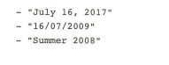

### 2.2.1 匹配字符串

在Python 中，我们会使用re模块来实现正 表达式 为了让大家更好地理解正则表达式在 Python 中的应用，我们会通过一系列的例子来阐述。

案例中，我们会提到re的一个方法一re.sarch

通过使用 re .search( regex , string）这个方法，我们可以检查这个string字符串是否匹配正 表达式 regex 如果匹配到，这个表达式会返回一个**match对象**，如果没有匹配到则返回 **None**

我们先看下准备的有关爬虫介绍的文字信息 句子和句子之间是以句号分隔 具体的文本如下所示：

> 文本最重要的来源无疑是网络 我们要把网络中的文本获取形成一个文本数据库
> 利用 一个爬虫抓取到网络中的信息 爬取的策略有广度爬取和深度爬取 根据用户的需
> 求，爬虫可以有主题爬虫和通用爬虫之分

例1：获取包含“爬虫”这个关键字的句子

查找哪些语句包含“爬虫”这个关键字 Python 的代码实现如下：

```
import re

text_string = "文本最重要的来源无疑是网络。我们要把网络中的文本获取形成一个" \
              "文本数据库。利用一个爬虫抓取到网络中的信息。爬取的策略有广度爬取和" \
              "深度爬取。根据用户的需求，爬虫可以有主题爬虫和通用爬虫之分。"
regex = '爬虫'
p_string = text_string.split('。')#句号为分隔符通过split切分
for line in p_string:
    #search方法是用来查找匹配当前行是否匹配这个regex.返回的是一个match对象
    if re.search(regex,line) is not None:
        print(line) #如果匹配到打印这行信息
```

运行结果：


例2 匹配任意一个字符

正则表达式中，有一些保留的特殊符号可以帮助我们处理一些常用逻辑。如表2-1所示：

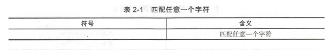

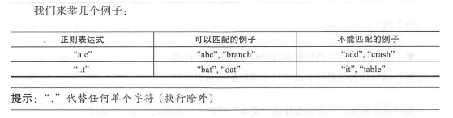


我们现在来演示下如何查找包含“爬”＋任意一个字的句子 代码如下：


```
import re

text_string = "文本最重要的来源无疑是网络。我们要把网络中的文本获取形成一个" \
              "文本数据库。利用一个爬虫抓取到网络中的信息。爬取的策略有广度爬取和" \
              "深度爬取。根据用户的需求，爬虫可以有主题爬虫和通用爬虫之分。"
regex = '爬.'
p_string = text_string.split('。')#句号为分隔符通过split切分
for line in p_string:
    #search方法是用来查找匹配当前行是否匹配这个regex.返回的是一个match对象
    if re.search(regex,line) is not None:
        print(line) #如果匹配到打印这行信息


```

运行结果：

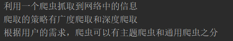

例3：匹配起始和结尾字符串

现在介绍另 个特殊符号具体功能如表 2-2 所示。

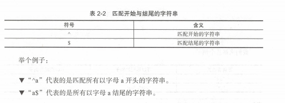

我们现在来演示下如何查找以“文本”这两个字起始的句子 代码如下：

```
import re

text_string = "文本最重要的来源无疑是网络。我们要把网络中的文本获取形成一个" \
              "文本数据库。利用一个爬虫抓取到网络中的信息。爬取的策略有广度爬取和" \
              "深度爬取。根据用户的需求，爬虫可以有主题爬虫和通用爬虫之分。"
regex = '^文本'
p_string = text_string.split('。')#句号为分隔符通过split切分
for line in p_string:
    #search方法是用来查找匹配当前行是否匹配这个regex.返回的是一个match对象
    if re.search(regex,line) is not None:
        print(line) #如果匹配到打印这行信息


```

运行结果：

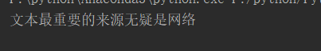

例4：使用中括号匹配多个字符

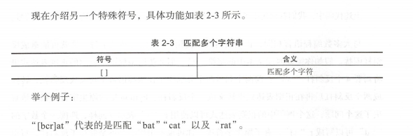

我们先看下文字信息句子和句子之 以句号分隔。

- [重要的]今年第七号台风23日登陆广东东部沿海地区。
- 上海发布车库销售监管通知：违规者暂停网签资格。
- [紧要的中国对连发强硬信息,度急切需要结束对峙。

我们希望提取［重要的]或者 [紧要的] 为起始新闻标题码如下：

```
import re

text_string = ['[重要的]今年第七号台风23日登陆广东东部沿海地区',
               '上海发布车库销售监管通知：违规者暂停网签资格',
               '[紧要的]中国对连发强硬信息,度急切需要结束对峙']
regex = '^\[[重紧]..\]'
#p_string = text_string.split('。')#句号为分隔符通过split切分
for line in text_string:
    #search方法是用来查找匹配当前行是否匹配这个regex.返回的是一个match对象
    if re.search(regex,line) is not None:
        print(line) #如果匹配到打印这行信息
    else:
        print('not match')


```

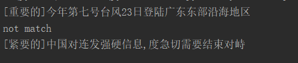

### 2.2.2 使用转义符

上述代码中，我们看到使用了"\"为转义符，因为“[]”在正表达式是特殊符号

与大多数编程语言相同，正则表达式里使用“ \”作为转义字符，这就可能造成反斜杠困扰。假如你需要匹配文本中的字符“＼”，那么使用编程语言表示 的正则表达式里将需4个反斜杠 “\\\\\\\” ：前两个和后两个分别用于在编程语言里转义成反斜杠，转换成两个反斜杠后再在正则 达式里转义成一个反斜杠 Python 里的原生字符串很好地解决了这个问题，这个例子中的正则表达式可以使用r"\\\"表示。同样，匹配一个数字的“\\\d”也可以写成r"\d"。有了原生字符串你在也不用担心是不是漏写了反斜杠，写出来的表达式也更直观。

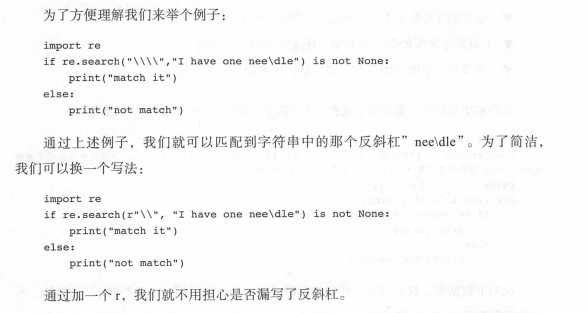

### 2.2.3 抽取文本中的数字

1. 通过正则表达式匹配年份

   “[0-9]”代表的是0到9的所有数字，那相对的”[a-z]”代表的是从a到z的所有小写字母。我们通过一个小例子来讲解下如何使用。首先我们定义一个list 分配于一个变量strings ，匹配年份是在1000-2999 年之间代码如下：

   ```
   import re 
   strings =[’War of 1812 ',’There are 5280 feet to a mile ’,'Happy New Year 
   2016!'] 
   for string in strings: 
   	if re.search('[ 1-2][ 0-9]{3}'， string)：＃字符串有英文有数字，匹配其中的数字部分，
   并且是在 1000-2999 之间， {3} 代表的是重复之前的 0-9 三次 [0-9] [0-9] [0-9]的简化写法
   	
   print(year_strings)
   ```

   

2. 抽取所有的年份

   我们使用 Python 中的 re 模块 另一个方法 findall()来返回匹配带正则表达式的那部分字符串 re.findall ("[a-z]","abc1234")得到的结果是["a","b","c"]。

   我们定义一个字符串years_string，其中的内容是‘2015 was a good year, but 2016 will be better ！’ 现在我们 抽取 下所有的年份代码如下：

   ```
   import re
   
   years_string ='2016 was a good year, but 2017 will be better !'
   years = re.findall('[2][0-9]{3}',years_string)
   print(years)
   ```

   运行结果：

   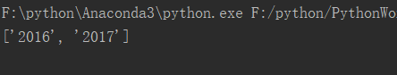

## 2.3 Numpy 使用详解

Numpy (Numerical Python 的简称）是高性能科学计算和数据分析的基础包，提供了矩阵运算的功能 Numpy 提供了以下几个主要功能：

- ndarray一一一个具有 量算术运算和复杂广播能力的多维数组对象
- 用于对数组数据进行快速运算的标准数学函数
- 用于读写磁盘数据 工具以及用于操作内存映射文件的工具
- 非常有用的 性代数 ，傅里叶变换和随机数操作
- 用于集成c\c++和Fortran 代码的工具

除明显的科学用途之外，numpy 也可以用作通用数据的高效多维容器，可以定义任意的数据类型这些使得 Numpy 能无缝 快速地与各种数据库集成。

在处理自然语言过程中，需要将文字（中文或其他语言）转换为向量，即把对文本内容的处理简化为向量空 间中的向 运算 基于向量运算，我们就可以实现文本语义相似度、特征提取、情感分析、文本分类等功能。

本节numpy要点包括：

- 创建 Numpy 数组
- 获取 Numpy 中数组的维度
- Numpy 数组索引与切片
- Numpy 数组比较
- 替代值
- Numpy 数据类型转换
- Numpy 的统计计算方法

### 2.3.1 创建数组

在Numpy 中， 最核心的数据结构是 ndarray, ndarray 代表的是多维数组，数组指的是数据的集合，为了方便理解，我们来举一个小例子：

（1）一个班级里学生的学号可以通过一维数组来表示： 数组名叫a，在a中存储的是数值类型的数据，分别是1,2,3,4。

​					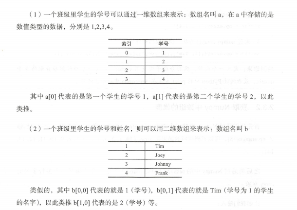

示例代码：

```
import numpy as np
#向量
vector = np.array([1,2,3,4])
#矩阵
matrix= np.array([[1,'Tim'] , [2,'Joey'], [3 ,'Johnny'] , [ 4,'Frank']])
```

### 2.3.2 获取 Numpy 中数组的维度

首先我们通过 Numpy 中的一个方法 arange(n) ,生成0到 n-1 的数组。比如我们输np.arange(15），可以看到返回的结果是 array ( [0, 1, 2, 3, 4, 5, 6, 7, 8, 9, 10, 11 , 12, 13, 14J)

之后再通过 Numpy 中的 reshape ( row,column ）方法，自动构架一个多行多列的array对象

代码：

```
import numpy as np

a = np.arange(15).reshape(3,5)

print(a)
#shape属性打印数组维度（输出一个元组，3代表3行，5代表5列）
print(a.shape)
```

运行结果：

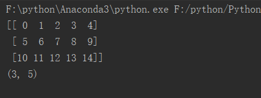

### 2.3.3 获取本地数据

我们可以通过 Numpy中的genomtxt()方法来读取本地地的数据集， 需要使用的数据集， house-prices.csv 是由逗号（，）分隔的，在 Github的data目录下能下载到。我们可以使用以语句 来读取这个数据集：

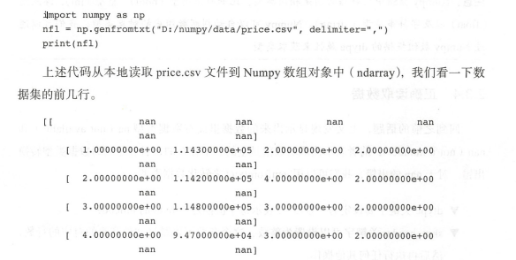

注：由于在官方GIthub上未找到数据此处先放课本截图后续做出修改。

### 2.3.4 正确读取数据

回到之前的话题，上文发现显示出来的数据里面有数据类型 na (not available ）和nan (not a number ），前者表示读取的数值是空的、不存在的，后者是因为数据类型转换出错 对于 nan 的出错，我们可以用 genfromtxt()来转化数据类型

- dtype 关键字要设定为‘ U75 ’． 表示每个值都是 75byte的unicode
- skip_header 关键字可以设置为整数，这个参数可以跳过文件开头的对应的行数，然后再执行任何其他操作


```
import numpy as np
nfl ＝np.genfromtxt("D:/numpy/data/price.csv"， dtype ＝'U75'， skip_headerl = 1,del miter＝',') 
print(nfl)
```


### 2.3.5 Numpy 数组索引

Numpy 支持 list一样的定位操作。举例来说：


```
import numpy as np
matrix = np.array([[1,2,3],[20,30,40]])
print(matrix[0,1])
```

**输出：2**

上述代码中的 matrix[0,1］， 其中0代表的是行，在 numpy中0表起始第一个，所取的是第一行，之后的1代表的是列，所以取的是第二列，那么最后第一行第二列就2这个值了。

### 2.3.6 切片

Numpy 支持list一样的切片操作：

```
import numpy as np
matrix = np.array([[5,10,15],[20,25,30],[35,40,45]])
print(matrix[:,1])
print(matrix[:,0:2])
print(matrix[1:3,:])
print(matrix[1:3,0:2])
```

运行结果：

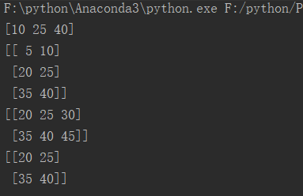

上述的 print ( matrix[: , 1 ]）语法代表选择所有的行，但是列的索引是1的数据那么就返回 10, 25, 40

print matrix[: 0:2J) 代表的是选取所有的行，列的索引0和1，返回[[ 5 10]，[20 25]， [35 40]]

print matrix[1:3 ,:) 代表的是选取行的索引值1和2 以及所有的列，返回[[20 25 30]， [35 40 45]]

print ( matrix[1:3, 0:2] 代表的是选取行的索引1和2及列的索0和1的所有数据，返回[[20 25]， [35 40]]

### 2.3.7 数组比较

Numpy 强大的地方是数组或矩阵的比较，数据比较之后会产生 boolean值：

```
import numpy as np
matrix = np.array([[5,10,15],[20,25,30],[35,40,45]])
m = (matrix == 25)
print(m)
```

运行结果：

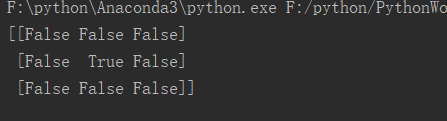

另一个复杂例子：

```
import numpy as np
matrix = np.array([[5,10,15],[20,25,30],[35,40,45]])
second_column_25 = (matrix[:,1] == 25)
print(second_column_25)

print(matrix[second_column_25,:])
```

运行结果：

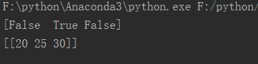

上述代码中 print ( cond column 25 ）输出的是［False True False],首先 matrix[ :,1]代表的是所有的行，以及索引为 的列－＞ [10,25,40 ］，最后和 25 进行比较，得到的就是false, true,false。print ( matrix[second column 25, :）代表的是返回 true 值的那一行数据－＞ [20,25,30 ］

### 2.3.8 替代值

NumPy 可以运用布尔值来替换值

在数组中：

```
vector = numpy.array( [5, 10, 15, 20]) 
equal_to_ten_or_five = (vector == 10)|(vector == 5)
vector[equal_to_ten_or_five] = 50
print(vector)
```

输出：[50, 50, 15, 20]

在矩阵中：

```
matrix = numpy.array([[5, 10, 15], [20, 25 , 30], [35, 40 , 45] ])
second column 25 = matr X[ :, l] == 25 
matrix[second column_25, l] = 10 
print(matrix)
```

输出：[[ 5 10 15]，[20 10 30]，[35 40 45]]

我们先创立数组 matrix。将matrix 的第二列和 25 比较，得到一个布尔值数组，second_column_25将matrix 第二列值为 25 的替换为 10

替换有一个很棒的应用之处，就是替换那些空值。之前提到过numPy中只能有一个数据类型 我们现在读取一个字符矩阵，其中有一个值为空值 其中的空值我 很有必要把它替换成其他值， 比如数据的平均值或者直接把他们删除。 这在大数据处理中很有必要。这里，我们演示把空值替换为“0”的操作

```
import numpy as np
matrix = np.array([[5, 10, 15], [20, 25 , 30], [35, 40 ,''] ])
second_column_25 = matrix[ :,2] == ''
matrix[second_column_25,2] = '0'
print(matrix)
```

输出：[['5' '10' '15']
 ['20' '25' '30']
 ['35' '40' '0']]


### 2.3.9 数据类型转换

Numpy nd arra 数据类型可以通过参数**dtype**设定，而且可以使用 **astype**转换类型，在处理文件时这个会很实用，注意**astype**调用会返回一个新的数组，也就是原始数据的一份复制

比如，把string转换成float 如下：

```
import numpy as np
vector= np.array (["1","2","3"])
vector = vector.astype(float)
print(vector)
```

输出：[ 1.  2.  3.]

### 2.3.10 Numpy 的统计计算方法

- sum()：计算数组元素和；对于矩阵算结果为一个一维数组，需要指定行或者列
- mean()：计算数组元素的平均值；对于矩阵计算结果为一个一维数组，需要指定行或者列
- max()： 计算数组元素的最大值；对于矩阵计算结果为一个一维数组，需要指定行或者列

**需要注意的是，用于这些统计方法计算 数值类型必须是 int 或者 float**

数组例子：

```
import numpy
vector = numpy.array ( [5, 10, 15, 20]) 
vector.sum()
```

输出：50

矩阵例子：

```
matrix= array([[ 5, 10, 15], [20, 10, 30], [35, 40, 4 5]]) 
matrix.sum(axis=l) 

matrix.sum(axis=0) 

```

输出：array( [ 30, 60, 120]) 

array([60, 60, 90])

**注：如上述例子所示， axis =1 算的是行的和，结果 以列的形式展示 axis=0 算的列的和，结果以行的形式展**

**[numpy教程](https://www.runoob.com/numpy/numpy-tutorial.html)**

## 2.4 本章小结

工欲善其事， 必先利其器 本章主要讲述了 NLP 工作者高效工作的 些“利器”：使用 Anaconda 快速构建开发环境，正则表达式快速进行字符串处理以及 Numpy 辅助进行科学计算 需要提醒读者 是，应重点关注正 表达式，因为在一些具体任务上，通常开端都是基于规则的方法最简单高效，而正则表达式正是实现这种规则最方便的方式，
尤其是在以匹配为主的规则应用过程中 此外 ，章节篇幅有限，无法对一些诸如 pandas、SciPy 等常用Python 库进行一一介绍，望读者自行查找相关资 ，在入门NLP 之前掌握一定的Python基础


AIMI-CN AI学习交流群【1015286623】 获取更多AI资料 
扫码加群：


分享技术，乐享生活：我们的公众号每周推送“AI”系列资讯类文章，欢迎您的关注！


