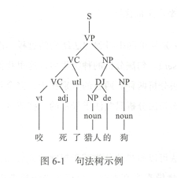
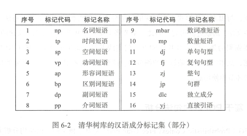
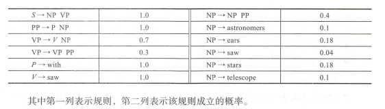
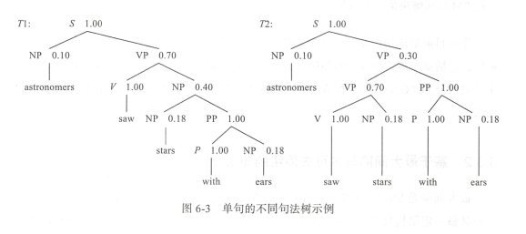
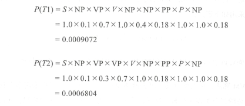
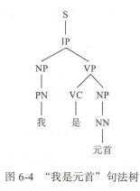
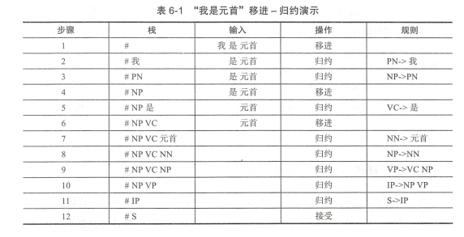
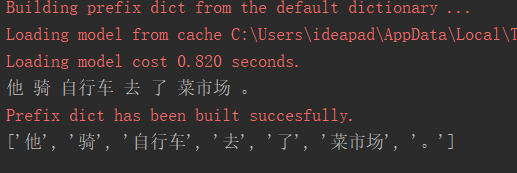
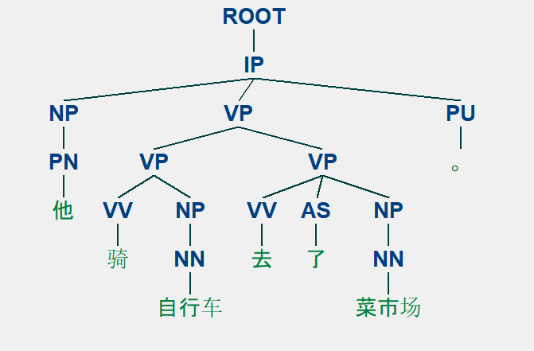

# 第六章句法分析

> 搜索微信公众号:‘AI-ming3526’或者’计算机视觉这件小事’ 获取更多干货  
> github：https://github.com/aimi-cn/AILearners  

在本章中，你将学到与句法分析相关的一些算法和技术 。 很多技术手段可以用来实 现句法分析，包括基于规则的和基于统计的，在本章中读者将会了解其基本原理和使用方法 。

本章要点主要如下：

- 句法分析及其难点
- 句法分析相关数据和技术
- 基于 Stanford Parser 的句法分析实战

## 6.1 句法分析概述

在自然语言处理中，机器翻译是一个重要的课题，也是 NLP 应用的主要领域，而句 法分析是机器翻译的核心数据结构。 句法分析是自然语言处理的核心技术，是对语言进 行深层次理解的基石 。 句法分析的主要任务是识别出句子所包含的句法成分以及这些成 分之间的关系，一般以句法树来表示句法分析的结果。 从 20 世纪 50 年代初机器翻译课 题被提出时算起，自然语言处理研究已经有 60 余年的历史，句法分析一直是自然语言处 理前进的巨大障碍 。 句法分析主要有以下两个难点：

- 歧义 。 自然语言区别于人工语言的一个重要特点就是它存在大量的歧义现象。 人 类自身可以依靠大量的先验知识有效地消除各种歧义，而机器由于在知识表示和 获取方面存在严重不足，很难像人类那样进行句法消歧 。
- 搜索空间 。 句法分析是一个极为复杂的任务，候选树个数随句子增多呈指数级增 长，搜索空间巨大。 因此，必须设计出合适的解码器，以确保能够在可以容忍的 时间内搜索到模型定义最优解 。

句法分析（ Parsing ） 是从单词串得到句法结构的过程，而实现该过程的工具或程序 被称为句法分析器（ Parser ） 。 句法分析的种类很多，这里我们根据其侧重目标将其分为 完全句法分析和局部句法分析两种。 两者的差别在于，完全句法分析以获取整个句子的 句法结构为目的；而局部句法分析只关注于局部的一些成分，例如常用的依存句法分析 就是一种局部分析方法 。

句法分析中所用方法可以简单地分为基于规则的方法和基于统计 的方法两大类 。 基 于规则 的方法在处理大规模真实文本时，会存在语法规则 覆盖有 限、系统可迁移差等 缺陷 。 随着大规模标注树库的建立，基于统计学习模型的句法分析方法开始兴起，句 法分析器的性能不断提高，最典型的就是风靡于 20 世纪 70 年代的 PCFG ( Probabil istic Context Free Grammar ），它在句法分析领域得到了极大的应用，也是现在句法分析中常 用的方法 。 统计句法分析模型本质是一套面向候选树的评价方法，其会给正确的句法树 赋予一个较高的分值，而给不合理的句法树赋予一个较低的分值，这样就可以借用候选 句法树的分值进行消歧。 在本章中，我们将着重于基于统计的句法分析方法（简称统计 分析方法）的介绍 。

## 6.2 句法分析的数据集与评测方法

### 6.2.1 句法分析的数据集

统计学习方法多需要语料，数据的支撑，统计句法分析也不例外 。 相较于分词或词性 标注，句法分析的数据集要复杂很多，其是一种树形的标注结构，因此又称树库 。 图 6 - 1 所示是一个典型的句法树 。



目前使用最多的树库来自美国宾夕法尼亚大学加工 的英文宾州树库（ Penn TreeBank, PTB ） 。 PTB 的前身为 ATIS ( Air Travel Information System ） 和 WSJ ( Wall Street Journa ) 树库， 具有较高 的一致性和标注准确率。

中文树库建设较晚 ，比较著名 的有中文宾州树库 （ Chinese TreeBank, CTB ） 、清华 树库（ Tsinghua Chinese TreeBank, TCT ）、台湾中研院树库 。 其 中 CTB 是宾夕法尼亚大 学标注 的汉语句法树库， 也是 目前绝大多数 的中文句法分析研究的基准语料库 。 TCT 是 清华大学计算机系智能技术与系统国家重点实验室人员从汉语平衡语料库中提取出 100 万规模的汉字语料文本，经过自动句法分析和人工校对，形成的高质量的标注有完整句 法结构的中文句法树语料库 。 Sinica TreeBank 是 中国台 湾 中研院词库小组从中研院平衡 语料库中抽取句子，经过电脑自动分析成句法树，并加以人工修改 、 检验后所得的成果 。

不同的树库有着不同的标记体系 使用时切忌使用一种树库的句法分析器，然后用其他树库的标记体系来解释。 由于树库众多，这里不再讲述具体每一种树库的标记规范，图 6 -2 所示为清华树库的部分标记集 。



### 6.2.2 句法分析的评测方法

句法分析评测的主要任务是评测句法分析器生成的树结构与于工标注的树结构之间 的相似程度 。 其主要考虑两方面的性能：满意度和效率。 其 中满意度是指测试句法分析 器是否适合或胜任某个特定的自然语言处理任务；而效率主要用于对 比句法分析器的运行时间 。

目前主流的句法分析评测方法是 PARSEVAL 评测体系，它是一种粒度比较适中、较 为理想的评价方法，主要指标有准确率、召回率、交叉括号数。 准确率表示分析正确的 短语个数在句法分析结果中所占的比例， ~fl 分析结果中与标准句法树中相匹配的短语个 数占分析结果中所有短语个数的比例。 召回率表示分析得到的正确短语个数占标准分析 树全部短语个数的比例 。 交叉括号表示分析得到的某一个短语的覆盖范围与标准句法分 析结果的某个短语的覆盖范围存在重叠又不存在包含关系， 即构成了 一个交叉括号 。

## 6.3 句法分析的常用方法

相较于词法分析（分词 、 词性标注或命名实体识别等），句法分析成熟度要低上不少 。 为此 ，学者们投入了大量精力进行探索，他们基于不同的语法形式，提 出了各种不同的 算法。 在这些算法中，以短语结构树为目标的句法分析器目前研究得最为彻底，应用也最为广泛，与很多其他形式语法对应的句法分析器都能通过对短语结构语法（特别是上 下文元关文法）的改造而得到 。 因此，本节将主要介绍基于上下文无关文法的句法分析。 这里需要强调的是，因为本书是 NLP 入门实践书籍，而句法分析又属于 NLP 中较为高 阶的问题，故本节不会深陷算法的细节中 。 读者了解这些算法即可，重要的是能够在后 面的实践环节中使用起来 。

### 6.3.1 基于 PCFG 的句法分析

PCFG ( Probabilistic Context Free Grammar ） 是基于概率的短语结构分析方法，是目 前研究最为充分、形式最为简单的统计句法分析模型，也可以认为是规则方法与统计方 法的结合 。

PCFG 是上下文无关文法的扩展，是一种生成式 的方法，其短语结构文法可以表示 为一个五元组 （ X, V, S, R , P ):

- X 是一个有限词汇的集合（词典），它的元素称为词汇或终结符。 
- V是一个有 限标注的集合，称为非终结符集合 。
- S 称为文法的开始符号，其包含于 Y， 即 S∈Y。
- R 是有序偶对 （ α，β）的集合， 也就是产生的规则集 。
- P 代表每个产生规则的统计概率。

PCFG 可以解决以下问题：

- 基于 PCFG 可以计算分析树的概率值。
- 若一个句子有多个分析树，可以依据概率值对所有的分析树进行排序 。 
- PCFG 可以用来进行句法排歧，面对多个分析结果选择概率值最大的 。

如果把→看作一个运算符， PCFG 可以写成如下的形式：

形式 ： A → α， P

约束：ΣαP(A → α）

下面根据一个例子来看 PCFG 求解最优句法树的过程 。 有一个规则集，内容如下：



给定句子 S : astronomers saw stars with ears ，得到两个句法树，如图 6-3 所示 。



计算两棵句法树的概率如下 ：



因此选择 Tl 作为最终的句法树 。根据上述例子，我们很自然想到关于 PCFG 的三个基本问题。

- 给定上下文无关文法 G ，如何计算句子 S 的概率，即计算 P(SIG)?
- 给定上下文无关文法 G 以及句子 S ，如何选择最佳的句法树，即计算 arg maxtP(T/S, G) ?
- 如何为文法规则选择参数，使得训练句子的概率最大，即计算 arg maxg P(SIG)?

可以使用内向算法和外向算法解决第一个问题，使用 Viterbi 算法解决第二个问题， 使用 EM 算法解决第三个问题。

作为目前最成功的基于语法驱动 的统计句法分析方法， PCFG 衍生 出了各种形式的 算法，包括基于单纯 PCFG 的句法分析方法、基于词汇化的 PCFG 的句法分析方法、基 于子类划分 PCFG 的句法分析方法等。 这些方法各有千秋，使用时可根据具体效果进行选择。

### 6.3.2 基于最大间隔马尔可夫网络的句法分析

最大间隔是 SVM （支持向量机）中的重要理论，而马尔可夫网络是概率图模型中 一种具备一定结构处理关系 能力的算法。 最大间隔马尔可夫网络（ Max - Margin Markov Networks ）就是这两者的结合，能够解决复杂的结构化预测问题，尤为适合用于句法分 析任务 。 这是一种判别式的句法分析方法，通过丰富特征来消解分析过程中产生的歧义 。 其判别函数采用如下形式：


类似 SVM 算法，最大 间 隔马尔可夫网络要实现多元分类，可以采用多个独立而且可以并行训练的二分类器来代替 。 这样，每个二分类器识别一个短语标记，通过组合这些分类器就能完成句法分析任务，同时也能通过并行方式，大大提升训练速度 。

### 6.3.3 基于 CRF 的句法分析

当将句法分析作为序列标注 问题来解决时，同样可以采用条件随机场（ CRF ）模型 。 该方法在第 4 章中已 做详细介绍，因此这里不再展开，读者将标注序列做相应变换，然 后参照第 4 章实战环节进行即可 。

与前面 PCFG 的模型相比，采用 CRF 模型进行句法分析，主要不同点在于概率计算 方法和概率归一化的方式 。 C盯模型最大化的是句法树的条件概率值而不是联合概率值， 并且对概率进行归一化。

同 基于最大间隔马尔可夫网络的句法分析一样，基于 CRF 的句法分析也是一种判别 式的方法，需要融合大量的特征 。

### 6.3.4 基于移进一归约的句法分析模型

移进一归约方法（ Shift - Reduce Algorithm ）是一种自下而上的方法。 其从输人串开 始，逐步进行“归约”，直至归约到文法的开始符号 。 移进－归约算法类似于下推自动机 的 LR 分析法，其操作的基本数据结构是堆钱。

移进一归约算法主要涉及四种操作（这里符号 S 表示句法树的根节点） 。

1. 移进：从句子左端将一个终结构：移到战顶。
2. 归约：根据规则，将楼顶的若干个字符替换为一个符号 。
3. 接受 ： 句子中所有词语都已移进战中，且校中只剩下一个符号 S ，分析成功，结束 。
4. 拒绝：句子中所有词语都已移进校中，校中并非只有一个符号 S ,也无法进行任何归约操作，分析失败,结束 。

以“我是元首”这句话为例，演示采用移进一归约的 流程 。 其对应的句法树如图 6-4 所示 。
句法树 的数据表示为“（ S (IP (NP (PN 我） )(VP (VC 是） (NP ( NN 元首） ））））”，对其的操作如表 6 -1 所示 





基于移进－归约的句法分析通常会出 现冲 突情况，一种是既可以移进又 可以规约， 还有一种是可以采用不同的规则进行规约。一般可通过引人规则、引入上下文以及缓冲 区等方式进行改进。 基于移进一规约的句法分析应用于中文时，其对词性非常敏感，常 常需要和准确度较高的词性标注工具一块使用。

## 6.4 使用 Stanford Parser 的 PCFG 算法进行句法分析

前面介绍了 多种句法分析方法 ， 本节我们将 采用 Stanford Parser 来具体演示 当 下最 流行的 基 于 PCFG 的句 法分析方法。 首先介绍 Stanford Parser 基本情况和其安装方法， 然后使用其进行中文句法分析的句法树展示 。

### 6.4. 1 Stanford Parser

Stanford Parser 是斯坦福大学自然语言小组开发的开源句法分析器，是基于概率统计 句法分析的一个 Java 实现。 该句法分析器目前提供了 5 个中 文文法 的实现。

Stanford Parser 主要有以下优点 ：

- 既是一个高度优化的概率上下文无关文法和词汇化依存分析器，又是一个词汇化 上下文无关文法分析器。 
- 以 权威的宾州树库作为分析器的训练数据，支持多语言。 目前已经支持英文、中文、德文、阿拉伯文、 意大利文、保加利亚文、葡萄牙文等语种。
-  提供了 多样化的分析输出形式，除句法分析树输出外，还支持分词和词性标注、短语结构、依存关系等输出 
- 内 置了分词、词性标注 、 基于自定义树库的分析器训练等辅助工作 。
- 支持多种平台，并封装了多种常用语言的接口，如 Java 、 Python 、 PHP 、 Ruby 、C ＃ 等 

这里我们主要使用 Stanford Parser 的 Python 接口 。 由于该句法分析器底层是 由 Java 实现，因此使用时需要确保安装 JDK 。 截至本书完稿时，最新的 Stanford Parser 版本为 3.8.0 ，对 JDK 的 要求是 1.8 及以 上 。 关于 JDK 的 安装， 网上教程众多 ，这里不再展开 。 需要注意 的是， 读者在安装 JDK 后，需要配置环境变量 中的 JAVA HOME 。

Stanford Pars er 的 Python 封装是在 nltk 库中实现的，因此需要先安装 nltk 库 。 nltk 库是一款 Python 的 自然语言处理工具，但是其主要针对英文 ， 对中文的支持较差 ，因此本书未做展开叙述 。 读者可通过“ pip install nltk ”来进行安装，我们主要使用 nltk.par se 中的 Stanford 模块。

接下来，需要下载 Stanford Parser 的 jar 包，主要有两个：“an ford -p arser.jar 和 stanford-parser-3 . 8 .0 -models .j ar 。 在 Stanford Parser 3.8.0 官方版本中已经内置了中文句法 分析的一些算法，读者若在程序运行时出现缺失算法包问题，下载中文包替换即可 。[官方下载地址]( https://nlp.stanford.edu/software/lex-parser.shtml#Download ) ，下载相应文件，进行解压，即可在目录下找到上面所述的 jar 包文件。

### 6.4.2 基于 PCFG 的中文句法分析实战

在本节，我们将对‘他骑自行车去了菜市场 。”这句话进行句法分析以及可视化操作 。

在 Stanford Parser 相关依赖安装完以及 jar 包获得后，即可进行实战之旅 。

首先进行分词处理，这里我们采用 Jieba 分词，代码如下 ：

```
# 分词
import jieba
string = '他骑自行车去了菜市场。'
seg_list = jieba.cut(string, cut_all=False, HMM=True)
#空格切分后再拼接成字符串，因为stanford parse的句法分析器接收的输入是分词完后空格隔开的句子
seg_str = ' '.join(seg_list)
print(seg_str)
```

分词结果：他  骑  自行车  去  了  菜市场 。

下面使用pcfg进行句法分析：

```
#coding=utf-8

# 分词
import jieba

# PCFG句法分析
from nltk.parse import stanford
import os

if __name__ == '__main__':
    #1.首先进行分词
    string = '他骑自行车去了菜市场。'
    seg_list = jieba.cut(string, cut_all=False, HMM=True)
    #空格切分后再拼接成字符串，因为stanford parse的句法分析器接收的输入是分词完后空格隔开的句子
    seg_str = ' '.join(seg_list)
    print(seg_str)
    
    #2.采用中文PCEG算法进行句法分析
    root = './'#当前目录下，./当前目录，../父级目录，/根目录
    parser_path = root + 'stanford-parser.jar'
    model_path =  root + 'stanford-parser-3.9.2-models.jar'

    # 指定JDK路径
    if not os.environ.get('JAVA_HOME'):#判断系统环境变量
        JAVA_HOME = 'F:\java\jdk'
        os.environ['JAVA_HOME'] = JAVA_HOME

    # PCFG模型路径，模型通过stanford-parser-3.9.2-models.jar包解压
    pcfg_path = 'stanford-parser-3.9.2-models/edu/stanford/nlp/models/lexparser/chinesePCFG.ser.gz'

    parser = stanford.StanfordParser(
        path_to_jar=parser_path,
        path_to_models_jar=model_path,
        model_path=pcfg_path
    )

    sentence = parser.raw_parse(seg_str)
    for line in sentence:
        print(line.leaves())
        line.draw()
```

在代码 Stanford Parser 中 ， 我们使用了 3 个 参数 ， 其中 path_to _jar 传 人的是 Stanford Parser 的 jar 包， model_path 传人的是其训 练好的模型 jar 包，这两个 jar 包都是 前面下载的 。 第三个参数 model_path 传入的是需要调用的句法分析算法的 java class 路 径，读者可解压 jar 包查看算法路径 ，可看到支持的算法如图 6 -5 所示，里面包括了各种 语言 的句法分析算法 。
使用时需要注意的是 ，传入路径 时，应尽量按照本文 的方式进行组织，将依赖的 jar 包放置在工作目 录下 。 此外， 若系统未设置 JAVA_HOME 变量，需要在代码中指定。

运行结果：



使用pcfg句法分析产生的树形结构：




## 6.5 本章小结

句法分析是 NLP 任务中非常重要的一环， 一些涉及语义层面的应用也需要其支撑 。 本章主要介绍了句法分析的常用算法以及句法分析中常用的数据集和评测方法，并结合 Stanford Parser 演示 了采用 PCFG 算法进行句法分析的过程 。 这里需要指出的是，相较于 词法分析（分词 、 词性标注和命名实体识别等 ），句法分析算法实 际性能离真正实用化还 有不小的距离， 主要原因 在于 ， 在语言学理论和实际的自 然语言应用之间存在着巨大的 差距。

在实践中，句法分析常常通过结合－定 的规则来辅助解决一些任务 。 如模板解析类 的任务，可以通过句法分析进行语义标注，提取其中的一些主谓宾关系 ，然后通过规则 模板标出 重要的角色信息和行为 。

句法分析的方法远不止本章介绍的这几种，感兴趣的读者可以查找相关资料以进一 步探索和研究 。


AIMI-CN AI学习交流群【1015286623】 获取更多AI资料 
扫码加群：


分享技术，乐享生活：我们的公众号每周推送“AI”系列资讯类文章，欢迎您的关注！


