# 第四章词性标注与命名实体识别

> 搜索微信公众号:‘AI-ming3526’或者’计算机视觉这件小事’ 获取更多干货  
> github：https://github.com/aimi-cn/AILearners  

在本章中，你将学到 NLP 中的另外两个基础技术一 词性标注和命名实体识识别。

本章的要点包括：

- 词性标注和命名实体识别的基础概念和常用方法
- 基于条件随机场的命名实体识别原理解析
- 日期识别和地名识别实战

## 4.1 词性标注

### 4.1.1 词性标注简介

词性是词汇基本的语法属性，通常也称为词类 词性标注是在给定句子中判定每个词的语法范畴，确定其词性井加以标注的过程 例如，表示人、地点、事物以及其他抽象概念的名称即为名词，表示动作或状态变化的词为动词，描述或修饰名词属性、状态的词为形容词。如给定一个句子 “这儿是个非常漂亮的公园”，对其的标注结果应如下：“这儿/代词  是／动词  个/量词   非常/副词  漂亮／形容词  的/结构助词  公园/名词”。

在中文中 ，一个词的词性很很多时候都不是固定的，一般表现为同音同形的词在不同场景下，其表示的语法属性截然不同，这就为词性标注带来很大的困难；但是另外一方面，从整体上看，大多数词语，尤其是实词，一般只有一到两个词性，且其中一个词性的使用频次远远大于另一个，即使每次都将高频词性作为词性选择进行标注， 也能实现80% 以上的准确率。如此，若我们对常用词的词性能够进行很好地识别，那么就能够覆盖绝大多数场景，满足基本准确度要求。

词性标注最简单的方法是从语料库中统计每个所对应的高频词性，将其作为默认词性，但这样显然还有提升空间 。目前较为主流的方法是如同分词一样，将句子词性标注作为一个序列标注问题来解决，那么分词中常用的手段，如隐含马尔可夫模型、条件随机场模型等皆可在词性标注任务中使用。本节将继续介绍如何使用 Jieba 分词来完成
词性标注任务。

### 4.1.2 词性标注规范

词性标注需要有一定的标注规范，如将词分为名词、形容词、动词，然后用“n” “adj” “v” 等来进行表示。中文领域中尚无统一的标注标准，较为主流的主要为北大的词性标注集和宾州词性标注集两大类。两类标注方式各有千秋，一般我们任选一种方式即可。本书中采用北大词性标注集作为标准，其部分标注的词性如表 4-1 所示。

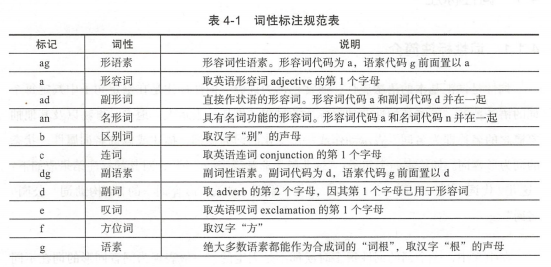

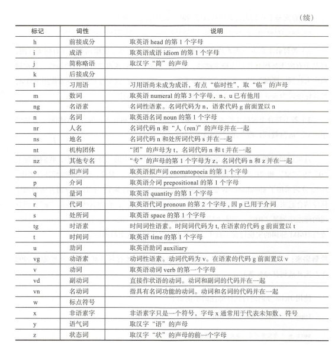

### 4.1.3 Jieba 分词中的词性标注

在上节分词中，我们介绍了 Jieba 分词的分词功能，这里将介绍其词性标注功能。类似Jieba分词的分词流程， Jieba 的词性标同样是结合规则和统计的方式，具体为在词性标注的过程中，词典匹配和HMM共同作用。词性标注流程如下。

1. 首先基于正则表达式进行汉字判断，正则表达式如下：

   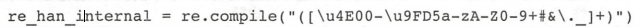

2. 若符合上面的正则表达式， 则判定为汉字，然后基于前缀词典构建有向无环图，再基于有向无环图计算最大概率路径，同时在前缀词典中找出它所分出的词性，若在词典中未找到，则赋予词性为“X”（代表未知） 当然，若在这个过程中，设置使用 HMM且待标注词为未登录词，则会通过 HMM 方式进行词性标注。

3. 若不符合上面的正则表达式，那么将继续通过正则表达式进行类型判断，分别赋予 “X”  “M”（数词）和 “eng”（英文）

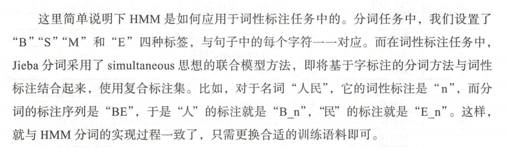

使用 Jieba 分词进行词性标注的示例如下：

```
import jieba.posseg as psg

sent = '中文分词是文本处理不可或缺的一步！'

seg_list = psg.cut(sent)

print(' '.join(['{0}/{1}'.format(w,t) for w,t in seg_list]))
```

运行结果：（每个词后面跟着其对应的词性，相关词性具体参考上表）

中文/nz 分词/n 是/v 文本处理/n 不可或缺/l 的/uj 一步/m ！/x


之前我们介绍过， Jieba 分词支持自定义词典，其中的词频和词性可以省略然而要注意的是，若在词典中省略词性，那么采用jieba分词进行词性标注后，最终切分词的词性将变成“X ”，这在如语法分析或词性统计等场景下会对结果有一定的影响。因此在使用jieba分词设置向定义词典时，尽量在词典中补充完整的信息。

## 4 .2 命名实体识别

### 4.2.1 命名实体识别简介

与自动分词、词性标注 样，命名实体识别也是自然语言处理的一个基础任务，是信息抽取、信息检索、机器翻译、问答系统等多种自然语言处理技术必不可少的组成部分。其目的是识别语料中人名、地名、组织机构名等命名实体 由于这些命名实体数量不断增加，通常不可能在词典中穷尽列出，且其构成方法具有各自的规律性，因此，通常把对这些词的识别在词汇形态处理（如汉语切分）任务中独立处理，称为命名实体识别(Named Entities Recognition, NER）。NER研究的命名实体一般分为3大类（实体类、时间类和数字类）和小类（人名、地名、组织机构名、时间、日期、货币和百分比）。由于数量、时间、日期、货币等实体识别通常可以采用模式匹配的方式获得较好的识别效果，相比之下人名、地名、机构名较复杂，因此近年来的研究主要以这种实体为主。

命名实体识别当前并不是一个大热的研究课题，因为学术界部分认为这是一个已经解决了的问题，但是也有学者认为这个问题还没有得到很好地解决，原因主要有：命名实体识别只是在有限的文本类型（主要是新闻语料）和实体类别（主要是人名、地名）中取得了效果；与其他信息检索领域相比，实体命名评测语料较小，容易产生过拟合；命名实体识别更侧重高召回率，但在信息检索领域，高准确率更重要；通用的识别多种类型的命名实体的系统性很差。

同时·，中文的命名实体识别与英文的相比，挑战更大，目前未解决的难题更多。命名实体识别效果的评判主要看实体的边界是否划分正确以及实体的类型是否标注正确。在英文中，命名实体一般具有较为明显的形式标志（如英文实体中的每个词的首字母要大写），因此其实体边界识别相对容易很多，主要重点是在对实体类型的确定。而在汉语中，相较于实体类别标注子任务，实体边界的识别更加困难。

中文命名实体识别主要有以下难点：

- 各类命名实体的数量众多
- 命名实体的构成规律复杂
- 嵌套情况复杂
- 长度不确定

在分词章节，我们介绍了分词主要有三种方式，主要有基于规则的方法、基于统计的方法以及二者的混合方法这在整个NLP的各个子任务基本上也多是同样的划分方式，命名实体识别也不例外：

1. 基于规则的命名实体识别：规则加词典是早期命名实体识别中最行之有效的方式。其依赖手工规则的系统，结合命名实体库，对每条规则进行权重赋值，然后通过实体与规则的相符情况来进行类型判断。当提取的规则能够较好反映语言现象时，该方法能明显优于其他方法。但在大多数场景下，规则往往依赖于具体语言、领域和文本风格，其编制过程耗时且难以涵盖所有的语言现象，存在可移植性差、更新维护困难等问题。
2. 基于统计的命名实体识别：与分词类似，目前主流的基于统计的命名实体识别方法有：隐马尔可夫模型、最大熵模型、条件随机场等。其主要思想是基于人工标注的语料，将命名实体识别任务作为序列标注问题来解决 基于统计的方法对语料库的依赖比较大，而可以用来建设和评估命名实体识别系统的大规模通用语料库又比较少，这是该
   方法的一大制约。
3. 混合方法：自然语言处理并不完全是一个随机过程，单独使用基于统计的方法使状态搜索空间非常庞大，必须借助规则知识提前进行过滤修剪处理。目前几乎没有单纯使用统计模型而不使用规则知识的命名实体识别系统，在很多情况下是使用混合方法，结合规则和统计方法。

序列标注方式是目前命名实体识别中的主流方法，鉴于 HMM 在之前的章节已有介绍，本节重点介绍基于条件随机场的方法。

### 4.2.2 基于条件随机场的命名实体识别

在进入条件随机场的命名实体识别之前，我们先温习下分词章节中介绍到的HMM。HMM将分词作为字标注问题来解决，其中有两条非常经典的独立性假设，一是输出观察值之间严格独立，二是状态的转移过程中当前状态只与前状态有关（ 一阶马尔可夫模型）通过这两条假设，使得HMM的计算成为可能，模型的计算也简单许多但多数场
景下，尤其在大量真实语料中，观察序列更多的是以一种多重的交互特征形式表现出来，观察元素之间广泛存在长程相关性 这样， HMM 的效果就受到了制约。

基于此，在 200 年， Lafferty 等学者们提出了条件随机场，其主要思想来源于HMM ，也是一种用来标记和切分序列化数据的统计模型 不同的是，条件随机场是在给定观察的标记序列下，计算整个标记序列的联合概率，而HMM 是在给定当前状态下，定义下一个状态的分布。

条件随机场的定义为：


这里简单举例说明随机场的概念：现有若干个位置组成的整体，当给某一个位置按照某种分布随机赋予一个值后，该整体就被称为随机场。以地名识别为例，假设我们定义了如表 4-2 所示规则。

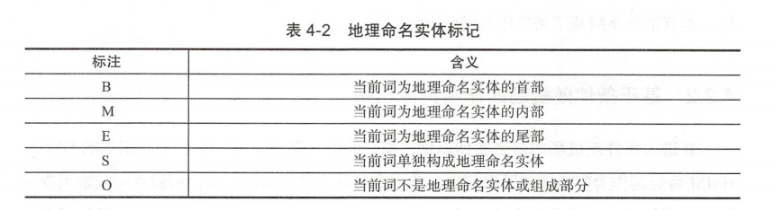

现有个由n个字符构成的NER的句子，每个字符的标签都在我们已知的标签集合（“B” “M” “E” “S” 和 “O”）中选择，当我们为每个字符选定标签后，就形成了一个随机场。若在其中加一些约束，如所有字符的标签只与相邻的字符的标签相关，那么就转化成马尔可夫随机场问题。从马尔可夫随机场到条件随机场就好理解很多，其假设马尔可夫随机场中有X和Y两种变量，X一般是给定的，Y是在给定X条件下的输出。在前面的例子中，X是字符，y为标签，P(X|Y)就是条件随机场。

在条件随机场的定义中，我们并没有要求变量X与Y具有相同的结构。实际在自然语言处理中，多假设其结构相同，即

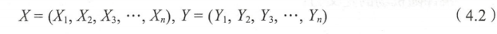

结构如图4-1所示：

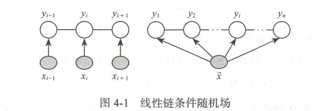

一般将这种结构称为线性链条件随机场（ linear-chain Conditional Random Fields 
linear-chain CRF） 其定义如下：

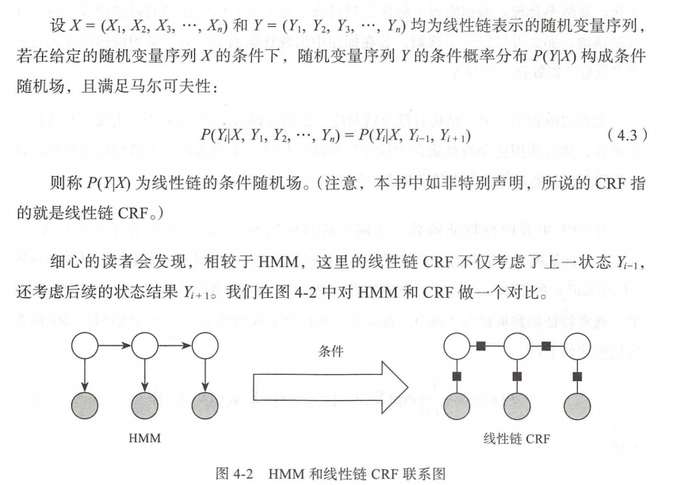

在图 4-2 可以看到HMM 是一个有向图，而线性链CRF盯是一个无向图，因此，HMM 处理时，每个状态依赖上一个状态，而线性链CRF依赖于当前状态的周围结点状态。

对于线性链CRF的算法思想已经介绍不少，接下来讲解如何将其应用于命名实体识别过程中。

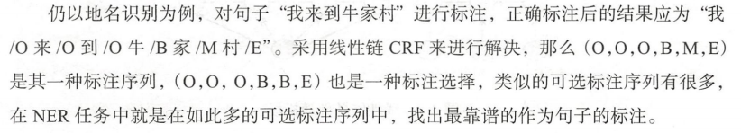

判断标注序列靠谱与否就是我们要解决的问题。就上面的两种分法，显然第二种没有第一种准确，因为其将“牛”和“家”都作为地名首字标成了“B”，一个地名两个首字符，显然不合理，假如给每个标注序列打分，分值代表标注序列靠谱程度，越高代表越靠谱，那么可以定一个规则， 若在标注中出现连续两个“B”结构的标注序列，则给它低分（如负分 、零分等）。

上面说的连续“B”结构打低分就对应一条特征函数。在CRF中，定义一个特征函数集合，然后使用这个特征集合为标注序列进行打分，据此选出最靠谱的标注序列。该序列的分值是通过综合考虑特征集合中的函数得出的。

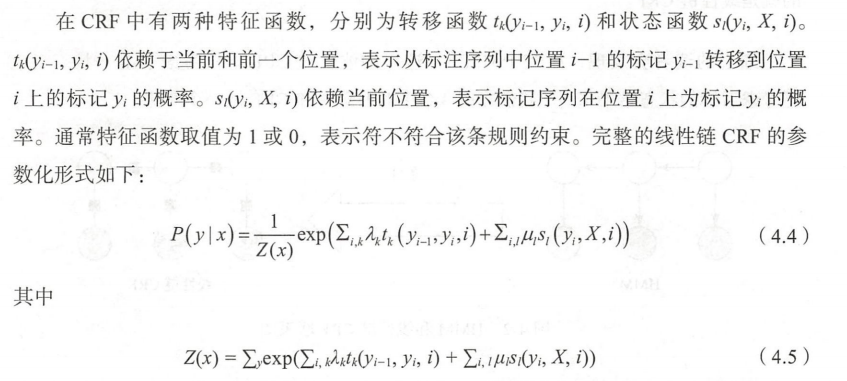

Z(X)是规范化因子， 其求和操作是在所有可能的输出序列上做的；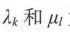为转移函数和状态函数对应的权值.

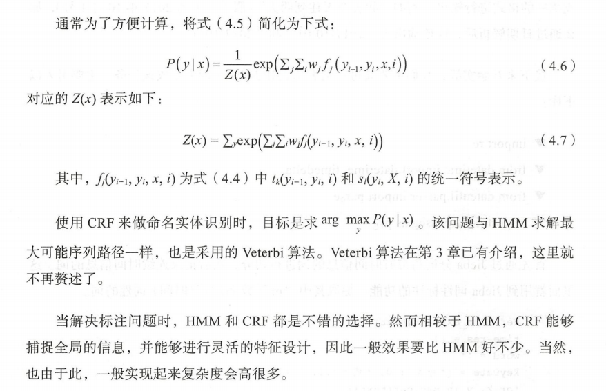

### 4.2.3 实战一：日期识别

在工程项目中，我们会经常面临日期识别的任务，当针对结构化数据时，日期设置一般有良好的规范，在数据入库时予以类型约束，在需要时能够通过解析还原读取到对应的日期。然而在一些非结构化数据应用场景下，日期和文本混杂在一起，此时日期的识别就变得艰难许多。

非结构数据下的日期识别多是与具体需求有关，本节实战的背景如下：现有一个基于语音问答的酒店预订系统，其根据用户的每句语音进行解析，识别出用户的酒店预订需求，如房间型号、人住时间等；用户的语音在发送给后台进行请求时已经转换成中文文本，然而由于语音转换工具的识别问题，许多日期类的数据并不是严格的数字，会出
现诸如“六月 12 ”“ 2016 年八月”“20160812““后天下午”等形式 这里我们不关注问答系统的具体实现过程，主要目的是识别出每个请求文本可能的日期信息，并将其转换成统一的格式进行输出。例如”我要今天住到明天“（假设今天为2019年5月28日），那么通过日期解析后，应该输出为”2019-05-28“和”2019-05-29“。

```
#日期识别

import re
from datetime import datetime,timedelta
from dateutil.parser import parse
import jieba.posseg as psg

UTIL_CN_NUM = {
    '零': 0, '一': 1, '二': 2, '两': 2, '三': 3, '四': 4,
    '五': 5, '六': 6, '七': 7, '八': 8, '九': 9,
    '0': 0, '1': 1, '2': 2, '3': 3, '4': 4,
    '5': 5, '6': 6, '7': 7, '8': 8, '9': 9
}

UTIL_CN_UNIT = {'十': 10, '百': 100, '千': 1000, '万': 10000}
#通过预定义一些模板将具体的文本转换成相应的数字，以供parse_datetime进行封装
def cn2dig(src):
    if src == "":
        return None
    m = re.match("\d+", src)
    if m:
        return int(m.group(0))
    rsl = 0
    unit = 1
    for item in src[::-1]:
        if item in UTIL_CN_UNIT.keys():
            unit = UTIL_CN_UNIT[item]
        elif item in UTIL_CN_NUM.keys():
            num = UTIL_CN_NUM[item]
            rsl += num * unit
        else:
            return None
    if rsl < unit:
        rsl += unit
    return rsl

def year2dig(year):
    res = ''
    for item in year:
        if item in UTIL_CN_NUM.keys():
            res = res + str(UTIL_CN_NUM[item])
        else:
            res = res + item
    m = re.match("\d+", res)
    if m:
        if len(m.group(0)) == 2:
            return int(datetime.datetime.today().year/100)*100 + int(m.group(0))
        else:
            return int(m.group(0))
    else:
        return None
#用来将每个提取到的文本日期串进行时间转换
def parse_datetime(msg):
    if msg is None or len(msg) == 0:
        return None

    try:
        dt = parse(msg, fuzzy=True)
        return dt.strftime('%Y-%m-%d %H:%M:%S')
    except Exception as e:
        m = re.match(
            r"([0-9零一二两三四五六七八九十]+年)?([0-9一二两三四五六七八九十]+月)?([0-9一二两三四五六七八九十]+[号日])?([上中下午晚早]+)?([0-9零一二两三四五六七八九十百]+[点:\.时])?([0-9零一二三四五六七八九十百]+分?)?([0-9零一二三四五六七八九十百]+秒)?",
            msg)
        if m.group(0) is not None:
            res = {
                "year": m.group(1),
                "month": m.group(2),
                "day": m.group(3),
                "hour": m.group(5) if m.group(5) is not None else '00',
                "minute": m.group(6) if m.group(6) is not None else '00',
                "second": m.group(7) if m.group(7) is not None else '00',
            }
            params = {}

            for name in res:
                if res[name] is not None and len(res[name]) != 0:
                    tmp = None
                    if name == 'year':
                        tmp = year2dig(res[name][:-1])
                    else:
                        tmp = cn2dig(res[name][:-1])
                    if tmp is not None:
                        params[name] = int(tmp)
            target_date = datetime.today().replace(**params)
            is_pm = m.group(4)
            if is_pm is not None:
                if is_pm == u'下午' or is_pm == u'晚上' or is_pm =='中午':
                    hour = target_date.time().hour
                    if hour < 12:
                        target_date = target_date.replace(hour=hour + 12)
            return target_date.strftime('%Y-%m-%d %H:%M:%S')
        else:
            return None


#用来对提取的拼接日期串进行进一步的处理，以进行有效性判断
def check_time_valid(word):
    m = re.match("\d+$", word)
    if m:
        if len(word) <= 6:
            return None
    word1 = re.sub('[号|日]\d+$', '日',word) 
    if word1 != word:
        return check_time_valid(word1)
    else:
        return word1

#时间提取；将带有时间信息的词进行切分，然后记录连续时间信息的词
def time_extract(text):

    time_res = []
    word = ''
    keyDate = {'今天': 0, '明天':1, '后天': 2}
    for k, v in psg.cut(text):
        if k in keyDate:
            if word != '':
                time_res.append(word)
            '''word = (datetime.today() + timedelta(days=keyDate.get(k, 0))).strftime('%Y年%m月%d日')'''
            word = (datetime.today() + timedelta(days=keyDate.get(k, 0))).strftime('%Y{y}%m{m}%d{d}').format(y='年',m='月',d='日')
        elif word != '':
            if v in ['m', 't']:
                word = word + k
            else:
                time_res.append(word)
                word = ''
        elif v in ['m', 't']:
            word = k
    if word != '':
        time_res.append(word)
    result = list(filter(lambda x: x is not None, [check_time_valid(w) for w in time_res]))
    final_res = [parse_datetime(w) for w in result]

    return [x for x in final_res if x is not None]

text1 = '我要住到明天下午三点'
print(text1, time_extract(text1), sep=':')

text2 = '预定28号的房间'
print(text2, time_extract(text2), sep=':')

text3 = '我要从26号下午4点住到11月2号'
print(text3, time_extract(text3), sep=':')

text4 = '我要预订今天到30的房间'
print(text4, time_extract(text4), sep=':')

text5 = '今天30号呵呵'
print(text5, time_extract(text5), sep=':')
```

通过上述代码发现，经过jibea分词以后，后续的工作主要通过正则表达式来判断具体的日期，另外通过year2dig和cn2dig两个方法定义一些模板，将具体的文本装换成相应的数字。

运行结果：

```
我要住到明天下午三点:['2019-05-29 15:00:00']
预定28号的房间:['2019-05-28 00:00:00']
我要从26号下午4点住到11月2号:['2019-05-26 16:00:00', '2019-11-02 00:00:00']
我要预订今天到30的房间:['2019-05-28 00:00:00']
今天30号呵呵:['2019-05-28 00:03:00'
```

### 4.2.4 实战二：地名识别

在日期识别中，我们主要采用了基于于规则（正则表达式）的方式。在本节，我们将采用基于条件随机场的方法来完成地名识别任务。首先，我们先介绍CRF++ ，它是一款基于C++高效实现CRF的工具。下面先简单介绍下其安装过程。

[windows下安装过程](https://blog.csdn.net/lilong117194/article/details/81204349)

linux下安装过程：

1. git clone https://github.com/taku910/crfpp.git
2.  cd crfpp
3. ./configure
4. make

5.  sudo make install

CRF＋＋提供了 Python 使用接口，用户可以通过该接口加载训练好的模型 安装该
接口步骤如下：

在Github上拷贝下文件后进入python文件夹

1. cd python
2. python setup.py build
3. sudo python setup.py install

按照上述步骤可以完成CRF++的安装

使用CRF++地名识别主要有以下流程：

1. 确定标签体系

   如同分词和词性标注一样，命名实体识别也有自己的标签体系。一般用户可以按照自己的想法自行设计，这里我们采用表 4-2 的地理位置标记规范，即针对每个字符标记为“B”"E""M""S""O"中的一个.

2. 语料数据处理

    CRF++的训练数据要求一定的格式，一般是一行一个token，一句话由多行 token组成，多个句子之间用空行分开。其中每行又分成多列，除最后一列以外，其他列表示特征，因此一般至少需要两列 最后一列表示要预测的标签（“B” "E" "M" "S" "O"）。本节描述的 NER ，我们就只采用字符这一个维度作为特征 以“我去北京饭店 ”为例，结果如下（最后一行为空行）：

   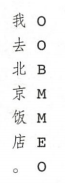

   数据处理代码如下（详见 corpusHandler.py ) :

   ```
   #coding=utf-8
   
   def tag_line(words, mark):
       chars = []
       tags = []
       temp_word = '' #用于合并组合词
       for word in words:
           word = word.strip('\t ')
           if temp_word == '':
               bracket_pos = word.find('[')
               w, h = word.split('/')
               if bracket_pos == -1:
                   if len(w) == 0: continue
                   chars.extend(w)
                   if h == 'ns':
                       tags += ['S'] if len(w) == 1 else ['B'] + ['M'] * (len(w) - 2) + ['E']
                   else:
                       tags += ['O'] * len(w)
               else:
                   w = w[bracket_pos+1:]
                   temp_word += w
           else:
               bracket_pos = word.find(']')
               w, h = word.split('/')
               if bracket_pos == -1:
                   temp_word += w
               else:
                   w = temp_word + w
                   h = word[bracket_pos+1:]
                   temp_word = ''
                   if len(w) == 0: continue
                   chars.extend(w)
                   if h == 'ns':
                       tags += ['S'] if len(w) == 1 else ['B'] + ['M'] * (len(w) - 2) + ['E']
                   else:
                       tags += ['O'] * len(w)
   
       assert temp_word == ''
       return (chars, tags)
   
   def corpusHandler(corpusPath):
       import os
       root = os.path.dirname(corpusPath)
       with open(corpusPath,encoding='utf8') as corpus_f, \
           open(os.path.join(root, 'train.txt'), 'w') as train_f, \
           open(os.path.join(root, 'test.txt'), 'w') as test_f:
   
           pos = 0
           for line in  corpus_f:
               line = line.strip('\r\n\t ')
               if line == '': continue
               isTest = True if pos % 5 == 0 else False  # 抽样20%作为测试集使用
               words = line.split()[1:]
               if len(words) == 0: continue
               line_chars, line_tags = tag_line(words, pos)
               saveObj = test_f if isTest else train_f
               for k, v in enumerate(line_chars):
                   saveObj.write(v + '\t' + line_tags[k] + '\n')
               saveObj.write('\n')
               pos += 1
   
   if __name__ == '__main__':
       corpusHandler('./data/people-daily.txt')
   ```

   此方法主要是用来加载数据并保存转换结果，通过此方法可以把语料进行切分标注

3. 特征模板设计

   在介绍基于条件随机场的命名实体识别时，提到CRF有特征函数，它是通过定义一些规则来实现的，而这些规则就对应CRF++中的特征模板。其基本格式为 %x [row，col ］，用于确定输入数据的一个token ，其中，row 确定与当前的 token 的相对行数， col用于确定决定列数。

   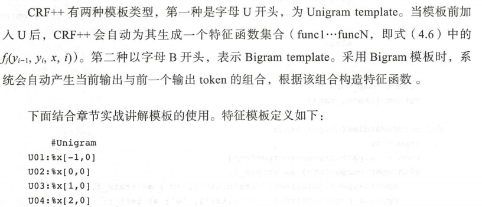

   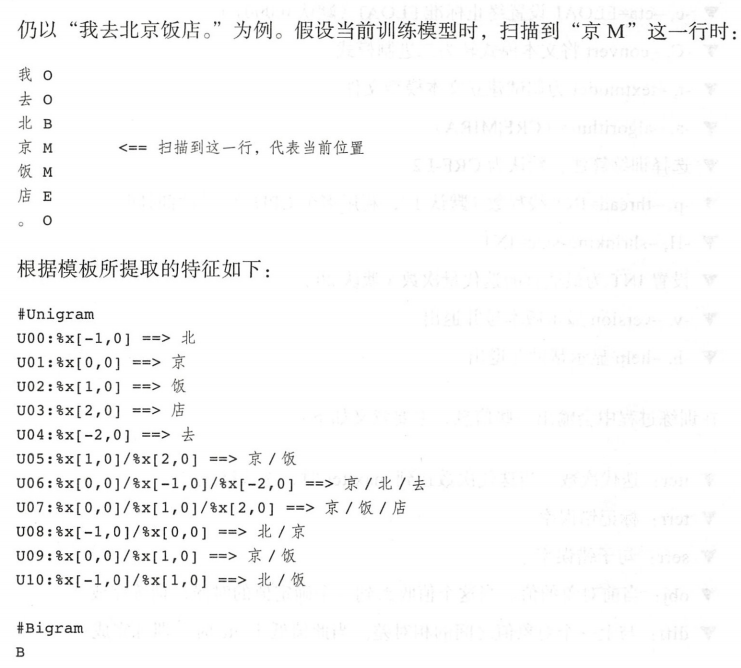

4. 模型训练和测试

   CRF++提供了训练和测试的命令：crf_learn、crf_test。训练采用下面的命令：

   **crf_learn -f 4  -c 3 template ./data/train.txt model**

   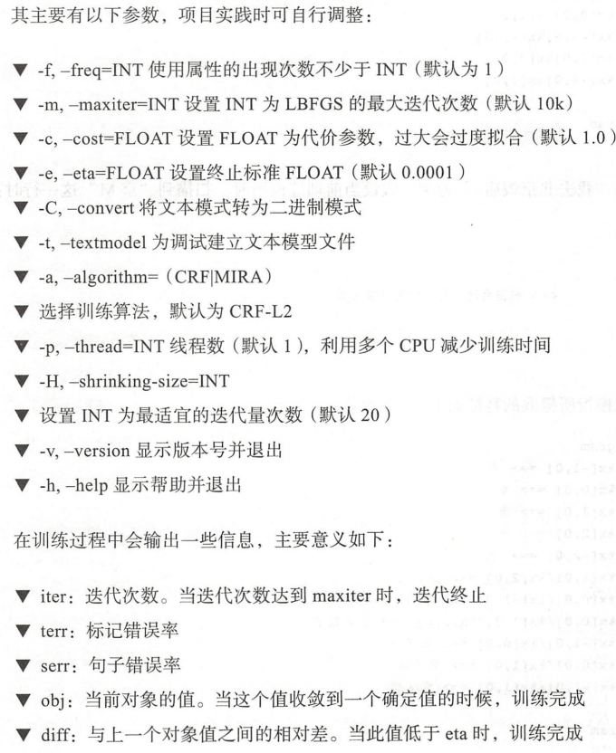

   此过程在命令提示符运行会显示出训练过程

   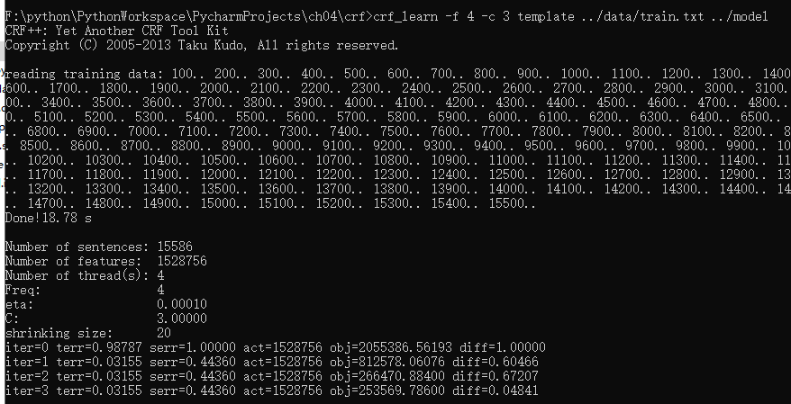

   训练完成后，使用crf_test命令测试模型。命令如下：

   **crf_test -m model ./data/test.txt>./data/test.rst**

5. 模型使用

   CRF++提供了Python接口，可以通过该接口加载模型，进行自定义函数（详见locNER.py）

   在windows系统下加载接口，此过程在上面安装过程中已完成。

   具体代码：

   ```
   
   def f1(path):
   
       with open(path) as f:
   
           all_tag = 0 #记录所有的标记数
           loc_tag = 0 #记录真实的地理位置标记数
           pred_loc_tag = 0 #记录预测的地理位置标记数
           correct_tag = 0 #记录正确的标记数
           correct_loc_tag = 0 #记录正确的地理位置标记数
   
           states = ['B', 'M', 'E', 'S']
           for line in f:
               line = line.strip()
               if line == '': continue
               _, r, p = line.split()
   
               all_tag += 1
   
               if r == p:
                   correct_tag += 1
                   if r in states:
                       correct_loc_tag += 1
               if r in states: loc_tag += 1
               if p in states: pred_loc_tag += 1
   
           loc_P = 1.0 * correct_loc_tag/pred_loc_tag
           loc_R = 1.0 * correct_loc_tag/loc_tag
           print('精确率loc_P:{0}, 召回率loc_R:{1}, F1值loc_F1:{2}'.format(loc_P, loc_R, (2*loc_P*loc_R)/(loc_P+loc_R)))
   
   def load_model(path):
       import os,CRFPP
       # -v 3: access deep information like alpha,beta,prob
       # -nN: enable nbest output. N should be >= 2
       if os.path.exists(path):
           return CRFPP.Tagger('-m {0} -v 3 -n2'.format(path))
       return None
   
   def locationNER(text):
   
       tagger = load_model('./model')
   
       for c in text:
           tagger.add(c)
   
       result = []
   
       # parse and change internal stated as 'parsed'
       tagger.parse()
       word = ''
       for i in range(0, tagger.size()):
           for j in range(0, tagger.xsize()):
               ch = tagger.x(i, j)
               tag = tagger.y2(i)
               if tag == 'B':
                   word = ch
               elif tag == 'M':
                   word += ch
               elif tag == 'E':
                   word += ch
                   result.append(word)
               elif tag == 'S':
                   word = ch
                   result.append(word)
   
   
       return result
   
   
   if __name__ == '__main__':
       f1('./data/test.rst')#计算模型在测试集上的效果
       text = '我中午要去北京饭店，下午去中山公园，晚上回亚运村。'
       print(text, locationNER(text), sep='==> ')
   
       text = '我去回龙观，不去南锣鼓巷'
       print(text, locationNER(text), sep='==> ')
   
       text = '打的去北京南站地铁站'
       print(text, locationNER(text), sep='==> ')
   
   ```

   此过程请在命令提示符下运行，在编辑器中运行会报出模块导入失败的错误。

   运行结果：

   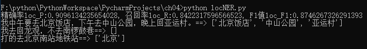

   可以看到，该程序针对一些场景能够很好地进行识别，但是在遇到如“回龙观”、“南锣鼓巷”、“北京南站”等词识别效果并不好。这种情况在实际项目中会经常遇到，解决办法是：1、扩展语料，改进模型。2、整理地理位置词库

   

## 4.3总结

本章主要讲解了词性标注和命名实体识别技术 对于词性标注，在给出基础概念和技术后，简单讲解了标注的规范， 然后介绍了其在 Jieba 分词中的使用方法 对于命名实体识别，在介绍完基础概念和常用方法后，重点介绍了另一种基于序列标注的模型一条件随机场，随后列举了两个实战一一日期识别和地名识别，分别演示了规则方法和统计方法。

到本章为止，我们已介绍过分同、词性标注和命名实体识别 作为中文信息处理中基础性关键技术，它们是自然语言处理中在词法层面的 姐妹，相互联系和影响。细心的读者会发现，在第3和第4章中 ，我们介绍的方法基本上是互通的，并不限于在某一个具体问题上，尤其是 HMM和CRF。当将分词、词性标注和命名实体识别都作为标注任务来进行处理时 ，采用 HMM和CRF 都是可行的，不同的是标签的区别。当然，HMM和CRF 相互间能够辅助其他任务完成得更好， 如在命名实体识别中，当我们在切完词、标注完词性后，再做识别任务，效果要比单纯的字标注要好很多。


AIMI-CN AI学习交流群【1015286623】 获取更多AI资料 
扫码加群：


分享技术，乐享生活：我们的公众号每周推送“AI”系列资讯类文章，欢迎您的关注！


