# 【2019斯坦福CS224N笔记】（1）如何计算机理解人类语言

## 写在前面

NLP——Natural Language Processing，其中自然语言指的就是人类语言。它研究用计算机来处理、理解以及运用人类语言（如中文、英文等），达到人与计算机之间进行有效通讯。所谓自然，是为了区分一些人造语言，类似C、Python等人为设计的语言。NLP的应用无处不在，因为人们几乎用语言进行交流：网络搜索，广告，电子邮件，客户服务，语言翻译，医学报告等。近年来，深度学习方法在许多不同的NLP任务中获得了非常高的性能，使用单个端到端神经模型，不需要传统的，任务特定的功能工程。

**简单来说，NLP就是让计算机理解人类的语言**。而想让机器理解人类的语言是一项很复杂的任务，而且有很多有趣又实用的研究方向如机器翻译、情感分析、智能问答、文摘生成等等。

本系列内容主要以斯坦福大学2019年最新课程CS224n为教材。在本课程中，大家可以通过学习设计，实施和理解自己的神经网络模型所需的技能。今年课程的变化包含了**更多新内容**：字符模型、Transformer、机器学习公平性、多任务学习等，并且从以往课程的TensorFlow改用**PyTorch**。有兴趣得同学，可以在我们的公众号中点击“加入我们”，一起学习交流。

---

本节的主要内容包括：

- 计算机如何表示单词含义
- word2vec
- word2vec的梯度下降推导

## 一、计算机如何表示单词含义

### 1.早期表示方法

这是NLP领域的一个基本问题。早期的做法是我们建立所有同义词synonym和下义词hypernym(即“is a"的关系）的词库，比如WordNet，一个单词的含义就由它的同义词集合和下义词集合来定义。

但是，这样表示存在一些问题。比如**语境问题**：一个单词只在某些语境下和另一个词为同义词而其他语境下不是，词汇的新的含义很难包含进入词库，定义比较主观且需要较多人力整理，而且也很难量化两个词的相似程度。

### 2.用ont-hot向量来表示单词

即在一个大的词汇表中，该单词对应所在元素为1，向量中其他元素均为0，向量维数=词汇表中单词的数量(如500,000)。

但是用one-hot表示也存在一个显然的问题，例如：在web搜索中，如果用户搜索“Seattle motel”,我们希望匹配包含“Seattle hotel”。但是，如下即由于所有向量都是互相正交的，我们无法有效的表示两个向量间的**相似度**，并且向量**维度过大**。

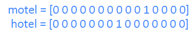

### 3.word vector来表示单词

对于单词的表示问题，语言学家们有一个新的发现，解决了早期的表示方法中存在问题，即：

*Distributional semantics*: **A word’s meaning is given by the words that frequently appear close-by**

- “You shall know a word by the company it keeps” (J. R. Firth 1957: 11)
- **One of the most successful ideas of modern statistical NLP!**	

上述这段话的大致意思是，**一个单词的含义往往是由经常和它一起出现的附近的单词们决定的**，有点物以类聚，人以群分的感觉。即我们定义一个以该词为中心的定长的窗口，窗口内的其他词构成了它的上下文context，而通过这些context我们可以建立对该词的有效的表示。我们可以学习在向量本身中编码相似性，即**根据上下文来表示单词**。使用w的许多contexts来构建w的表示。如下图中banking附近常出现的词决定了banking的含义。

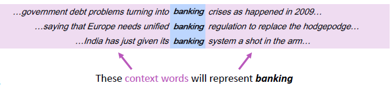

---

## 二、word2vec

### 1.word2vec介绍

word vector中一种较为流行的方法是Word2Vec。之前的one-hot vector是一种sparse vector,我们想要构建的是dense vector。即大多数元素不为零且维度较小的向量，并且希望在相似的context下的word vector也较为相似。（word vector也被称为word embedding或是word representation）word2vec方法由谷歌的NLP专家在2013年左右提出，我们将为选择的每个单词构建一个**密集**的向量。其核心思想如下：

- 我们有大量的文本语料库
- 遍历文本中的每个位置t，其中有一个中心词(center)c和上下文词(“outside”)单词o
- 固定词汇表中的每个单词w可用两个向量表示，一个是它作为center word时的向量v_w以及它作为context word时的向量u_w 
- 用向量c和o的**相似度**（比如说余弦相似度）来计算给定c的o的**概率**(**反之亦然**)，即Word2vec是一种从原始文本中学习嵌入词的高效预测模型。它有两种风格:连续的词袋模型(CBOW)和**跳格模型(skip-gram)**。从算法上来说，这些模型是相似的，CBOW从源上下文词预测目标词，而skip-gram则相反，**从目标词预测源上下文词**。
- 不断调整单词向量来**最大化**这个概率

如下图所示，就是窗口大小为2，center word为into的context word的概率表示。

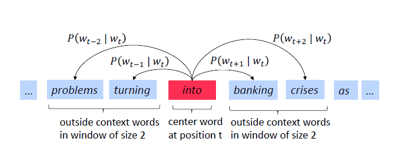

当我们扫到下一个位置时，banking就成为center word。

### 2.如何计算P

首先，我们先解释一下什么是[softmax function](https://zh.wikipedia.org/wiki/Softmax%E5%87%BD%E6%95%B0)，下面是(归一化处理)的例子：

$$
softmax(x_i)=\frac{exp(x_i)}{\sum_{j=1}^nexp(x_j)}
$$

softmax function将任意值x_i映射到概率分布（0，1）上，其中：

- exp目的是让所有数变为正数
- softmax之所以叫softmax，是因为指数会让大的数越大，小的数越小。
- 该方法一般用于深度学习中

有了上面的知识，我们就可以计算P了。我们回顾一下，对于每个单词w，我们将使用两个向量：

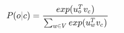

- v_w:当w是中心词的时候，v_w代表中心词向量，维度设为d维（一般为100-300维），故对于中心词c，对应的词向量为v_c
- u_w:当w是上下文词的时，u_w代表上文词向量，维度也为d维，故对于上下文词o，对应的词向量为u_o
- 一共用V个词汇
- 故计算$P(w_{t+j}|w_t)$，相当于计算给定中心词c，上下文词o时的概率

下面简单的用图来描述一下：
  
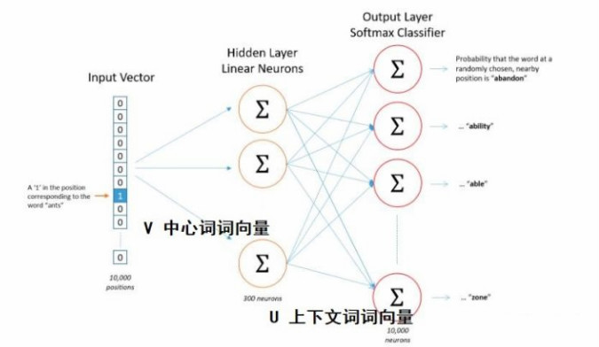

将输入输出的文本根据词汇表，进行one-hot编码。那么我们的问题就会变成训练一个神经网络。输入一个词的one-hot编码，预测该词的上下文。**其中的中心词词向量V就是输入层到隐藏层之间的权重，上下文词向量就是隐藏层到输出层之间的权重。**最后我们将输出层的结果进行softmax，使其分布在(0, 1)之间且总和为1。

所以说**word2vec本质是一个神经网络**，中心词词向量和上下文词向量都是该神经网络的参数。理解了这些，我们就可以采用常用的梯度下降或随机梯度下降来求解神经网络的参数了。

**注意**:起初，**词向量是随机初始化的。**（可采用的随机初始化方法有很多，比如让参数服从N(0, 1)的高斯分布）

我们有了每个单词的P，就可以来表示我们的目标函数了。之后采用随机梯度下降法来计算各个参数的梯度，再之后更新参数即可。

word2vec算法除了可以计算词向量，还可以用于预测用户行为，从而做一个推荐系统！训练词向量时，我们输入一段文本序列。而预测用户行为时，我们输入用户的先后行为操作。你知道之后该怎么做了吗？[相关介绍](http://mccormickml.com/2018/06/15/applying-word2vec-to-recommenders-and-advertising/)

### 3.objective function

整体的似然函数就可以写成这些条件概率的联乘积形式。

对于每个位置t= 1，…，T，预测一个固定大小为m的窗口、中心词为w_t，context words的概率，我们要做的就是不断调整单词向量来**最大化**这个整体的似然率，即这些条件概率的联乘积形式：

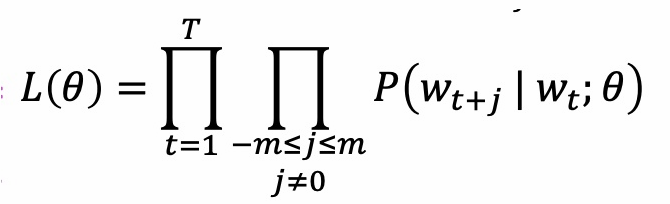

而我们的目标函数如下图：

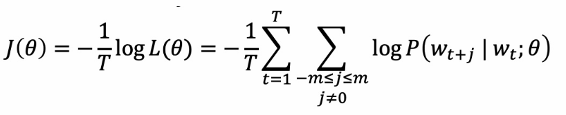

**公式描述**:

- objective function，有时也被称作loss function或者cost function
- θ是所有要被优化的变量
- 目标函数相比于上面的似然函数，连乘变为了求和，目的是防止概率越乘越小，而求和就可以避免这种情况。至于前面加了一个负号，由最大值改为求最小值，这点并没有很大区别**因此，我们由原来想要得到的似然函数的最大值，就转化为了求目标函数的最小值**。
- 另外，我们除以文本长度T，这样，该目标函数就和文本的长度无关了。

有了目标函数以及每个条件概率的表现形式，我们就可以利用梯度下降算法来逐步求得使目标函数最小的word vector的形式了。

---

## 三、word2vec的梯度下降推导

### 1.训练模型:计算**所有**向量梯度

- 回顾:θ表示在一个长向量中所有模型参数，在本个例子中有d维的向量和V个单词。且每个单词都有两个向量，参数个数一共是2dV个。
- 我们沿着梯度对这些参数进行优化

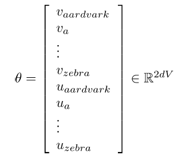

### 2.word2vec梯度推导

（这里只计算logP对v_c向量的偏导，建议大家自己动手推一下）

- 明确我们的目标:通过训练模型，即改变参数θ的值，来**最小化**$J(\theta)$

---

推导过程如下:

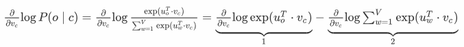

部分1推导结果为:u_0（注：v，u均为矢量，有d维，所以这里为多元微积分求导）以下为部分2推导：

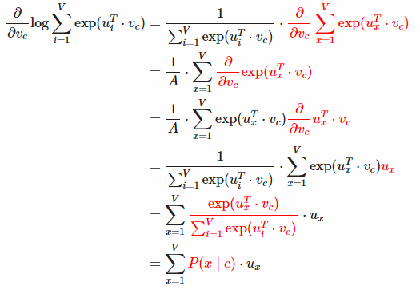

注：公式中的x为避免和前面的i重复。所以，综合起来可以求得，单词o是单词c的上下文概率。

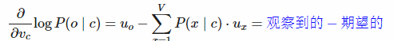

故实际上偏导是，单词o的上下文词向量，减去，所有单词x的上下文向量乘以x作为c的上下文向量的概率，即：

- 总体梯度计算:在一个window里面，对中间词汇$v_c$求了梯度， 然后再对各个上下文词汇$u_o$求梯度（本文中没有写，感兴趣可自行计算）。然后更新这个window里面用到的参数。通常在每个窗口中，我们将计算该窗口中使用的所有参数的更新。有了梯度之后，参数减去梯度，就可以朝着最小的方向走了。机器学习梯度下降

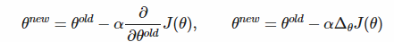

### 小结

- 词向量是如今自然语言处理中最常用的词语表达方式。语义相同的词，其词向量一般都很接近。
- 词向量时基于大量文本训练出来的。常见的算法有基于中心词预测上下文的skip-grams和基于上下文预测中心词的CBOW。
- 对词向量的训练本质上是对神经网络的训练。我们让神经网络预测单词出现的概率。但我们在意的不是预测结果，而是神经网络的参数。我们将神经网络的参数作为词向量，来进行以后的NLP任务。

本节，我们讲述了计算机是如何表示单词的语义，其中重点讲解了word2vec方法和其梯度下降的推导，下节我们将介绍一些关于word2vec的优化方法。

### 相关阅读

[第一讲ppt](http://web.stanford.edu/class/cs224n/slides/cs224n-2019-lecture01-wordvecs1.pdf)	

[第一讲讲义](http://web.stanford.edu/class/cs224n/readings/cs224n-2019-notes01-wordvecs1.pdf)

[skip-gram模型教程](http://mccormickml.com/2016/04/19/word2vec-tutorial-the-skip-gram-model/)

[gensim工具包使用实战](https://link.zhihu.com/?target=http%3A//web.stanford.edu/class/cs224n/materials/Gensim.zip)

[word2vec开山论文](https://arxiv.org/pdf/1301.3781.pdf)

[负采样算法](http://papers.nips.cc/paper/5021-distributed-representations-of-words-and-phrases-and-their-compositionality.pdf)

[DeepNLP的表示学习之词嵌入来龙去脉](https://blog.csdn.net/abcgkj/article/details/89739365)
