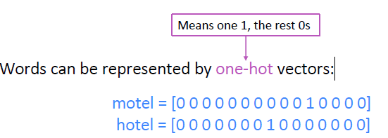
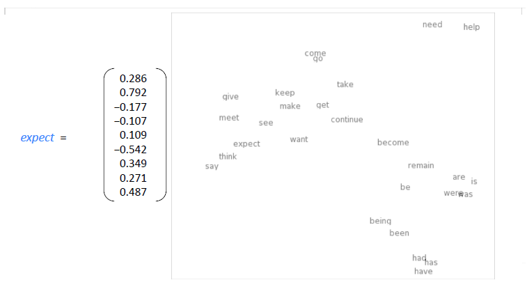
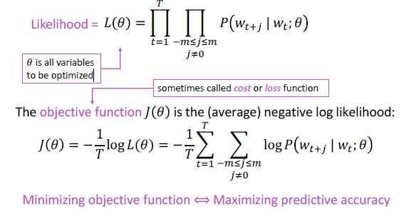
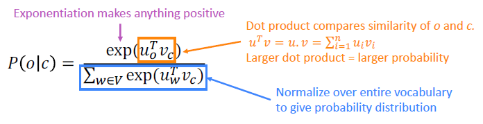
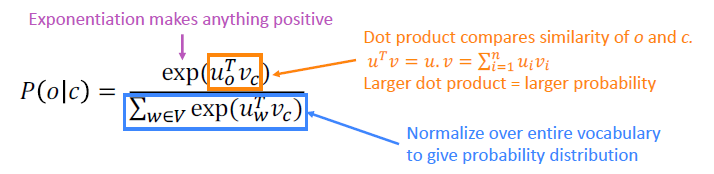
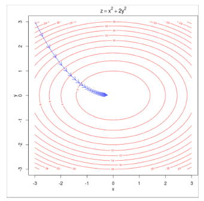
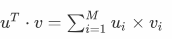

## CS224n-01课程简介和词向量

- 课程介绍
- 人类语言和词义
- word2vec介绍
- word2vec目标函数梯度
- 优化基础

### 一、课程介绍

1. [课程官网](http://cs224n.stanford.edu/)
2. 2019版课程与之前课程的区别：环境为Pytorch，且内容更为紧凑

### 二、人类语言和词义

#### 1.我们如何在计算机中拥有可用的意思？

一般的解决方案：使用WordNet（一个包含同义词集和超常词列表的同义词典）。

*举例：包含“good”的同义词集合*

**代码示例**

```python
import nltk
from nltk.corpus import wordnet as wn

nltk.download('wordnet')
poses = { 'n':'noun', 'v':'verb', 's':'adj (s)', 'a':'adj', 'r':'adv'}
for synset in wn.synsets("good"):
    print("{}: {}".format(poses[synset.pos()], ", ".join([l.name() for l in 			synset.lemmas()])))
```

**output**

	noun: good
	noun: good, goodness
	noun: good, goodness
	noun: commodity, trade_good, good
	adj: good
	adj (s): full, good
	adj: good
	adj (s): estimable, good, honorable, respectable
	adj (s): beneficial, good
	adj (s): good
	……
	adv: well, good
	adv: thoroughly, soundly, good

#### 2.诸如WordNet的资源中存在的问题

- 作为一个资源很好，但缺少细微差别

  例如：“proficient”被列为“good”的同义词。但是这仅仅在某些语境下是成立的。

- 缺少单词的新含义

  例如：wicked, badass, nifty, wizard, genius, ninja, bombest

-	不能与时俱进

- 主观性

- 需要人为来创造和适应

- 无法计算准确的单词相似性

#### 3.用离散符号来表示单词

在传统的自然语言处理中，我们把词语看作离散的符号:hotel, conference, motel – a localist representation



向量维数=词汇表中单词的数量(如500,000)

#### 4.把单词当作离散符号的问题

例如：在web搜索中，如果用户搜索“Seattle motel”,我们希望匹配包含“Seattle hotel”。

但是，


这两个向量是**正交**的。对于one-hot向量，没有**相似性**概念!

#### 5.解决方案

我们可以学习在向量本身中编码相似性，即**根据上下文来表示单词**。

​	*Distributional semantics*: **A word’s meaning is given by the words that frequently appear close-by**

- “You shall know a word by the company it keeps” (J. R. Firth 1957: 11)
- **One of the most successful ideas of modern statistical NLP!**	

当一个单词w出现在文本中时，它的**context**是出现在附近的一组单词(在一个**固定大小**的窗口中)。

使用w的许多contexts来构建w的表示


### 三、词向量（word2vec）介绍

#### 1.word vectors

- 我们将为选择的每个单词构建一个密集的向量，使其类似于出现在类似上下文中的单词的向量。

  *注：word vectors有时被称为word embeddings或word representations表示。它们是一种分布式的表示。*

- 词的含义作为一个神经词向量——可视化



#### 2.word2vec回顾

**如对word2vec还有疑问，请看**[图文讲解word2vec](https://blog.csdn.net/abcgkj/article/details/89575872)

Word2vec (Mikolov et al. 2013)是一个学习单词向量的框架

**主要思想：**

- 我们有大量的文本语料库
- 固定词汇表中的每个单词都由一个**向量**表示
- 遍历文本中的每个位置t，其中有一个中心词(center)c和上下文词(“outside”)单词o
- 用向量c和o的**相似度**（比如说余弦相似度）来计算给定c的o的**概率**(**反之亦然**)，即Word2vec是一种从原始文本中学习嵌入词的高效预测模型。它有两种风格:连续的词袋模型(CBOW)和**跳格模型(skip-gram)**。从算法上来说，这些模型是相似的，CBOW从源上下文词预测目标词，而skip-gram则相反，**从目标词预测源上下文词**。)
- 不断调整单词向量来**最大化**这个概率

**示例（给定windows来计算P(w_{t+j}|w_t)：**


#### 3.word2vec：objective function

对于每个位置t= 1，…，T，预测一个固定大小为m的窗口、中心词为w_j，预测context words：



**注：**

- objective function，有时也被称作loss function或者cost function
- θ是所有要被优化的变量
- 目标函数相比于上面的似然函数，前面加了一个负号，由最大值改为求最小值，这点并没有很大区别

**因此，我们想要得到目标函数的最小值**:





#### 4.softmax function

这是一个[softmax function](https://zh.wikipedia.org/wiki/Softmax%E5%87%BD%E6%95%B0)(归一化处理)的例子：
$$
softmax(x_i)=\frac{exp(x_i)}{\sum_{j=1}^nexp(x_j)}=p_i
$$
softmax function将任意值x_i映射到概率分布p_i上

- exp会让所有数变为正数
- softmax之所以叫softmax，是因为指数会让大的数越大，小的数越小。
- 一般用于深度学习中

### 四、word2vec目标函数梯度

为了训练模型，我们调整参数使损失最小化。例如，对于两个参数上的一个简单凸函数，等高线表示目标函数的级别



#### 1.训练模型:计算**所有**向量梯度

- 回顾:θ表示在一个长向量中所有模型参数，在本个例子中有d维的向量和V个单词。
- 我们沿着梯度对这些参数进行优化


注：每个单词都有两个向量（一个为中心词向量，一个为上下文词向量），而每个词向量的维度为d

#### 2.word2vec梯度推导
- 明确我们的目标:通过训练模型，即改变参数θ的值，来**最小化**$J(\theta)$
$$
J(θ)=-\frac{1}{T}\sum^T_{t=1}\sum_{{-m\le j\le m,j\neq0}}logP(w_{t+j}|w_t;\theta)
$$

- 问题：如何计算P？
- 答案：对于每个单词w，我们将使用两个向量：
  - $v_w$:当w是中心词的时候，$v_w$代表中心词向量，维度设为d维（本课程中设为100维特征，现google最新已为300维），故对于中心词c，对应的词向量为$v_c$
  - $u_w$:当w是上下文词的时，$u_w$代表上文词向量，维度设为d维，故对于上下文词o，对应的词向量为$u_o$
  - 一共用V个词汇
- 故计算$P(w_{t+j}|w_t)$，相当于计算对于中心词c和上下文词o时的概率，即：
  


	两个单词越相似，点积越大。向量点积定义如下：

- **这里只计算logP对$v_c$向量的偏导**（大家可以自己做对$u_o$的偏导），用向量表示所有的参数，有V个单词，d维向量。每个单词有2个向量。参数个数一共是2dV个。


---

推导过程如下:


 -   部分1推导结果为:$u_0$（注：v，u均为矢量，有d维，所以这里为多元微积分求导）
 -   部分2推导：


注：公式中的x为避免和前面的i重复。所以，综合起来可以求得，单词o是单词c的上下文概率
logP(o∣c)，对center向量$v_c$的偏导：


实际上偏导是，单词o的上下文词向量，减去，所有单词x的上下文向量乘以x作为c的上下文向量的概率。

-	总体梯度计算:

	-	在一个window里面，对中间词汇$v_c$求了梯度， 然后再对各个上下文词汇$u_o$求梯度（本文中没有写，感兴趣可自行计算）。然后更新这个window里面用到的参数。
	通常在每个窗口中，我们将计算该窗口中使用的所有参数的更新。例如：

	
	
-	梯度下降
有了梯度之后，参数减去梯度，就可以朝着最小的方向走了。机器学习梯度下降


#### 3.关于word2vec的更多细节
-	为什么是两个向量？

	更容易去优化，最后求其平均值。

-	两个相关模型，本文使用的是第一种：

	1.Skip-grams (SG)：通过中心词预测上下文词

	2.Continuous Bag of Words (CBOW）：从上下文词包中预测中心词
-	训练的额外方法：

	1.将常见的单词组合（word pairs）或者词组作为单个“word”来处理。

	2.对高频词进行抽样来减少训练样本的个数。

	3.对优化目标采用“negative sampling”方法，这样每个训练样本的训练只会更新一小部分的模型权重，从而降低计算负担。
	
	4.目前:专注于朴素的softmax(更简单的训练方法)

	详细内容请参考：[理解 Word2Vec 之 Skip-Gram 模型](https://zhuanlan.zhihu.com/p/27234078)

### 五、优化梯度
#### 1.方法
-	我们最小化目标函数：$J(\theta)$
-	梯度下降是一种最小化$J(\theta)$的算法
-	思想：对于当前θ值，计算$J(\theta)$的值，然后在**负梯度的方向**上迈步


#### 2.具体细节
-	更新方程（以矩阵表示）


-	更新方程（对于单个参数）


-	算法


#### 4.随机梯度下降
-	问题：$J(\theta)$是语料库中所有窗口的函数（数以亿计），所以计算J(θ)的梯度非常耗费资源，您需要等待很长时间才能进行一次更新，对于几乎所有的神经网络来说，这是一个非常糟糕的方法。

-	解决方法：**随机梯度下降**（Stochastic gradient descent，SGD），即重复示例窗口，并在每个窗口之后更新

随机梯度下降算法：

