# 【2019斯坦福CS224N笔记】（2）词向量的优化与评价

## 写在前面

在【2019斯坦福CS224N笔记】（1）中，我们介绍了计算机是如何表示单词的语义，以及重点讲解了word2vec方法及其梯度下降的推导，但是其中还存在一些问题，需要进行优化。本节我们将介绍一些关于word2vec的优化方法及词向量的评价方式。

---

本节的主要内容包括：

- word2vec的优化
- word2vec的一些表示方法
- 如何评价词向量

## 一、word2vec的优化

### 1.复习：word2vec的主要思想：

word2vec算法一般可分为CBOW和Skip-Grams两种模型。我们如果通过上下文来预测中心的词是什么，这样的方法叫做Continuous Bag of Words(CBOW)。反之，我们若是想要通过中心词来预测上下文的词，这样的方法叫Skip-grams，本文讲的是第二种方法，其主要思路为：

- 遍历整个语料库中的每个单词
- 每个单词用分别用中心词和上下文词向量表示
- 更新参数以使目标函数最小化 

顺便说一下，为什么我们要用两个向量表示一个单词？答案很简单，因为两个向量更容易我们表示单词，因为同一个单词，它既可能作为中心词，也可能是别的单词的上下文词。你可以通过平均两个向量来得到最后的一个向量，也可以求和，拼接等等。
 
那么，Word2vec中的参数是如何计算呢？如图：

1. 首先，我们需要注意在TensorFlow、Pytorch等一些框架中，**单词向量表示为行** 。U、V两个矩阵都有六个单词，每个单词有一个五维向量。其中U为每个单词作为上下文词时的表示向量，V为每个单词作为中心词时的表示向量
2. 对U，$v_4^T$做点积运算，其中v_4是V矩阵中的一个行向量。
3. 最后对上一步的每一个数字上，做softmax，这就会得到上下文中单词的概率分布

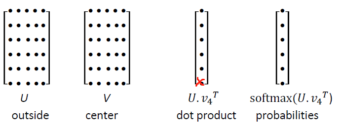

我们再来简单回顾一下梯度下降算法：

- 我们最小化目标函数：J
- 而梯度下降是一种最小化J的算法
- 思想：对于当前θ值，计算J的值，然后在**负梯度的方向**上迈步

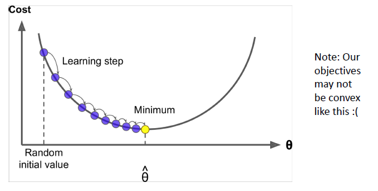

- 更新方程（以矩阵表示）

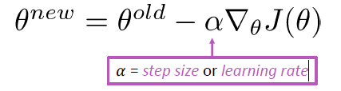

- 新方程（对于单个参数）

- 算法

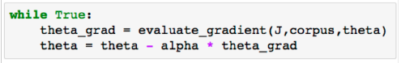

但是，随机梯度下降算法存在一个很大问题。即目标函数中的每个向量，是语料库中**所有窗口**的函数（数以亿计），所以计算J(θ)的梯度非常耗费资源，您需要等待很长时间才能进行一次更新，对于几乎所有的神经网络来说，这是一个非常糟糕的方法。所以我们提出了用随机梯度下降算法进行优化。

### 2.随机梯度下降

**随机梯度下降算法**（Stochastic gradient descent，SGD），我们只取了一个采样窗口，在实践中，我们采用一个small batch,一般为32或者64的batch，用小批量计算梯度。这样做有两个优点，一个是可以减少噪音估计。第二个原因，如果我们在使用GPU时希望计算速度快，需要得到一大堆相同的操作并行化。因此，如果你使用32或64等批次，你可以获得更好的加速。*而不是用42或者别的数字，只因为它是你最喜欢的数字。*

随机梯度下降算法：

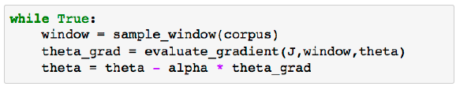

- 随机梯度下降与词向量：迭代地在每个这样的窗口为SGD取梯度，但是在每个窗口中，我们最多只有2m + 1个单词，所以$\nabla_\theta J_t(\theta)$非常稀疏（会有很多的0元素），我们只能更新出样本中出现的向量，如图：

### 3.negative sampling

为什么提出负样本这个概念？因为归一化时，分母的计算开销太大。如下图。因此，在标准word2vec中，使用负抽样实现skip gram模型，我们以前是研究一个多分类问题：给定一个单词，预测其周围的单词可能是N个中的哪一个（N为字典的长度）。而负采样算法将问题变为了**二分类**：给定两个词，预测这两个词是否应该挨在一起。

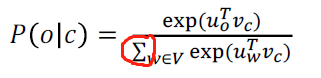

我们令x为第一个词o的U词向量和第二个词c的V词向量的乘积，即x = Uo * Vc采用sigmoid函数来得到概率分布。如果这两个词应该挨在一起，比如“我”，“是”这两个词挨在一起的概率很大，组合可以是“我是个好人”。那么x = Uo * Vc后，我们希望x是一个很大的整数。若两个词毫无关联，如“蚂蚁”，“木星”，我们希望x是一个绝对值很大的负数。我们使用sigmoid函数可以将x的取值缩放到0-1之间。我们用σ(x)来表示两个词是否应该挨在一起的概率。

主要思想（该思路来源于论文:“Distributed Representations of Words and Phrases and their Compositionality” (Mikolov et al. 2013)）：**对分子进行改变。**即，想要将实际观察到的单词概率更大化。训练一个真词对(中心词及其上下文窗口中的词)与随机采样几个噪声对(一般不超过15个，使中心词与随机词搭配,尽量给它们尽可能低的概率)

该论文提出的整体目标函数(使其最大化)如下图：

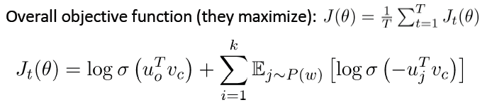

下图是改进后的新目标函数：

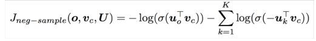

- 取k个负样本，例如：10，15个，使真实的上下文单词出现的概率最大化，加负号后，相当于使问题最小化。
- 使用unigram分布来挑选负样本词，其中，分母Z是用于归一化，以使所有的词被选取的概率和等于一，即∑p(w)=1。**通过这种方式，减少你采样中非常常见的单词，使频率较低的单词（稀有词）被更频繁地采样**
- 需要注意，窗口的大小我们作为一个超参数（一般为2-10），进行调试，尝试几个数字，来看看实际效果，这里并没有什么科学依据。这里3/4其实也是一个超参数。

unigram分布如下图所示：

---

接下来我们来简单总结一下词向量的表示方法

## 二、基于统计的一些词向量表示方法

### 1.HAL算法（Hyperspace Analogue to Language method）

与word2vec类似，在每个单词周围使用窗口，同时包含语法(POS)和语义信息。例子（基于窗口的共现矩阵）：

- 窗口长度1(更常见:5-10)
- 对称的(与左右上下文无关)
- 语料库示例:I like deep learning.I like NLP.I enjoy flying.

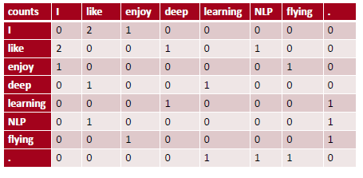

该算法存在一些问题：
如果语料库的词汇量很大，非常高维:需要很大的存储空间
共现矩阵存在稀疏性问题。

### 2.LSA算法（Latent Semantic Analysis）

为了解决上述问题，我们可以采用低维向量表示。主要思想:将“大多数”重要信息存储在一个固定的、少量的维度中:一个密集的向量。通常是25-1000个维度，类似于word2vec。如何降低维度?我们可以采用共现矩阵X的**奇异值分解**(对于任何矩阵，都可以做奇异值分解)。因式分解X到UΣV^T, U和V是正交的。即 ,如下图：

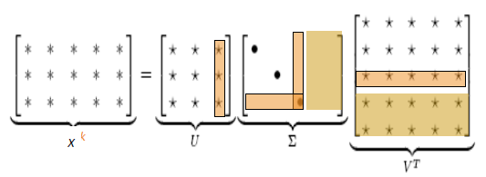

如图，在将X分解为三个矩阵后，我们舍弃图中被框柱（这些部分存储的信息不是很重要）。之后我们将剩余的U、∑、V矩阵重新合并为X矩阵。新的X矩阵会比原来的矩阵小很多（根据舍弃U、∑、V矩阵的比例而定），且保留的内容都是十分重要的信息。

当然，这里也有一些小的trick，比如说：

- the/he/has这里词出现的次数太多了。可以限制共现矩阵X中每个值最大取100，或者在矩阵X中删除所有the/he/has这样常见的词。
- 计算次数时可以加权计算。离中心词越近的词权重越高，越远的词权重越低。另外，除了用SVD降维，我们还可以使用PCA来实现降维。

## 三、基于神经网络方法

神经网络方法：我们将词向量当做神经网络中的一层（词嵌入层）。假设我们的词典有N个词，词向量维度为D。那么我们输入一个词的one-hot编码（X = [0, 0, 0, …, 1, … 0, 0]^T，大小为N * 1），经过词嵌入层W（大小为N*D）之后，我们会得到该词的词向量（如X’ = [0.23, -0.49, 0.32, …, 0.48]，1 * D）。即一个词的词向量为：

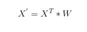

此处词嵌入W的取值，我们可以采用之前HAL、LSA、word2vec等算法得到的词向量，也可以完全随机初始化。

只要我们的训练样本足够大，我们完全可以让执行某一NLP任务（如机器翻译、阅读理解、文本分类等等）的神经网络的词嵌入层随机初始，词嵌入层会随着神经网络的训练而不断更新，直到收敛。在有海量训练数据的情况下，随着神经网络一起训练的词向量往往学习到了词与词之间的相似性，以及捕获了语法和语义的信息。关于如何用神经网络执行NLP任务，我们将会在下一篇文章中讲述。

迭代法：即针对某一个目标函数，通过不断迭代，如梯度下降法或者随机梯度下降算法使目标函数不断变小。当目标函数收敛至某一极小值时，我们选择该过程的中间产物作为我们的词向量。常见的算法有word2vec、Glove。

基于计数的预测vs.直接预测的比较：

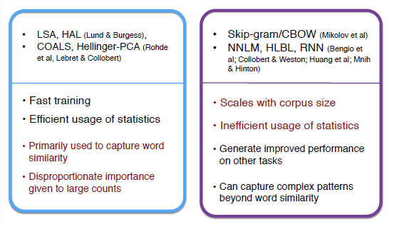

基于计数的算法训练速度相对较快，且很好地利用了统计学的知识。但是这种算法只是捕捉到了词与词之间的相似度。

而使用直接预测的算法，虽然能捕获到词语相似度以外更复杂的语义信息，使用此类算法得到的词向量用于NLP任务时可以获得更好的效果，但此类算法没有很好地利用统计学知识，且训练时间一般较长。

## 四、基于统计与预测相结合——Glove

我们可以结合两种思想，通过控制共现概率与编码意义之间的比率，从而有了Glove算法。

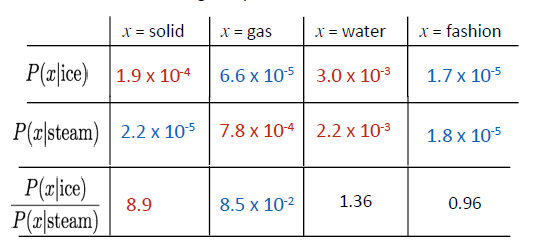

如上图所示，当x取solid时，ice（冰）周围出现的概率很大，在steam（蒸汽）这个词周围出现的概率很小。那么 P(x|ice)/P(x|steam)将会是一个很大的值，那就意味着x和ice关系极大，和steam关系极小。

在word2vec负采样中，我们希望两个词的词向量Uo * Vc很大代表词o和词c相邻，Uo * Vc很小代表词o和词c不相邻。类比这个思想，在Glove中，每个词只有一个词向量，我们希望词i和词j的词向量乘积可以代表词i在词j周围出现的概率。

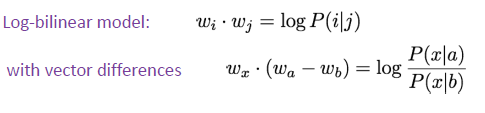

如上图，glove中，每个词只有一个词向量，词i和词j的词向量乘积代表词i在词j周围出现的概率。Wx ( Wa – Wb )越大，x与a有关；越小，x与b有关；取值适中，x可能与a和b都有关或都无关。

这里的P(x|a)是词a周围x出现的频率，是通过计数的方法来统计的，类似LSA算法，需要计算**共现矩阵**

此外，glove模型还有一个目标函数，此处就体现了预测算法的特点：

上图中w是词向量，X是共现矩阵，b是偏置（神经网络中很常见）。f(x)是一个人为规定的函数，该函数如下图。可近似为min(t,100)，意义是降低常见的”the”，”a” 这类词的重要性,f函数限制了常见单词对系统的影响。glove模型即使使用小语料库和小向量，性能也很好。

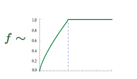

我们最小化上述目标函数J，其意义是我们希望两个词向量的乘积可以代表着两个词共同出现的频率。

## 五、如何评词向量？

与NLP的一般评估相关:内部与外部评价。

- 内部评价是在一个中间任务上评价词向量的好坏。该方法计算速度快，能帮助我们更好地理解系统。但是在Intrinsic上表现好并不意味着词向量在真实任务中会有好的效果。
- 外部评价是在一个真正的NLP任务（如文本分类、机器翻译）中使用词向量，以此来评判词向量的好坏。但是计算Extrinsic任务会消耗很长的时间。即使Extrinsic任务出现了问题，我们也不清楚是词向量的问题还是其他子系统的问题。

关于Intrinsic：

我们希望词向量能捕获语义和语法信息。（语义如 男孩:女孩 = 男人:女人，语法则如 small:smaller = tall:taller）

比如词向量可以知道“man”类比于“woman”就相当于“king”类比于“queen”；“eat”类比于“ate”就相当于“drink”类比于“drunk”;“small”类比于“smaller”就相当于“tall”类比于“taller”等等。

这样的类比在词向量中其实很简单，“woman”词向量减去“man”词向量近似于“king”词向量减去“queen”词向量即可。就如下图：

我们先人为规定几百条、上千条这样的类比规则。然后采用man:woman = king:?的方式，已知三个词，求另一个词。算法如下:

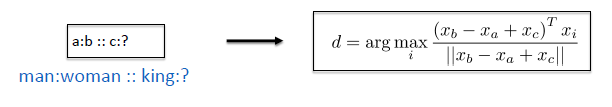

在词向量应用上图算法得到另一个词之后，我们对比词向量得到的词是否与我们人为规定的词相符。如man:woman = king:? 中，问号处应该填queen。

我们统计其预测的正确率，以此来代表词向量的好坏。

不同算法（CBOW，Glove等）在不同词向量维度上（100维、300维、1000维）以及不同训练文本大小(15亿——42亿)上训练的词向量在某一个Intrinsic评价数据集上的结果。（Sem.代表语义得分，Syn.代表句法得分，Tot.代表总分）

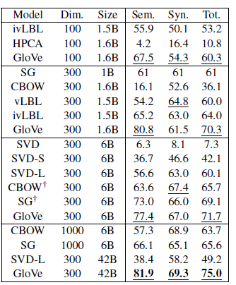

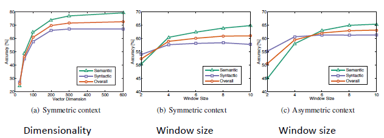

上图说明：

不同的词向量训练算法的效果截然不同。

词向量的效果随着训练文本量的增加而增加。

不对称上下文(只有左边的单词)就不那么好了

词向量维度过低或过高时，在300维的时候，训练效果较好。（过低模型偏差大，过高则模型方差大）

glove模型在Window size = 8 时效果比较好

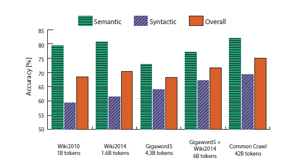

上图说明，在维基百科中的数据语义精确性比较高，可能是因为维基百科本身里的内容就是在说什么是什么的问题。

Intrinsic评判标准除了上述的a:b=c:? 查看语义语法以外，还有查看词语之间的相似度。

比如找10个人，问他们认为“老虎”和“猫”之间的相似度是多少，让他们从0-10中打分。之后我们平均这10个人的打分，得到“老虎”这个单词和“猫”这个单词的相似度。以这样的方法，我们人为标记单词之间的相似度。计算词向量中两个单词的相似度（欧氏距离、乘积、向量夹角等方法），然后对比其与我们人为定义的标准的差距。

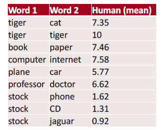

其他：

一词多义的现象很普遍。像“好”这样的词，可以是“质量好”的意思，也可以是“非常”的意思，如“好奇怪”。此时，如果能将一个词的多个意思用不同的词向量来表示就更好的。

读者若是有兴趣可以参考Linear Algebraic Structure of Word Senses, with Applications to Polysemy。该文章讲述了如何将多义词用多个词向量来表达。

## 小结

计算词向量的方法多种多样。定义并最小化一个目标函数，从而学习到某些参数。这是深度学习中最常见的方法。负采样方法将多分类问题变为二分类问题，避免了计算softmax函数，大大降低了计算量。
Glove算法结合了共现矩阵与优化目标函数。由Glove算法的到的词向量表现效果很好。

评价词向量的好坏有Intrinsic Evaluation（内部评价）和Extrinsic Evaluation（外部评价）两种。内部评价可快速得知词向量的对于语法、语义等信息的捕获效果，但是不知道词向量在真实任务中的效果如何。外部评价可以知道词向量的应用效果如何，但计算太慢。
