# 【2019斯坦福CS224N笔记】（3）神经网络

本文内容我们主要讲述一下深度学习中的神经网络，在此之前，我们先来简单回顾一下机器学习。

## 一、机器学习（ML）

### 1.ML主要任务

机器学习中主要有两种任务，即分类和回归。（除此之外，还有聚类任务等等）

- 分类（classification）：将实例数据划分到合适的类别中。应用实例：判断网站是否被黑客入侵（二分类 ）。对于二分类任务，通常令y={-1，+1}或{0，1}。而手写数字的自动识别（多分类）。

- 回归（regression）：主要用于预测数值型数据。应用实例：股票价格波动的预测，房屋价格的预测等。

### 2.ML常用算法

机器学习中的常用算法一般可根据训练数据是否拥有标记信息，大致分为两类：监督学习和无监督学习。（当然，除了监督和无监督学习，还有强化学习，但这里我就不过多讲述了）

- 监督学习：即拥有标记信息，以便机器学习算法可以发现特征和标记信息之间的关系。在监督学习中，给定一组数据，**我们知道正确的输出结果应该是什么样子** (代表任务：分类和回归)
- 无监督学习：在未加标记的数据中，试图找到隐藏的结构。因为提供给学习者的实例是**未标记**的，因此没有错误或报酬信号来评估潜在的解决方案。在无监督学习使用的许多方法是基于用于处理数据的数据挖掘方法。（代表任务：聚类和密度估计）

常用机器算法如下图所示：

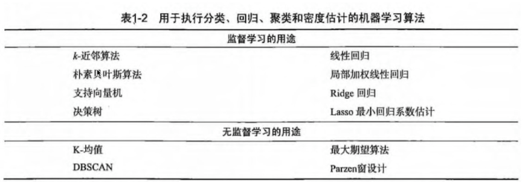

## 二、神经网络（NN）

神经网络是一门重要的机器学习技术，是机器学习的一个重要分支。它是目前最为火热的研究方向--深度学习的基础。神经网络是一种模拟人脑的神经网络以期能够实现类人工智能的机器学习技术。神经网络会将前一层神经元们的信号经过处理后传到下一层，下一层神经元们的信号经过处理后再传到下下层，并且可以证明的是，层数越深越可以更好的拟合出任意的函数。

### 1.经典的神经网络

这是一个包含三个层次的神经网络。红色的是输入层，绿色的是输出层，紫色的是中间层（也叫隐藏层）。输入层有3个输入单元，隐藏层有4个单元，输出层有2个单元。如下图：

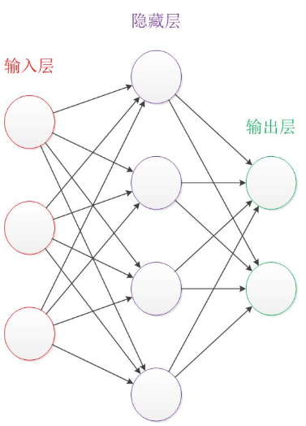

在开始介绍前，我们需要知道：

- 设计一个神经网络时，输入层与输出层的节点数往往是固定的，中间层则可以自由指定；
- 结构图里的关键不是圆圈（代表“神经元”），而是连接线（代表“神经元”之间的连接）。每个连接线对应一个不同的权重（其值称为权值），这是需要训练得到的。  

### 2.神经元结构

神经元模型是一个包含输入，输出与计算功能的模型。下图是一个典型的神经元模型：包含有3个输入，1个输出，以及2个计算功能。

连接是神经元中最重要的东西。每一个连接上都有一个权重。一个神经网络的训练算法就是让权重的值调整到最佳，以使得整个网络的预测效果最好。由下图我们可以清楚的看到，神经元模型的本质，无非是线性函数+非线性函数。

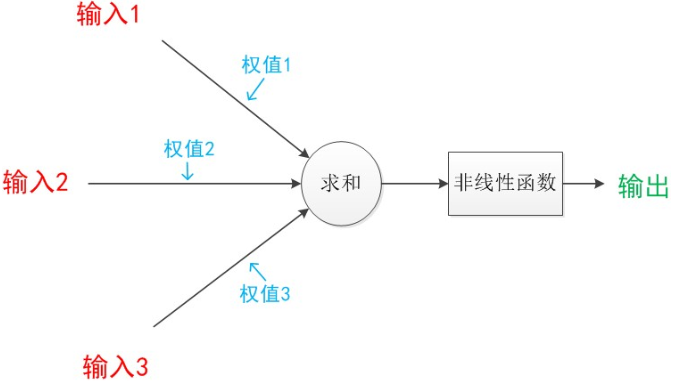

神经元模型可以这样理解：我们有一个数据，称之为样本。样本有四个属性，其中三个属性已知，一个属性未知。我们需要做的就是通过三个已知属性预测未知属性。这里，已知的属性称之为特征，未知的属性称之为目标。假设特征与目标之间确实是线性关系，并且我们已经得到表示这个关系的权值w1，w2，w3。那么，我们就可以通过神经元模型预测新样本的目标。

### 3.单层神经网络（感知机）

在原来MP模型的“输入”位置添加神经元节点，标志其为“输入单元”。其余不变，于是我们就有了下图。

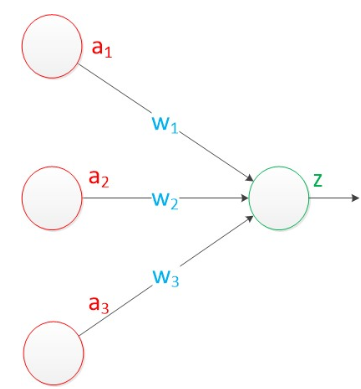

在“感知器”中，有两个层次。分别是输入层和输出层。输入层里的“输入单元”只负责传输数据，不做计算。输出层里的“输出单元”则需要对前面一层的输入进行计算。我们把需要计算的层次称之为“计算层”，并把拥有一个计算层的网络称之为“单层神经网络”。

我们可以用决策分界来形象的表达分类的效果。决策分界就是在二维的数据平面中划出一条直线，当数据的维度是3维的时候，就是划出一个平面，当数据的维度是n维时，就是划出一个n-1维的超平面。
下图显示了在二维平面中划出决策分界的效果，也就是感知器的分类效果。

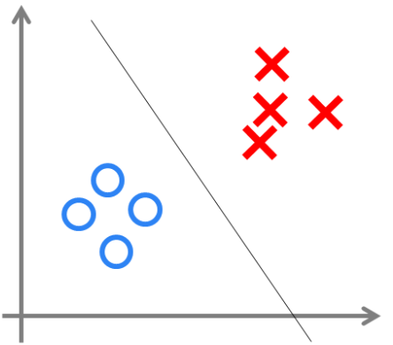

但是感知器也只能做简单的线性分类任务，因此有了两层神经网络（多层感知机）。

### 4.两层神经网络（多层感知机）

单层神经网络无法解决异或问题。但是当增加一个计算层以后，两层神经网络不仅可以解决异或问题，而且具有非常好的非线性分类效果。

两层神经网络除了包含一个输入层，一个输出层以外，还增加了一个中间层。此时，中间层和输出层都是计算层。我们扩展上节的单层神经网络，在右边新加一个层次（只含有一个节点）。

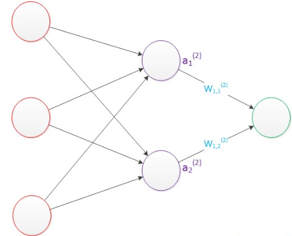

需要说明的是，至今为止，我们对神经网络的结构图的讨论中都没有提到偏置节点（bias unit）。事实上，这些节点是默认存在的。它本质上是一个只含有存储功能，且存储值永远为1的单元。在神经网络的每个层次中，除了输出层以外，都会含有这样一个偏置单元。所以我们这里就不过于赘述了。

与单层神经网络不同。理论证明，两层神经网络可以无限逼近任意连续函数。这是什么意思呢？也就是说，面对复杂的非线性分类任务，两层（带一个隐藏层）神经网络可以分类的很好。

这里有一个重要的事情，隐藏层的节点数如何设计？在设计一个神经网络时，输入层的节点数需要与特征的维度匹配，输出层的节点数要与目标的维度匹配。而中间层的节点数，却是由设计者指定的。因此，“自由”把握在设计者的手中。但是，节点数设置的多少，却会影响到整个模型的效果。如何决定这个自由层的节点数呢？目前业界没有完善的理论来指导这个决策。一般是根据经验来设置。较好的方法就是预先设定几个可选值，通过切换这几个值来看整个模型的预测效果，选择效果最好的值作为最终选择。这种方法又叫做Grid Search（网格搜索）。

那么两层的神经网络是如何训练的呢？我们先定义一个损失函数，通过优化算法（如梯度下降算法）优化参数，使损失最小。

优化问题只是训练中的一个部分。机器学习问题之所以称为学习问题，而不是优化问题，就是因为它不仅要求数据在训练集上求得一个较小的误差，在测试集上也要表现好。因为模型最终是要部署到没有见过训练数据的真实场景。提升模型在测试集上的预测效果的主题叫做泛化（generalization），相关方法被称作正则化（regularization）。神经网络中常用的泛化技术有权重衰减等。

而在实际训练过程中，我们往往会用到BP算法，即反向传播，下节内容我们会进行详细介绍。

### 5.多层神经网络（深度学习）

常见的多层神经网络有：FNN、RNN、CNN等。这里我们只介绍一下简单的FNN，即前馈神经网络。

我们延续两层神经网络的方式来设计一个多层神经网络。在两层神经网络的输出层后面，继续添加层次。原来的输出层变成中间层，新加的层次成为新的输出层。所以可以得到下图。

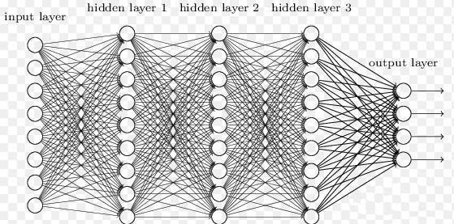

依照这样的方式不断添加，我们可以得到更多层的多层神经网络。与两层层神经网络不同。多层神经网络中的层数增加了很多。增加更多的层次有什么好处？更深入的表示特征，以及更强的函数模拟能力。

更深入的表示特征可以这样理解，随着网络的层数增加，每一层对于前一层次的抽象表示更深入。在神经网络中，每一层神经元学习到的是前一层神经元值的更抽象的表示。例如第一个隐藏层学习到的是“边缘”的特征，第二个隐藏层学习到的是由“边缘”组成的“形状”的特征，第三个隐藏层学习到的是由“形状”组成的“图案”的特征，最后的隐藏层学习到的是由“图案”组成的“目标”的特征。通过抽取更抽象的特征来对事物进行区分，从而获得更好的区分与分类能力。

更强的函数模拟能力是由于随着层数的增加，整个网络的参数就越多。而神经网络其实本质就是模拟特征与目标之间的真实关系函数的方法，更多的参数意味着其模拟的函数可以更加的复杂，可以有更多的容量（capcity）去拟合真正的关系。

### 6.对比

从单层神经网络，到两层神经网络，再到多层神经网络，下图说明了，随着网络层数的增加，以及激活函数的调整，神经网络所能拟合的决策分界平面的能力。

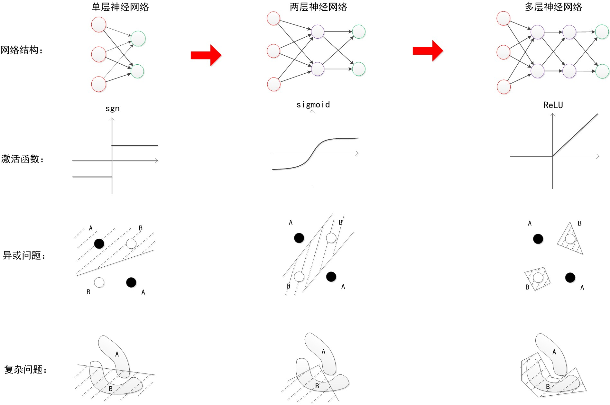

可以看出，随着层数增加，其非线性分界拟合能力不断增强。图中的分界线并不代表真实训练出的效果，更多的是示意效果。神经网络的研究与应用之所以能够不断地火热发展下去，与其强大的函数拟合能力是分不开关系的。

## 三、命名实体识别

### 1.什么是命名实体识别

经过之前那么的铺垫，我们终于开始进行第一个NLP的任务：命名实体识别(Named Entity Recognition)

命名实体识别(Named Entity Recognition)简称NER，目的是找到并分类文本中的实体。如“雷锋是一名军人”中的实体有“雷锋”和“军人”，除了找出这些实体，我们还希望AI可以识别出“雷锋”是人名、“军人”是职业。

命名实体识别是NLP中的一项基础任务，也是一项比较重要的任务。因为一句话中重要的语义信息往往就蕴含在实体之间的关系中，我们在进行问答时，答案也常常是实体名称。

也许你会觉得，这个问题太简单了，完全不需要使用深度学习来实现，人为建一个字典就行了，这个字典中包含我们提前定义的实体名称，只要语句中的词出现在字典中，那这些词就肯定是实体：当我们在一句话中看到“你”、“他”、“她”，“我”这样的词时，这些词肯定是实体，属于代词；当文本中有“游乐园”、“餐厅”、“车站”时，这些词肯定也是实体，属于地名……

只要按照如上步骤，就可以快速地找到一句话中的实体，哪还需要用深度学习来实现啊。

但是，无论是什么语言，都会存在一词多义的情况：英语中”To sanction” 可以理解为”to permit”（允许）或者 “to punish”（惩罚）；中文中的“可怜”一词，在“我好可怜”中，“可怜”是形容词，而在“你们可怜可怜我吧”中，“可怜”又成了动词……类似的例子数不胜数，我们往往需要依靠一个词的**上下文**才能明白该词的意思。

而且在“南京市长江大桥”这样的话中，不考虑上下文的实体识别可能会出现分成“南京”、“市长”、“江大桥”这样的笑话。

### 2 如何实现命名实体识别

上文中我们讲到我们最好通过上下文来理解一个词。因此，我们让神经网络判别一个词是否是实体时，我们不仅告诉神经网络这个词是什么，我们还要告诉神经网络这个词前后N个词是什么。

比如N取2，那么我们可以向神经网络输入X=[museums, in, Paris, are, amaing]，让神经网络通过“Paris”的上下文来推断“Paris”是否为实体。

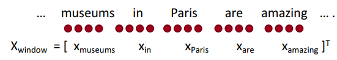

下面具体来说一下整个网络：

假设每个单词都是的词向量（更多词向量相关请看:[笔记一](https://mp.weixin.qq.com/s?__biz=MzU3NDc2MTY3MQ==&mid=2247483902&idx=1&sn=88769d342ce1a6823cb53a483981f88a&chksm=fd2c3e56ca5bb74021d5af3235337f879a0de968f8636ccae8c661ba1a59c077a3689971210b&token=1892774034&lang=zh_CN#rd)[笔记二](https://mp.weixin.qq.com/s?__biz=MzU3NDc2MTY3MQ==&mid=2247483902&idx=2&sn=e2a22c3a3f2267c477ec653c9039af34&chksm=fd2c3e56ca5bb7409610a2fb26a566b76128ea868d7052930b453df74430bf2ba1d06b2f76d1&token=1892774034&lang=zh_CN#rd）)。维度D为4（取4仅仅是为了绘图方便，正常情况下，词向量维度在100-300之间），那么输入的数据的长度为5 * 4。我们可以构建一个输入节点个数为5*4，输出节点个数为1的神经网络。有一层隐藏层，其长度为8，输出层长度为1。这里激活函数只在隐藏层中使用，在输出层不使用。如下图：

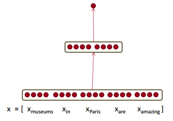

上图的神经网络仅仅是一个示意，我们可以改进一下，如输11个单词，每个单词的词向量维度为100。那么输入层的长度为1100，之后我们再设第一层隐藏层维度为300，第二层隐藏层维度为100，第三层隐藏层维度为50，最后的输出层维度为1。其中输出层的激活函数是sigmoid，所有隐藏层的激活函数均为ReLU。

经过神经网络后，输出层最终会返回一个数值。那么如何来评判预测的好坏，我们提出了一个损失函数。

我们取一对训练样本，如一个正样本[“他”，“去”，“游乐园”, “玩”]（词“游乐园”是实体）和一个负样本[“我”，“是”，“一”，“个”，“公民”]（词“一”不是实体）。

我们希望正样本经过神经网络后，神经网络的输出数据是一个比较大的数，而负样本经过神经网络后，神经网络的输出数据是一个比较小的数。

我们设每一对训练样本中，正样本经过神经网络后的输出数据为S，而负样本经过神经网络后的输出数据为Sc 。为了满足我们上述的希望，即S大，Sc小，我们设目标函数为 J = max(0, 1 – S + Sc), 最小化目标函数 J 的取值即可完成我们S取值大Sc取值小的愿望。如下图：

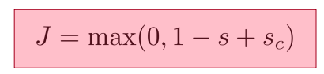

当S的取值比Sc大很多时（这里是S比Sc大1）1-S+Sc就会是负数，那么J = max(0, 1 – S + Sc) 就能取到最小值0。若S比Sc小，或者S并不比Sc大多少时，1-S+Sc就会是一个正数，目标函数J就是一个大于0的数，其还有继续优化的空间。

这里 1 – S + Sc中的 1 可以是2、3、100……只要大于零即可，其目的是让正样本的输出S和负样本的输出Sc拉开一定的差距。

知识补充：这里max(0, ∆ − S + Sc)也称为 Hinge Loss 或者 max-margin objective function， 是SVM中常见的一个目标函数。

当然我们也可以采用softmax作为我们的输出层的函数，交叉熵来作为我们的损失函数。

上述内容中我们只考虑了一个词是不是命名实体，没有给实体进行分类。可以考虑将我们所讨论的模型从二分类问题改为多分类问题。输出层的维度不再是1，而是N。如N取4，考虑一个单词是属于[非实体, 人名, 地名, 组织机构名]中的哪一个。若属于“人名”，则输出层中对应“人名”的结点取值应该很大，其他结点取值很小。

那么我们是否更新词向量？

在上述讨论中，词向量都是提前预训练好的（可以使用word2vec，glove等方法）。那么我们到底需不需要更新词向量呢？其实，当我们的训练样本很少的时候，最好使用预训练好的词向量，再来训练神经网络。再者，使用预训练好的词向量可以大幅度减少我们训练网络的时间。

所以在我们在命名实体识别的时候，我们可以采用fine-tune方法，更新词向量。其学习率α要很小，因为词向量已经捕获了语义信息，我们只需要对词向量进行微调即可。而且在神经网络训练刚开始时不更新词向量，等目标函数收敛到一定程度时才开始训练词向量。因为神经网络开始时是随机初始化的，此时要是更新词向量，只会降低词向量的表现效果。

## 总结

- 首先，回顾了机器学习中的任务和常用算法。
- 其次，讲述了一下神经网络的历史进程，从单层到两层，到最后的多层神经网络。我们现在常用的激活函数为Relu。
- 最后，介绍了NLP中的一个基本任务，命名实体识别。

下节，我们将会介绍反向传播机制。

## 本文参考资料

[cs224n第三讲ppt](http://web.stanford.edu/class/cs224n/slides/cs224n-2019-lecture03-neuralnets.pdf)

[cs224n第三讲视频](https://www.youtube.com/watch?v=8CWyBNX6eDo&list=PLoROMvodv4rOhcuXMZkNm7j3fVwBBY42z&index=3)

[机器学习基础](https://github.com/apachecn/AiLearning/blob/master/docs/ml/1.%E6%9C%BA%E5%99%A8%E5%AD%A6%E4%B9%A0%E5%9F%BA%E7%A1%80.md)

[如何简单形象又有趣地讲解神经网络是什么？](https://www.zhihu.com/question/22553761/answer/267280164)

[神经网络浅讲：从神经元到深度学习](http://www.cnblogs.com/subconscious/p/5058741.html)

[What is the intuition behind SoftMax function?](https://www.quora.com/What-is-the-intuition-behind-SoftMax-function)

[2019版CS224N中文笔记(3)神经网络基础知识-上](https://zhuanlan.zhihu.com/p/62132916)

[深度学习（一）——MP神经元模型, BP算法, 神经元激活函数, Dropout](https://blog.csdn.net/antkillerfarm/article/details/74187428?locationNum=3&fps=1)