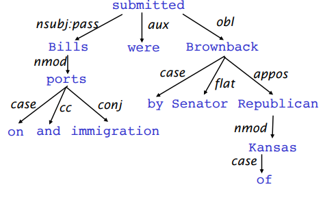

# 【2019斯坦福CS224N笔记】（5）依存结构语法

csdn：https://blog.csdn.net/abcgkj

github：https://github.com/aimi-cn/AILearners

---

上节课我们主要讲述了神经网络是如何进行反向传播的。那么，这节课我们将来介绍NLP中的一大难点——句法分析。句法分析的主要任务是识别出句子所包含的句法成分以及这些成分之间的关系，一般以句法树来表示句法分析的结果。

那么如何描述语法？主要有两种观点:短语结构语法和依存结构语法。本文将重点讲述依存结构语法，因为人们发现依存句法树标注简单，且准确率高，近年来大多数使用的都是这种语法结构。

## 一、起源

语法依存的概念可以追溯到公元前4世纪印度语言学家Panini对语义、句法和形态依存的分类研究，但一般认为现代依存语法理论的创立者是法国语言学家Lucien Tesnière（1893—1954）。L.Tesnière的思想主要反映在他1959年出版的《结构句法基础》（Eléments de syntaxe structurale）一书中［Tesnière，1959］。——摘自《统计自然语言处理》

## 二、定义

英文术语是：Dependency Parsing。依存结构语法假定句法结构由词汇项之间的关系组成，通常称为依赖关系的二元非对称关系，描述为从 head（被修饰的主题）用箭头指向 dependent （修饰语）。一般这些依存关系形成树结构。他们通常用语法关系的名称（主体，介词宾语，同位语等）。一个依存树的例子如下图所示：

### 1.信息来源

- 双词汇亲和（Bilexical affinities），比如discussion与issues。
- 依赖距离（Dependency distance），主要用近义词。
- 中间词语，如果中间词语是动词或标点，则两边的词语不太可能有依存
- 词语配价，一个词语最多有几个依赖者。

### 2.约束条件

- Root只能被一个词依赖
- 无闭环

### 3.方法

- Dynamic programming
- Graph algorithms——最小生成树
- Constraint Satisfaction 
- “Transition-based parsing” or “deterministic dependency parsing”：主流方法，基于贪心决策动作拼装句法树。

## 三、神经网络依存句法分析器

在神经网络依存句法依赖分析器出现之前，主要有如下在几种句法分析器：

- Greedy transition-based parser
- Basic transition-based dependency parser
- Arc-standard transition-based parser
- MaltParser

那为什么需要神经网络句法分析器？这是因为传统特征表示稀疏、不完全、计算代价大的传统parser的大部分时间都花在拼装查询特征上了。其实，相较于传统方法，神经网络句法分析器就是把原来的单词、词性、依存标签转化成了向量进行表示。下图是该模型的架构:

从模型架构上来看，输入层主要做的是查找和合并，隐藏层使用了一个Relu激活函数，输出层则是一个简单的softmax分类器，loss使用的交叉熵函数。

## 四、展望

Chen and Manning(2014)的工作，是第一个简单、成功的神经依赖解析器。这项工作由其他人进一步发展和改进，走在最前沿的是Google。主要趋势是：

- 更大、更深的网络，具有更好的调优超参数
- Beam Search
- 对决策序列进行全局、条件随机字段(CRF)样式的推理

这就引出了之后的SyntaxNet和Parsey McParseFace模型。

喜欢的童鞋记得分享给别的小伙伴哈。AIMI-CN AI学习交流群【1015286623】 获取更多AI资料扫码加群：

分享技术，乐享生活：我们的公众号每周推送“AI”系列资讯类文章，欢迎您的关注！

