# 【2019斯坦福CS224N笔记】（6）Language Models and RNNs

csdn：https://blog.csdn.net/abcgkj

github：https://github.com/aimi-cn/AILearners

---

## 一、传统的语言模型

### 1.什么是语言模型

语言建模是一项基准测试任务，它帮助我们衡量我们在理解语言方面的进展。语言建模是许多NLP任务的子组件，特别是那些涉及生成文本或估计文本概率的任务：预测输入、语音识别、手写识别、拼写/语法修正、身份识别、机器翻译、摘要、对话等。

在实际应用中，我们经常需要解决这样一类问题：如何计算一个句子的概率？而语言模型就是用来解决该问题的。比如我们每天用手机发信息，输入法会自动“联想”你可能输入的下一个字或者词，这就用到了语言模型。

其实，语言模型就是计算一个单词序列（句子）的概率的模型。那么我们如何计算一个句子的概率呢？给定一个句子（词语序列）：S = w1,w2,...,wk，它的概率可以表示为：P(S) = P(w1,w2,..,wk) = p(w1)p(w2|w1)...p(wk|w1,w2,...,wk-1)。但是这样的方法有着严重的缺陷：

- 參数空间过大：条件概率p(wn|w1,w2,..,wn-1)的可能性太多，无法估算，不可能有用；
- 数据稀疏严重：对于非常多词对的组合，在语料库中都没有出现，依据最大似然估计得到的概率将会是0。

因此，为了解决上述问题。引入了马尔科夫假设（Markov Assumption）：随意一个词出现的概率只与它前面出现的有限的一个或者几个词有关。由此也就有了n-gram语言模型。

### 2.n-gram语言模型

首先我们看一元语言模型，我们的句子概率定义为：此时整个句子的概率可表示为最大似然估计:

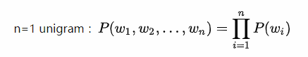

观察可知，在一元语模型中，整个句子的概率等于各个词语概的乘积。言下之意就是：各个词之间都是相互独立的，这无疑是完全损失了句中的词序信息，所以一元模型的效果并不理想。

接下来是二元语言模型和三元语言模型，此时整个句子的概率可表示为：

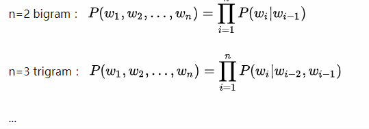

观察可知，在二元模型和三元模型中，整个句子的概率等于n个条件概率相乘，以此类推，就有了n-gram语言模型。那么如何计算上述概率呢？我们可以用统计学的方法近似计算出上述概率。计算方法如下图所示：

下面我们举一个例子（例子来源于https://class.coursera.org/nlp/）：

这个例子来自大一点的语料库，为了计算对应的二元模型的参数，即P(wi | wi-1)，我们要先计数即c(wi-1，wi)，然后计数c(wi-1)，再用除法可得到这些条件概率。可以看到对于c(wi-1，wi)来说，wi-1有语料库词典大小（记作|V|）的可能取值，wi也是，所以c(wi-1，wi)要计算的个数有|V|^2。

c(wi-1，wi)计数结果如下:

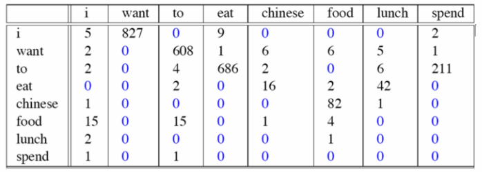

c(wi-1)的计数结果如下：

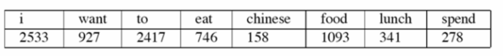

那么二元模型的参数计算结果如下：

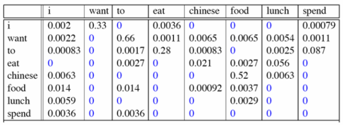

比如计算其中的P(want | i) = 0.33如下：

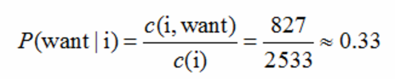

那么针对这个语料库的二元模型建立好了后，我们可以计算我们的目标，即一个句子的概率了。显然当n>=2时，该模型是可以保留一定的词序信息的，而且n越大，保留的词序信息越丰富，但是计算成本也呈指数级增长，并且这也就有了n-gram模型的两个问题：稀疏性和存储问题。

首先，对于稀疏性问题主要来源于两个方面：
  
- 分子为0，即count（w1，w2，w3）等于0，则进而导致P（w3|w1，w2）等于0，模型试图说明这个句子不太可能出现，而事实上只是它以前没有见过而已，所以我们需要采取“平滑”方法来解决这个问题，它的解决问题的基本思想就是把在训练集中看到的概率分一点给未看到的，并保持概率和为1。
- 分目为0，即count（w1，w2）等于0，我们可以采取“回退”的方法。比如说：要计算p(wn | wn-2,wn-1)，但没有相关的三元统计，就可以使用二元语法P(wn | wn-2)来估计，如果没有相关的二元统计，那么我们就用一元模型P(wn)来估计。因此，n的增加使稀疏性问题变得更糟，所以一般情况下n不能大于5。

如果大家想了解更多关于解决稀疏性问题的方法，可以参考[Statistical language model 统计语言模型](https://blog.csdn.net/a635661820/article/details/43906731)

其次，是存储问题。需要存储在语料库中看到的所有n-gram的计数。随着n的增加(或者语料库大小的增加)，模型的大小也随之增加。

## 二、基于窗口的神经语言模型

Bengio et al提出了第一个大规模深度学习自然语言处理模型，只不过是用前n个单词的词向量来做同样的事情（上文建模）而已，其网络结构如下：

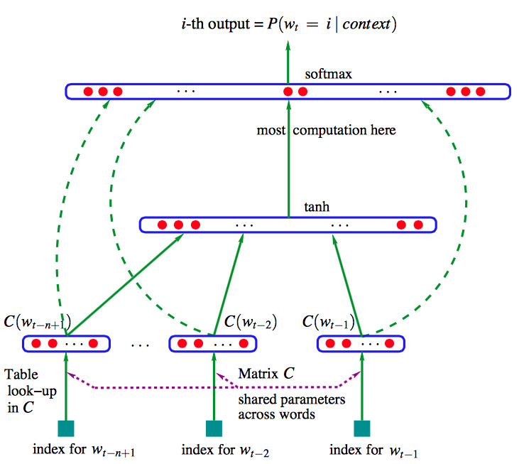

公式如下：

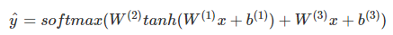

这里W(3)x+b(3)就是前n个单词词向量的线性运算，虽然这种模型名字里有“Neural”，但依然属于传统模型。

## 三、Recurrent Neural Networks

### 1.初识RNN语言模型

利用RNN对序列建模，复用不同时刻的线性非线性单元及权值，理论上之前所有的单词都会影响到预测单词。

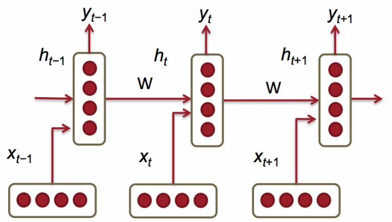

上图为RNN的结构，其中垂直矩形框是时间步长t处的隐藏层，每个隐藏层包含多个神经元，每个神经元对其输入进行线性矩阵运算，然后进行非线性运算(如tanh())。在每个时间步长中，隐藏层有两个输入：前一层的输出h_{t-1}和该时刻的输入x_t。最后通过输出层获得预测下一个单词。

举个例子来说，假设我们输入一个单词序列： the students opened their，来预测下一个单词，如下图所示：

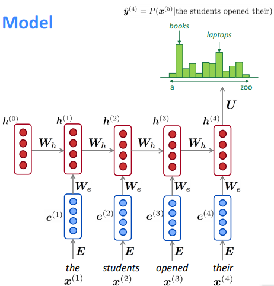

- 输入层x^(t)是每个单词的one-hot向量编码，再乘上word embedding矩阵E得到e^t
- 隐藏层的状态计算如下图所示：
    
    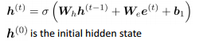

    如上图可以看到，每个时间步的隐藏层状态都由之前隐藏层状态和当前的输入决定。

- 输出层可以通过一个softmax函数进行预测下一个单词
- 这里需要注意的是，在整个过程中学习的权重W_h和W_e是一样的，因此减少了需要学习的参数数量，并且参数的数量与输入序列的长度无关，因此不会出现n-gram存在的问题。

我们来小结一下RNN语言模型的优点：

- 可以处理任意长度的输入
- 步骤t的计算(理论上)可以使用来自之前所有步骤的信息，而不仅是一个窗口
- 模型大小不会随着输入时间的增加而增加。在每个时间步上应用相同的权重。

当然，这样做也有一些缺点：

- RNN计算是十分缓慢的。因为每个时间步的计算都需要先计算之前的序列，所以不能并行计算多个时间步
- 在实践中，存在梯度消失和爆炸问题，因此很难从许多步骤中获取信息

### 2.如何训练RNN语言模型

- 首先我们需要一个大的文本语料库
- 把其放到RNN语言模型中，计算每个时间步t的输出
- 定义损失函数，一般采用分类问题中常见的交叉熵损失函数：

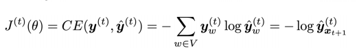

- 取平均值，得到整个训练集的总损失

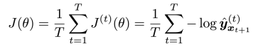

然而，在整个语料库上计算需要花费大量的时间。所以，在实际中我们可以采用随机梯度下降法批量计算损失和梯度然后进行更新。

- 反向传播用于RNN，计算loss的导数

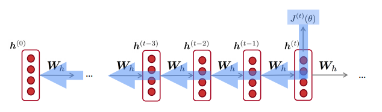

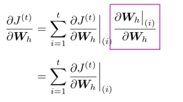

(如果对反向传播不是很了解的童鞋可以点击[反向传播](https://mp.weixin.qq.com/s?__biz=MzU3NDc2MTY3MQ==&mid=2247484310&idx=1&sn=38b64c5d3a52697c5738d87e7dc6b102&chksm=fd2c3c3eca5bb528edc4025fe0cee4216da9f10bc53890984153e02c1b242fbf732eb12fecb5&token=1634066809&lang=zh_CN#rd))

## 四、评估语言模型

语言模型的标准评价指标是“perplexity”

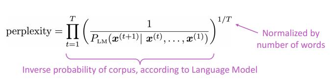

这等于交叉熵损失的指数:

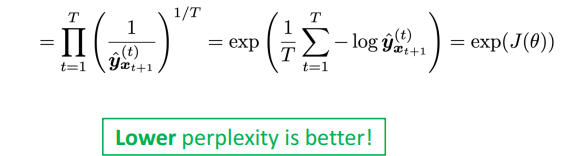

几种语言模型perplexity的比较：

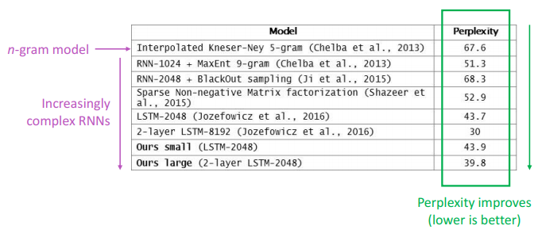

## 五、使用RNN语言模型生成文本

你可以在任何类型的文本上训练RNN-LM，然后生成这种样式的文本。让我们来看一些RNN语言模型一些有趣的例子。

### 1.RNN-LM训练奥巴马演讲

[链接](https://medium.com/@samim/obama-rnn-machine-generated-political-speeches-c8abd18a2ea0)

### 2.RNN-LM训练哈利波特

[链接](https://medium.com/deep-writing/harry-potter-written-by-artificial-intelligence-8a9431803da6)

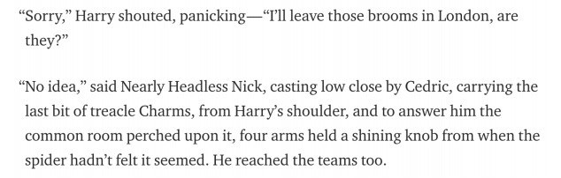

### 3.RNN-LM训练食谱

[链接](https://gist.github.com/nylki/1efbaa36635956d35bcc)

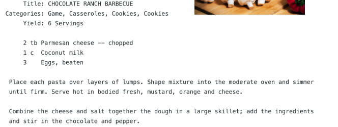

### 4.RNN-LM训练颜色名称

[链接](http://aiweirdness.com/post/160776374467/new-paint-colors-invented-by-neural-network)

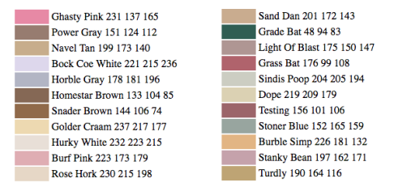

除此之外，RNN还有许多的作用。比如：词性标注、命名实体识别、情感分类、句子分类、回答问题，机器翻译，许多其他任务!更为重要的是，RNN可以用作编码器模块。

在接下来的课程中，我们将会介绍RNN的梯度消失问题，以及RNN的其他版本：GRU、LSTM等结构。

喜欢的童鞋记得分享给别的小伙伴哈。AIMI-CN AI学习交流群【1015286623】 获取更多AI资料扫码加群：

分享技术，乐享生活：我们的公众号每周推送“AI”系列资讯类文章，欢迎您的关注！

