# 【2019斯坦福CS224N笔记】（7）Fancy RNNs

csdn：https://blog.csdn.net/abcgkj

github：https://github.com/aimi-cn/AILearners

---

## 一、RNN的梯度爆炸和消失问题

### 1.产生原因

首先我们回顾一下经典的RNN结构：

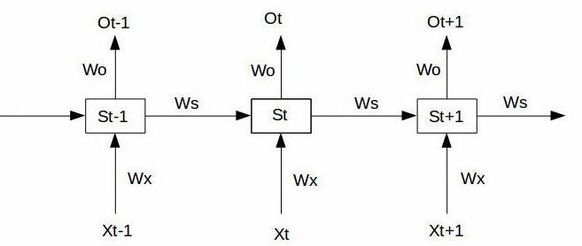

假设我们的时间序列只有三段，S_0为给定值，神经元没有激活函数，则RNN最简单的前向传播过程如下：

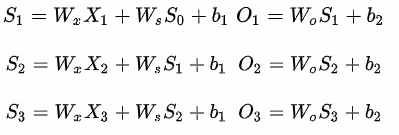

假设在t=3时刻，损失函数为:

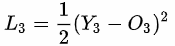

则对于一次训练任务的损失函数为下图，即每一时刻损失值的累加。

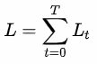

使用随机梯度下降法训练RNN其实就是对W_x、W_s、W_o以及b_1、b_2求偏导，并不断调整它们以使L尽可能达到最小的过程。

现在假设我们我们的时间序列只有三段，t1，t2，t3。

我们只对t3时刻的W_x、W_s、W_o求偏导（其他时刻类似）：

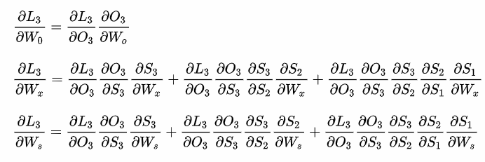

可以看出对于W_0求偏导并没有长期依赖，但是对于W_x、W_s求偏导，会随着时间序列产生长期依赖。因为S_t随着时间序列向前传播，而S_t又是W_x、W_s的函数。

根据上述求偏导的过程，我们可以得出任意时刻对W_x、W_s求偏导的公式：

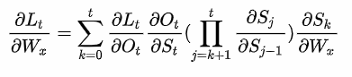

任意时刻对W_s求偏导的公式同上。如果加上激活函数:

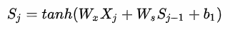

则可得：

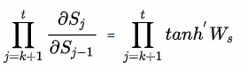

激活函数tanh和它的导数图像如下:

由上图可以看出tanh'<=1，对于训练过程大部分情况下tanh的导数是小于1的，如果W_s也是一个大于0小于1的值，则当t很大时上式就会趋近于0。同理当W_s很大时其就会趋近于无穷，这就是RNN中梯度消失和爆炸的原因。

### 2.解决方案

通常来说，梯度爆炸更容易处理一些。因为梯度爆炸的时候，我们的程序会收到NaN错误。我们也可以设置一个梯度阈值，当梯度超过这个阈值的时候可以直接截取。

梯度消失更难检测，而且也更难处理一些。总的来说，我们有三种方法应对梯度消失问题：

- 合理的初始化权重值。初始化权重，使每个神经元尽可能不要取极大或极小值，以躲开梯度消失的区域。
- 使用relu代替sigmoid和tanh作为激活函数。
- 使用其他结构的RNNs，比如长短时记忆网络（LTSM）和Gated Recurrent Unit（GRU），这是最流行的做法。接下来我们就介绍一下这两种网络。

## 二、LSTM网络

### 1.什么是LSTM

Long Short Term 网络，一般就叫做LSTM，是RNN的一种特殊的类型，可以学习长期依赖信息。LSTM 由Hochreiter & Schmidhuber (1997)提出，并在近期被Alex Graves进行了改良和推广。在解决很多问题方面，LSTM 都取得相当巨大的成功，并得到了广泛的使用。

其实，长短时记忆网络的思路比较简单。原始RNN的隐藏层只有一个状态，即h，它对于短期的输入非常敏感。那么，假如我们再增加一个状态，即c，让它来保存长期的状态，那么问题不就解决了么？如下图所示：

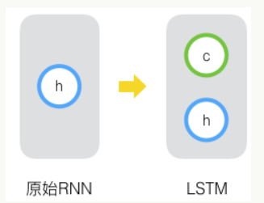

注意：h和c这两个向量维度相同。

LSTM 不同于单一神经网络层，整体上除了输出h在随时间流动，细胞状态c也在随时间流动。这里，细胞状态c就代表着长期记忆。

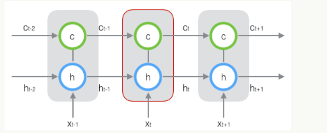

LSTM的关键，就是怎样控制长期状态c。在这里，LSTM的思路是使用三个控制开关。第一个开关，负责控制继续保存长期状态c；第二个开关，负责控制把即时状态输入到长期状态c；第三个开关，负责控制是否把长期状态c作为当前的LSTM的输出。三个开关的作用如下图所示：

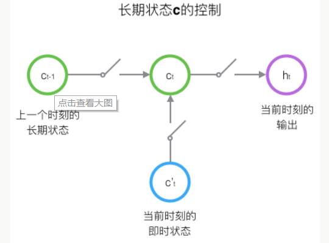

前面描述的开关是怎样在算法中实现的呢？这就用到了门（gate）的概念。门实际上就是一层全连接层，它的输入是一个向量，输出是一个0到1之间的实数向量。门是一种让信息选择式通过的方法。他们包含一个 sigmoid 神经网络层和一个按位的乘法操作。如下图所示：

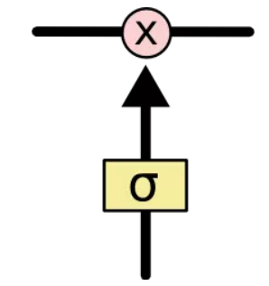

门的使用，就是用门的输出向量按元素乘以我们需要控制的那个向量。因为门的输出是0到1之间的实数向量，那么，当门输出为0时，任何向量与之相乘都会得到0向量，这就相当于啥都不能通过；输出为1时，任何向量与之相乘都不会有任何改变，这就相当于啥都可以通过。因为σ（也就是sigmoid函数）的值域是(0,1)，所以门的状态都是半开半闭的。

### 2.逐步理解LSTM

首先我们来看遗忘门：它是用来控制从以前的单元格状态保留和遗忘什么。在下图的公式中，$\sigma$表示对数据进行$sigmoid$运算，$W_f$表示权重，$[h_{t-1},x_t]$，表示将当前的输入$x_t$与$t-1$时段隐藏层的状态$h_{t-1}$的矩阵进行拼接，$b_f$表示偏差。

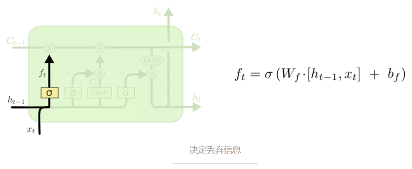

接下来是输入门：它是用来控制**下一步是什么样的新信息被存放在细胞状态中**。这里包含两个部分。第一，$sigmoid$ 层称 “输入门层” 决定什么值我们将要更新，**即决定想让网络学习到的新的知识所占的权重**。然后，一个 $tanh$ 层创建一个新的候选值向量，$\tilde{C}_t$，**即神经网络在此时学习到的新的知识**，它会被加入到状态中。下一步，我们会讲这两个信息来产生对状态的更新。

**现在是更新旧细胞状态的时间了，$C_{t-1}$更新为 $C_t$**。前面的步骤已经决定了将会做什么，我们现在就是实际去完成。

我们把旧状态与$f_t$相乘，丢弃掉我们确定需要丢弃的信息。接着加上 $i_t * \tilde{C}_t$，学习我们想让网络学习的东西。这就是新的候选值，根据我们决定更新每个状态的程度进行变化。

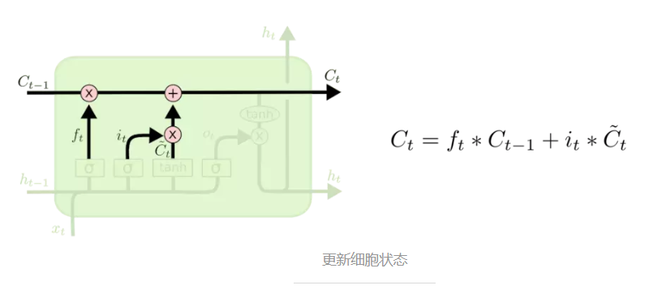

最终是输出门：它用来控制**我们需要确定输出什么值**。首先，我们运行一个$sigmoid$ 层来确定细胞状态需要被输出部分的权重。接着，我们把细胞状态通过 $tanh$进行处理（得到一个在-1到 1之间的值）并将它和 $sigmoid$门的输出相乘，最终我们仅仅会输出我们确定输出的那部分。

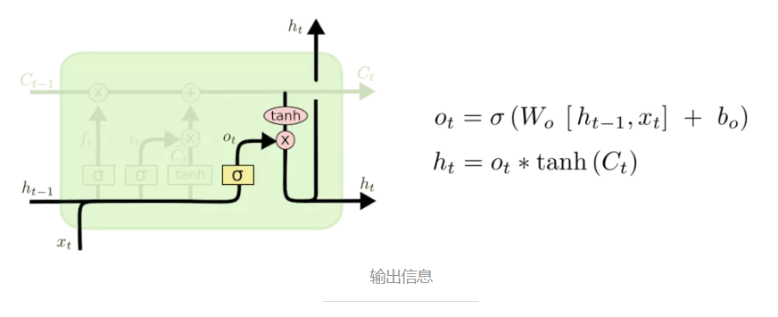

可以用下面一幅图总结：

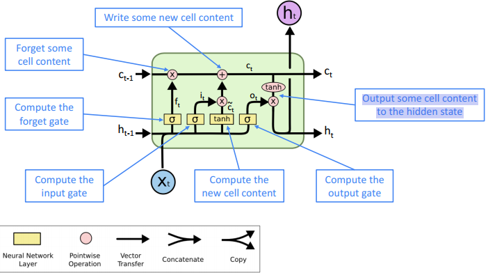

所以，总的来说，我认为LSTM网络中的不同神经元与各种操作可以理解为：

+ $sigmoid$层主要是用来计算权重，其输出的是一种“比例”。
+ $tanh$层主要是用来学习新的知识，其输出的是一种"内容"。
+ ×操作主要是用来对"比例"和"内容"进行线性运算，从而决定哪些"内容"被网络学习，哪些"内容"被网络忘记。
+ ＋操作主要是将学习到的新"内容"添加到细胞状态中，从而产生长期记忆。

### 3、LSTM的变体——GRU

我们到目前为止都还在介绍正常的 LSTM。但是不是所有的 LSTM 都长成一个样子的。接下来我们简要介绍一下GRU，它将忘记门和输入门合成了一个单一的更新门，如下图所示：

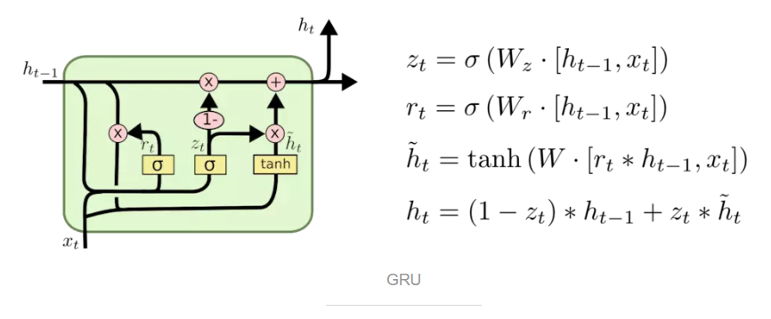

- 对于更新门z：它用来控制更新和保留隐藏状态的哪些部分
- 对于重置门r：它用来控制用于计算新内容的先前隐藏状态的哪些部分
- 对于新的隐层状态内容h't（对应下图的第三个公式）：重置门选择上一个隐藏状态的有用部分。使用这个和当前输入来计算新的隐藏内容。
- 对于隐藏层状态h_t：更新z同时控制从以前的隐藏状态保留的内容，以及更新到新的隐藏状态内容的内容

### 4、LSTM vs GRU

- 研究人员提出了许多门控RNN变体，其中LSTM和GRU的应用最为广泛
- 最大的区别是GRU计算速度更快，参数更少，但是没有确凿的证据表明其中一个总是比另一个表现得更好
- LSTM是一个很好的默认选择(特别是当您的数据依赖关系特别长，或者您有很多训练数据时)
- 经验法则:从LSTM开始，但是如果您想要更高效的东西，请切换到GRU

读到这里，我们不禁还有一个疑问？梯度消失或者梯度爆炸只是存在于RNN中吗？答案明显是否定的。事实上，对于所有的神经结构(包括前馈和卷积)都是一个问题，尤其是对于深度结构。原因主要是由于链式法则/非线性函数的选择，梯度在反向传播时可以变得非常小，因此较低层次的学习非常缓慢(很难训练)。因此现在的RNN、CNN等架构又有许多的改进，比如：ResNet、DenseNet、HighwayNet等等

## 三、更为复杂的RNN

### 1.Bidirectional RNNs

为什么要提出双向RNN呢？我们举一个情感分类的例子：“The movie was terribly exciting !”如果是用普通的单向RNN，如下图所示：

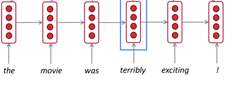

由于是顺序的，因此我们只能读取到terribly的上文，即“The movie was”，这样就很有可能导致我们的情感分类为负面的。但实际情况是，terribly在本句话中是用来修饰exciting的，因此我们有了Bidirectional RNN来解决这一问题。

如下图所示:每个时间t下有一个前向的RNN和反向的RNN。而且，这两个RNN的权重一般都是不同的。需要注意的是，这里的RNN可以使用LSTM、GRU等这样的变体。

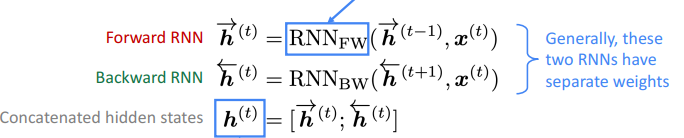

双向的RNN简化图如下：

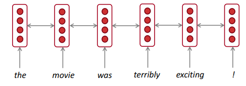

注意：双向RNN只适用于访问整个输入序列的情况。它们不适用于语言建模，因为在LM中，您只有上文。因此如果你有完整的输入序列(例如任何一种编码)，双向性是强大的(默认情况下你应该使用它)。例如，BERT(Bidirectional Encoder Representations from Transformers)是一个强大的预先训练的上下文表示系统，建立在双向性的基础上。

### 2.Multi-layer RNNs

RNNs已经深入到一个维度(它们展开到许多时间步长)，我们也可以通过应用多层RNNs使它们深入到另一个维度，下图是一个多层RNN。这允许网络计算更复杂的表示，较低的RNN应该计算较低级别的特性，较高的RNN应该计算较高级别的特性。

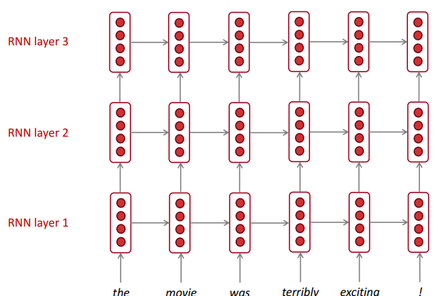

高性能的RNN通常是多层的(但没有卷积或前馈网络那么深)。例如:在2017年的一篇论文中，Britz等人发现了这一点。机器翻译时，编码器RNN最好为2 - 4层，解码器RNN最好为4层。基Transformer的网络(如BERT)可以多达24层。

## 小结

本节的内容较多，但是逻辑还是很清楚的，我们来简要回顾一下。首先我们解释了RNN梯度爆炸和消失的原因，由此引出了接下来的主要解决方案——LSTM和GRU。最后我们简单介绍了双向RNN和多层的RNN。下节课我们将介绍Machine Translation, Seq2Seq and Attention。

以下是本节课的主要参考资料：

[零基础入门深度学习(6) - 长短时记忆网络(LSTM)](https://zybuluo.com/hanbingtao/note/581764)

[Understanding LSTM Networks](http://colah.github.io/posts/2015-08-Understanding-LSTMs/)

[一文带你理解LSTM网络](https://github.com/aimi-cn/AILearners/blob/master/blog/others/20190518_LSTM.md)

[RNN梯度消失和爆炸的原因](https://zhuanlan.zhihu.com/p/28687529)

喜欢的童鞋记得分享给别的小伙伴哈。AIMI-CN AI学习交流群【1015286623】 获取更多AI资料扫码加群：

分享技术，乐享生活：我们的公众号每周推送“AI”系列资讯类文章，欢迎您的关注！

