# 【2019斯坦福CS224N笔记】（9）Deep Learning for NLP Best Practices

csdn：https://blog.csdn.net/abcgkj

github：https://github.com/aimi-cn/AILearners

---

本人在看CS224n Lecture9课程后，本节课程主要讲的是Final project和回顾了GRU和LSTM网络。没有特别多的新内容，故在网上找到了一篇国外大佬写的关于NLP实践总结的博文，故翻译之与大家进行分享。

原文作者：Sebastian Ruder

[原文链接] (http://ruder.io/deep-learning-nlp-best-practices/index.html#attention)

在NLP社区中一直存在一个笑话，一个受到关注的LSTM将在任何任务上产生最先进的性能。虽然这在过去两年中一直如此，但NLP社区正逐渐从现在的标准基线转向更有趣的模型。

然而，作为一个社区，我们不希望在接下来的两年中独立（重新）发现下一个关注LSTM。我们不想重新发明已经证明有效的技巧或方法。虽然许多现有的深度学习库已经编码了一般用于神经网络的最佳实践，例如初始化方案，但许多其他细节，特别是任务或特定于域的注意事项，仍留给从业者。

这篇文章并不是为了追踪最新技术，而是为了收集与各种任务相关的最佳实践。换句话说，这篇文章不是描述一个特定的架构，而是旨在收集成功架构的功能。虽然这些功能中的许多功能对推动最新技术最有用，但我希望通过更广泛的知识对它们进行更强有力的评估，与基线进行更有意义的比较，以及通过塑造我们对可行方法的直觉来激发灵感。

我将首先概述与大多数任务相关的最佳实践。然后，我将概述与最常见任务相关的实践，特别是分类，序列标记，自然语言生成和神经机器翻译。

免责声明：将某事视为最佳做法非常困难：最好根据什么？如果有更好的选择会怎么样？这篇文章是基于我（必然是不完整的）理解和经验。在下文中，我将仅讨论被至少两个不同组独立报告的实践。我将尽力为每个最佳实践提供至少两个参考。

## 词向量技术

Word嵌入可以说是NLP近期历史上最广为人知的最佳实践。众所周知，使用预先训练的嵌入有助于提升模型的结果。单词嵌入的最佳维度主要取决于任务：较小的维度更适用于更多的句法任务，如命名实体识别或词性（POS）标记，而较大的维数为多个语义任务，如情绪分析。

## 模型深度

虽然我们暂时无法达到计算机视觉的深度，但NLP中的神经网络已逐渐变得更加深入。最先进的方法现在经常使用深层Bi-LSTM，通常由3-4层组成，例如用于POS标记和语义角色标记。某些任务的模型可以更深入，参见 谷歌的NMT模型有8个编码器和8个解码器层。然而，在大多数情况下，使模型深于2层的性能改进是最小的。

这些观察结果适用于大多数序列标记和结构化预测问题。对于分类，深度或深度模型仅在字符级输入时表现良好，浅字级模型仍然是最先进的。

## 网络层之间的连接

对于深层次神经网络的训练，有一些技巧非常重要，可以避免梯度弥散的问题。目前已经提出了各种各样的网络层和连接方法。在这里，我们将讨论其中的三种方法：

- 高速公路层 (highway layers)
- 残差连接 (residual connection)
- 密集连接 (dense connection)

### 1.高速公路层

高速公路层高速公路层的灵感来源于LSTM的门函数。首先让我们假设有一个单层的MLP (多层感知机，也就是全连接神经网络)，它将对输入x作一个非线性g函数的变换，如下：

h = g(Wx + b)

高速公路层则是这样的函数变换：

h = g ⊙ g(Wx + b) + (1 - t) ⊙ x

其中⊙表示对应元素相乘,

称为变换门，

(1 -t)称为移位门。我们可以看到，高速公路层其实类似于LSTM的门函数，因为它能将输入的一些信息自适应地直接传送至输出端。

高速公路层已经被用于语言模型之中，并取得了目前的最好结果，也被用于其他任务上，如语音识别 。Sristava的主页里有关于高速公路层更多资料和代码。

### 2.残差连接

残差连接的提出最初是用于计算机视觉领域，它是在2016年的ImageNet大赛上夺冠的主要原因。残留连接的方式比高速公路层更为直接，使用如下的函数：

h = g(Wx + b) + x

从上述公式来看，它简单地将当前层的输入添加至输出。这个简单的修改改善了梯度弥散的问题，这是因为即使某一层的作用不大，它也还是可以获取到原始输入的信息(不至于传递不下去)。

### 3.密集连接

相比于之前只是简单地将每一层的输出直接添加至下一层的输入，密集连接 (Huang et al., 2017) (2017年CVPR会议的最佳论文奖) 增加了从每个层到后续所有层的直接连接。我们用h表示输出结果，x表示输入，l表示当前层。密集连接将当前层之前的所有网络层的输出作为输入提供给当前层：

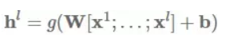

其中[⋅;⋅]表示级联。密集连接已成功应用于计算机视觉领域之中。他们还发现这种连接方法对于不同NLP任务的多任务学习也是有用的，而对于基于神经网络的机器翻译任务而言，使用残差变量之和的方法已被证明要优于仅使用残差连接。

## Dropout

虽然计算机视觉中的批量标准化使得其他正规化器在大多数应用中已经过时，但是辍学仍然是NLP中深度神经网络的首选正则化器。在大多数情况下，辍学率0.5已被证明是有效的。近年来，已经提出了诸如自适应（Ba＆Frey，2013）和进化辍学等辍学的变化，但这些都没有在社区中得到广泛采用。阻碍NLP丢失的主要问题是它不能应用于循环连接，因为聚合丢失掩码会随着时间的推移有效地将嵌入归零。

## 循环dropout

循环dropout通过在第1层的时间步长应用相同的丢失掩码解决了这个问题。这避免了沿序列放大丢失噪声并导致序列模型的有效正则化。例如，在语义角色标记（He et al。，2017）和语言建模中，反复出现辍学已被用于实现最先进的结果。

## 多任务学习

如果有足够多的额外数据，通常可以利用多任务学习 (MTL) 来提高目标任务的性能。可以看看[这篇博文](http://ruder.io/multi-task/index.html)来了解有关MTL的更多信息。

### 1.辅助目标

我们经常可以找到对我们关心的任务有用的辅助目标。虽然我们已经可以预测周围的单词以便预先训练单词嵌入（Mikolov等，2013），但我们也可以将其作为训练期间的辅助目标也使用类似的目标进行序列到序列模型。

### 2.面向特定任务的网络层

尽管NLP领域中多任务学习的常用方法都是参数共享的，但这样作对于面向不同任务的模型层的学习是有益的。这可以通过将一个任务的输出层放置在较低的层次 来完成。而另一种方法是利用独自的共享空间来实现。

## 注意力机制

注意力机制最常用于seq2seq模型的编码过程，也可用于任何序列模型中以回溯过去的状态。使用注意力机制，可以基于隐藏层状态s,来得到一个上下文向量ci，再结合当前层的隐状态hi来做出预测。上下文向量ci是之前隐藏层状态的加权平均，权重系数为ai:，如下面的公式：

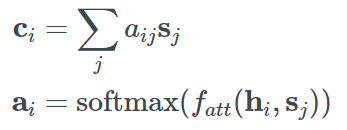

注意力函数,

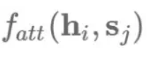

利用当前隐层状态hi和之前隐层状态sj计算出一个相应分值(未归一化)。接下来，我们将探讨4种注意力机制的变种：

- 加法式的注意力机制
- 乘法式的注意力机制
- 基于自身的注意力机制 (self-attention)
- key-value形式的注意力机制
  
### 1.加法式的注意力机制

原始的注意力机制 使用了一个单层的隐藏层前馈网络来计算注意力的对齐关系，如下公式：

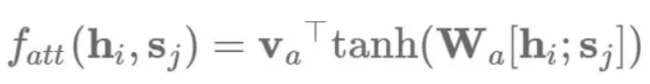

其中Va和Wa是学习到的注意力参数。相应地，我们也可以使用矩阵W1和W2分别对hi和sj作相应的变换，然后求和：

### 2.乘法式的注意力机制

乘法式的注意力机制简化了原始的注意力函数的计算，如下：

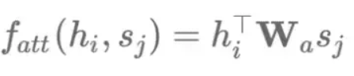

加法式和乘法式的注意力机制在时间复杂度上是差不多的，但乘法式在实践中的计算更快，也更节省内存，因为它可以利用高效率的矩阵乘法算法。当解码器向量dh的维数较小时，这两种的性能差不多；而维数较大时，会出现加法式的注意力机制表现更好的情况，此时通过将

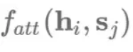

缩小至

倍可以减少这种情况的发生。

注意力机制不仅可以影响编码器的状态以及利用之前的隐层状态，还可以获得输入信息的分布情况(也是一种特征形式)，例如用于阅读理解任务中的文本对应的词向量分析。但是，注意力机制并不适用于一些不需要额外信息的分类任务，如情感分类。对于这类任务用到的模型，通常是使用LSTM的最终隐藏层状态或者使用类似于最大池化或平均池化的聚合函数来获得句子表示。

### 3.基于自身的注意力机制

在没有任何额外信息的情况下，我们仍然可以通过关注句子本身 (即self-attention) 来从句子中提取出相关的信息。 基于自身的注意力机制 (也称为基于内部的注意力机制) 已经被成功地应用于各种任务上，包括阅读理解，文本蕴涵和生成式摘要等。

我们可以简化加法式的注意力模型，即计算每个隐藏状态hi的非归一化的对齐分数：

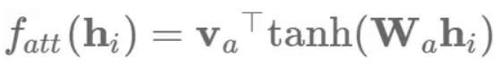

转换为矩阵运算形式，对于隐藏层状态,

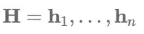

我们可以计算出注意力向量a和最终的句子向量表示c如下：

相比于只提取出一个向量，我们利用矩阵Va来取代va从而得到几个关注点，然后抽取出矩阵注意力矩阵A：

在实践中，我们会使用如下的正交约束项来防止冗余，并采用Frobenius规范项的平方来保证注意力向量的多样性：

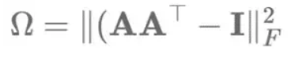

一种类似的multi-head注意力机制被Vaswani等人采用过。

### 4.Key-value形式的注意力机制

最后，Key-value形式的注意力机制是最近提出的一种注意力机制的变种，与之前使用注意力函数不同的是，它通过维护一个独立的向量来进行注意力的计算。这种方法被有效地应用到多种文档建模任务中。 具体而言，Key-value形式的注意力机制将每个隐藏层向量hi分解成一个key为ki和一个value为vi：即

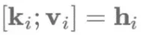

这些key会被用于计算注意力的分布ai，通过一个加法式的注意力函数：

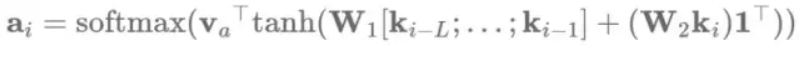

其中L是注意力窗口的长度，l是一个向量。然后通过这些来得到上下文表示向量ci：

上下文表示向量ci和当前值vi会结合在一起来用于预测。

## 最优化

最优化算法和优化模式通常也是属于模型的一部分，并被当做一个黑盒子。有时候，对最优化算法进行轻微的改动，例如对于Adam降低β2值会对优化结果产生非常大的影响。

### 1.最优化算法

Adam 是最受欢迎和被广泛使用的优化算法之一，通常都会作为NLP领域研究人员的选择。通常认为，Adam要明显优于传统的随机梯度下降(SGD)算法。然而，虽然训练过程中A dam比SGD收敛快得多，但是SGD的在学习率上的退火速率要略胜于Adam。最近的研究工作进一步表明，对SGD进行适当的动量调整将优于Adam算法。

### 2.优化模式

虽然Adam内部会调整每个参数的学习率，我们仍然在Adam中使用SGD式的退火。具体而言，我们可以通过重启来进行学习率退火：设定一个学习率并训练模型直到收敛。然后，我们将学习率减半，并通过加载之前最佳的学习模型来重启算法。对于Adam而言，这会使优化器忘记其之前的参数学习率并重启。(Denkowski, M., & Neubig, G. (2017). Stronger Baselines for Trustable Results in Neural Machine Translation)表明，Adam两次重启后的学习率退火更快，表现要优于SGD。 

## 模型集成

通过集成多个模型来提升最终的性能是一种基于经验主义的有效策略。尽管使用集成式的模型在测试阶段会比较费时，但最新研究进展表明对集成式模型进行压缩也是可行的。

随着模型多样性增加，对这些模型进行集成是确保最终结果可靠的重要方法 。 虽然对同一模型的不同种结果的集成被证明是有效的，但是这牺牲了模型的多样性作为代价。周期性的学习率有助于减轻这种影响。然而，在有充足的计算资源的情况下，我们更倾向于集成多个单独训练的模型来最大程度上增加模型的多样性。

## 超参数的优化

相比于单纯使用预先定义好的或现成的模型超参数，简单地对它们作一点调整就可以提升模型的结果。贝叶斯优化的最新研究进展使其成为神经网络中超参数优化的理想工具，远远优于被广泛使用的网格搜索。对一个简单的LSTM模型的超参数作自动调整取得了目前语言模型的最好结果，这甚至超过了一些更复杂的模型。

## LSTM模型调优的小技巧

初始状态的学习    我们通常用0向量来初始化LSTM模型的初始状态。相较于固定模型的初始状态，我们可以把初始状态的参数也当做需要学习的参数，这可以提高性能，也是Hinton所推荐的做法(https://www.cs.toronto.edu/~hinton/csc2535/notes/lec10new.pdf)。参考这篇博客文章(https://r2rt.comnon-zero-initial-states-for-recurrent-neural-networks.html)，了解Tensorflow的实现。

### 1.共享输入和输出的词向量

输入和输出的词向量参数是LSTM模型中数量最多的参数。如果将LSTM作为一个语言模型来进行词的预测，那么输入和输出的参数是可以共享的。这种做法对于小型数据集特别适用，因为数据规模限制了参数的学习量。

### 2.梯度的规范化削减

降低“梯度爆炸”风险的一种方法是削减梯度的最大值。 然而，这对模型的效果并没有改善。相比于简单地削减梯度的最大值，对梯度的全局范数进行削减取得的效果更为显著(在此有Tensorflow的实现)。

### 3.向下投影

为了进一步减少输出的参数量，可以将LSTM的隐藏层状态投影至更小的空间。这对于输出量较大的任务 (如语言建模) 尤其有用。

## 面向具体任务的最佳实践经验

接下来，我们将讨论一些具体任务上的最佳实践经验。其中的大多数在一个具体的任务上的效果都是最佳的，其中的一些可能还适用于其他的任务，但这还需要进行验证。我们将讨论以下几种应用：分类，序列标注，自然语言生成(NLG)，以及 NLG的一个特例——基于神经网络的机器翻译。

### 1.分类

CNN模型被广泛应用在NLP中的分类任务中。近期发现，由于CNN模型具有高效的卷积运算，它也同样适用于序列类型的任务。下面是一些与CNN模型相关的最佳实践，以及超参数上的最佳选择。

- 卷积核：可以组合多种尺寸的卷积核来取得最优的效果，例如卷积核尺寸为(3,4,5)的组合的效果最佳 。卷积核的最佳数量范围为50-600。
- 池化函数输出为1的最大池化的效果要好于平均池化和输出为k的最大池化方法。

### 2.序列标注

序列标注是NLP领域的常见任务。现有的实践经验很多都是与模型结构的中特定部分相关，下面将提供模型输出和预测阶段方面的实践经验。

- 序列标注的模式：对于某些文本标注任务而言，所使用的标注框架是不同的。其中有：BIO模式，它将文本片段中出现的第一个令牌 (token) 标记成B标签，剩余的令牌都标记成I标签，不属于令牌的标记为O标签; IOB模式，类似于BIO，但只在前一个令牌是同一个类但不属于分段的一部分时标记为B标签; 还有IOBES模式，它额外区分了单令牌实体 (S标签) 和分段中的最后一个令牌 (E标签)。使用IOBES和BIO模式所取得的效果是差不多的。
- CRF输出层：如果输出之间存在相互依赖的关系，例如对于命名实体识别，最终的softmax层可以用线性的条件随机场 (CRF) 替代。实验结果表明，这对模型需要进行约束的任务有一定的改进。
- 受约束的解码过程：相较于使用一个CRF输出层，对解码进行约束是一种防止生成错误序列的方法，即不会产生有效的BIO转换。对解码进行约束的好处在于可以执行任意的约束条件，这适用于一些特定的任务，如需要执行句法约束的任务。
  
### 3.自然语言生成

目前大多数的实践经验也适用于自然语言生成 (NLG)。事实上，迄今为止有很多实践上的技巧都来源于语言建模，这个最原始的NLP任务。

- 模型结果的覆盖度：输出重复问题是许多NLG任务面临的一大问题，这是因为目前的模型没有一个好的方法来记住模型产生了的输出结果。在模型中使用模型输出结果的覆盖度是解决这个问题的好方法。如果提前有一个清单，包括了有哪些实体应该在输出结果中提及，如 (Kiddon, C., Zettlemoyer, L., & Choi, Y. (2016). Globally Coherent Text Generation with Neural Checklist Models. Proceedings of the 2016 Conference on Empirical Methods in Natural Language Processing (EMNLP2016), 329–339) 所用到的。如果使用注意力机制，我们可以记录覆盖度向量ci，这是之前时间步长的注意力分布at的总和：

这个向量捕获了我们对输入中所有单词的关注程度。我们可以通过控制这个表征覆盖度的向量，以避免模型在输出时使用重复的单词：

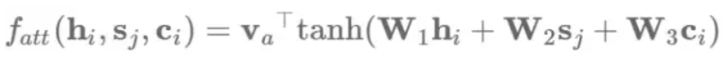

此外，我们还可以增加一个辅助的损失函数，来捕获对于特定任务我们想得到的注意力分布：对于NMT，我们希望大致上能一对一地对齐；因此，如果覆盖向量的指标发生了偏差，我们则对模型做出相应的惩罚处理 。总之，当模型重复使用输入中的相同部分时，需要对模型的训练作相应惩罚 。

### 4.基于神经网络的机器翻译

尽管基于神经网络的机器翻译 (NMT) 只是NLG的一个实例，但NMT受到了非常多的关注，许多模型和方法都是专门为此而开发的。相应地，许多最佳的实践经验或超参数最佳选择都仅适用于NMT这个任务本身。

- 词向量的维数:词向量的维数设置为2048时的模型性能达到最佳，但这带来的提升幅度很小。其实即使词向量维数为128维时模型的性能也很不错，而收敛速度也将几乎快上两倍。
- 编码器和解码器的层数:编码器的层数设置最好不要超过2-4层。尽管深层次的模型要优于浅层模型，但对于解码器而言，其层数最好不要超过44层。
- 编码方向双向的编码器的性能要优于单向的编码器。Sutskever等人(2014)提出了对源序列的输入方向反转有助于减轻对长时记忆的依赖。在单向编码器中反转源序列的结果要优于没有反转的结果。
- 集束搜索 (Beam Search) 策略:集束搜索设置的大小为10左右，同时对长度作正则化时，能够取得最佳的模型性能。
- 单字翻译:Senrich等人(2016)提出了一种基于字节对编码 (BPE) 的方式将单词划分为字序列。BPE迭代式地合并频繁的符号对，最终将频繁出现的ngram合并成单个符号，从而有效地清除了不在词典中的词。尽管这个方法最初是为了处理罕见的单词，但是处理字单元的模型整体的表现要优于全词系统，对于以字为单位的词汇表大小设置为32,000比较合适。

注意：本文参考文献比较多，查看原文可参考完整的参考文献。

喜欢的童鞋记得分享给别的小伙伴哈。AIMI-CN AI学习交流群【1015286623】 获取更多AI资料扫码加群：

分享技术，乐享生活：我们的公众号每周推送“AI”系列资讯类文章，欢迎您的关注！

