# 【2019斯坦福CS224N笔记】（10）Question Answering

csdn：https://blog.csdn.net/abcgkj

github：https://github.com/aimi-cn/AILearners

---

问答系统（简称QA）,是近几年比较火的NLP应用之一，常见的应用有：问答机器人、智能客服等。本节内容将主要讲解了斯坦福所提出的Stanford Attentive Reader模型，和简要分析一下其他相关模型。

问答系统主要分为两部分：

- 找到可能包含答案的文档（使用传统的信息检索技术）
- 在可能的文档中找到我们所需要的答案（通常称为阅读理解）

本文将重点介绍第二点，即"阅读理解"。

## Stanford Attentive Reader

Stanford Attentive Reader是斯坦福在2016年的ACL会议上的《A Thorough Examination of the CNN/Daily Mail Reading Comprehension Task》发布的一个机器阅读理解模型。数据集使用的CNN和Daily Mail。

### 模型介绍

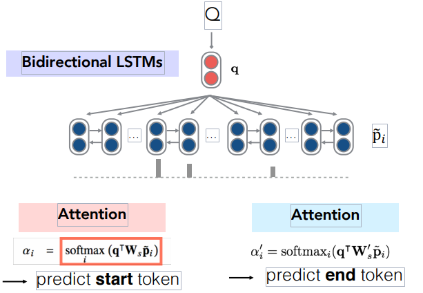

1.word embedding

将passage(P)和question(Q)中的所有单词都通过一个word embedding矩阵嵌入,用d维的词向量来表示，得到：

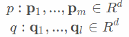

2.encoding

对于问题Q：把每个单词嵌入后的向量放入双向LSTM中编码，将这些向量拼接起来，得到隐藏层的最终状态q。

对于短文P：和Q一样，把每个单词嵌入后的向量放入双向LSTM中编码（但不用拼接），得到向量p_i。

3.attention

因为我们需要在文章中找到答案，因此使用得到的q向量，以解决答案在哪里使用注意力。根据文章中词语p与问题中词语q之间的相关程度，计算出一个概率分布，如下图所示

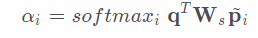

其中q为问题Q的最终状态，W为要学习的矩阵，p'_i是P的每个单词经过双向LSTM的向量表达。

得到注意力得分后，进行加权：

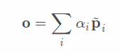

4.预测:上下文加权得到向量o之后，模型就能够基于此输出最有可能的答案：

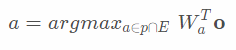

5.使用负对数似然函数作为训练的目标函数。

## Stanford Attentive Reader++

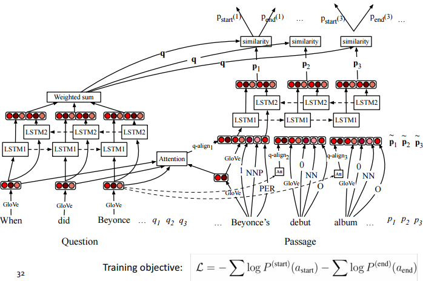

与上一版本的改变：

1.之前是只使用问题Q的最后一个状态的拼接，而现在我们使用LSTM中的所有状态。(其实在很多NLP任务中,这样做都是非常好的)

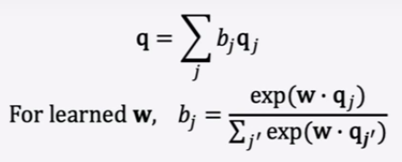

2.第二个改变是，这里使用3层的Bi-LSTM网络

3.词向量的改变：不仅是只使用简单的词向量，又加入了位置和命名实体识别的标记（用one-hot编码）

4.加入问题和文章的相似度计算。

## BiDAF

BiDAF(全称Bi-Directional Attention Flow for Machine Comprehension)，是2017年Seo等人在ICIR上提出的模型。其核心思想是：由以往的单向注意力机制转为双向注意力机制。即注意力双向流动——从上下文到问题，从问题到上下文

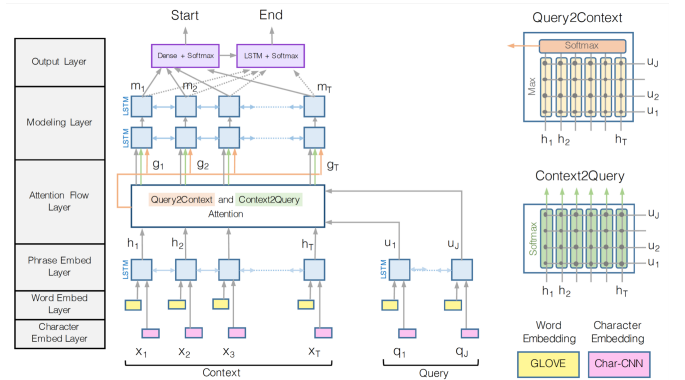

## 更多注意力机制

- Additive Attention

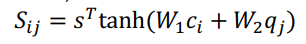

- Bilinear Attention

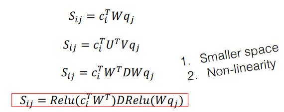

## 更多模型

2016年、2017年和2018年的大部分工作都采用了越来越复杂的架构，注意力的多样性也越来越多——通常可以获得很好的任务收益。

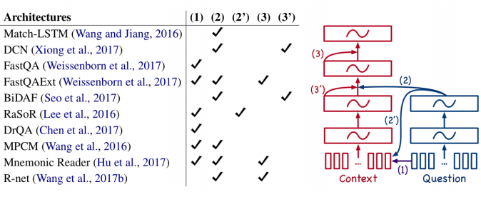

除了本节课介绍的一些模型外，还有一些非常好的模型。比如：给予Bert的一些模型在很多数据集上表现非常好。但是不得不说，即使问答系统前景如此广阔，但其背后的技术仍没有达到十分成熟的地步，仍有很大的进步空间。

喜欢的童鞋记得分享给别的小伙伴哈。AIMI-CN AI学习交流群【1015286623】 获取更多AI资料扫码加群：

分享技术，乐享生活：我们的公众号每周推送“AI”系列资讯类文章，欢迎您的关注！

